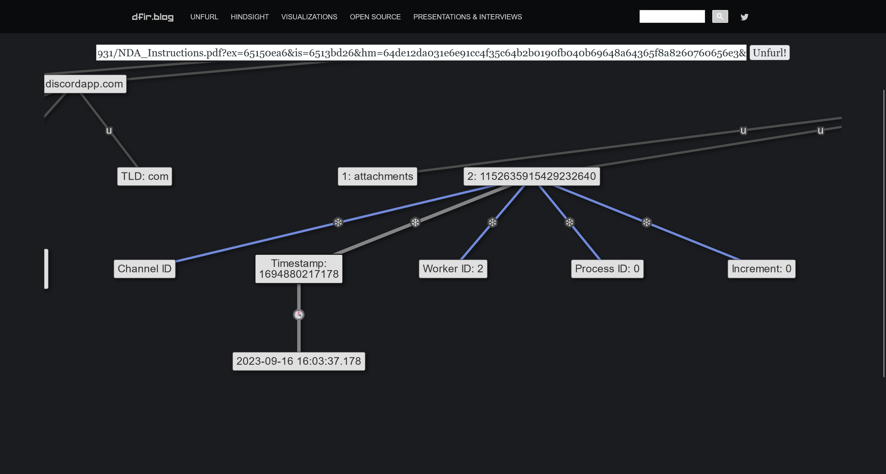
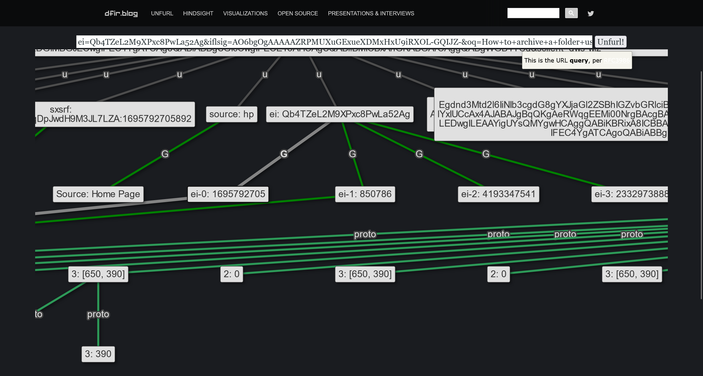

# Constellation [Medium]

> **ES:** Sherlock DFIR con amenaza interna: URLs extraídas de memoria (Discord CDN + búsqueda Google), snowflake/timestamps, PDF anómalo y OSINT sobre AntiCorp Gr04p para construir la línea de tiempo.
> **EN:** DFIR sherlock with insider threat: memory-extracted URLs (Discord CDN + Google search), snowflake/timestamps, anomalous PDF, and OSINT on AntiCorp Gr04p to build the timeline.

| Campo | Valor |
|-------|-------|
| **Tipo** | DFIR |
| **URL** | https://app.hackthebox.com/sherlocks/constellation |
| **Evidencia** | constellation.zip |


:::info Sherlock Scenario

The SOC team has recently been alerted to the potential existence of an insider threat. The suspect employee's workstation has been secured and examined. During the memory analysis, the Senior DFIR Analyst succeeded in extracting several intriguing URLs from the memory. These are now provided to you for further analysis to uncover any evidence, such as indications of data exfiltration or contact with malicious entities. Should you discover any information regarding the attacking group or individuals involved, you will collaborate closely with the threat intelligence team. Additionally, you will assist the Forensics team in creating a timeline. Warning : This Sherlock will require an element of OSINT and some answers can be found outside of the provided artifacts to complete fully.

> [ZH] "SOC 团队最近收到警报，得知可能存在内部威胁。已锁定并检查了嫌疑员工的工作站。在内存分析期间，高级 DFIR 分析师成功从内存中提取了几个有趣的 URL。现将这些 URL 提供给您，以便进一步分析，以发现任何证据，例如数据泄露或与恶意实体联系的迹象。如果您发现有关攻击小组或所涉个人的任何信息，您将与威胁情报团队密切合作。此外，您还将协助取证团队创建时间线。警告：此 Sherlock 将需要 OSINT 的元素，并且可以在提供的工件之外找到一些答案才能完成。"
> **ES:** Posible insider: workstation asegurada y URLs extraídas de memoria para buscar exfiltración o contacto malicioso, con apoyo a TI y forense; requiere OSINT y fuentes externas.
> **EN:** Possible insider: secured workstation and memory-extracted URLs to hunt exfiltration or malicious contacts, supporting TI and forensics; requires OSINT and external sources.

:::

## 题目数据 / Datos / Data

[constellation.zip](./constellation.zip)

## First of all / Primeros pasos / First steps

> **ES:** El reto entrega dos ficheros (`IOCs.txt` y `NDA_Instructions.pdf`); se inspecciona su contenido y se descomponen las URL.
> **EN:** The challenge provides two files (`IOCs.txt` and `NDA_Instructions.pdf`); inspect their contents and break down the URLs.

```bash
Mode                 LastWriteTime         Length Name
----                 -------------         ------ ----
-----           2023/12/4    20:57            959 IOCs.txt
-----            2024/3/5    18:02          25995 NDA_Instructions.pdf
```

```plaintext title="IOCs.txt"
URL 1 : https://cdn.discordapp.com/attachments/1152635915429232640/1156461980652154931/NDA_Instructions.pdf?ex=65150ea6&is=6513bd26&hm=64de12da031e6e91cc4f35c64b2b0190fb040b69648a64365f8a8260760656e3&

URL 2 : https://www.google.com/search?q=how+to+zip+a+folder+using+tar+in+linux&sca_esv=568736477&hl=en&sxsrf=AM9HkKkFWLlX_hC63KqDpJwdH9M3JL7LZA%3A1695792705892&source=hp&ei=Qb4TZeL2M9XPxc8PwLa52Ag&iflsig=AO6bgOgAAAAAZRPMUXuGExueXDMxHxU9iRXOL-GQIJZ-&oq=How+to+archive+a+folder+using+tar+i&gs_lp=Egdnd3Mtd2l6IiNIb3cgdG8gYXJjaGl2ZSBhIGZvbGRlciB1c2luZyB0YXIgaSoCCAAyBhAAGBYYHjIIEAAYigUYhgMyCBAAGIoFGIYDMggQABiKBRiGA0jI3QJQ8WlYxIUCcAx4AJABAJgBqQKgAeRWqgEEMi00NrgBAcgBAPgBAagCCsICBxAjGOoCGCfCAgcQIxiKBRgnwgIIEAAYigUYkQLCAgsQABiABBixAxiDAcICCBAAGIAEGLEDwgILEAAYigUYsQMYgwHCAggQABiKBRixA8ICBBAjGCfCAgcQABiKBRhDwgIOEC4YigUYxwEY0QMYkQLCAgUQABiABMICDhAAGIoFGLEDGIMBGJECwgIFEC4YgATCAgoQABiABBgUGIcCwgIFECEYoAHCAgUQABiiBMICBxAhGKABGArCAggQABgWGB4YCg&sclient=gws-wiz
```

### IOCs.txt

> **ES:** Descomposición de ambas URL por partes (host, ruta y parámetros).
> **EN:** Breakdown of both URLs by parts (host, path and parameters).

```plaintext title="URL 1"
https://cdn.discordapp.com
/attachments
/1152635915429232640
/1156461980652154931
/NDA_Instructions.pdf
?ex=65150ea6
&is=6513bd26
&hm=64de12da031e6e91cc4f35c64b2b0190fb040b69648a64365f8a8260760656e3
&
```

```plaintext title="URL 2 After URL Decode"
https://www.google.com
/search
?q=how to zip a folder using tar in linux
&sca_esv=568736477
&hl=en
&sxsrf=AM9HkKkFWLlX_hC63KqDpJwdH9M3JL7LZA:1695792705892
&source=hp
&ei=Qb4TZeL2M9XPxc8PwLa52Ag
&iflsig=AO6bgOgAAAAAZRPMUXuGExueXDMxHxU9iRXOL-GQIJZ-
&oq=How to archive a folder using tar i
&gs_lp=Egdnd3Mtd2l6IiNIb3cgdG8gYXJjaGl2ZSBhIGZvbGRlciB1c2luZyB0YXIgaSoCCAAyBhAAGBYYHjIIEAAYigUYhgMyCBAAGIoFGIYDMggQABiKBRiGA0jI3QJQ8WlYxIUCcAx4AJABAJgBqQKgAeRWqgEEMi00NrgBAcgBAPgBAagCCsICBxAjGOoCGCfCAgcQIxiKBRgnwgIIEAAYigUYkQLCAgsQABiABBixAxiDAcICCBAAGIAEGLEDwgILEAAYigUYsQMYgwHCAggQABiKBRixA8ICBBAjGCfCAgcQABiKBRhDwgIOEC4YigUYxwEY0QMYkQLCAgUQABiABMICDhAAGIoFGLEDGIMBGJECwgIFEC4YgATCAgoQABiABBgUGIcCwgIFECEYoAHCAgUQABiiBMICBxAhGKABGArCAggQABgWGB4YCg
&sclient=gws-wiz
```

## Task 1 — Inicio del DM / DM start time

> [ZH] "嫌疑人第一次与外部实体（可能的目标组织员工泄露敏感数据的威胁行为者团体）开始直接消息 (DM) 对话的时间是？（UTC）"
> **ES:** ¿Cuándo inició el sospechoso su primer DM con la entidad externa (grupo que filtra datos)? (UTC)
> **EN:** When did the suspect first start a DM conversation with the external entity (group leaking sensitive data)? (UTC)

> **ES:** En `URL 1` se toma el primer segmento numérico (ID de canal) y se convierte de Discord snowflake a timestamp (snowsta.mp / unfurl).
> **EN:** In `URL 1` take the first numeric segment (channel ID) and convert it from Discord snowflake to timestamp (snowsta.mp / unfurl).

```plaintext title="URL 1"
/1152635915429232640
```

可以使用 [Discord Snowflake to Timestamp Converter](https://snowsta.mp/)

使用 [unfurl](https://dfir.blog/unfurl/) 进行分析



> **ES:** Timestamp extraído del análisis.
> **EN:** Timestamp extracted from the analysis.

```plaintext
Timestamp: 1694880217178
```

```plaintext title="Answer"
2023-09-16 16:03:37.178
```

## Task 2 — Archivo enviado / Sent file name

> [ZH] "发送给涉嫌内部威胁的文件的名称是什么？"
> **ES:** ¿Cuál es el nombre del archivo enviado a la presunta amenaza interna?
> **EN:** What is the name of the file sent to the suspected insider threat?

```plaintext title="Answer"
NDA_Instructions.pdf
```

## Task 3 — Hora de envío del archivo / File sent time

> [ZH] "文件发送给涉嫌内部威胁的时间是？（UTC）"
> **ES:** ¿A qué hora se envió el archivo a la presunta amenaza interna? (UTC)
> **EN:** When was the file sent to the suspected insider threat? (UTC)

> **ES:** El parámetro `is` de la URL firmada de Discord es un timestamp hex; se convierte a decimal/UTC según la documentación oficial.
> **EN:** The signed Discord URL parameter `is` is a hex timestamp; convert it to decimal/UTC per the official docs.

```plaintext
&is=6513bd26
```

参考 Discord 官方文档的说明 [Discord Developer Portal — Documentation — Reference](https://discord.com/developers/docs/reference#signed-attachment-cdn-urls-attachment-cdn-url-parameters)

```plaintext
Hex: 6513BD26
DEC: 1695792422
Timestamp: Wed 27 September 2023 05:27:02 UTC
```

```plaintext title="Answer"
2023-09-27 05:27:02
```

## Task 4 — Consulta de búsqueda / Search query

> [ZH] "嫌疑人在收到文件后使用谷歌搜索了一些东西。搜索查询是什么？"
> **ES:** Tras recibir el archivo, ¿qué buscó el sospechoso en Google?
> **EN:** After receiving the file, what did the suspect search on Google?

> **ES:** En `URL 2`, el parámetro `q` contiene la consulta.
> **EN:** In `URL 2`, the `q` parameter holds the query.

```plaintext
?q=how+to+zip+a+folder+using+tar+in+linux
```

```plaintext title="Answer"
how to zip a folder using tar in linux
```

## Task 5 — Entrada original / Original input

> [ZH] "嫌疑人最初在搜索选项卡中输入了其他内容，但找到了他们点击的谷歌搜索结果建议。你能否确认嫌疑人最初在搜索栏中输入了哪些单词？"
> **ES:** ¿Qué palabras había tecleado originalmente el sospechoso en la barra de búsqueda antes de clicar la sugerencia?
> **EN:** What words had the suspect originally typed in the search bar before clicking the suggestion?

> **ES:** En `URL 2`, el parámetro `gs_lp` (Base64) conserva la entrada parcial original; al decodificarlo se extrae el texto.
> **EN:** In `URL 2`, the `gs_lp` parameter (Base64) preserves the original partial input; decoding it reveals the text.

```plaintext
&gs_lp=Egdnd3Mtd2l6IiNIb3cgdG8gYXJjaGl2ZSBhIGZvbGRlciB1c2luZyB0YXIgaSoCCAAyBhAAGBYYHjIIEAAYigUYhgMyCBAAGIoFGIYDMggQABiKBRiGA0jI3QJQ8WlYxIUCcAx4AJABAJgBqQKgAeRWqgEEMi00NrgBAcgBAPgBAagCCsICBxAjGOoCGCfCAgcQIxiKBRgnwgIIEAAYigUYkQLCAgsQABiABBixAxiDAcICCBAAGIAEGLEDwgILEAAYigUYsQMYgwHCAggQABiKBRixA8ICBBAjGCfCAgcQABiKBRhDwgIOEC4YigUYxwEY0QMYkQLCAgUQABiABMICDhAAGIoFGLEDGIMBGJECwgIFEC4YgATCAgoQABiABBgUGIcCwgIFECEYoAHCAgUQABiiBMICBxAhGKABGArCAggQABgWGB4YCg
```

使用 Base64 解码后，提取字符串，得到

```plaintext
gws-wiz"
How to archive a folder using tar i
2-46
```

```plaintext title="Answer"
How to archive a folder using tar i
```

## Task 6 — Hora de la búsqueda / Search time

> [ZH] "此谷歌搜索是在何时进行的？（UTC）"
> **ES:** ¿Cuándo se realizó esta búsqueda de Google? (UTC)
> **EN:** When was this Google search performed? (UTC)

> **ES:** Análisis de timestamps en URLs de Google (Magnet Forensics) con unfurl para obtener el inicio de sesión.
> **EN:** Google search URL timestamp analysis (Magnet Forensics) with unfurl to get the session start.

参考这篇文章 [Analyzing Timestamps in Google Search URLs - Magnet Forensics](https://www.magnetforensics.com/resources/analyzing-timestamps-in-google-search-urls/)

使用 [unfurl](https://dfir.blog/unfurl/) 进行分析



得到会话开始的时间戳

```plaintext
1695792705
Wed 27 September 2023 05:31:45 UTC
```

```plaintext title="Answer"
2023-09-27 05:31:45
```

## Task 7 — Grupo responsable / Responsible group

> [ZH] "负责贿赂内部威胁的黑客组织的名称是什么？"
> **ES:** ¿Cómo se llama el grupo hacker que sobornó a la amenaza interna?
> **EN:** What is the name of the hacker group that bribed the insider threat?

```plaintext title="Answer"
AntiCorp Gr04p
```

## Task 8 — Presunta amenaza interna / Suspected insider

> [ZH] "涉嫌为内部威胁的人员的姓名是什么？"
> **ES:** ¿Quién es la persona sospechosa de ser la amenaza interna?
> **EN:** Who is the person suspected of being the insider threat?

```plaintext title="Answer"
Karen Riley
```

## Task 9 — Fecha de creación anómala / Anomalous creation date

> [ZH] "发送给内部威胁的文件中所述的异常创建日期是什么？（UTC）"
> **ES:** ¿Cuál es la fecha de creación anómala indicada en el archivo enviado a la amenaza interna? (UTC)
> **EN:** What is the anomalous creation date stated in the file sent to the insider threat? (UTC)

> **ES:** Revisión directa de los metadatos EXIF del PDF.
> **EN:** Direct check of the PDF EXIF metadata.

直接看 pdf 文件的 exif 信息

```bash title="exiftool NDA_Instructions.pdf"
ExifTool Version Number         : 12.57
File Name                       : NDA_Instructions.pdf
Directory                       : .
File Size                       : 26 kB
File Modification Date/Time     : 2024:03:06 00:19:35+08:00
File Access Date/Time           : 2024:03:06 00:19:35+08:00
File Inode Change Date/Time     : 2024:03:06 00:19:35+08:00
File Permissions                : -rw-r--r--
File Type                       : PDF
File Type Extension             : pdf
MIME Type                       : application/pdf
PDF Version                     : 1.7
Linearized                      : No
Page Count                      : 1
Producer                        : AntiCorp PDF FW
Create Date                     : 2054:01:17 22:45:22+01:00
Title                           : KarenForela_Instructions
Author                          : CyberJunkie@AntiCorp.Gr04p
Creator                         : AntiCorp
Modify Date                     : 2054:01:17 22:45:22+01:00
Subject                         : Forela_Mining stats and data campaign (Stop destroying env)
```

```plaintext title="Answer"
2054-01-17 22:45:22
```

## Task 10 — Nombre real del handler / Handler real name

> [ZH] "Forela 威胁情报团队正在努力揭露此事件。攻击者犯下的任何 OpSec 错误对于 Forela 的安全团队至关重要。尝试帮助 TI 团队并确认 Anticorp 中代理人 / 处理人的真实姓名。"
> **ES:** Ayudar al equipo de TI confirmando el nombre real del agente/handler de AntiCorp a partir de su error OpSec.
> **EN:** Help the TI team by confirming the real name of the AntiCorp agent/handler from their OpSec mistake.

> **ES:** Búsqueda en LinkedIn con la palabra clave `AntiCorp Gr04p`.
> **EN:** LinkedIn search using the keyword `AntiCorp Gr04p`.

在 Linkedin 上，通过 `AntiCorp Gr04p` 作为关键词定位到 [Abdullah Al Sajjad - Security Expert - AntiCorp Gr04p | LinkedIn](https://pk.linkedin.com/in/abdullah-al-sajjad-434545293?trk=public_profile_browsemap-profile)

```plaintext title="Answer"
Abdullah Al Sajjad
```

## Task 11 — Ciudad del actor / Actor city

> [ZH] "威胁行为者属于哪个城市？"
> **ES:** ¿A qué ciudad pertenece el actor de amenazas?
> **EN:** Which city does the threat actor belong to?

> **ES:** Dato visible en el perfil anterior.
> **EN:** Detail visible in the profile above.

上文中就有

```plaintext title="Answer"
Bahawalpur
```

## Fuentes / Sources

- Dificultad y categoria: [momenbasel/htb-writeups - Sherlocks index](https://github.com/momenbasel/htb-writeups/blob/main/sherlocks/README.md) - fecha de acceso: 2026-09-24.
- Autor notas: Apuromafo.

---

## ⚠️ Aviso Legal / Disclaimer

> **ES:** Uso educativo y personal únicamente. No afiliado a HackTheBox. Evidencia y respuestas con contexto, no solo la respuesta suelta.
> **EN:** Educational and personal use only. Not affiliated with HackTheBox. Evidence and contextual answers, not bare answers.

_Fecha de edición: 2026-09-24_
