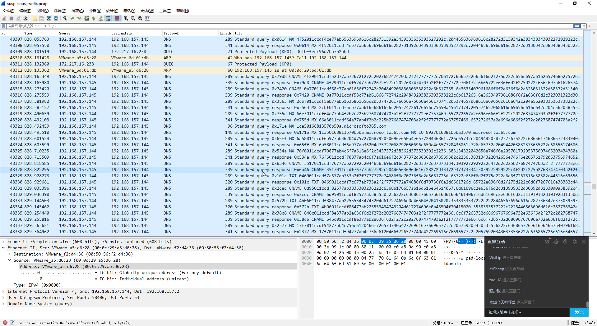
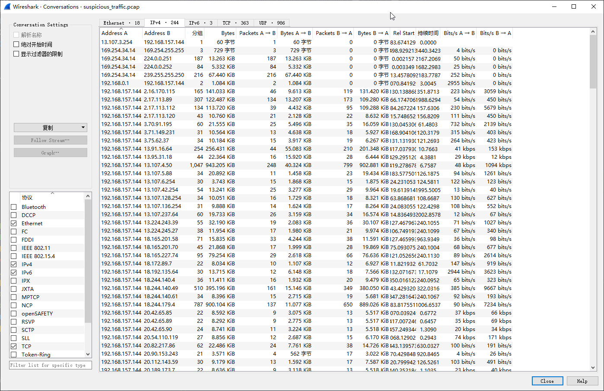
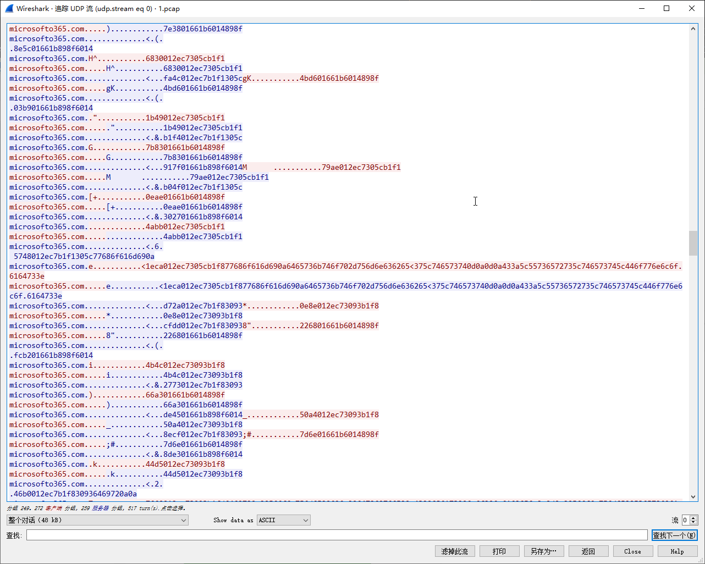
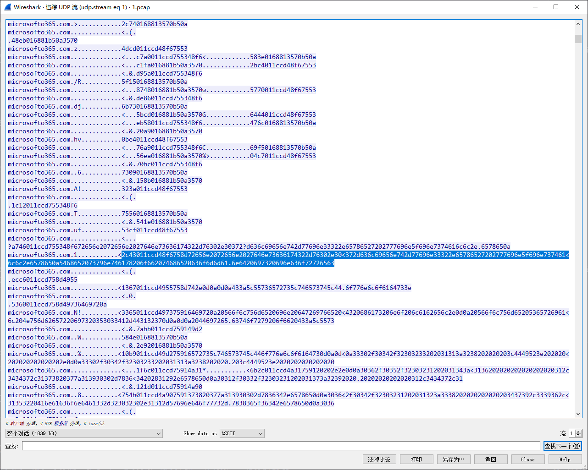

# Litter [verificar]

> **ES:** Sherlock SOC: host de pruebas comprometido con túnel DNS (dnscat2 v0.07) — robo de PII vía exfiltración DNS, 8 tasks.
> **EN:** SOC sherlock: testing host compromised with DNS tunneling (dnscat2 v0.07) — PII theft via DNS exfiltration, 8 tasks.

| Campo | Valor |
|-------|-------|
| **Tipo** | SOC |
| **URL** | https://app.hackthebox.com/sherlocks/litter |
| **Evidencia** | litter.zip |

:::info Sherlock Scenario

Khalid has just logged onto a host that he and his team use as a testing host for many different purposes, it’s off their corporate network but has access to lots of resources in network. The host is used as a dumping ground for a lot of people at the company but it’s very useful, so no one has raised any issues. Little does Khalid know; the machine has been compromised and company information that should not have been on there has now been stolen – it’s up to you to figure out what has happened and what data has been taken.

> [ZH] 哈立德刚刚登录了一个主机……这台机器已经被入侵了，并且公司不应该存在的信息已经被窃取了。
> **ES:** Host de pruebas multiuso fuera de la red corporativa, comprometido con robo de información: determinar qué pasó y qué datos salieron.
> **EN:** Multi-purpose testing host off the corporate network, compromised with data theft: determine what happened and what data left.

:::

## 题目数据 / Datos / Data

[litter.zip](./litter.zip)

## Task 1 — Protocolo sospechoso / Suspicious protocol

> [ZH] 一眼看去，在这次攻击中，哪种协议似乎是可疑的？
> **ES:** ¿Qué protocolo se ve sospechoso en este ataque?
> **EN:** Which protocol looks suspicious in this attack?

En la segunda mitad de la captura hay un volumen anómalo de peticiones DNS frente a un entorno normal:



```plaintext title="Answer"
DNS
```

## Task 2 — IP del host sospechoso / Suspicious host IP

> [ZH] 我们的主机和另一个主机之间有大量的流量，可疑主机的 IP 地址是什么？
> **ES:** Hay gran volumen de tráfico con otro host: ¿IP del host sospechoso?
> **EN:** Heavy traffic with another host: what is the suspicious host's IP?

En Wireshark: `Estadísticas` → `Conversaciones`, IPv4, ordenar por bytes — el mayor es el objetivo:



```plaintext title="Answer"
192.168.157.145
```

## Task 3 — Primer comando al cliente / First command to client

> [ZH] 攻击者发送给客户端的第一个命令是什么？
> **ES:** ¿Cuál fue el primer comando del atacante al cliente?
> **EN:** What was the attacker's first command to the client?

:::note

> **ES:** Exportar a un pcap nuevo con `ip.src==192.168.157.145 || ip.dst==192.168.157.145` para analizar.
> **EN:** Export to a new pcap with `ip.src==192.168.157.145 || ip.dst==192.168.157.145` for analysis.

:::

Extraer los datos de las queries DNS:



```plaintext
1eca012ec7305cb1f877686f616d690a6465736b746f702d756d6e636265<375c746573740d0a0d0a433a5c55736572735c746573745c446f776e6c6f.6164733e
```

Decodificando el hex se obtiene la respuesta:

```plaintext title="Answer"
whoami
```

## Task 4 — Versión de la herramienta DNS tunneling / DNS tunneling tool version

> [ZH] 攻击者使用的 DNS 隧道工具版本是多少？
> **ES:** ¿Qué versión de la herramienta de túnel DNS usó el atacante?
> **EN:** Which version of the DNS tunneling tool did the attacker use?

Decodificando más respuestas DNS de la víctima:

```plaintext
02cb012ec7332cb1fd422e42726f777365722e666f722e53514c6974652d<332e31322e322d77696e36342e6d73690d0a32382f30352f323031362020<32313a333820202020202020202020203134322c33333620646e73636174.322d76302e30372d636c69656e74
```

se obtiene:

```plaintext
28/05/2016  21:38           142,336 dnscat2-v0.07-client
```

```plaintext title="Answer"
0.07
```

## Task 5 — Renombre de la herramienta / Tool rename

> [ZH] 攻击者试图重命名他们意外留在客户主机上的工具。他们将其命名为什么？
> **ES:** El atacante renombró la herramienta olvidada en el host: ¿a qué nombre?
> **EN:** The attacker renamed the tool left behind on the host: to what?

En el tráfico DNS posterior:



```plaintext
2c43011ccd48f6758d72656e2072656e2027646e73636174322d76302e30<372d636c69656e742d77696e33322e65786527202777696e5f696e737461<6c6c2e6578650a5468652073796e746178206f662074686520636f6d6d61.6e6420697320696e636f72726563
```

decodificado:

```plaintext
ren ren 'dnscat2-v0.07-client-win32.exe' 'win_install.exe
```

```plaintext title="Answer"
win_install.exe
```

## Task 6 — Archivos en almacenamiento en la nube / Files in cloud storage

> [ZH] 攻击者试图枚举用户的云存储。他们在云存储目录中定位到多少个文件？
> **ES:** El atacante enumeró el OneDrive del usuario: ¿cuántos archivos halló?
> **EN:** The attacker enumerated the user's OneDrive: how many files did they find?

Tráfico DNS del OneDrive:

```plaintext
2be5011ccd61f875ee20204d757369630d0a30342f30362f323032312020<30383a3532202020203c4449523e202020202020202020204f6e65447269<76650d0a31312f30362f32303231202031333a3430202020203c4449523e.2020202020202020202050696374
```

Siguiendo el rastro no hay ningún archivo:

```plaintext title="Answer"
0
```

## Task 7 — Ruta del archivo PII robado / Stolen PII file path

> [ZH] 被窃取的个人身份信息（PII）文件的完整位置是什么？
> **ES:** ¿Ruta completa del archivo con PII robado?
> **EN:** Full path of the stolen PII file?

En los datos DNS:

```plaintext
7170011ccd863877ab747970652022433a5c55736572735c746573745c44<6f63756d656e74735c636c69656e742064617461206f7074696d69736174<696f6e5c757365722064657461696c732e637376220a2c6a6f622c636f6d.70616e792c73736e2c7265736964
```

decodificado:

```plaintext
type "C:\Users\test\Documents\client data optimisation\user details.csv"
```

```plaintext title="Answer"
C:\users\test\documents\client data optimization\user details.csv
```

## Task 8 — Nº de registros exfiltrados / Number of exfiltrated records

> [ZH] 究竟被窃取了多少个客户的个人身份信息记录？
> **ES:** ¿Cuántos registros PII de clientes se exfiltraron en total?
> **EN:** How many customer PII records were exfiltrated in total?

Es la task más laboriosa; proceso automatizado:

1. Con Wireshark filtrar el tráfico DNS a un pcap nuevo `1.pcap`:

```bash
# filtro wireshark para extraer a 1.pcap
ip.src==192.168.157.145 || ip.dst==192.168.157.145
```

2. Extraer payloads UDP con tshark:

```bash
tshark -r 1.pcap -T fields -Y "ip.src==192.168.157.144" -e udp.payload | sed '/^\s*$/d' > dnsdata.txt
```

3. Estadística de tamaños para aislar la sesión del shell (longitud 494):

```python
with open("./dnsdata.txt", "r") as f:
    dnsdata_raw = f.read()

dnsdata_raw = dnsdata_raw.split("\n")

res = {}

for i in dnsdata_raw:
    tmp = len(i)
    if tmp in res.keys():
        res[tmp] += 1
    else:
        res[tmp] = 1

headers = list(res.keys())
headers.sort()
for i in headers:
    print(i, res.get(i))
```

4. Recortar el framing dnscat2 y quedarse con los datos del shell:

```python
with open("./dnsdata.txt", "r") as f:
    dnsdata_raw = f.read()

dnsdata_raw = dnsdata_raw.split("\n")

dnsdata = []

for i in dnsdata_raw:
    tmp = len(i)
    if tmp == 494:
        dnsdata.append(i)

res = ""

for i in dnsdata:
    tmp1 = bytes.fromhex(i[62:]).split(b"\x1c")
    tmp2 = "".join(tmp1[0].decode().split("<")) + tmp1[1].decode().split("\r")[0]
    # print(tmp2)
    res += bytes.fromhex(tmp2).decode()

print(res)
```

5. De la sesión reconstruida se extraen los datos de `C:\users\test\documents\client data optimization\user details.csv`:

<details>

<summary> 文件的完整数据 / Datos completos / Full data </summary>

[data.txt](./data.txt)

</details>

Como cada fila lleva número de serie, se cuenta cuántas se filtraron:

```plaintext title="Answer"
721
```

---

## ⚠️ Aviso Legal / Disclaimer

> **ES:** Uso educativo y personal únicamente. No afiliado a HackTheBox. Evidencia y respuestas con contexto, no solo la respuesta suelta.
> **EN:** Educational and personal use only. Not affiliated with HackTheBox. Evidence and contextual answers, not bare answers.

_Fecha de edición: 2026-09-24_
