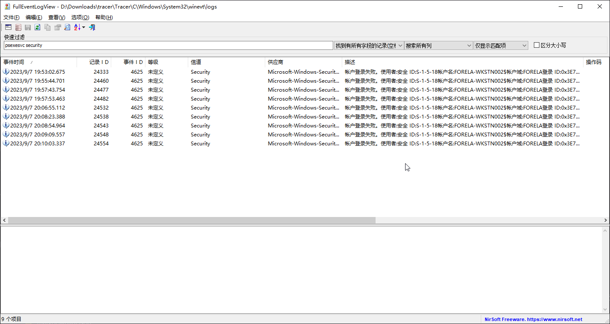

# Tracer [Medium]

> **ES:** Ficha mínima — ver plantilla completa en `../../_PLANIFICACION/PLANTILLA_SHERLOCK.md`.
> **EN:** Minimal header — see full template at `../../_PLANIFICACION/PLANTILLA_SHERLOCK.md`.

| Campo | Valor |
|-------|-------|
| **Tipo** | Threat Hunting |
| **URL** | https://app.hackthebox.com/sherlocks/tracer |
| **Evidencia** | tracer.zip |


:::info Sherlock Scenario

A junior SOC analyst on duty has reported multiple alerts indicating the presence of PsExec on a workstation. They verified the alerts and escalated the alerts to tier II. As an Incident responder you triaged the endpoint for artefacts of interest. Now please answer the questions regarding this security event so you can report it to your incident manager.

> [ZH] "一名值班的初级 SOC 分析师报告了多个警报，表明工作站上存在 PsExec。他们验证了这些警报并将其升级给二级支持团队。作为事件响应人员，您对端点进行了初步调查，以查找感兴趣的证据。现在，请回答以下关于这一安全事件的问题，以便向您的事件经理报告。"
> **ES:** Un analista SOC junior reportó alertas de PsExec en un workstation, verificadas y escaladas a Tier II: triar el endpoint y responder para informar al incident manager.
> **EN:** A junior SOC analyst reported PsExec alerts on a workstation, verified and escalated to Tier II: triage the endpoint and answer to report to the incident manager.

:::

## 题目数据 / Datos / Data

[tracer.zip](./tracer.zip)

:::note

Herramienta usada para el análisis de logs: [FullEventLogView](https://www.nirsoft.net/utils/full_event_log_view.html).
Log analysis assisted with: [FullEventLogView](https://www.nirsoft.net/utils/full_event_log_view.html).

:::

## Task 1 — Veces que se ejecutó PsExec / PsExec execution count

> [ZH] "SOC 团队怀疑有一个对手潜伏在他们的环境中，并且正在使用 PsExec 进行横向移动。一名初级 SOC 分析师特别报告了在一台工作站上使用了 PsExec。攻击者在系统上执行了多少次 PsExec？"
> **ES:** El SOC sospecha movimiento lateral con PsExec reportado en un workstation: ¿cuántas veces se ejecutó PsExec en el sistema?
> **EN:** The SOC suspects lateral movement with PsExec reported on a workstation: how many times was PsExec executed on the system?

En `Security.evtx`, el primer registro a seguir es el objeto PsExec:

```xml
<Event xmlns="http://schemas.microsoft.com/win/2004/08/events/event">
  <System>
    <Provider Name="Microsoft-Windows-Security-Auditing" Guid="{54849625-5478-4994-a5ba-3e3b0328c30d}" />
    <EventID>4625</EventID>
    <Version>0</Version>
    <Level>0</Level>
    <Task>12544</Task>
    <Opcode>0</Opcode>
    <Keywords>0x8010000000000000</Keywords>
    <TimeCreated SystemTime="2023-09-07T12:10:03.3378931Z" />
    <EventRecordID>24554</EventRecordID>
    <Correlation ActivityID="{3e97425f-e181-0001-8a42-973e81e1d901}" />
    <Execution ProcessID="808" ThreadID="880" />
    <Channel>Security</Channel>
    <Computer>Forela-Wkstn002.forela.local</Computer>
    <Security />
  </System>
  <EventData>
    <Data Name="SubjectUserSid">S-1-5-18</Data>
    <Data Name="SubjectUserName">FORELA-WKSTN002$</Data>
    <Data Name="SubjectDomainName">FORELA</Data>
    <Data Name="SubjectLogonId">0x3e7</Data>
    <Data Name="TargetUserSid">S-1-0-0</Data>
    <Data Name="TargetUserName">administrator</Data>
    <Data Name="TargetDomainName">FORELA-WKSTN002</Data>
    <Data Name="Status">0xc000006d</Data>
    <Data Name="FailureReason">%%2313</Data>
    <Data Name="SubStatus">0xc000006a</Data>
    <Data Name="LogonType">2</Data>
    <Data Name="LogonProcessName">Advapi  </Data>
    <Data Name="AuthenticationPackageName">Negotiate</Data>
    <Data Name="WorkstationName">FORELA-WKSTN002</Data>
    <Data Name="TransmittedServices">-</Data>
    <Data Name="LmPackageName">-</Data>
    <Data Name="KeyLength">0</Data>
    <Data Name="ProcessId">0x262c</Data>
    <Data Name="ProcessName">C:\Windows\PSEXESVC.exe</Data>
    <Data Name="IpAddress">-</Data>
    <Data Name="IpPort">-</Data>
  </EventData>
</Event>
```

Se obtiene el nombre concreto del servicio PsExec: `PSEXESVC`.

> **ES:** Con `FullEventLogView` y la palabra clave `psexesvc security` se filtran 9 registros.
> **EN:** With `FullEventLogView` and the keyword `psexesvc security`, 9 records are filtered.



```plaintext title="Answer"
9
```

## Task 2 — Binario del servicio PsExec / PsExec service binary name

> [ZH] "PsExec 工具释放的服务二进制文件的名称是什么，使得攻击者能够执行远程命令？"
> **ES:** ¿Qué binario de servicio despliega PsExec para permitir ejecución remota de comandos?
> **EN:** What service binary does PsExec drop to allow remote command execution?

> **ES:** Visto en la tarea anterior.
> **EN:** Seen in the previous task.

```plaintext title="Answer"
PSEXESVC.exe
```

## Task 3 — Timestamp de la 5.ª ejecución / 5th execution timestamp

> [ZH] "现在我们确认了 PsExec 运行了多次，我们特别关注第 5 次运行的 PsExec 实例。PsExec 服务二进制文件运行的时间戳是什么？"
> **ES:** Confirmadas múltiples ejecuciones, foco en la 5.ª instancia: ¿cuál es el timestamp de ejecución del binario de servicio PsExec?
> **EN:** Multiple runs confirmed, focus on the 5th instance: what is the service binary run timestamp?

:::warning

> **ES:** Leer con cuidado: se pregunta por el tiempo de ejecución de `psexec`, mientras que el log de sistema registra el evento de logon del usuario que ejecuta `psexec`.
> **EN:** Read carefully: the question asks for the `psexec` execution time, while the System log records the user logon event of the `psexec` execution.

:::

> **ES:** Para analizar ejecuciones con los adjuntos, solo queda analizar `prefetch` (caché de ejecución con datos valiosos) con [PECmd](https://github.com/EricZimmerman/PECmd), sobre `PSEXESVC.EXE-AD70946C.pf`.
> **EN:** To analyse executions with the given attachments, only `prefetch` analysis remains (runtime cache with valuable data) with [PECmd](https://github.com/EricZimmerman/PECmd), on `PSEXESVC.EXE-AD70946C.pf`.

```bash
PS D:\_Tool\_ForensicAnalyzer\PECmd> .\PECmd.exe -f D:\Downloads\tracer\Tracer\C\Windows\prefetch\PSEXESVC.EXE-AD70946C.pf --csv D:\Downloads\res
```

> **ES:** El informe se guarda en `D:\Downloads\res`; revisar `20240102035233_PECmd_Output_Timeline.csv`.
> **EN:** The report is saved under `D:\Downloads\res`; review `20240102035233_PECmd_Output_Timeline.csv`.

|    RunTime     |                     ExecutableName                      |
| :------------: | :-----------------------------------------------------: |
| 2023/9/7 12:10 | `\VOLUME{01d951602330db46-52233816}\WINDOWS\PSEXESVC.EXE` |
| 2023/9/7 12:09 | `\VOLUME{01d951602330db46-52233816}\WINDOWS\PSEXESVC.EXE` |
| 2023/9/7 12:08 | `\VOLUME{01d951602330db46-52233816}\WINDOWS\PSEXESVC.EXE` |
| 2023/9/7 12:08 | `\VOLUME{01d951602330db46-52233816}\WINDOWS\PSEXESVC.EXE` |
| 2023/9/7 12:06 | `\VOLUME{01d951602330db46-52233816}\WINDOWS\PSEXESVC.EXE` |
| 2023/9/7 11:57 | `\VOLUME{01d951602330db46-52233816}\WINDOWS\PSEXESVC.EXE` |
| 2023/9/7 11:57 | `\VOLUME{01d951602330db46-52233816}\WINDOWS\PSEXESVC.EXE` |
| 2023/9/7 11:55 | `\VOLUME{01d951602330db46-52233816}\WINDOWS\PSEXESVC.EXE` |

> **ES:** Con esto se fija el tiempo.
> **EN:** This pins the time.

```plaintext title="Answer"
07/09/2023 12:06:54
```

## Task 4 — Hostname origen del movimiento lateral / Lateral-movement source hostname

> [ZH] "您能确认攻击者进行横向移动的工作站的主机名吗？"
> **ES:** ¿Cuál es el hostname del workstation desde el que el atacante realizó el movimiento lateral?
> **EN:** What is the hostname of the workstation the attacker moved laterally from?

> **ES:** En la salida de `PECmd`, examinar la sección `Files referenced`.
> **EN:** In the `PECmd` output, examine the `Files referenced` section.

```plaintext
00: \VOLUME{01d951602330db46-52233816}\WINDOWS\SYSTEM32\NTDLL.DLL
01: \VOLUME{01d951602330db46-52233816}\WINDOWS\PSEXESVC.EXE (Executable: True)
02: \VOLUME{01d951602330db46-52233816}\WINDOWS\SYSTEM32\KERNEL32.DLL
03: \VOLUME{01d951602330db46-52233816}\WINDOWS\SYSTEM32\KERNELBASE.DLL
04: \VOLUME{01d951602330db46-52233816}\WINDOWS\SYSTEM32\LOCALE.NLS
05: \VOLUME{01d951602330db46-52233816}\WINDOWS\SYSTEM32\USER32.DLL
06: \VOLUME{01d951602330db46-52233816}\WINDOWS\SYSTEM32\USERENV.DLL
07: \VOLUME{01d951602330db46-52233816}\WINDOWS\SYSTEM32\WIN32U.DLL
08: \VOLUME{01d951602330db46-52233816}\WINDOWS\SYSTEM32\UCRTBASE.DLL
09: \VOLUME{01d951602330db46-52233816}\WINDOWS\SYSTEM32\GDI32.DLL
10: \VOLUME{01d951602330db46-52233816}\WINDOWS\SYSTEM32\RPCRT4.DLL
11: \VOLUME{01d951602330db46-52233816}\WINDOWS\SYSTEM32\GDI32FULL.DLL
12: \VOLUME{01d951602330db46-52233816}\WINDOWS\SYSTEM32\MSVCP_WIN.DLL
13: \VOLUME{01d951602330db46-52233816}\WINDOWS\SYSTEM32\ADVAPI32.DLL
14: \VOLUME{01d951602330db46-52233816}\WINDOWS\SYSTEM32\MSVCRT.DLL
15: \VOLUME{01d951602330db46-52233816}\WINDOWS\SYSTEM32\SECHOST.DLL
16: \VOLUME{01d951602330db46-52233816}\WINDOWS\SYSTEM32\SHELL32.DLL
17: \VOLUME{01d951602330db46-52233816}\WINDOWS\SYSTEM32\WTSAPI32.DLL
18: \VOLUME{01d951602330db46-52233816}\WINDOWS\SYSTEM32\KERNEL.APPCORE.DLL
19: \VOLUME{01d951602330db46-52233816}\WINDOWS\SYSTEM32\NTMARTA.DLL
20: \VOLUME{01d951602330db46-52233816}\WINDOWS\PSEXEC-FORELA-WKSTN001-CAD5E7EF.KEY
21: \VOLUME{01d951602330db46-52233816}\WINDOWS\SYSTEM32\CRYPTSP.DLL
22: \VOLUME{01d951602330db46-52233816}\WINDOWS\SYSTEM32\RSAENH.DLL
23: \VOLUME{01d951602330db46-52233816}\WINDOWS\SYSTEM32\BCRYPT.DLL
24: \VOLUME{01d951602330db46-52233816}\WINDOWS\SYSTEM32\SSPICLI.DLL
25: \VOLUME{01d951602330db46-52233816}\WINDOWS\SYSTEM32\PROFAPI.DLL
26: \VOLUME{01d951602330db46-52233816}\WINDOWS\SYSTEM32\BCRYPTPRIMITIVES.DLL
27: \VOLUME{01d951602330db46-52233816}\PROGRAMDATA\MICROSOFT\CRYPTO\RSA\S-1-5-18\F05260A40AE771219C4528E4628312CD_B02EC91E-ADE1-4F67-9328-AE89B0EBD197
28: \VOLUME{01d951602330db46-52233816}\WINDOWS\SYSTEM32\CRYPTBASE.DLL
29: \VOLUME{01d951602330db46-52233816}\WINDOWS\SYSTEM32\NETAPI32.DLL
30: \VOLUME{01d951602330db46-52233816}\WINDOWS\SYSTEM32\LOGONCLI.DLL
31: \VOLUME{01d951602330db46-52233816}\WINDOWS\SYSTEM32\NETUTILS.DLL
32: \VOLUME{01d951602330db46-52233816}\WINDOWS\SYSTEM32\WINSTA.DLL
33: \VOLUME{01d951602330db46-52233816}\WINDOWS\PSEXEC-FORELA-WKSTN001-89A517EE.KEY
34: \VOLUME{01d951602330db46-52233816}\WINDOWS\PSEXEC-FORELA-WKSTN001-415385DF.KEY
35: \VOLUME{01d951602330db46-52233816}\WINDOWS\PSEXEC-FORELA-WKSTN001-C3E84A44.KEY
36: \VOLUME{01d951602330db46-52233816}\WINDOWS\PSEXEC-FORELA-WKSTN001-95F03CFE.KEY
37: \VOLUME{01d951602330db46-52233816}\$MFT
38: \VOLUME{01d951602330db46-52233816}\WINDOWS\PSEXEC-FORELA-WKSTN001-663BCB85.KEY
39: \VOLUME{01d951602330db46-52233816}\WINDOWS\PSEXEC-FORELA-WKSTN001-7AA5D6C6.KEY
40: \VOLUME{01d951602330db46-52233816}\WINDOWS\PSEXEC-FORELA-WKSTN001-EDCC783C.KEY
```

> **ES:** El hostname se obtiene del nombre de los ficheros `.key`.
> **EN:** The hostname comes from the `.key` filenames.

```plaintext title="Answer"
FORELA-WKSTN001
```

## Task 5 — Nombre del fichero .key / Key filename

> [ZH] "Psexec 的倒数第 5 个实例释放的密钥文件的全名是什么？"
> **ES:** ¿Cuál es el nombre completo del fichero de clave liberado por la 5.ª instancia de PsExec?
> **EN:** What is the full name of the key file dropped by the 5th PsExec instance?

> **ES:** Filtrar `Files referenced` quedándose con los registros `.key`.
> **EN:** Filter `Files referenced` down to the `.key` records.

```plaintext
20: \VOLUME{01d951602330db46-52233816}\WINDOWS\PSEXEC-FORELA-WKSTN001-CAD5E7EF.KEY
33: \VOLUME{01d951602330db46-52233816}\WINDOWS\PSEXEC-FORELA-WKSTN001-89A517EE.KEY
34: \VOLUME{01d951602330db46-52233816}\WINDOWS\PSEXEC-FORELA-WKSTN001-415385DF.KEY
35: \VOLUME{01d951602330db46-52233816}\WINDOWS\PSEXEC-FORELA-WKSTN001-C3E84A44.KEY
36: \VOLUME{01d951602330db46-52233816}\WINDOWS\PSEXEC-FORELA-WKSTN001-95F03CFE.KEY
38: \VOLUME{01d951602330db46-52233816}\WINDOWS\PSEXEC-FORELA-WKSTN001-663BCB85.KEY
39: \VOLUME{01d951602330db46-52233816}\WINDOWS\PSEXEC-FORELA-WKSTN001-7AA5D6C6.KEY
40: \VOLUME{01d951602330db46-52233816}\WINDOWS\PSEXEC-FORELA-WKSTN001-EDCC783C.KEY
```

> **ES:** Localizar la quinta por orden.
> **EN:** Locate the fifth one in order.

```plaintext title="Answer"
PSEXEC-FORELA-WKSTN001-95F03CFE.key
```

## Task 6 — Timestamp de creación del .key / Key creation timestamp

> [ZH] "您能确认该密钥文件在磁盘上创建的时间戳吗？"
> **ES:** ¿Cuál es el timestamp de creación en disco de ese fichero de clave?
> **EN:** What is the on-disk creation timestamp of that key file?

> **ES:** Para el timestamp hay que parsear NTFS `$Extend` (usn journal) con [MFTECmd](https://github.com/EricZimmerman/MFTECmd).
> **EN:** For the timestamp, parse NTFS `$Extend` (USN journal) with [MFTECmd](https://github.com/EricZimmerman/MFTECmd).

```bash
PS D:\_Tool\_ForensicAnalyzer\MFTECmd> .\MFTECmd.exe -f 'D:\Downloads\tracer\Tracer\C\$Extend\$J' --json 'D:\Downloads\tracer\Tracer\C\$Extend'
......
Usn entries found in D:\Downloads\tracer\Tracer\C\$Extend\$J: 145,944
        CSV output will be saved to D:\Downloads\tracer\Tracer\C\$Extend\20240102044257_MFTECmd_$J_Output.csv
```

> **ES:** Filtrar los datos extraídos: tres registros.
> **EN:** Filter the extracted data: three records.

| Name                                | Extension | EntryNumber | SequenceNumber | ParentEntryNumber | ParentSequenceNumber | ParentPath | UpdateSequenceNumber | UpdateTimestamp | UpdateReasons                       | FileAttributes | OffsetToData | SourceFile                              |
| :---------------------------------- | :-------- | :---------- | :------------- | :---------------- | :------------------- | :--------- | :------------------- | :-------------- | :---------------------------------- | :------------- | :----------- | :-------------------------------------- |
| PSEXEC-FORELA-WKSTN001-95F03CFE.key | .key      | 219314      | 12             | 102274            | 1                    |            | 3247682232           | 06:55.1         | FileCreate                          | Archive        | 25375416     | D:\Downloads\tracer\Tracer\C\$Extend\$J |
| PSEXEC-FORELA-WKSTN001-95F03CFE.key | .key      | 219314      | 12             | 102274            | 1                    |            | 3247682368           | 06:55.1         | DataExtend|FileCreate               | Archive        | 25375552     | D:\Downloads\tracer\Tracer\C\$Extend\$J |
| PSEXEC-FORELA-WKSTN001-95F03CFE.key | .key      | 219314      | 12             | 102274            | 1                    |            | 3247682504           | 06:55.1         | DataExtend|FileCreate|RenameOldName | Archive        | 25375688     | D:\Downloads\tracer\Tracer\C\$Extend\$J |

```plaintext title="Answer"
07/09/2023 12:06:55
```

## Task 7 — Named pipe stderr / Named pipe ending in stderr

> [ZH] "第 5 个 PsExec 实例的以 "stderr" 关键字结尾的命名管道的全名是什么？"
> **ES:** ¿Cuál es el nombre completo del named pipe de la 5.ª instancia que termina en "stderr"?
> **EN:** What is the full name of the 5th instance named pipe ending in "stderr"?

> **ES:** Analizar `Microsoft-Windows-Sysmon%4Operational.evtx` filtrando por el timestamp `07/09/2023 12:06:54`.
> **EN:** Analyse `Microsoft-Windows-Sysmon%4Operational.evtx` filtering by timestamp `07/09/2023 12:06:54`.

```xml
<Event xmlns="http://schemas.microsoft.com/win/2004/08/events/event">
  <System>
    <Provider Name="Microsoft-Windows-Sysmon" Guid="{5770385f-c22a-43e0-bf4c-06f5698ffbd9}" />
    <EventID>17</EventID>
    <Version>1</Version>
    <Level>4</Level>
    <Task>17</Task>
    <Opcode>0</Opcode>
    <Keywords>0x8000000000000000</Keywords>
    <TimeCreated SystemTime="2023-09-07T12:06:55.0846666Z" />
    <EventRecordID>159603</EventRecordID>
    <Correlation />
    <Execution ProcessID="3552" ThreadID="4360" />
    <Channel>Microsoft-Windows-Sysmon/Operational</Channel>
    <Computer>Forela-Wkstn002.forela.local</Computer>
    <Security UserID="S-1-5-18" />
  </System>
  <EventData>
    <Data Name="RuleName">-</Data>
    <Data Name="EventType">CreatePipe</Data>
    <Data Name="UtcTime">2023-09-07 12:06:55.069</Data>
    <Data Name="ProcessGuid">{b02ec91e-bcde-64f9-0c02-000000003000}</Data>
    <Data Name="ProcessId">6836</Data>
    <Data Name="PipeName">\PSEXESVC-FORELA-WKSTN001-3056-stderr</Data>
    <Data Name="Image">C:\WINDOWS\PSEXESVC.exe</Data>
    <Data Name="User">NT AUTHORITY\SYSTEM</Data>
  </EventData>
</Event>
```

```plaintext title="Answer"
\PSEXESVC-FORELA-WKSTN001-3056-stderr
```

## Fuentes / Sources

- Dificultad y categoria: [momenbasel/htb-writeups - Sherlocks index](https://github.com/momenbasel/htb-writeups/blob/main/sherlocks/README.md) - fecha de acceso: 2026-09-24.
- Autor notas: Apuromafo.

---

## ⚠️ Aviso Legal / Disclaimer

> **ES:** Uso educativo y personal únicamente. No afiliado a HackTheBox. Evidencia y respuestas con contexto, no solo la respuesta suelta.
> **EN:** Educational and personal use only. Not affiliated with HackTheBox. Evidence and contextual answers, not bare answers.

_Fecha de edición: 2026-09-24_
