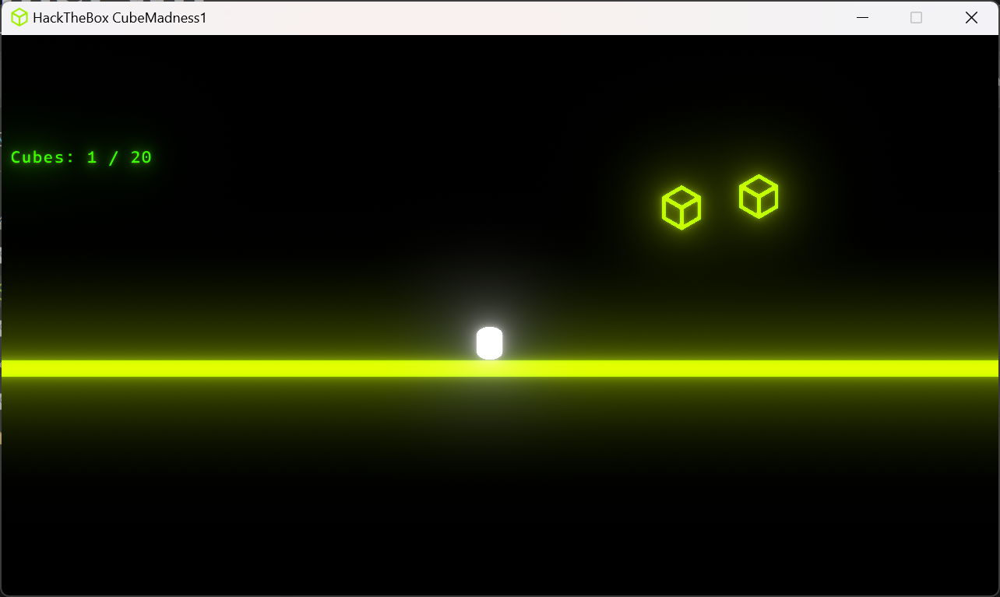
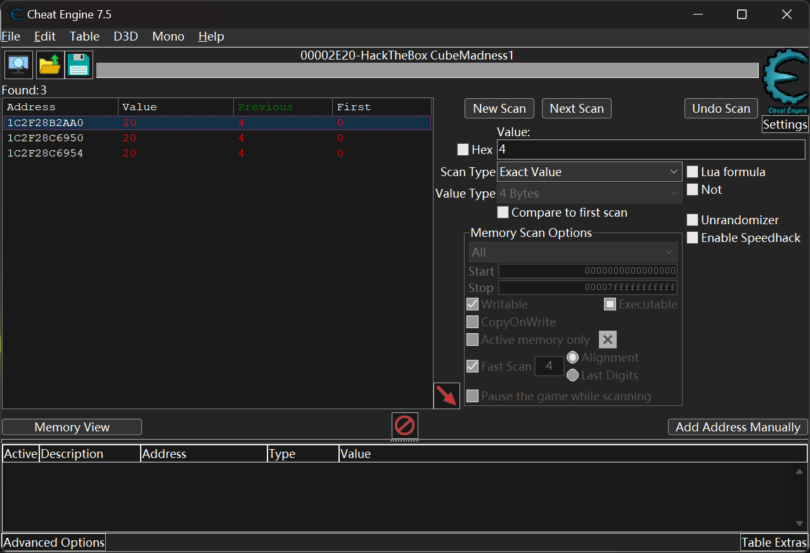
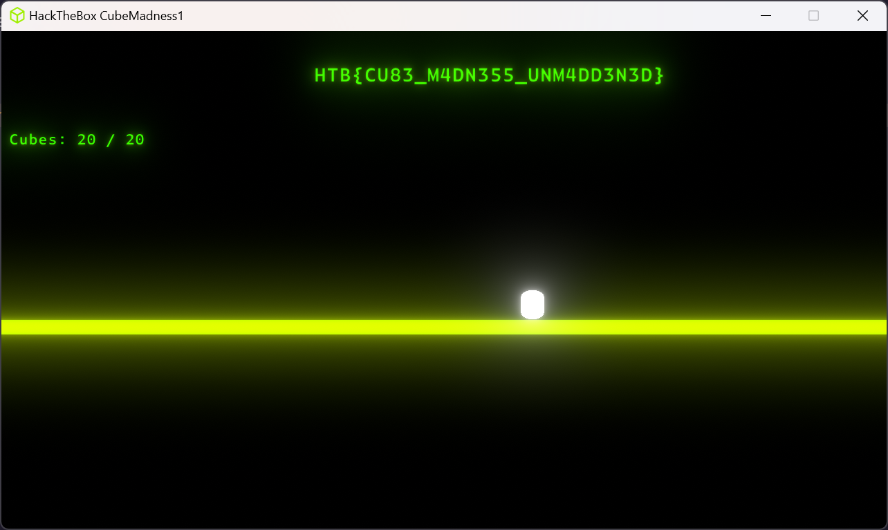

# CubeMadness1

>note DESCRIPCIÓN DEL DESAFÍO

**Dificultad:** MUY FÁCIL

*Gotta collect them all.* (Tienes que recogerlos todos).

>



Tras observar la cantidad de puntos disponibles en el escenario, es evidente que no es posible alcanzar el objetivo de **20 puntos** de manera normal.

Para solucionar esto, utilizamos **Cheat Engine** para modificar los valores en la memoria:

Finalmente, tras cambiar la puntuación actual a **19**, solo es necesario recoger un punto adicional en el juego para completar el desafío.





```plaintext title="Flag"
HTB{CU83_M4DN355_UNM4DD3N3D}

more:


 ## Referencias y Recursos

### Guías del Desafío

* **Writeup de Eric Turner:** [HackTheBox GamePwn - CubeMadness1](https://blog.ericturner.it/2022/03/23/hackthebox-gamepwn-challenge-cubemadness1/)

### Cheat Engine y su Uso

* **Sitio Oficial:** [Cheat Engine](https://www.cheatengine.org/)
* **Tutorial Práctico:** [Uso de Cheat Engine para munición infinita en Metal Slug 3](https://medium.com/@quackquackquack/using-cheat-engine-to-make-infinite-shotgun-in-metal-slug-3-a42be48c2009)

```