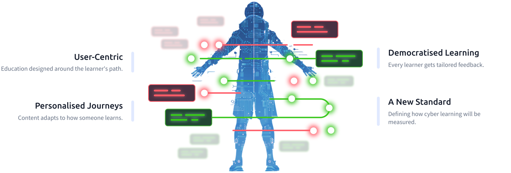
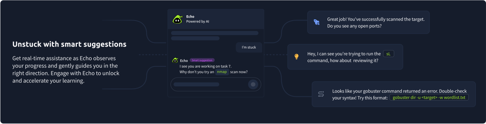
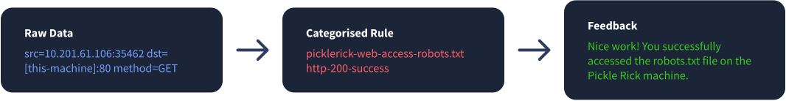

# BADR | Behaviour Action Detection Reporting
> **Actions to Insights: A New Standard in Learning**

## 🎯 La Visión
For the first time, we can rethink cyber education to be truly adaptive, personalised, and accessible to all - turning raw learner activity into revolutionary insights.

## 🔍 ¿Qué es BADR?
BADR isn't just data collection - it's the foundation for a new vision of cyber education. Traditional metrics stop at completion. BADR captures what happens in between - the commands, the steps, the approaches - revealing how learners really problem-solve.

### Capacidades principales:
- **User Actions in the VM:** Commands executed, tools opened, exploration steps.
- **Completion Journeys:** Not just if they finished, but how they got there.
- **Patterns of Behavior:** Exploratory vs goal oriented actions.

## 🤖 BADR + Echo
How we use BADR with Echo to seeing beyond completion and measuring the journey.

## 📊 Ejemplos de Datos

*Capturing flags to shaping futures.*

---
**The future of cyber teaching is here. Let's build it together.**
