# BADR | Behaviour Action Detection Reporting

> **Actions to Insights: A New Standard in Learning**

## 🚀 The Vision

**From capturing flags to shaping futures.**

*"For the first time, we can rethink cyber education to be truly adaptive, personalised, and accessible to all - turning raw learner activity into revolutionary insights."*

---

## 🔍 What it does?

**BADR isn't just data collection - it's the foundation for a new vision of cyber education.**

Traditional metrics stop at completion. BADR captures what happens in between - the commands, the steps, the approaches - revealing how learners really problem-solve.

### Key Capabilities:

* **User Actions in the VM:** Commands executed, tools opened, exploration steps.
* **Completion Journeys:** Not just if they finished, but how they got there.
* **Patterns of Behavior:** Exploratory vs goal oriented actions.

---

## 🤖 How we use BADR with Echo

**Seeing beyond completion: Measuring the journey.**

---

## 📊 BADR Data Examples

**Capturing the journey in real-time.**

 

---

## 🎯 Summary

**The future of cyber teaching is here. Let's build it together.**

With BADR, TryHackMe is moving cyber education from test-based to action-based. This is more than a feature - it's a movement toward adaptive, learner-first training. We believe in a future where every action counts, every learner gets feedback, and education evolves to meet the student.

---

Images
# Index de Imágenes - BADR CTF

## 🚀 Hero & Vision
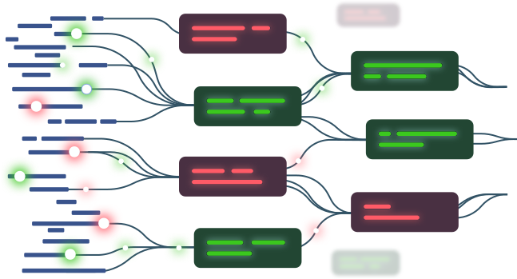

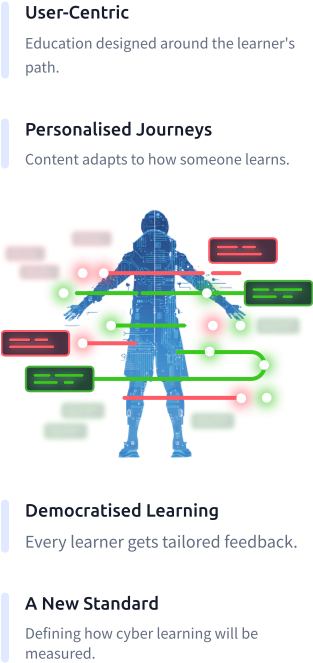

---

## 📊 Data Examples

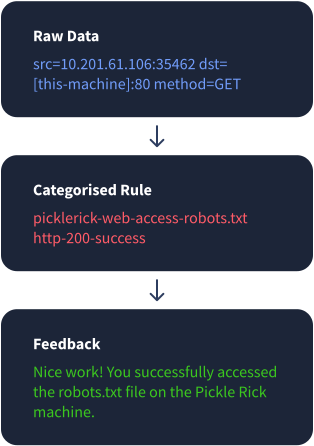
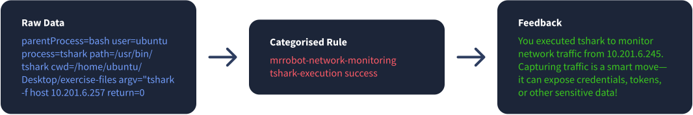
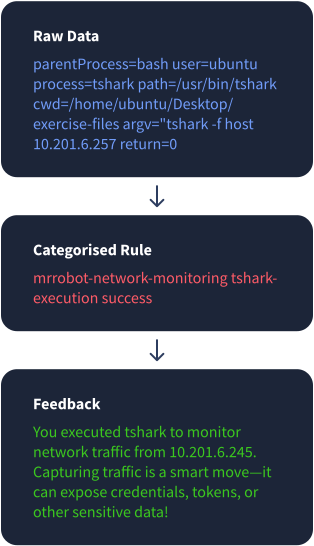

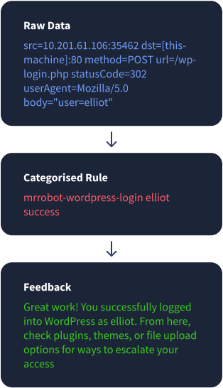
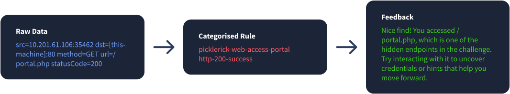
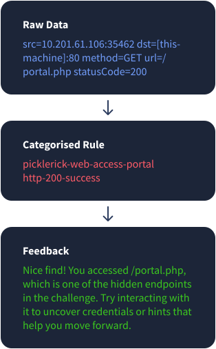
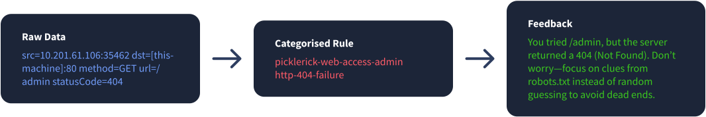
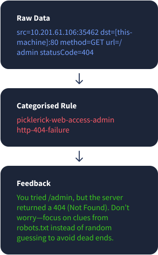

---

## 🛠️ How we use & What it does

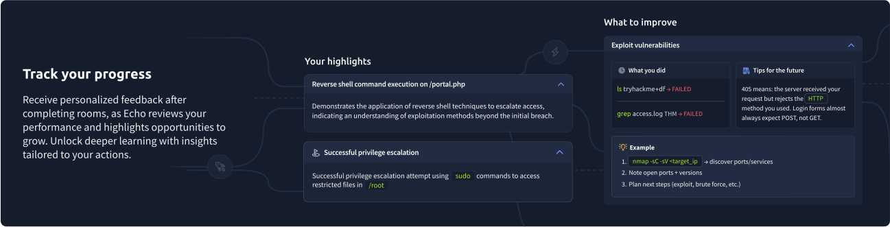
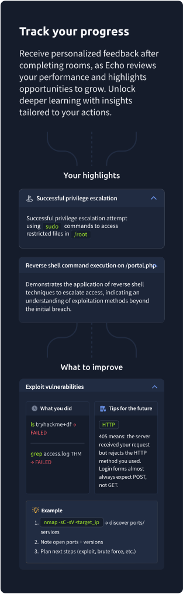
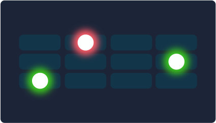
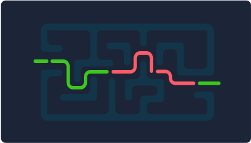