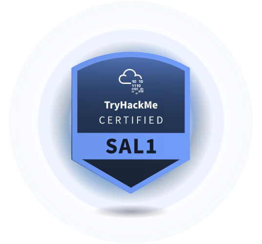

oficial información**
https://tryhackme.com/certification/security-analyst-level-1

https://tryhackme.com/resources/blog/creating-sal1



 

## Preguntas Frecuentes (FAQ)

### ¿Cuál es el proceso del examen?

El examen consta de tres secciones: **80 preguntas de opción múltiple** (límite de 1 hora), un **Escenario de Simulador SOC** (límite de 2 horas) y un **segundo Escenario de Simulador SOC** (límite de 2 horas). Una vez que comiences, tienes una ventana de **24 horas** para completar el examen completo.

Cada sección tiene su propio temporizador, que comienza a contar en cuanto inicias dicha sección. El temporizador corre de forma continua hasta que el tiempo expire o completes la sección.

La duración total del examen es de **6 horas** dentro de la ventana de 24 horas. Debes completar las secciones en orden: primero las preguntas de opción múltiple, seguidas de los dos escenarios del simulador SOC.

---

### ¿En qué se diferencia de un certificado de finalización?

Cuando completas todas las salas de una ruta, recibes certificados de finalización. La certificación **Security Analyst Level 1 (SAL1)** va más allá; es una certificación profesional de analista de ciberseguridad diseñada para validar tu capacidad de aplicar habilidades en el mundo real.

A diferencia de los certificados estándar, la SAL1 incluye un examen inmersivo y práctico que pone a prueba tu capacidad para manejar escenarios de seguridad reales. Los empleadores buscan profesionales que puedan pensar de forma crítica, investigar amenazas y responder con eficacia. La certificación SAL1 demuestra que puedes hacerlo, convirtiéndola en una credencial valiosa para quienes buscan iniciar o avanzar en su carrera.

---

### ¿Existen requisitos previos?

Este es un examen de **nivel inicial**. No hay requisitos previos formales: no se requiere educación previa, certificaciones ni experiencia laboral. Sin embargo, nuestro objetivo es asegurar que quienes aprueben estén realmente listos para trabajar. Para lograrlo, recomendamos una preparación exhaustiva en:

* Fundamentos de computación y redes.
* Comportamiento malicioso común.
* Herramientas de seguridad comunes.
* **Flujos de trabajo y actividades de SOC, incluyendo:**
* Triaje de alertas.
* Análisis de logs.
* Redacción de informes.


Para los usuarios de TryHackMe, recomendamos completar, como mínimo, las rutas de aprendizaje **Cyber Security 101** y **SOC Level 1**, además de practicar en los escenarios gratuitos de SOC Sim.

---

### Si repruebo, ¿puedo volver a tomar el examen?

**¡Sí!** Cada compra de certificación incluye **un intento de recuperación gratuito**. Puedes comenzar tu recuperación tres días después de haber iniciado tu primer intento. Si es necesario, se pueden comprar intentos adicionales.

---

### ¿Es necesario renovar esta certificación?

Sí, la certificación es **válida por tres años** y deberá ser renovada. La ciberseguridad evoluciona constantemente, y las certificaciones con vencimiento garantizan que tus conocimientos se mantengan actualizados. Puedes renovarla realizando un examen de recertificación, obteniendo otras certificaciones de TryHackMe (próximamente) o aprendiendo continuamente en la plataforma.

---

### ¿Por qué esta certificación tiene preguntas de opción múltiple?

Introdujimos preguntas de opción múltiple (MCQs) para asegurar que los candidatos estén bien preparados para roles iniciales. Los empleadores enfatizaron la importancia de los **conocimientos fundamentales de computación y redes**, los cuales no siempre se evalúan fácilmente solo con ejercicios prácticos. Las MCQs ayudan a cerrar esa brecha, evaluando conocimientos esenciales que se esperan en las entrevistas de trabajo.

---

### ¿Cómo manejan el fraude (trampas)?

Como empresa de seguridad, nos tomamos muy en serio la prevención del fraude. Hemos implementado múltiples salvaguardas:

1. **Preguntas y escenarios aleatorios.**
2. **Estrategias de rotación** para minimizar la exposición del contenido.
3. **Verificación estricta de identidad.**
4. **Controles aleatorios (spot checks)** por parte de nuestro personal.

Cualquier persona sorprendida haciendo trampa verá su certificación revocada y será **baneada permanentemente**.

---

### Precios y descuentos

| Opción | Precio | Incluye |
| --- | --- | --- |
| **Paquete Estándar** | **£299** | Examen + 3 meses de TryHackMe Premium |
| **Usuarios Premium actuales** | **£255** | 15% de descuento sobre el precio del examen |
| **Extensión de entrenamiento** | **Desde £14.99** | Tiempo adicional de preparación |

* **Descuentos por volumen:** Disponibles según la cantidad de licencias.
* **Empresas:** Si eres cliente de TryHackMe Business, contacta a tu gerente de éxito de cliente.

---
 


review:
https://raw.githubusercontent.com/GoldenEye10/goldeneye10.github.io/refs/heads/main/_posts/2025-03-30-SAL1_review.md

https://github.com/Remy-Haidaraly/Remy-Haidaraly.github.io/blob/4d3312a6e54ad18d678474512124082e04a6d98e/_posts/2025-04-19-SAL1.md


---
> TryHackMe SAL1 Exam Review
>
>description: TryHackMe Security Analyst Level 1 (SAL1)
>
> date: 2025-03-30 11:33:00 +0800
  
---

## Overview
The **TryHackMe Security Analyst Level 1 (SAL1)** exam is a brand-new hands-on certification designed to test practical cybersecurity skills. In February 2025, TryHackMe announced its launch and offered free exam vouchers to those holding **CompTIA CySA+** or **Blue Team Level 1 (BTL1)**. Naturally, I took advantage of this opportunity, Since I already held the BTL1 Certification.

---

## Should You Take SAL1?
### You should take SAL1 if:
- You want a **hands-on experience** like **CompTIA CySA+** or **BTL1**.
- You enjoy **learning through practical experience** rather than theoritical.
- You appreciate **affordable certifications**.

### You should NOT take SAL1 if:
- You’re **only looking to boost your resume**.
- You want a certification **just to pass HR filters**.

TryHackMe is a well-respected platform, but this certification is **brand new** and may take time to gain industry recognition.

---

## Preparation Strategy
TryHackMe recommends its **Cyber Security 101** and **SOC Level 1** pathways for exam preparation. Due to the limited time available before my free voucher expired (March 30, 2025), I just went with my knowledge from **BTL1**.

### Key Takeaways:
- **Master Splunk:** It plays a crucial role in the exam.
- **Prioritize hands-on exercises:** Especially SOC Simulators.
- **Time management is critical.**
- **Proper ducomentation is critical.**

---

## Exam Breakdown
The **SAL1 exam** consists of three sections, with a maximum score of **1000 points**:

- **200 points** – 80 **multiple-choice questions** (**1 hour**).
- **400 points** – **Scenario I** (hands-on investigation, **2 hours**).
- **400 points** – **Scenario II** (hands-on investigation, **2 hours**).

### Tools Provided:
- **Alerts Dashboard**
- **Splunk** (primary tool for analysis)
- **Analyst VM** (not heavily utilized, mostly for copying IPs into ‘TryDetectThis’, a TryHackMe fake VirusTotal)

### Exam Tips:
- **Close all True Positive alerts before the timer expires** – incomplete scenarios earn **zero** points.
- **Exam instructions are vague** about whether True Positives should be escalated. Over-escalation may cost points.
- **Multiple-choice questions are straightforward** – if you’ve taken **CompTIA Security+, ISC2 SSCP, or EC-Council CND**, you’ll do fine.

---

## Reporting Format
During preparation, I copied a **Documentation demo of exam on how to write report** to streamline my reports:

```
Alert description: <Type of attack>

### 5Ws
- **Who:** <Usernames, IPs, hostnames, etc.>
- **What:** <Type of attack>
- **Impact:** <What happened? Data exfiltration? Malware infection?>
- **When:** <Timestamps from Splunk>
- **Where:** <Device logs in Splunk>
- **Why:** <Attacker’s goal>

### Attacker Intent
- **Objective:** (e.g., ransomware, lateral movement, data theft)
- **Impact:** Was the attack successful?
- **MITRE ATT&CK Mapping:** (Identify relevant TTPs)

### Indicators of Compromise (IOCs)
- **List all related IPs, hostnames, usernames, and artifacts.**

### Recommended Actions
- **Block IPs, disable compromised accounts, or take other necessary security measures.**

### Escalation Decision
- **State whether you are escalating the alert, if yes, then justify the reason.**
```

### AI Grading Criteria:
1. **Correctly identifying alerts** (True Positive vs. False Positive).
2. **Providing detailed 5W analysis.**
3. **Assessing attacker intent accurately.**
4. **Listing comprehensive IOCs.**
5. **Making correct escalation decisions.**

AI **strictly penalizes incorrect escalation choices** but seems to be lenient on typos and grammer.

---

## Exam Experience & Verdict
One frustration was the **inability to take defensive actions** when detecting attacks in Splunk. While I could **observe** the attack unfolding, I couldn’t **isolate systems or disable compromised accounts**, which felt limiting but makes sense you are just the level 1 SOC. The lab is kind of slow and you do not have to use lot of tool except for splunk.

### Exam Format Flaws:
- **No scenario details until after the timer starts.**
- **VM boot-up time counts against your timer.**
- **Does not allow you to confirm, so you can review all the alerts one final time before the end of each section**
- **Tip:** Immediately start VMs before reading the scenario.

### Final Thoughts:
- **Well-structured exam but seems very basic compared to BTL1.**
- **Great for SOC aspirants looking for hands-on experience. While BTL1 is focused more on incident response, this is pure SOC Scenario**


---

## Conclusion
Despite its pros and cons, **SAL1 is a solid fun hands-on blue team certification**. Beginners who complete **the relevant TryHackMe pathways** have a strong chance of passing. Upon success, you receive a **certification, Credly badge, and some well-earned bragging rights.**


 2nd review:
 

---

## Comparativa: SAL1 vs. BTL1

Si estás dudando entre **SAL1 (Security Analyst Level 1)** y **BTL1 (Blue Team Level 1)**, aquí te comparto mi análisis tras haber cursado ambos:

* **BTL1 (Enfoque Generalista):** Esta certificación es un "Blue Team" en sentido amplio. Se centra profundamente en el uso de herramientas forenses y de investigación (como **Autopsy, Volatility, KAPE y DeepBlueCLI**). Es ideal si buscas entender la respuesta ante incidentes desde la raíz técnica.
* **SAL1 (Enfoque Operativo SOC):** Está diseñada específicamente para el rol de **Analista SOC**. El contenido se vuelca en la operativa diaria: gestión de servicios críticos como **SIEM y SOAR**, triaje de alertas, redacción de informes y priorización de incidentes.

**En resumen:** Ambos son muy completos, pero mientras que BTL1 te da una visión técnica general del equipo azul, **SAL1 te prepara para el día a día real dentro de un SOC.**

> [!TIP]
> Si completas los recorridos **SOC L1 + SOC L2 de TryHackMe**, tendrás los conocimientos necesarios para afrontar ambas certificaciones con éxito.

---
Imagen del certificado (fr)


## Conclusión

La certificación **SAL1** es una excelente puerta de entrada al mundo de la defensa activa. Te capacita específicamente para:

* **Priorizar y analizar** alertas de seguridad de forma eficiente.
* **Leer e interpretar logs** de diversas fuentes.
* **Correlacionar información** (IOCs y comportamientos sospechosos).
* **Redactar informes** claros, técnicos y argumentados.

Todo esto se desarrolla en un entorno realista e inmersivo, con una relación calidad-precio muy competitiva para un nivel *entry-level*.

--- 
 