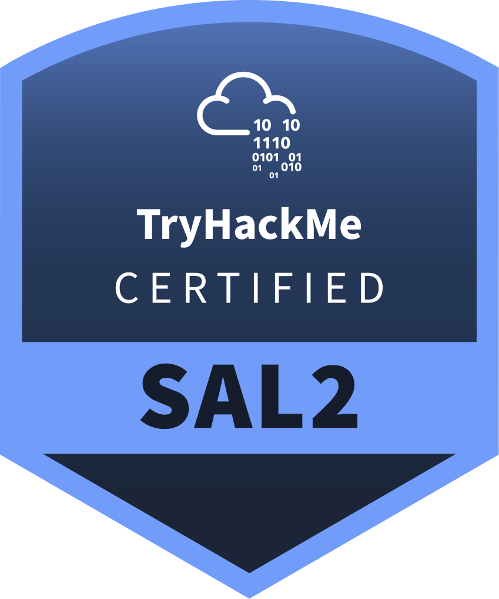
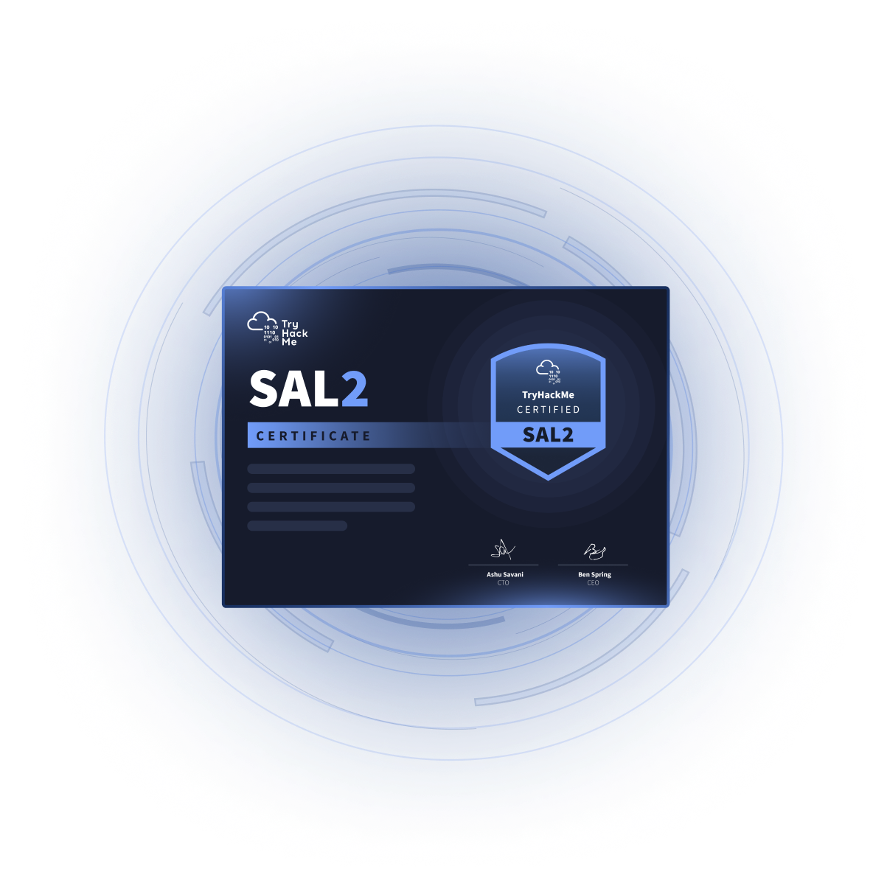

# Security Analyst Level 2 (SAL2) [INFO]

> **ES/EN** — Guía de la certificación Security Analyst Level 2 (SAL2) de TryHackMe.
> Guide to TryHackMe's Security Analyst Level 2 (SAL2) certification.

Referencia oficial / Official reference: https://tryhackme.com/certification/security-analyst-level-2

### ¿Qué es? / What is it?

SAL2 es una certificación avanzada y práctica para analistas listos para operar al siguiente nivel. Valida la profundidad técnica, el juicio y la comunicación que exigen las operaciones de seguridad modernas. Los roles SOC de nivel medio-senior demandan más que triage de alertas: SAL2 demuestra que puedes investigar amenazas complejas y rendir al nivel del que dependen los equipos modernos.

### ¿Cómo es el proceso de examen? / How is the exam process?

- **100% hands-on**, ventana flexible de **72 horas** para completar a tu ritmo.
- **12 escenarios SOC multi-etapa** que evalúan investigación técnica y toma de decisiones / reporte de nivel superior.
- **Evaluación técnica + reporte:** se analizan cadenas de ataque complejas en escenarios SOC realistas (nube, Active Directory, red y endpoint) y se articulan hallazgos con reportes estructurados.
- Tras aprobar recibes el certificado SAL2 y la insignia digital para compartir con empleadores o en LinkedIn.

### ¿Qué habilidades valida? / What skills does it validate?

Según el artículo oficial SAL2 Training Content (Help Center, 29-may-2026):

- **Investigación de incidentes multi-etapa:** cadenas de ataque complejas de acceso inicial a impacto.
- **Análisis de amenazas y razonamiento contextual:** naturaleza, severidad e impacto.
- **Fluidez en tooling SOC:** SIEM (Splunk, Elastic), consolas EDR y entornos de investigación.
- **Investigación cross-domain:** nube, Active Directory, red y endpoint.
- **SLA awareness:** operar dentro de tiempos de respuesta definidos, priorizando como un SOC real.
- **Priorización y decisiones bajo presión.**
- **Comunicación profesional:** resúmenes ejecutivos + reportes técnicos detallados para handoff DFIR.

### ¿A quién está dirigida? / Who is it for?

Analistas SOC Nivel 1 y 2 listos para rendir a nivel medio. **SAL1 antes de SAL2 es recomendado** (no obligatorio). Roles objetivo: Mid-level SOC Analyst, Detection Engineer, Threat Hunter, Incident Responder, DFIR Analyst.

### Si repruebo, ¿puedo volver a tomar el examen? / If I fail, can I retake the exam?

**¡Sí!** Incluye **1 free retake**: si no apruebas al primer intento, tienes una segunda oportunidad incluida.

### Precios / Pricing

**$749** (USD de referencia; puede aplicar precio localizado). Suscriptores Premium o Max aplican su código de descuento al pagar. Comparativa oficial de la página: Security+ $425+, CySA+ $599, BTL1 $2.500, SANS $5.999+. Precio referencial con información al **21.09.2026**.

### Founding Operators Club (cohorte inaugural)

Los primeros **100 analistas** que aprueben forman el club fundador con reconocimiento público y beneficios exclusivos: certificado Premium Founding, listado en directorio público (opt-in), mensaje de los cofundadores, insignia y banner de LinkedIn e invitaciones a eventos de operadores. Campaña cierra el 2 de abril (verificar año vigente en la página).

### Pendiente de verificar / Pending verification

- Nota de aprobación (puntaje mínimo) y vigencia de la credencial: la página guardada no los muestra — **no documentar hasta verificar**.

---

**Fuente / Source:** [TryHackMe SAL2](https://tryhackme.com/certification/security-analyst-level-2) (página guardada localmente 2026-09-21) · [SAL2 Training Content](https://help.tryhackme.com/en/articles/14193956-sal2-training-content) (Help Center, 2026-05-29)
**Autor del documento / Document author:** Apuromafo
**Fecha de acceso / Access date:** 2026-09-21
