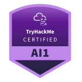
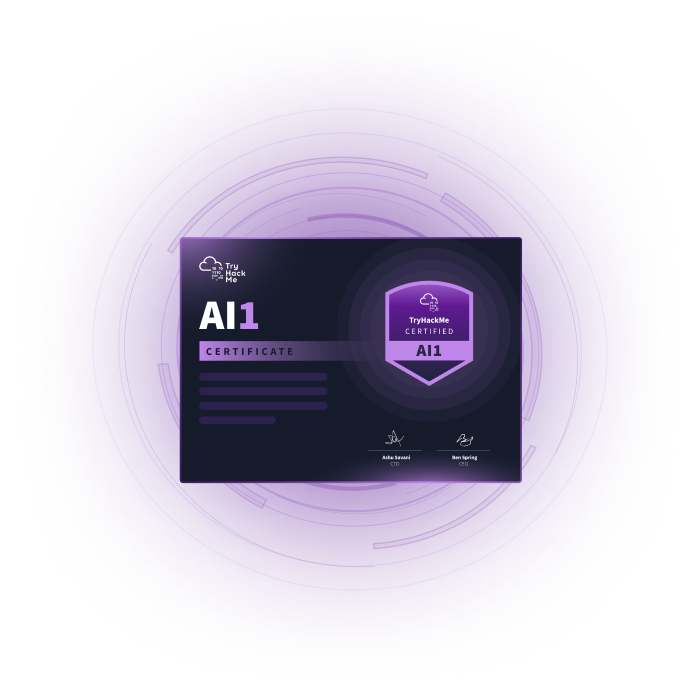

# AI Security (AI1) [INFO]

> **ES/EN** — Guía de la certificación AI Security (AI1) de TryHackMe.
> Guide to TryHackMe's AI Security (AI1) certification.

Información oficial / Official information:
https://tryhackme.com/certification/ai-security

## Preguntas Frecuentes (FAQ) / FAQ: AI Security (AI1)

**¿Qué es la Certificación AI Security (AI1)?**
AI1 es una certificación práctica de nivel intermedio que valida tu capacidad para **atacar y defender sistemas de Inteligencia Artificial**. Cubre el ciclo de vida completo de la seguridad de la IA: ataques, defensas y evaluaciones de sistemas y modelos de IA.

**¿Cuál es el precio del examen? / What is the exam price?**
El examen cuesta **$399** e incluye **1 retoma/retake gratuita** en caso de no aprobar al primer intento. Precio referencial con información al **21.09.2026**.

**¿Para quién está diseñada?**
Ideal para profesionales de seguridad que ya trabajan en ciberseguridad y quieren especializarse en IA, así como para desarrolladores de IA que quieren seguridad. No es una certificación de nivel principiante.

**¿Cuánto dura el examen? / How long is the exam?**
El examen tiene una ventana de **48 horas** para completarlo, de forma 100% práctica y sin preguntas de opción múltiple. Consta de **4 secciones y 13 escenarios hands-on** sobre sistemas IA reales.

**¿Cuál es el puntaje de aprobación? / What is the passing score?**
La nota de aprobación es **70%**, con calificación asistida por IA en 24-48 horas.

**¿Cuánto dura la validez? / How long is it valid?**
Al igual que el resto de certificaciones de TryHackMe, la certificación AI1 es válida por **3 años** desde la fecha en que apruebas el examen.

**¿Qué valida la certificación?**
Valida de forma práctica tu capacidad para:

* Atacar y explotar sistemas y modelos de IA (prompt injection, evasión, exfiltración de datos, etc.).
* Defender sistemas de IA frente a ataques.
* Evaluar riesgos de seguridad en el ciclo de vida de la IA.
* Trabajar con escenarios reales de IA en entornos desplegables.

**¿Hay retomas? / Is there a retake?**
Sí. El precio incluye **1 free retake**: si no apruebas al primer intento, tienes una segunda oportunidad incluida.

**¿Necesito una suscripción para realizar el examen?**
No se requiere una suscripción para comprar el examen, aunque se recomienda completar la ruta de aprendizaje correspondiente antes de presentarse.

---

 fecha:21.09.2026

---

**Fuente / Source:** [TryHackMe AI Security (AI1)](https://tryhackme.com/certification/ai-security) · [AI1 Exam Guide](https://help.tryhackme.com/en/articles/15301082-ai1-exam-guide)
**Autor del documento / Document author:** Apuromafo
**Fecha de acceso / Access date:** 2026-09-21
