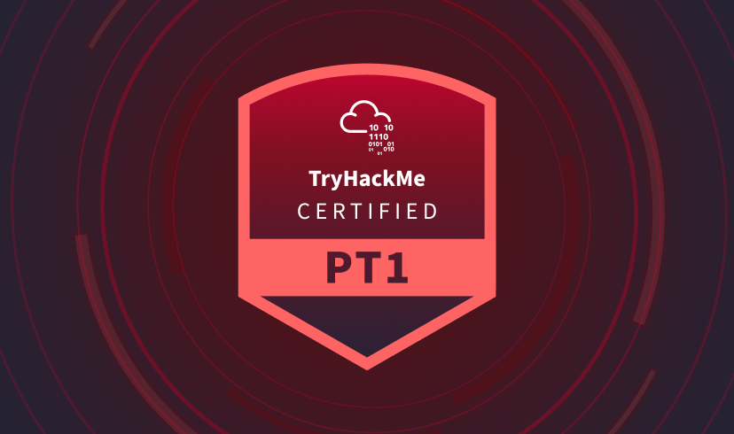

# Junior Penetration Tester (PT1) [INFO]

> **ES/EN** — Guía de la certificación Junior Penetration Tester (PT1) de TryHackMe.
> Guide to TryHackMe's Junior Penetration Tester (PT1) certification.

Referencia oficial / Official reference: https://tryhackme.com/certification/junior-penetration-tester

### ¿Cómo es el proceso de examen? / How is the exam process?

El examen consta de 3 secciones en el Simulador de Pentest que desafía tus habilidades prácticas sumergiéndote en escenarios de pruebas de penetración de la vida real: **Web Application, Network Security y Active Directory**.

Cada sección presenta un único escenario en el que recibirás reglas de compromiso (*rules of engagement*) y una misión para identificar y explotar vulnerabilidades, culminando en un informe de caso detallado, que refleja fielmente las responsabilidades del mundo real de un pentester profesional.

La duración total del examen es de **48 horas**. Una vez enviado, tu examen es evaluado automáticamente por nuestro proceso de revisión impulsado por IA de alto estándar, desarrollado por expertos en el dominio para garantizar la precisión y la equidad.

### ¿En qué se diferencia esto de una certificación de finalización? / How does this differ from a completion certificate?

Cuando completas todas las salas de una ruta, recibes certificados de finalización. La certificación Junior Penetration Tester (PT1) va más allá; es una certificación de seguridad ofensiva profesional diseñada para validar tu capacidad de aplicar habilidades del mundo real. A diferencia de los certificados de finalización estándar, el PT1 incluye un examen práctico e inmersivo que pone a prueba tu capacidad para manejar escenarios de seguridad reales.

### ¿Existen requisitos previos? / Are there prerequisites?

Este es un examen de nivel inicial. No hay requisitos previos formales: no se requiere educación previa, certificación o experiencia laboral. Sin embargo, nuestro objetivo es garantizar que quienes aprueben estén realmente preparados para el trabajo con un tiempo de adaptación mínimo. Para lograr esto, recomendamos encarecidamente una preparación exhaustiva con las rutas de aprendizaje recomendadas, como la ruta **Junior Penetration Tester** y **Web Fundamentals**.

### Si repruebo, ¿puedo volver a tomar el examen? / If I fail, can I retake the exam?

¡Sí! Cada compra de certificación incluye **un retake gratuito**. Puedes comenzar tu retake **tres días** después de iniciar tu primer intento. Si es necesario, se pueden comprar retakes adicionales.

### ¿Es necesario renovar esta certificación? / Is it necessary to renew this certification?

Sí, la certificación es válida por **tres años** y deberá ser renovada. La ciberseguridad evoluciona constantemente, y las certificaciones que caducan garantizan que tus conocimientos se mantengan actualizados con las últimas amenazas, tecnologías y mejores prácticas. Puedes renovarla realizando un examen de recertificación, obteniendo otras certificaciones de TryHackMe (próximamente) o aprendiendo continuamente en la plataforma. Una vez que apruebes, se mostrará tu fecha de vencimiento y te enviaremos recordatorios a medida que se acerque la fecha de renovación.

### ¿Cómo manejan las trampas? / How do they handle cheating?

Como empresa de seguridad, nos tomamos muy en serio la prevención de trampas. Nuestro equipo de expertos en seguridad ha probado rigurosamente el examen para detectar posibles vulnerabilidades y oportunidades de trampa, y fortaleceremos continuamente nuestras defensas. Para proteger la integridad de la certificación, hemos implementado múltiples salvaguardas, que incluyen escenarios aleatorios, estrategias de rotación para minimizar la exposición y una verificación de identidad estricta.

Nuestro personal también realiza controles aleatorios para detectar y disuadir comportamientos deshonestos. Cualquier persona sorprendida haciendo trampa, incluido el **uso de herramientas de IA para asistir injustamente en las evaluaciones**, verá revocada su certificación y será baneada permanentemente. Nuestro objetivo es garantizar que obtener esta certificación siga siendo un logro significativo y creíble que refleje la habilidad y el esfuerzo genuinos.

### Precios y Descuentos / Prices and Discounts

Por **£299**, obtienes el examen más tres meses de TryHackMe premium, lo que te brinda acceso total a toda la capacitación que necesitas para tener éxito. Si necesitas más tiempo, puedes extender tu capacitación por tan solo **£14.99**.

Los usuarios premium actuales de TryHackMe pueden comprar el examen por **£255 (15% de descuento)**. También hay descuentos por volumen disponibles según la cantidad de licencias compradas. Muchos profesionales pasan el costo de la certificación a través de su empleador; verifica si tu empresa ofrece reembolsos por aprendizaje y desarrollo.

Si eres un cliente comercial de TryHackMe, ponte en contacto con tu gerente de éxito del cliente. Si estás interesado en nuestra oferta comercial, puedes obtener más información aquí.

### ¿Hay una fecha de vencimiento para tomar el examen después de la compra? / Is there an expiration date to take the exam after purchase?

Sí. Después de la compra, tienes **12 meses** para realizar el examen de certificación.
*Nota: Si estás usando un cupón, la fecha de vencimiento puede diferir; consulta los detalles proporcionados con tu cupón.*

### Estoy pensando en obtener otra certificación, ¿por qué elegir PT1 en su lugar? / I'm considering another certification, why choose PT1?

PT1 va mucho más allá de "¿puedes hackear esta caja?", es una simulación completa de un pentest del mundo real, que incluye laboratorios dedicados, movimiento lateral, explotación y generación de informes de estilo profesional. A diferencia de otras certificaciones que omiten Active Directory o pasan por alto el movimiento de red, PT1 ofrece una combinación sólida de AppSec, NetSec y AD, exactamente lo que los SOC y los red teams buscan validar. También enfatiza una de las habilidades más críticas para los empleadores: la comunicación clara de riesgos.

Practicarás la redacción de informes estructurados al igual que en roles de consultoría interna o externa. El entorno también refleja la realidad: obtienes tu propio laboratorio, acceso total a Internet y sin restricciones de herramientas, al igual que la configuración de un pentester real.

Y todo esto a un precio competitivo, con más profundidad, presión y valor para el empleo que **CEH, PenTest+ o incluso eJPT/PJPT**. Si te tomas en serio destacar, PT1 está diseñado para ti.

---
  
Source: https://raw.githubusercontent.com/MoetezBenAbdallah/moetezbenabdallah.github.io/7385b3419f13c34b70f962dd173a36d55e327f8d/_posts/2025-09-14-PT1-Review.md

---
> PT1 Junior Penetration Tester (TryHackMe) – Review 🚀 

> date: 2025-09-14

> categories: [Certifications, Review]

> tags: [PT1, TryHackMe, Network Pentesting, Web Exploitation,Active Directory, cybersecurity, report]
 
---

## Introduction / Introducción
Hey everyone! I recently passed the TryHackMe PT1 (Junior Penetration Tester) certification exam, and I wanted to share my review on it. As someone who's been diving into cybersecurity and penetration testing, this was a great hands-on challenge. I got my exam slot through a giveaway (I already had the eJPT), so I didn’t pay for it this time. In this post, I'll cover what PT1 is, the exam structure, my personal experience, the difficulties I faced in each section, pros and cons, and whether I think it's worth the price. Spoiler: It was a solid experience, but not without its hurdles.

## What is PT1? / ¿Qué es PT1?
PT1 is TryHackMe's hands-on Junior Penetration Tester certification. It's designed to test practical skills in web exploitation, network penetration testing, and Active Directory attacks. Unlike some certs that come with a full course, PT1 recommends their learning paths like the Junior Penetration Tester path, Web Fundamentals, and Active Directory Fundamentals. There are also plenty of practice rooms on the platform to hone your skills. The exam costs $297, which includes a free retake and a three-month subscription to TryHackMe.

## Exam Structure / Estructura del Examen
The exam is a 48-hour hands-on challenge where you simulate a real penetration test. It's divided into three main sections:

- **Web Application Penetration Testing:** Worth 400 points (40%), with 4 flags to capture. Focuses on finding and exploiting vulnerabilities in a web app.  
- **Network Penetration Testing:** 360 points (36%), involving 2 machines (likely one Linux and one Windows) with 4 flags total.  
- **Active Directory Penetration Testing:** 240 points (24%), with 2 flags across a workstation and Domain Controller.

You need at least **750/1000** points to pass. Each section has its own Rules of Engagement, scope, and summary. After exploiting, you submit flags and write a structured report for each part right on the TryHackMe dashboard. The reports get graded by AI, which provides quick feedback.

## My Personal Experience / Mi Experiencia Personal
I started the exam on a weekend to give myself plenty of time. I had prepared using the recommended paths and some extra rooms on TryHackMe, plus a bit of practice on HackTheBox for variety. I tackled the network section first since it felt most straightforward, then moved to AD, and saved web for last because I knew it might be tough.

Overall, I spent about **20–25 hours** actively working on it, spread over the two days. I managed to get **9/10** flags – all in network and AD, but missed one in web due to time and frustration. The reporting was straightforward once I got the hang of the template, but make sure to include screenshots, commands, and clear explanations. AI grading was fast, and the feedback helped me refine my submission.

One tip: keep notes and checklists ready. I used Notion for quick references on common exploits and commands. Also, don't hesitate to use AI tools like ChatGPT for brainstorming ideas — they can speed up your thought process (just don’t use them to bypass exam rules).

## Difficulty Levels / Niveles de Dificultad
Based on my experience:

- **Network:** Easy. The machines were like entry-level CTFs – basic enumeration, exploit a service for initial access, then privilege escalation. If you've done easy rooms on TryHackMe or HTB, you'll breeze through it. I finished this in under 2 hours.  
- **Active Directory:** Easy but tricky. Initial access to the workstation was straightforward, but getting to the Domain Controller involved some clever pivoting and tool usage that caught me off guard at first. It felt a bit CTF-y, and I spent about 4–5 hours here debugging issues with tools like BloodHound and Mimikatz. Once I figured out the trick, it clicked.  
- **Web:** Hard. The app had multiple vulnerabilities that required deep enumeration and testing. I dealt with things like IDOR, XSS, and maybe some race conditions or SQLi — it varies per attempt. I struggled with one flag that needed precise exploitation, and the dynamic nature meant no walkthroughs to rely on. Took me the longest, around 10–12 hours, and I still missed one.

The exam's randomized elements make it replay-resistant, which is good for credibility but means preparation needs to be broad.

## Pros / Pros
- **Hands-On and Realistic:** It simulates a real pentest engagement, from scoping to reporting. Great for building practical skills.  
- **AI Grading:** Instant feedback is awesome — no waiting weeks for results.  
- **Comprehensive Coverage:** Covers web, network, and AD, giving a well-rounded junior-level experience.  
- **Included Subscription:** The three-month access to TryHackMe is a nice bonus for continued learning.

## Cons / Contras
- **Variable Difficulty:** Since vulnerabilities are randomized, some attempts might be easier or harder, which could feel unfair.  
- **Reporting Limitations:** It's all on the dashboard, no option to export a full PDF report like in real engagements.  
- **Support:** If you hit a snag (like I did with a flag format), email support can be slow – better than nothing, but not instant.  
- **Prep Path Gaps:** The recommended paths are good, but you might need external resources for deeper AD or web practice. I personnaly used some HackTheBox machines to garantee my success.

## Value for Money / Valor por Dinero
At **$297**, it's a bit pricier than some alternatives, but the hands-on focus and subscription make it worthwhile if you're serious about pentesting. If you get a voucher or a giveaway (like I did), it’s a no-brainer. If you're a beginner, it's a strong foundation. For those with experience, it might not add as much resume value yet since it's relatively new, but it's still good practice and skill-building. If TryHackMe offers discounts or vouchers, definitely take them.

## Conclusion / Conclusión
Overall, PT1 was a challenging but rewarding cert. I found network easy, AD easy but tricky, and web hard — which aligned with what I expected but still pushed me. If you're into practical pentesting and have some TryHackMe experience, I recommend it. It's not a "must-have" for jobs, but it's a great way to prove your skills to yourself.

If you have questions or want tips, drop a comment below. Happy hacking!

---

**Fuente / Source:** [TryHackMe Junior Penetration Tester (PT1)](https://tryhackme.com/certification/junior-penetration-tester)
**Autor del documento / Document author:** Apuromafo
**Fecha de acceso / Access date:** 2026-09-01

