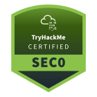
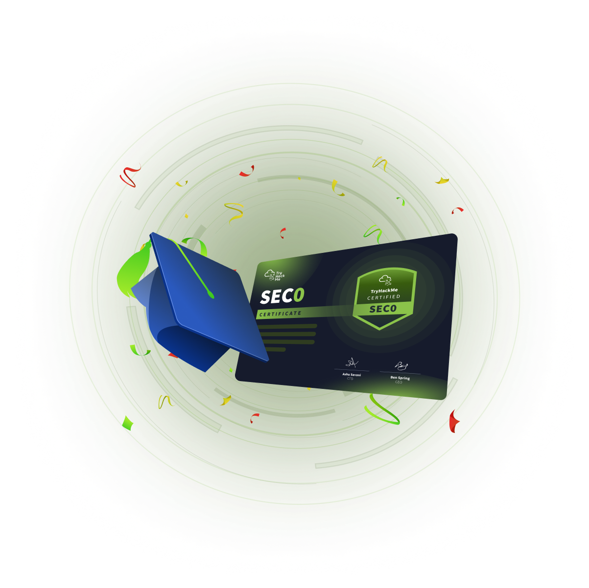

# Pre Security (SEC0) [INFO]

> **ES/EN** — Guía de la certificación Pre Security (SEC0) de TryHackMe.
> Guide to TryHackMe's Pre Security (SEC0) certification.

Información oficial / Official information:
https://tryhackme.com/certification/pre-security

## Preguntas Frecuentes (FAQ) / FAQ: Pre Security (SEC0)

**¿Qué es la Certificación Pre Security (SEC0)?**
Pre Security (SEC0) es la certificación de entrada para estudiantes sin experiencia previa en ciberseguridad. Valida fundamentos prácticos de redes, Linux, seguridad web y lógica de ciberseguridad antes de avanzar hacia certificaciones como SEC1 (Cyber Security 101).

**¿Cuál es el precio del examen? / What is the exam price?**
El examen cuesta **$69** e incluye **1 retoma/retake gratuita** en caso de no aprobar al primer intento. Precio referencial con información al **21.09.2026**.

**¿Cuánto dura el examen y hay retomas?**
El examen es 100% práctico y cuenta con **1 retoma gratuita** incluida en el precio de compra.

**¿Cuánto dura la validez? / How long is it valid?**
La certificación es válida por **3 años** desde la fecha en que apruebas el examen. Deberás realizar el examen nuevamente para mantener la validez de la certificación.

**¿Es una certificación para principiantes?**
Sí, es el primer eslabón de la línea de certificaciones de TryHackMe. Ideal para personas con 0 experiencia que quieren validar las bases antes de intentar SEC1 (Cyber Security 101).

**¿Qué valida la certificación?**
Valida de forma práctica la comprensión de:

* Cómo funciona Internet y las redes (OSI, TCP/IP, HTTP/HTTPS, DNS).
* Conceptos básicos de Linux.
* Fundamentos de seguridad web y aplicaciones.
* Fundamentos de criptografía.
* Lógica de ataque y defensa (Red Team vs Blue Team).

**¿Hay un bundle con otras certificaciones?**
Sí. El **Foundational Bundle** combina SEC0 (Pre Security) + SEC1 (Cyber Security 101) por **$177** (precio original $221). Precio referencial con información al **21.09.2026**.

**¿Necesito una suscripción para realizar el examen?**
No se requiere una suscripción para comprar el examen. Sin embargo, partes de la ruta de aprendizaje Pre Security de TryHackMe pueden requerir una suscripción Premium para completarse.

---

 fecha:21.09.2026

---

**Fuente / Source:** [TryHackMe Pre Security (SEC0)](https://tryhackme.com/certification/pre-security)
**Autor del documento / Document author:** Apuromafo
**Fecha de acceso / Access date:** 2026-09-21
