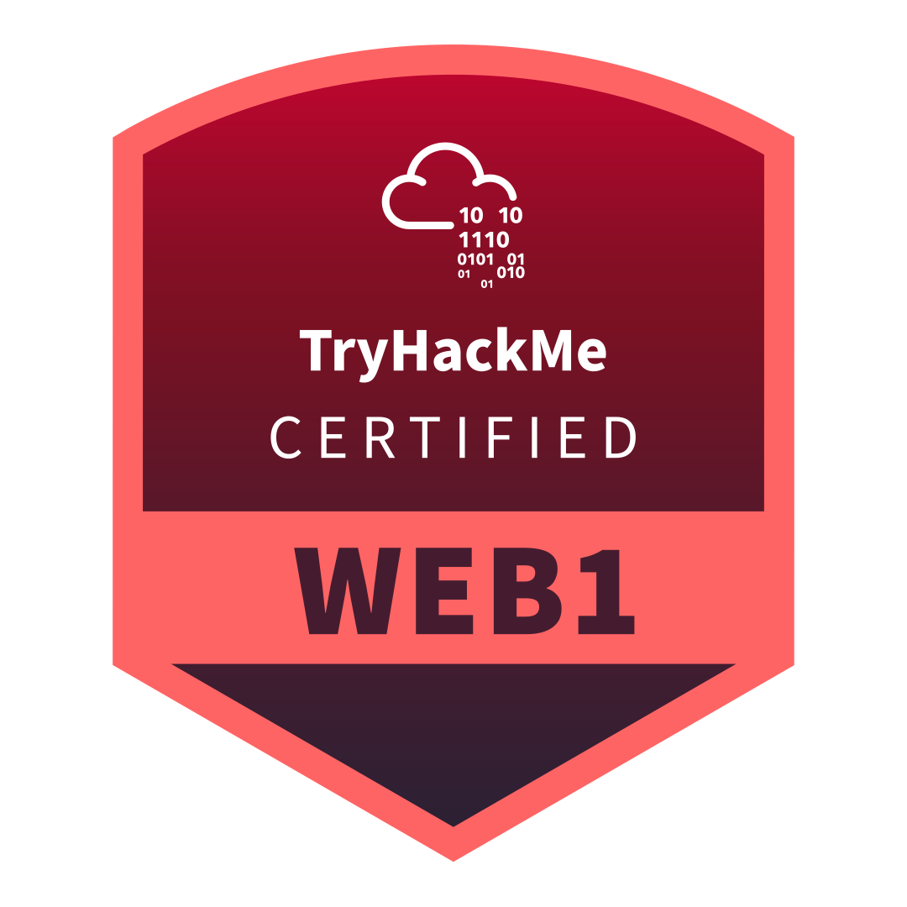

# Web Application Pentester Level 1 (WEB1) [INFO]

> **ES/EN** — Guía de la certificación Web Application Pentester Level 1 (WEB1) de TryHackMe.
> Guide to TryHackMe's Web Application Pentester Level 1 (WEB1) certification.

Información oficial / Official information:
https://tryhackme.com/certification/web-application-pentester-level-1

## Preguntas Frecuentes (FAQ) / FAQ: Web App Pentester Level 1 (WEB1)

**¿Qué es la Certificación WEB1?**
WEB1 es la certificación especializada en **seguridad web** de TryHackMe. Testea habilidades de pentesting web "de punta a punta": atacas aplicaciones web reales bajo tres modelos de acceso — **blackbox, whitebox y greybox** —, explotas lo que encuentras y documentas la corrección.

**¿Cuál es el precio del examen? / What is the exam price?**
El examen cuesta **$299** e incluye **1 retoma/retake gratuita** en caso de no aprobar al primer intento. Precio referencial con información al **21.09.2026**.

**¿Es una certificación de nivel introductorio?**
No. WEB1 NO es de nivel principiante (entry-level). Es una especialización web que se adentra en territorio intermedio: request smuggling, race conditions, insecure deserialisation y prototype pollution. Se recomienda tener conocimientos sólidos de tecnologías web, HTTP y conceptos básicos de seguridad antes de presentarse.

**¿Cuánto dura el examen? / How long is the exam?**
El examen es 100% práctico, tiene una ventana de **48 horas** y no es un CTF: cada vulnerabilidad explotada se verifica objetivamente con una flag única por instancia y cada hallazgo requiere un reporte escrito calificado contra una rúbrica.

**Formato y puntuación / Format and scoring**
* Secciones: **Blackbox (20%)**, **Whitebox (20%)** y **Greybox (60%)**.
* Puntuación total: **1000 puntos**. Se aprueba con **700 puntos (70%)**.
* Cada explotación aporta un porcentaje de la nota técnica; el reporte (descripción del ataque + remediación) suma el resto.

**¿Cuánto dura la validez? / How long is it valid?**
Al igual que el resto de certificaciones de TryHackMe, la certificación WEB1 es válida por **3 años** desde la fecha en que apruebas el examen.

**¿Qué herramientas necesito?**
Solo un navegador y tu kit habitual de pruebas web (Burp Suite Community o gratuito sirve). No se requiere licencia de pago (p. ej. Burp Suite Pro) para presentar el examen. Puedes atacar desde el AttackBox de TryHackMe o desde tu propia máquina conectada por VPN.

**¿Hay retomas? / Is there a retake?**
Sí. El precio incluye **1 free retake**: si no apruebas al primer intento, tienes una segunda oportunidad incluida con flags nuevas por instancia.

**¿Cómo se relaciona con otras certificaciones?**
WEB1 es una especialización web que corre en paralelo a PT1 (Junior Penetration Tester). No necesitas completar PT1 primero. WEB1 se sitúa antes de PT1 como preparación previa dentro de la línea web.

---

 fecha:21.09.2026

---

**Fuente / Source:** [TryHackMe Web App Pentester Level 1 (WEB1)](https://tryhackme.com/certification/web-application-pentester-level-1) · [WEB1 Exam Guide](https://help.tryhackme.com/en/articles/16012250-web1-exam-guide)
**Autor del documento / Document author:** Apuromafo
**Fecha de acceso / Access date:** 2026-09-21
