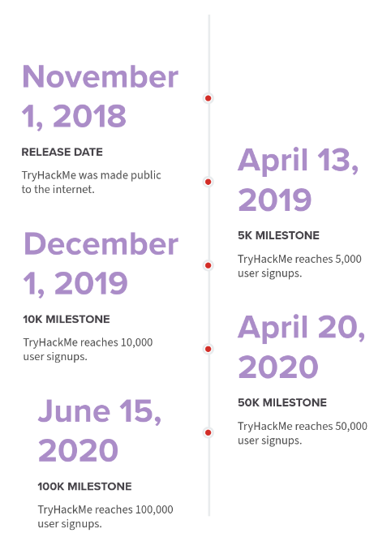

# TryHackMe Reaches 100,000 Members

**ID Original:** no disponible
**Slug:** 100k
--------------------

In June 2020, TryHackMe hit 100,000 registered members - an incredible milestone. From April to June alone we've seen 50,000 new registrations.
User registration timeline
The 100k Mini-CTF
To celebrate, this Friday (19th June) at 8pm BST we will be releasing a short security challenge. You will need to hack into a machine and find an email address. The first 10 users to email will receive a prize. The prizes are more valuable the sooner you email - for example being the first to email will give you a prize worth more than coming second.
How TryHackMe started
Ashu and I (both Co-Founders) met at a summer internship back in 2018. We found that learning cyber security was fragmented and much of the learning material out there lacked structure and direction. We had experimented with other learning platforms, but still found a disconnection between what we had read and what we put it into practice.
We decided (for our own learning) to build our own cloud-based security labs, that hosted a few virtual machines to be deployed with the click of a button. We converted our notes ( that had been on paper or scattered virtual notepad documents) to a short guide on different security topics and included a button to deploy a machine where users could follow the notes and put the theory into practice.
This approach of interacting with practical material with structure while understanding the theory behind it worked really for us; releasing it to the wider public showed great promise. Since then, we've not stopped building TryHackMe to make it easier for people to learn security.
Our vision is to make it easy to learn (and teach ) cyber security. With the cyber security skills gap constantly increasing, we hope TryHackMe will contribute (however small) to reducing this gap.
How TryHackMe has grown
Advent of Cyber - It wasn't until December 2019 (6 months ago) when we really started to see any real growth. Each day leading up to Christmas, we released beginner-friendly security challenges in the style of a Christmas Advent Calendar. Since then, we've had 11000+ people sign up and join the room! The challenges and learning content is still available: https://tryhackme.com/room/25daysofchristmas
YouTube - As described in our 50k users blog post , we had a lot of growth from a video John Hammond created showcasing our platform. Since then, we've seen TryHackMe become a popular choice for various streamers.
Word of Mouth - A lot of users have been refereed through friends or colleagues. We really appreciate it when you take the time to share TryHackMe.
What Does The Future Look Like
Our dream has always been to make cyber security accessible to the masses; Anyone with an internet connection should have the opportunity to learn about the exciting and fascinating world of cyber. We're constantly working to make this a reality.
Some notable features we're looking to release over the next few months include:
Deploying networks
New learning pathways
Easier content creation process
In-browser and VPN servers for US/AU regions.
TryHackMe Classrooms
It's not been possible without...
The amazing community .
The community moderators and mentors.
The content creators.
Anyone who has signed up, shared our platform and supported us.
Closing Statement
We hope that TryHackMe will continue to help users break into (and upskill in) cyber security. Here is until the next 100k uses.
Thanks for reading.

## Multimedia

---
**Fuente / Source:** [100k](https://tryhackme.com/resources/blog/100k)
