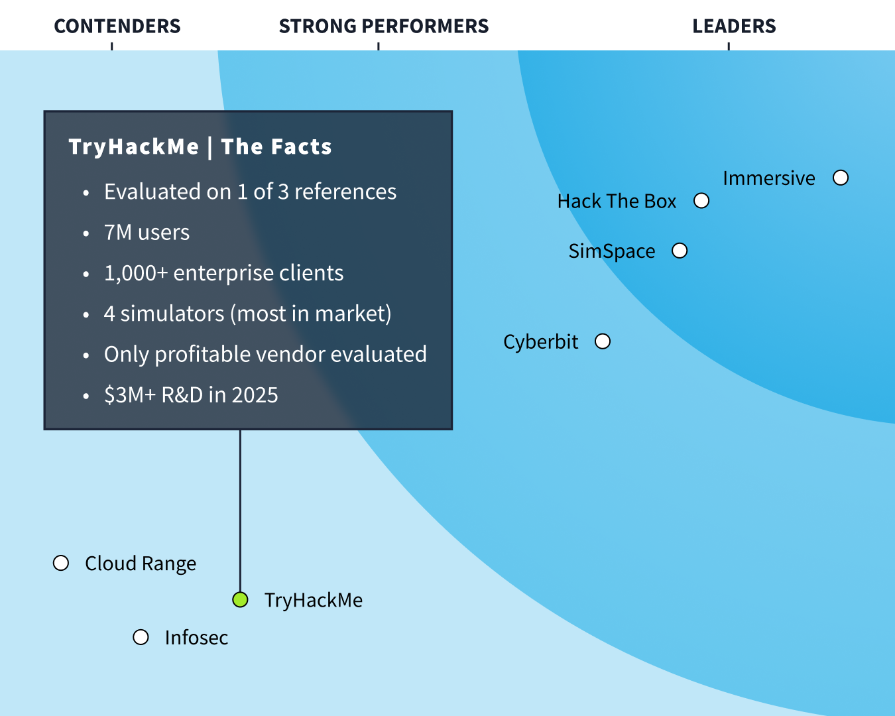

# Forrester Got it Wrong: Here's the Evidence. Wave Q1 2026

**ID Original:** no disponible
**Slug:** forrester-got-it-wrong-heres-the-evidence
--------------------

Today, Forrester released their Wave for Cyber Security Skills and Training Platforms, Q1 2026, placing TryHackMe as a Contender. While we value the role analyst reports play in the industry, we believe the full story of our platform was severely overlooked. With more than 7 million practitioners, 1,000+ enterprise clients, and more simulators than any other vendor in this evaluation, we're proud to be the largest cybersecurity training platform in the world.
In this case, the evaluation relied on feedback from a single responding customer reference. We provided detailed capability evidence ahead of the evaluation and we're sharing it here so you can decide for yourself.
The Comparison Forrester Should Have Made
TryHackMe is the only platform covering every layer of defensive readiness in one place - from individual skill development to full team-based simulation. ImmersiveLabs relies on a question-and-hint model and has breadth of content over depth. HackTheBox deprecated their team exercises and offers no threat hunting or incident response simulations.
Don't take our word for it. Here's what some of our 1000+ enterprise customers have to say about TryHackMe:
4.5 star on TrustPilot from 800+ people
“ TryHackMe’s tabletop exercise surfaced a real gap for us: our DNS logging wasn’t where it needed to be, and we actioned changes to SIEM ingestion right after. The exercise felt realistic, sparked cross-team collaboration, and the post-exercise report made prioritisation obvious. We’ll be running tabletops much more regularly with TryHackMe ” - Head of Security Operations, Major UK Utility
“We spun up an exercise in minutes and it immediately drove productive debate. We updated our IR playbook during the session after identifying an escalation gap. The exercises kept analysts engaged, and the report turned decisions into clear next steps, so we’ve added TryHackMe’s tabletop exercises to our quarterly training cadence ”. - SOC Manager, Global Financial Markets Firm
Used By:
Read the full case studies:
How Huntress reduced onboarding time by 50% and improved SOC support readiness
From standard to battle ready: how Arag IT embedded a measurable, culture led approach, to cyber security training
Driving incident readiness with Simulators, Team Exercises & Real-world Content
At TryHackMe, we believe SOC and defence teams shouldn't have to wait for big budgets or specialist hires to improve. Continuous maturity - through threat hunting, simulation, and hands-on practice - should be within reach for every team, at every stage. TryHackMe is the only platform with 4 distinct simulators to help our clients meet this goal. No other vendor offers all 4 (most don't even offer 2).
Our Tabletop Exercises (TTX) are fully productised, using AI to generate scenarios from your company context in seconds with no equivalent self-serve product on the market. Our Threat Hunting Simulator is a dedicated, standalone environment recently endorsed by senior military and threat intelligence leaders as the best training environment they've used. Our SOC Simulator runs real-world investigations using live SIEMs including Splunk, Sentinel, and Elastic, built organically, not acquired. And our Live Breach Simulations are currently in beta, something no other vendor offers.
TTX deserves special attention. It's a synchronous, multiplayer exercise where analysts, IR leads, and executives respond concurrently to MITRE ATT&CK and NIST-aligned injects. Participants vote on the action they'd take, the majority vote progresses the exercise, and after each phase the team receives structured feedback on the vote split, the most effective decision, and where the group's judgement diverged from best practice. No competitor offers an equivalent mechanic.
All of our content, simulations and exercises use real enterprise security tooling: Splunk, Microsoft Sentinel, AWS, Elastic. Our AttackBox (web-based machine for learning entirely through the browser) includes Metasploit, Nmap, BloodHound, Mimikatz, Ghidra, Burp Suite, Wireshark, Hashcat, and more. We have over 1100 interactive hands-on lessons for all experience levels (complete beginners and upskilling junior staff, all the way to expert level content). We're also releasing an AI security path in April (see a taster module here ).
On top of that we offer multiplayer exercises: King of the Hill (live attack/defend competitions), network challenges , and capstone challenges , all supporting multi-analyst participation in the same live environment. These aren't solo learning experiences. They're team-based, competitive, and built for enterprise SOC teams training together.
TryHackMe Invested $3M+ in R&D in 2025 alone
We've put $1M+ into AI-powered learning that delivers real-time, personalised feedback based on how users approach exercises, not just whether they got the right answer. Part of this was spending 18 months building the technology to understand how users behave to build a platform where learning efficiency is at the forefront of training. No other platform does this.
On top of that, we've committed $2M to two new products: NoScope (AI pentesting, launching at RSA) and RuleForce (AI SOC triage, in beta). We're the only platform expanding into adjacent security capabilities at this scale.
SOC Maturity Model
TryHackMe has developed a proprietary SOC Maturity Model that addresses a gap left by established frameworks like NIST CSF, ISO 27001, MITRE ATT&CK, and NICE: none of them tell you whether the people in a SOC can actually execute when it matters. Built from experience working with over 1000 organisations, the model evaluates SOC capability across five categories - People & Culture, Processes & Procedures, Technology, Testing & Validation, and Measurement & Continuous Improvement - and defines five stages of progression from Nascent to Leading.
Its central argument is that maturity must be demonstrated, not assumed. We use this model as a practical diagnostic: working with security leaders to identify where their team sits across each category, pinpoint the specific gaps between their current state and their target maturity, and translate those findings into a concrete set of recommendations - whether that's introducing scenario-based simulation, formalising a post-exercise improvement loop, or building the kind of evidenced readiness that holds up to board and regulatory scrutiny.
No competitor offers a structured maturity model that reliably progresses a SOC from where it is today to where it needs to be.
What Forrester Missed
Part of Forrester's evaluation involves speaking to client references. They spoke to most of our competitors' references but only 1 of our 3, meaning the evaluation was built on a fraction of our customer evidence. Here's what they wrote about us versus what's actually true. Every claim below can be evidenced, and was provided to Forrester ahead of the evaluation:
What enterprise security leaders say:
" TryHackMe labs have a brilliant balance of theory and practice - explaining how cyber tools work and showcasing them in interactive real-world environments. It's a fun, straightforward platform with clear guidance, so it's easy to upskill independently. Bite-sized content is especially useful for training in between other priorities." -KPMG
“ At SS&C, we wanted to establish a consistent skills baseline for our SOC team. The TryHackMe SAL1 Certification has enabled us to do exactly that—providing structured learning and a measurable standard. We're aiming for all our analysts to achieve SAL1, giving us confidence that the team shares a strong foundation ." -SS&C
“We (Arag) chose THM for one main reason, it made realistic practice safe and easy to adopt. the team could run hands-on scenarios in browser-based, isolated labs without touching production systems ” -Arag
Try the Platforms Yourself
1000+ Enterprise security teams already use TryHackMe to build measurable SOC readiness. Forrester built their evaluation on 33% of our evidence. Form your own view with 100% of the platform free. Put your SOC team through TryHackMe. Then try any leader on their list. The best evaluation is a hands-on one, let the outcomes decide.

## Multimedia

---
**Fuente / Source:** [forrester-got-it-wrong-heres-the-evidence](https://tryhackme.com/resources/blog/forrester-got-it-wrong-heres-the-evidence)
