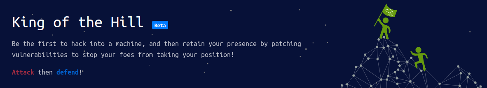

# King of the Hill Updates

**ID Original:** no disponible
**Slug:** king-of-the-hill-is-changing
--------------------

If you didn't know, King of the Hill is a competitive hacking game where users play against 10 other hackers to compromise a machine, before patching vulnerabilities to stop other players from gaining access. The longer you maintain your access, the more points you get.
Since releasing this game at the beginning of April, we've made a few changes to the competitive hacking game.
Firstly, King of the Hill (KoTH) is now free ... and will be forever. We've found the users who play find it really addictive, and we want to ensure everyone has the opportunity to battle their friends to become King.
You will be able to create private games and choose the KoTH machine you want to play. This is a subscriber only feature, however only the user who creates the game needs to be subscribed; once the game is made, non-subscribed users can join the lobby.
If the machine ends up breaking, or becoming unusable, you can vote to reset the machine to its default state. Initially this was set to 4 votes, however we realise some lobbies may contain less. Resets are now dynamic and based on the number of users in the lobby (the number of reset votes is half the number of users in the game, rounded up).
When KoTH was first released, we allowed streaming just for the 'release month'. However, after seeing the enjoyment of users watching streamers play, we've decided to allow streaming and writeups on all KoTH machines.
Lastly, we've decided against retiring machines. Each month new machines will be added to the pool, this will help reduce the chances of playing the same machine repetitively. This will hopefully help reduce the number of auto-pwns, as eventually the machine pool will be so large the chances of having a machine (unless you over-play) pop-up again will be minimal.
TL;DR : - King of the Hill is now free to play.. forever. - You can choose which KoTH machines you want to play in private games. - The number of resets are now based on the number of users in the game. - Streaming and Writeups are allowed - KoTH machines wont retire, the machine pool will be forever growing.

## Multimedia

---
**Fuente / Source:** [king-of-the-hill-is-changing](https://tryhackme.com/resources/blog/king-of-the-hill-is-changing)
