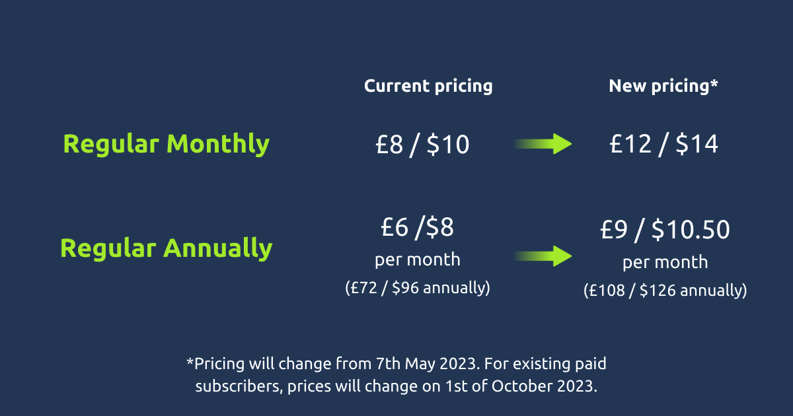

# An Update to TryHackMe’s Pricing Plan

**ID Original:** no disponible
**Slug:** update-to-tryhackme-pricing
--------------------

Over the past four years, we’ve invested heavily to make TryHackMe the number one choice for hands-on learning in cyber security.
Since launching, we’ve released new interactive material consisting of 650+ labs across different areas of cyber, 10 learning paths, competitive hacking games (including our community-loved King of the Hill ), hands-on environments for real-world learning, festive hacking activities throughout the year, and bundles of career guides to help you get the most out of our platform. We’ve helped so many of you launch careers in cyber, including Hayden , a student who successfully secured a role as a SOC Analyst through our SOC Level 1 learning path!
Our ongoing commitment provides an engaging and effective platform that opens up an increasingly diverse array of career opportunities! To continue investing in making TryHackMe better for you, we’d like to inform you that our prices will change for the first time from the 7th of May, 2023.
To purchase a subscription at the lower price before the increase on the 7th you can purchase a voucher on the following page: https://tryhackme.com/subscriptions
What this means for you
Existing subscribers
To thank you for your loyalty as a TryHackMe subscriber, your subscription price will remain the same until the 1st of October, 2023 after which your subscription price will increase to £12 / $14 per month). For annual users, this will increase from £72 / $96 to £108 / $126 (£6 / $8 to £9 / $10.50 per month), and this change will not affect you until October. If you’re on the student pricing plans the price will increase monthly from £6.40 / $8 to £9.60 / $11.20, and annually from £57.60 / $72 to £86.40 / $100.
Nothing else will change - you’ll still have access to all premium content and our awesome training and challenge releases!
If you cancel your subscription after the 7th of May and decide to come back to us later on, you will lose your pricing for the active subscription and will need to pay the new pricing of £12 / $14 per month.
If you are on a monthly subscription, you may wish to change to an annual subscription which gives you an additional 3 months of free access included.
If you’re an existing subscriber, this is a first heads-up to give you plenty of notice before our prices change. All individual users will receive an email to notify them regarding this update. To make this transition as easy as possible, no action is needed from you, and we’ll be in touch again between now and 1st October 2023.
New subscribers
New subscriptions from the 7th of May will cost £12 / $14 per month. Annual subscriptions at the new pricing offer savings of £36 / $42 per year over monthly subscriptions.
Subscriptions purchased before the 7th of May will be at the lower price of £8 / $10 per month (or £72 / $96 billed annually) and will be locked into the lower price until October 1st 2023.
Check out our ‘ Why Subscribe? ’ page for more information about becoming a TryHackMe subscriber!
Free TryHackMe users
As a free TryHackMe member, nothing will change. You will still have access to our free cyber security training content at no cost, and we will continue to release free content. If you do decide to become a paid TryHackMe subscriber to gain access to our premium content, please be aware that the pricing increase will take place on the 7th of May, 2023.
What’s coming to TryHackMe?
As a result of our investment, we will continue to add value to TryHackMe with bundles of awesome labs, walkthroughs, challenges, learning paths, and some very exciting releases throughout the year that we know you’ll love.
A few upcoming releases include learning paths for Security Engineering, SOC Level 2 Analysts, DevSecOps, Incident Response and Web Application Security training, and a very special event to showcase an 14-machine network!
As our promise to you, we’ll continue to make TryHackMe fun, engaging and applicable to the real world through improved skill development and enhanced content discovery.
It’s not a decision we take lightly to increase our pricing, so our pricing has never changed since TryHackMe first launched. Even with this slight increase, TryHackMe will continue to remain the most affordable platform for real-world and highly practical security training.
We’d like to thank all TryHackMe users for choosing us on your personal cyber security learning journey!
Ben Spring & Ashu Savani Co-founders of TryHackMe

## Multimedia

---
**Fuente / Source:** [update-to-tryhackme-pricing](https://tryhackme.com/resources/blog/update-to-tryhackme-pricing)
