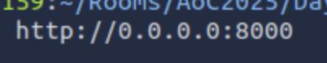

# Phishing - Merry Clickmas

| **Dificultad** | Easy | **Tipo** | CTF (Free Room) | **Slug** | `day02phishingmerryclickmas` | | **Link** | [TryHackMe](https://tryhackme.com/room/adventofcyber25) | | **Sección** | Advent of Cyber Tryhackme | | **Fuente** | texto oficial THM + anotaciones propias | | **Componentes** | Phishing / SMiShing / Vishing / Quishing / SET / Social Engineering | | **Impacto** | Día 02 del AoC 2025: introducción a los tipos de phishing y montaje de un ataque de phishing con el Social Engineering Toolkit (SET) |

---

**Contexto:** Día 02 del calendario Advent of Cyber 2025 ("Phishing - Merry Clickmas"). Se repasan las vías de phishing (smishing, vishing, quishing), la preparación de un servidor de phishing y la selección del vector de ataque en el Social Engineering Toolkit (Mass Mailer Attack). Después se pone en práctica contra el portal TBFC: se recupera la contraseña del portal y se accede al mail reutilizando credenciales. Documento original bilingüe (ES/EN); se conservan apuntes y respuestas verbatim.

---

## Solucionario

### Día 02: Phishing - Merry Clickmas

**Explicación:** Apuntes del laboratorio (notas bilingües originales):

- Ways of phishing
  - smishing: short text messages
  - vishing: voice calls
  - quishing: QR codes

- port = 8000
- all interfaces = 0.0.0.0

**Correo de phishing / phishing mail:**
Social-Engineering attacks < Mass Mailer Attack < E-Mail Attack Single Email Address

- set up server
- social engineer toolkit: [https://github.com/trustedsec/social-engineer-toolkit](url)

| # | Pregunta | Respuesta |
| --- | --- | --- |
| 1 | What is the password used to access the TBFC portal? | `unranked-wisdom-anthem` |
| 2 | Browse to http://MACHINE_IP from within the AttackBox and try to access the mailbox of the factory user to see if the previously harvested admin password has been reused on the email portal. What is the total number of toys expected for delivery? | `1984000` |

---

**Metodología:**

1. Identificar los tipos de phishing (smishing, vishing, quishing)

2. Preparar un servidor de phishing (puerto 8000, interfaz 0.0.0.0)

3. Configurar el SET: Social-Engineering Attacks -> Mass Mailer Attack -> E-Mail Attack Single Email Address

4. Comprobar la reutilización de credenciales (password reuse) en el portal de email

**Learning chain:** Phishing concepts -> SET setup -> Mailer Attack -> Credential reuse

**Lección:** *El phishing no se limita al correo: SMS (smishing), voz (vishing) y códigos QR (quishing) son vectores igualmente explotables; además, la reutilización de contraseñas amplifica el impacto de una única credencial comprometida.*

**MITRE ATT&CK:**

- T1566.001 - Phishing: Spearphishing Attachment

- T1566.002 - Phishing: Spearphishing Link

- T1598.003 - Phishing for Information: Spearphishing via Service

- T1078 - Valid Accounts (reutilización de credenciales)

**Fuente:** [TryHackMe - Phishing - Merry Clickmas](https://tryhackme.com/room/adventofcyber25)

---

## ⚠️ Descargo de Responsabilidad (Disclaimer)

Este contenido se presenta exclusivamente con fines académicos y educativos.

**Sin Afiliación:** Este espacio no posee ninguna alianza, asociación, patrocinio ni vinculación oficial con TryHackMe.
**Veracidad de los Datos:** La información aquí contenida tiene un propósito ilustrativo y formativo. Los datos, políticas, precios o características de los servicios mencionados pueden variar y no son decididos por TryHackMe en este contexto.
**Referencia Oficial:** Para obtener información precisa, oficial y actualizada, se recomienda encarecidamente visitar el sitio web oficial de TryHackMe (https://tryhackme.com).
**Uso Ético:** No fomentamos ni nos responsabilizamos por el uso indebido de esta información fuera de fines educativos o profesionales legítimos.