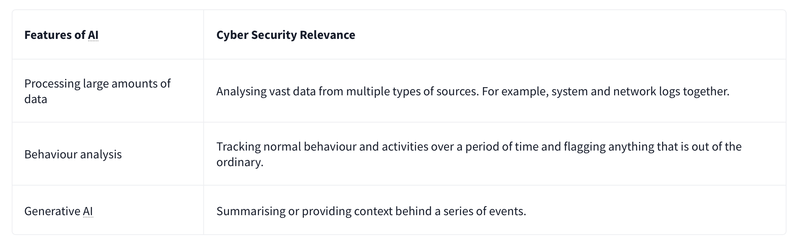

# AI in Security - old sAInt nick

| **Dificultad** | Easy | **Tipo** | CTF (Free Room) | **Slug** | `day04aiinsecurityoldsaintnick` | | **Link** | [TryHackMe](https://tryhackme.com/room/adventofcyber25) | | **Sección** | Advent of Cyber Tryhackme | | **Fuente** | texto oficial THM + anotaciones propias | | **Componentes** | AI / Machine Learning / Blue Team / Anomaly Detection / Red Team / SQLi | | **Impacto** | Día 04 del AoC 2025: uso de IA en seguridad (detección de anomalías) y, en la parte roja, explotación de una web vulnerable con un script de la red team |

---

**Contexto:** Día 04 del calendario Advent of Cyber 2025 ("AI in Security - old sAInt nick"). Se exploran las aplicaciones de la IA y el aprendizaje automático en ciberseguridad (blue teaming: análisis de logs, tráfico sospechoso, detección de anomalías e IPs maliciosas) y los tres tipos de ML (supervisado, no supervisado y por refuerzo). En la fase práctica se completa el showcase de IA (flag AI_MANIA) y se ejecuta el exploit proporcionado por la red team contra la web vulnerable (flag SQLI_EXPLOIT). Documento original bilingüe (ES/EN); se conservan apuntes y respuestas verbatim.

---

## Solucionario

### Día 04: AI in Security - old sAInt nick

**Explicación:** Apuntes del laboratorio (notas bilingües originales):

- Blue teaming: defensive security operations aimed at protecting an organization's systems and data from cyber threats.
- Types of ML learning:
  - Supervised learning: model trained on labelled data
  - Unsupervised learning: finds patterns by itself
  - Reinforcement learning: learns through feedback
- AI can analyze logs, identify suspicious traffic, detect anomalies, identify malicious IP, etc.

| # | Pregunta | Respuesta |
| --- | --- | --- |
| 1 | Complete the AI showcase by progressing through all of the stages. What is the flag presented to you? | `THM{AI_MANIA}` |
| 2 | Execute the exploit provided by the red team agent against the vulnerable web application hosted at MACHINE_IP:5000. What flag is provided in the script's output after it? | `THM{SQLI_EXPLOIT}` |

---

**Metodología:**

1. Recorrer todas las etapas del AI showcase para obtener la primera flag

2. Ejecutar el script/exploit de la red team contra la app web vulnerable (MACHINE_IP:5000)

3. Leer la flag en la salida del exploit (SQLi)

**Learning chain:** AI concepts -> Blue team AI -> Red team exploit (SQLi)

**Lección:** *La IA fortalece la defensa (anomalías, tráfico, IPs maliciosas), pero los atacantes también la usan; un mismo showcase demuestra cómo el machine learning supervisado/no supervisado/por refuerzo se aplica, mientras la parte ofensiva explota fallos clásicos como SQLi.*

**MITRE ATT&CK:**

- T1190 - Exploit Public-Facing Application (SQLi)

- T1059 - Command and Scripting Interpreter (ejecución del exploit)

- T1083 - File and Directory Discovery

**Fuente:** [TryHackMe - AI in Security - old sAInt nick](https://tryhackme.com/room/adventofcyber25)

---

## ⚠️ Descargo de Responsabilidad (Disclaimer)

Este contenido se presenta exclusivamente con fines académicos y educativos.

**Sin Afiliación:** Este espacio no posee ninguna alianza, asociación, patrocinio ni vinculación oficial con TryHackMe.
**Veracidad de los Datos:** La información aquí contenida tiene un propósito ilustrativo y formativo. Los datos, políticas, precios o características de los servicios mencionados pueden variar y no son decididos por TryHackMe en este contexto.
**Referencia Oficial:** Para obtener información precisa, oficial y actualizada, se recomienda encarecidamente visitar el sitio web oficial de TryHackMe (https://tryhackme.com).
**Uso Ético:** No fomentamos ni nos responsabilizamos por el uso indebido de esta información fuera de fines educativos o profesionales legítimos.