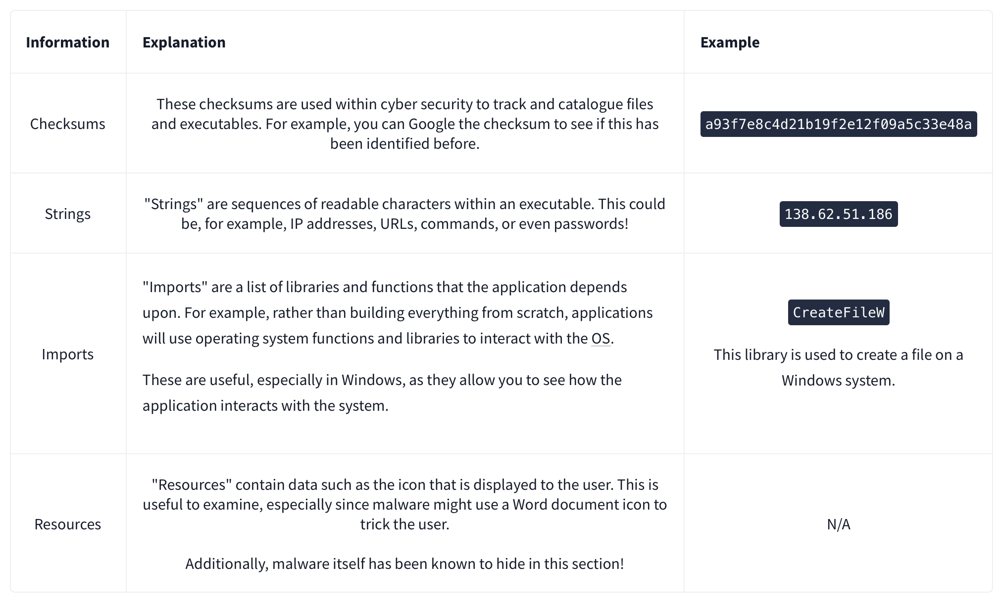

# Malware Analysis - Egg-xecutable

| **Dificultad** | Easy | **Tipo** | CTF (Free Room) | **Slug** | `day06malwareanalysiseggxecutable` | | **Link** | [TryHackMe](https://tryhackme.com/room/adventofcyber25) | | **Sección** | Advent of Cyber Tryhackme | | **Fuente** | texto oficial THM + anotaciones propias | | **Componentes** | Malware Analysis / Static & Dynamic / SHA256 / Strings / ProcMon / Regshot / Persistence | | **Impacto** | Día 06 del AoC 2025: análisis estático y dinámico del binario HopHelper.exe (hash, strings, persistencia en registro y comunicación por red) |

---

**Contexto:** Día 06 del calendario Advent of Cyber 2025 ("Malware Analysis - Egg-xecutable"). Reto de análisis de malware sobre `HopHelper.exe`: análisis estático (hash SHA256, strings con flag THM, rapidez y seguridad) y análisis dinámico en sandbox (Regshot para persistencia en el registro, ProcMon filtrando operaciones TCP para ver el protocolo de red). Documento original bilingüe (ES/EN); se conservan apuntes y respuestas verbatim.

---

## Solucionario

### Día 06: Malware Analysis - Egg-xecutable

**Explicación:** Apuntes del laboratorio (notas bilingües originales):

- Static analysis: analysis without running/executing the sample; quicker and safer
- Dynamic analysis: analysis by running the sample; uses a sandbox environment to carry out safely
- Sandbox environment: used to execute potentially dangerous code
- Use of static analysis:

- File hashes: a unique signature for a file
- Regshot: captures snapshots of the Windows registry before and after the sample is run and then compares the difference
- Malware persistence
- Malware may use:
  - Obfuscation/Packing to hide code;
  - Anti-analysis tricks to avoid detection

| # | Pregunta | Respuesta |
| --- | --- | --- |
| 1 | Static analysis: What is the SHA256Sum of the HopHelper.exe? | `F29C270068F865EF4A747E2683BFA07667BF64E768B38FBB9A2750A3D879CA33` |
| 2 | Static analysis: Within the strings of HopHelper.exe, a flag with the format THM{XXXXX} exists. What is that flag value? | `THM{STRINGS_FOUND}` |
| 3 | Dynamic analysis: What registry value has the HopHelper.exe modified for persistence? | `Dynamic analysis: What registry value has the HopHelper.exe modified for persistence?` |
| 4 | Dynamic analysis: Filter the output of ProcMon for "TCP" operations. What network protocol is HopHelper.exe using to communicate? | `http` |

---

**Metodología:**

1. Análisis estático: calcular el hash SHA256 del binario y extraer strings (findstr/grep) buscando la flag THM

2. Análisis dinámico en sandbox: ejecutar la muestra y comparar snapshots del registro con Regshot para detectar persistencia

3. Filtrar ProcMon por operaciones "TCP" para determinar el protocolo de red usado (http)

**Learning chain:** Static analysis (hash/strings) -> Dynamic analysis (sandbox) -> Registry (persistence) -> Network (ProcMon)

**Lección:** *El análisis estático da respuestas rápidas sin ejecutar la muestra (hash y strings), pero la persistencia y el comportamiento de red solo se confirman en un sandbox con Regshot y ProcMon; la persistencia suele pasar por el registro. Nota: la respuesta 3 quedó registrada en el original como el propio enunciado (dato a verificar en la plataforma).*

**MITRE ATT&CK:**

- T1027 - Obfuscated Files or Information (packing/anti-analysis)

- T1547.001 - Boot or Logon Autostart Execution: Registry Run Keys (persistencia)

- T1071.001 - Web Service: Web Application Layer Protocol (http)

- T1105 - Ingress Tool Transfer

**Fuente:** [TryHackMe - Malware Analysis - Egg-xecutable](https://tryhackme.com/room/adventofcyber25)

---

## ⚠️ Descargo de Responsabilidad (Disclaimer)

Este contenido se presenta exclusivamente con fines académicos y educativos.

**Sin Afiliación:** Este espacio no posee ninguna alianza, asociación, patrocinio ni vinculación oficial con TryHackMe.
**Veracidad de los Datos:** La información aquí contenida tiene un propósito ilustrativo y formativo. Los datos, políticas, precios o características de los servicios mencionados pueden variar y no son decididos por TryHackMe en este contexto.
**Referencia Oficial:** Para obtener información precisa, oficial y actualizada, se recomienda encarecidamente visitar el sitio web oficial de TryHackMe (https://tryhackme.com).
**Uso Ético:** No fomentamos ni nos responsabilizamos por el uso indebido de esta información fuera de fines educativos o profesionales legítimos.