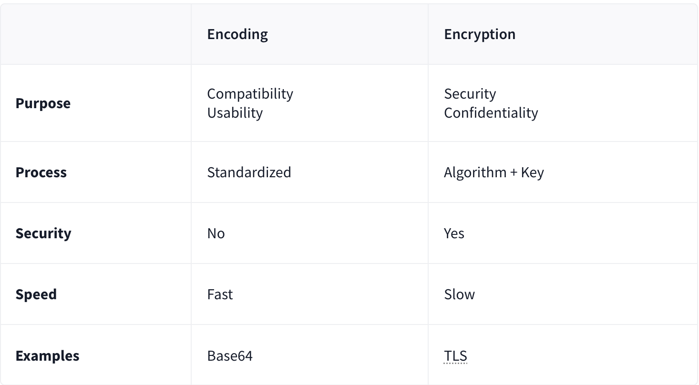

# CyberChef - Hoperation Save McSkidy

| **Dificultad** | Easy | **Tipo** | walkthrough | **Slug** | `day17cyberchefhoperationsavemcskidy` |
| **Link** | [TryHackMe](https://tryhackme.com/room/adventofcyber25) |
| **Sección** | Advent of Cyber Tryhackme |
| **Fuente** | texto oficial THM + anotaciones propias |
| **Componentes** | CyberChef / data transformation / encode/decode / XOR (self-reversible) / MD5 / CrackStation / hash cracking / locks |
| **Impacto** | Recuperar una cadena de contraseñas y el flag final usando operaciones de CyberChef |

---

**Contexto:** Día 17 del Advent of Cyber 2025. Se usa **CyberChef**, la herramienta de transformación de datos que permite codificar/decodificar, transformar formatos y encadenar múltiples operaciones. Se aplica que el **XOR es auto-reversible** y que el **MD5** produce un hash de longitud fija, es una función de un solo sentido (no reversible matemáticamente) pero las bases de datos de hashes precomputados (como CrackStation) pueden revelar la entrada original. Con eso se abren cinco candillos que protegen el flag recuperado.

## Solucionario

### Día 17: CyberChef - Hoperation Save McSkidy

**Explicación:**



- **CyberChef** -> data transformation tool; encode/decode data, transform formats, chain multiple operations
- XOR is self-reversible
- MD5: ( Use CrackStation)
    1. MD5 produces a fixed-length hash
    2. one-way function
    3. can't reverse it mathematically
    4. Precomputed hash databases can reveal the original input

| # | Pregunta | Respuesta |
|---|----------|-----------|
| 1 | What is the password for the first lock? | `Iamsofluffy` |
| 2 | What is the password for the second lock? | `Itoldyoutochangeit!` |
| 3 | What is the password for the third lock? | `BugsBunny` |
| 4 | What is the password for the fourth lock? | `passw0rd1` |
| 5 | What is the password for the fifth lock? | `51rBr34chBl0ck3r` |
| 6 | What is the retrieved flag? | `THM{M3D13V4L_D3C0D3R_4D3P7}` |

---

**Metodología:** Se encadenaron operaciones de CyberChef (decodificación y transforms) sobre cada candillo: donde aparecía XOR se aplicó de nuevo XOR (auto-reversible), y donde aparecían hashes MD5 se consultó CrackStation para recuperar la entrada original. Con las cinco contraseñas obtenidas se desbloqueó la cadena y se recuperó el flag final.
**Learning chain:** CyberChef -> encode/decode -> XOR (self-reversible) -> MD5 -> CrackStation (precomputed hash databases) -> 5 locks -> flag

Cadena de ataque / Attack Chain:
```
lock 1 (Iamsofluffy) -> lock 2 (Itoldyoutochangeit!) -> lock 3 (BugsBunny) -> lock 4 (passw0rd1) -> lock 5 (51rBr34chBl0ck3r) -> THM{M3D13V4L_D3C0D3R_4D3P7}
```

**Lección:** *CyberChef convierte cualquier transformación de datos en un pipeline reproducible; el XOR se revierte aplicándose a sí mismo y un hash MD5 no se "descifra", simplemente se busca en bases precomputadas como CrackStation.*

**MITRE ATT&CK:** T1140 - Deobfuscate/Decode Files or Information

**Fuente:** [TryHackMe - CyberChef - Hoperation Save McSkidy](https://tryhackme.com/room/adventofcyber25)

---

## ⚠️ Descargo de Responsabilidad (Disclaimer)

Este contenido se presenta exclusivamente con fines académicos y educativos.

**Sin Afiliación:** Este espacio no posee ninguna alianza, asociación, patrocinio ni vinculación oficial con TryHackMe.
**Veracidad de los Datos:** La información aquí contenida tiene un propósito ilustrativo y formativo. Los datos, políticas, precios o características de los servicios mencionados pueden variar y no son decididos por TryHackMe en este contexto.
**Referencia Oficial:** Para obtener información precisa, oficial y actualizada, se recomienda encarecidamente visitar el sitio web oficial de TryHackMe (https://tryhackme.com).
**Uso Ético:** No fomentamos ni nos responsabilizamos por el uso indebido de esta información fuera de fines educativos o profesionales legítimos.