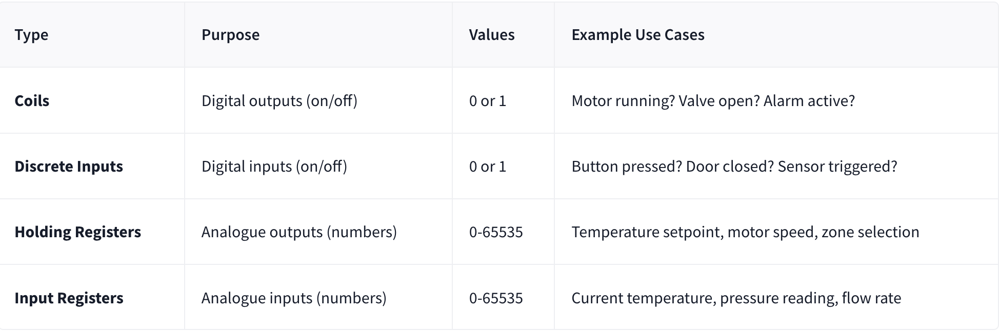

# Modbus - Claus for Concern

| **Dificultad** | Easy | **Tipo** | walkthrough | **Slug** | `day19modbusclausforconcern` |
| **Link** | [TryHackMe](https://tryhackme.com/room/adventofcyber25) |
| **Sección** | Advent of Cyber Tryhackme |
| **Fuente** | texto oficial THM + anotaciones propias |
| **Componentes** | SCADA / PLCs / Modbus TCP / port 502 / registers / coils / ICS / industrial protocols |
| **Impacto** | Entender por qué los sistemas SCADA/PLC con Modbus son objetivos atractivos y manipular sus registros/coils |

---

**Contexto:** Día 19 del Advent of Cyber 2025. Se introducen los sistemas industriales: **SCADA** (centro de mando de operaciones industriales que conecta operadores humanos con máquinas físicas) y los **PLC** (cerebros de la automatización que leen sensores, ejecutan lógica y mandan comandos a actuadores). Se explica por qué SCADA es un objetivo atractivo (software legado, credenciales por defecto, diseño orientado a fiabilidad más que a seguridad, procesos físicos, conexión a redes corporativas y protocolos inseguros como Modbus) y se detalla **Modbus**, el antiguo protocolo industrial de comunicación que corre por defecto en el puerto **502**, donde los **registers** equivalen a configuración y las **coils** a interruptores.

## Solucionario

### Día 19: Modbus - Claus for Concern

**Explicación:**

- SCADA (Supervisory Control and Data Acquisition) -> Command centre for industrial operations; bridge human operators and physical machines
- PLCs (Programmable Logic Controllers) -> brains of automation; read sensor input, execute logic rules, and send commands to actuators
- SCADA systems are attractive targets because:
     1. They often run legacy software
     2. Default credentials are rarely changed
     3. Designed for reliability, not security
     4. Control physical processes (real-world impact)
     5. Commonly connected to corporate networks
     6. Use insecure protocols like Modbus

- Modbus -> old industrial communication protocol
  
- Default Modbus TCP port : 502
- Registers = configuration
- Coils = switches

| # | Pregunta | Respuesta |
|---|----------|-----------|
| 1 | What port is commonly used by Modbus TCP? | `502` |
| 2 | What's the flag? | `THM{eGgMas0V3r}` |

---

**Metodología:** Se conectó al servicio Modbus (puerto 502) de la máquina industrial y se interactuó con los registros/coils del SCADA, entendiendo la diferencia entre registers (configuración) y coils (interruptores). Mediante escritura y lectura de esas unidades se completó el reto y se capturó el flag.
**Learning chain:** SCADA (command centre) -> PLCs (automatización) -> protocolo Modbus (puerto 502) -> registers (config) / coils (switches) -> manipulación -> flag

Cadena de ataque / Attack Chain:
```
escaneo de puertos -> Modbus TCP en 502 -> leer/escribir registers y coils -> control del proceso SCADA/PLC -> flag THM{eGgMas0V3r}
```

**Lección:** *Los sistemas industriales priorizan la fiabilidad sobre la seguridad: software legado, credenciales por defecto y protocolos en claro como Modbus convierten a SCADA/PLC en un blanco con impacto físico real; conocer que registers y coils son la superficie de configuración es el primer paso.*

**MITRE ATT&CK:** T0869 - Standard Application Layer Protocol: Modbus, T0855 - Unauthorized Command Message, T0836 - Modify Control Logic

**Fuente:** [TryHackMe - Modbus - Claus for Concern](https://tryhackme.com/room/adventofcyber25)

---

## ⚠️ Descargo de Responsabilidad (Disclaimer)

Este contenido se presenta exclusivamente con fines académicos y educativos.

**Sin Afiliación:** Este espacio no posee ninguna alianza, asociación, patrocinio ni vinculación oficial con TryHackMe.
**Veracidad de los Datos:** La información aquí contenida tiene un propósito ilustrativo y formativo. Los datos, políticas, precios o características de los servicios mencionados pueden variar y no son decididos por TryHackMe en este contexto.
**Referencia Oficial:** Para obtener información precisa, oficial y actualizada, se recomienda encarecidamente visitar el sitio web oficial de TryHackMe (https://tryhackme.com).
**Uso Ético:** No fomentamos ni nos responsabilizamos por el uso indebido de esta información fuera de fines educativos o profesionales legítimos.