# [TryHackMe] Phishing Pond - Write-up
> **Room URL:** [The Phishing Pond — Catch the phish before the phish catches you.](https://tryhackme.com/room/phishingpond)

## 📝 Descripción del Lab

**Phishing Pond** es una sala diseñada para entrenar la capacidad de identificación de correos maliciosos. El objetivo es analizar diferentes escenarios de comunicación y determinar si se trata de un intento de **Phishing** o una comunicación legítima.
 

### Tácticas Identificadas:

* **Urgency & Scare Tactics**: Presión mediante límites de tiempo.
* **Look-alike domains**: Dominios visualmente similares (ej. `rnicrosoft.com`).
* **Display name impersonation**: Nombres conocidos con direcciones falsas.
* **Malicious attachments**: Archivos con macros o malware (.doc, .xls, .zip).

---

## 🚀 Proceso de Resolución

### Introducción

Al iniciar la máquina virtual y acceder a la URL proporcionada, nos encontramos con la interfaz del juego donde debemos clasificar los correos.

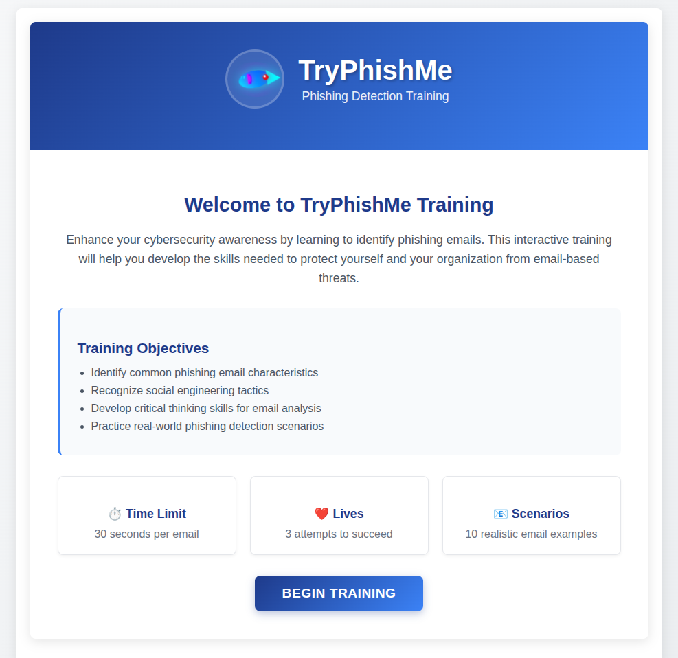

## 📧 Walkthrough de Niveles

Entendido perfectamente. Vamos a construirlo de forma redactada, paso a paso y asegurando que cada bloque tenga la ruta de imagen correspondiente de tu carpeta `./IMG/` tal como solicitaste.

Aquí tienes el `README.md` estructurado para que se visualicen todas tus capturas en orden:

---

# 
[The Phishing Pond — TryHackMe Walkthrough](https://tryhackme.com/room/phishingpond)

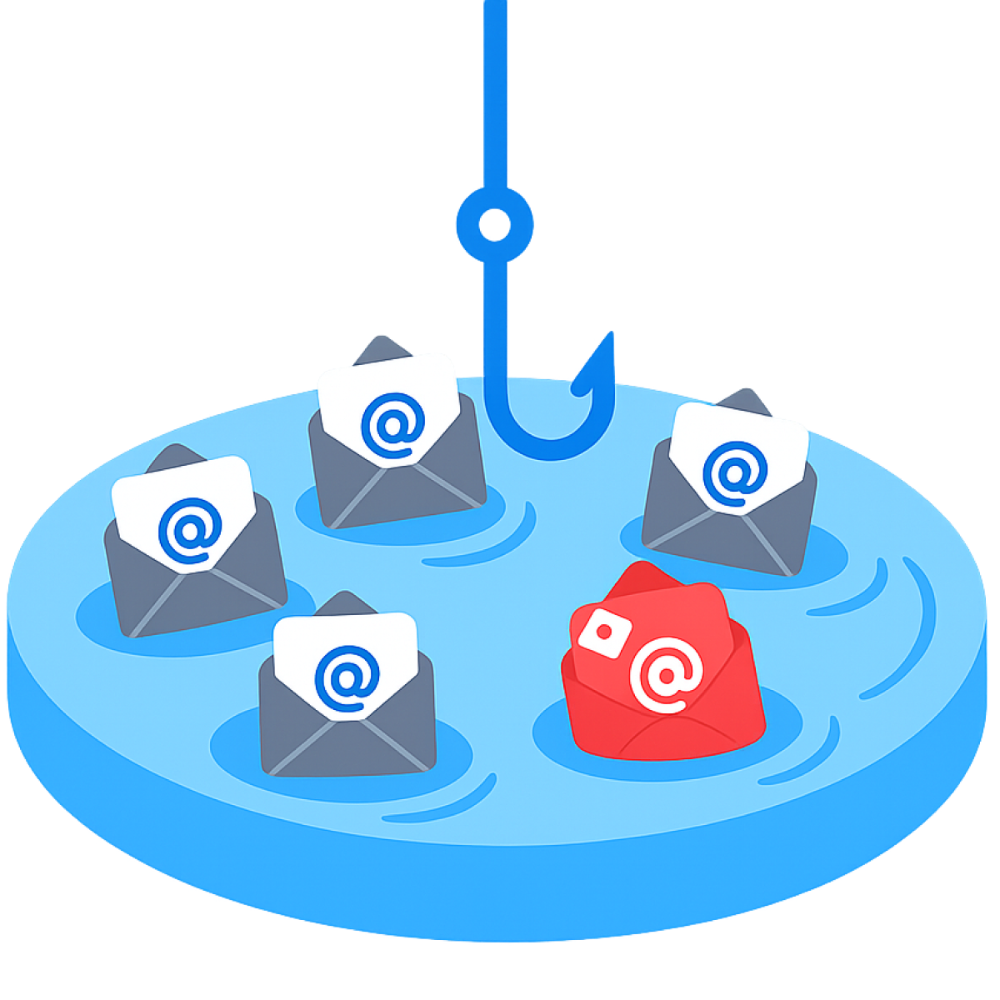

## 📝 Introducción al Laboratorio

El lab **Phishing Pond** es un desafío interactivo donde debemos actuar como analistas de seguridad para identificar correos electrónicos maliciosos. El objetivo es detectar patrones de ataque comunes y obtener la flag final tras superar 10 niveles de dificultad progresiva.

## 🚀 Proceso de Resolución

### Inicio del Challenge

Al acceder a la máquina, se nos presenta la pantalla de bienvenida que explica la dinámica del juego de clasificación.

---

### Análisis de los 10 Niveles

#### Nivel 1

Analizamos el primer correo donde se observa una técnica de impersonación de un ejecutivo.

* **Resultado**: Phishing.
* **Razón**: Urgencia y solicitud de transferencia bancaria.

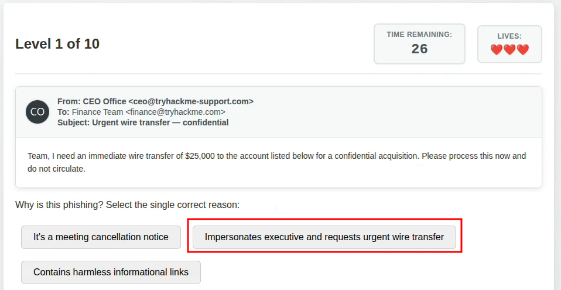

#### Nivel 2

* **Resultado**: Legítimo.

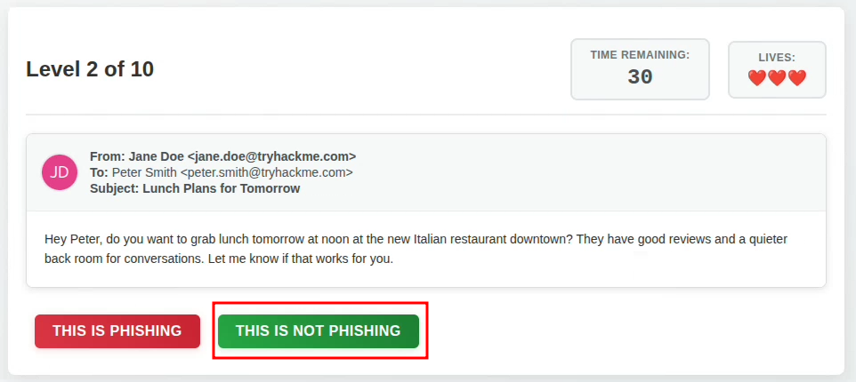

#### Nivel 3

* **Resultado**: Legítimo.

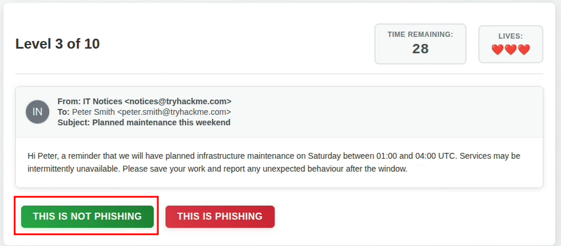

#### Nivel 4

* **Resultado**: Legítimo.

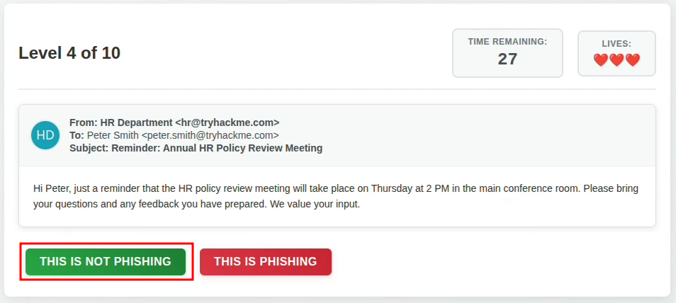

#### Nivel 5

En este nivel detectamos un vector de ataque clásico basado en documentos ofimáticos.

* **Resultado**: Phishing.
* **Razón**: El correo solicita explícitamente habilitar macros en un archivo adjunto.

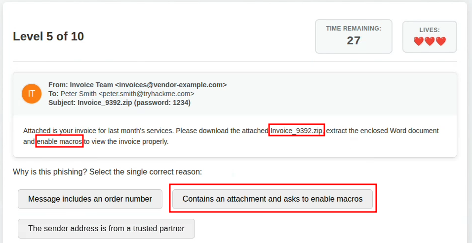

#### Nivel 6

* **Resultado**: Phishing.
* **Razón**: Enlace a una encuesta externa de procedencia dudosa.

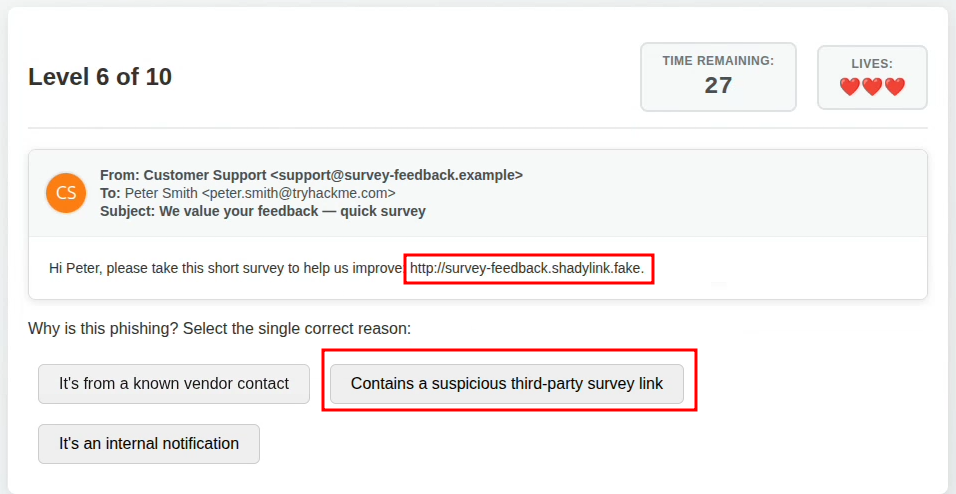

#### Nivel 7

* **Resultado**: Phishing.
* **Razón**: Promesa de recompensas a cambio de información sensible.

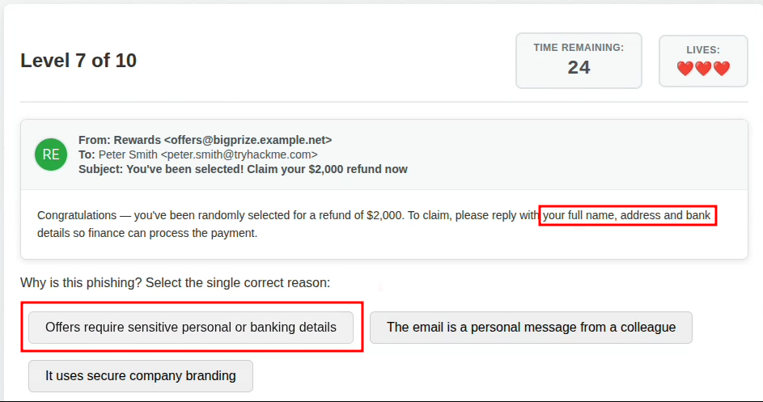

#### Nivel 8

* **Resultado**: Phishing.
* **Razón**: Redirección a un portal falso de cambio de credenciales.

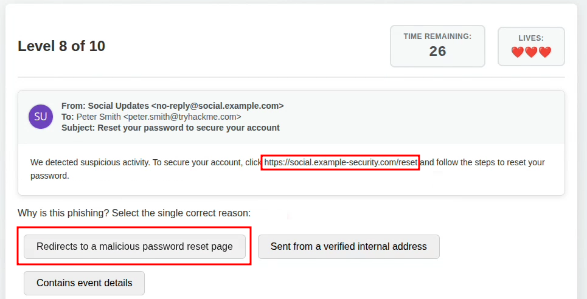

#### Nivel 9

* **Resultado**: Phishing.
* **Razón**: El enlace utiliza un dominio "typosquatted" que imita una pasarela de pago real.

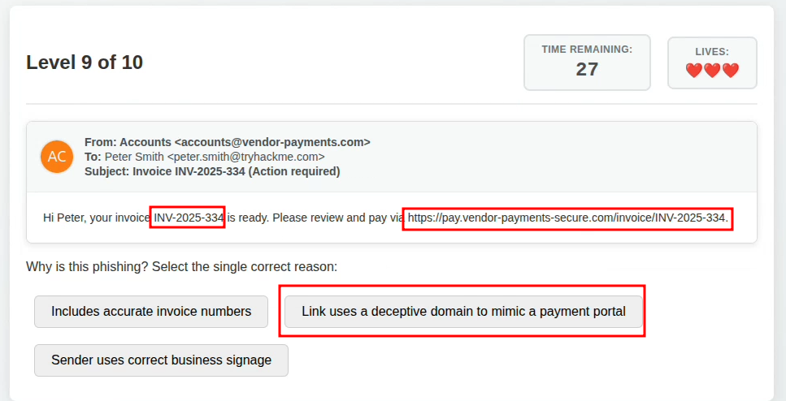

#### Nivel 10

El reto final consolida lo aprendido con un adjunto malicioso.

* **Resultado**: Phishing.
* **Razón**: Reitera la técnica de macros maliciosas.

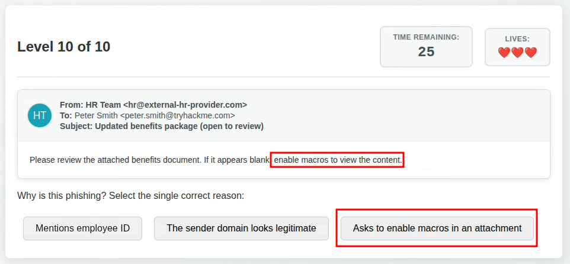

 

### resumen

En esta primera etapa, identificamos desde fraudes de CEO hasta archivos con macros.

| Nivel | Captura de Pantalla | Análisis y Resultado |
| --- | --- | --- |
| **01** |  | **🚩 Phishing**: Impersonación de ejecutivo y solicitud de transferencia urgente. |
| **02** |  | **✅ Legítimo**: Comunicación interna estándar. |
| **03** |  | **✅ Legítimo**: Notificación de sistema sin adjuntos ni links sospechosos. |
| **04** |  | **✅ Legítimo**: Correo auténtico de servicio al cliente. |
| **05** |  | **🚩 Phishing**: Archivo adjunto que solicita habilitar macros. |
| **06** |  | **🚩 Phishing**: Contiene un link a una encuesta de terceros sospechosa. |
| **07** |  | **🚩 Phishing**: Oferta de premios que requiere datos bancarios. |
| **08** |  | **🚩 Phishing**: Link de restablecimiento de contraseña falso. |
| **09** |  | **🚩 Phishing**: Dominio engañoso imitando un portal de pagos. |
| **10** |  | **🚩 Phishing**: Intento de entrega de malware vía macros en adjunto. |

---

### Captura de la Flag

Tras completar correctamente todos los niveles, el sistema valida las respuestas y muestra la flag

> **Flag**: `THM{i_phish_you_not}`

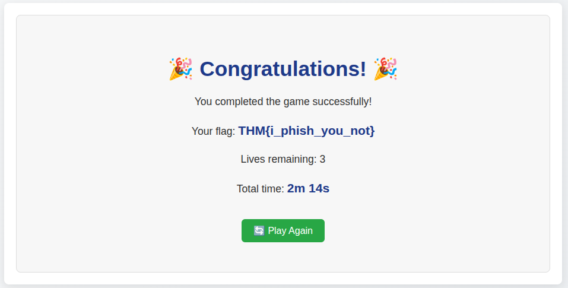

## 🏁 Finalización y Flag

Tras enviar la flag se termina la sala

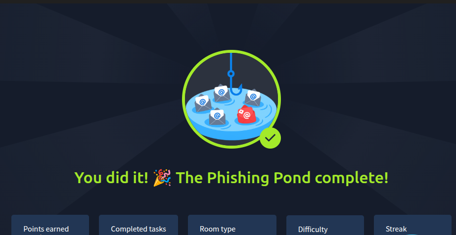

---

## 🛠️ Técnicas de Análisis Utilizadas

1. **Inspección de Hyperlinks**: Verificación de la URL real al pasar el mouse sobre botones (hovering).
2. **Análisis de Headers**: Verificación del dominio del remitente (`From:`) contra el dominio real de la empresa.
3. **Evaluación de Contexto**: Identificación de solicitudes inusuales de credenciales o transferencias monetarias.

---

*Documentación para propósitos educativos y registro de CTF.*

 