#SOC Simulator
>HomeScenariosProgress and stats Leaderboard 
>Build real-world expertise
>in a simulated SOC environment
>Tackle authentic challenges, sharpen your investigative skills,
>and improve performance through actionable feedback tailored to enhance your readiness.

>Desarrolla experiencia del mundo real en un entorno de SOC simulado
>Enfrenta desafíos auténticos, pule tus habilidades de investigación y mejora el rendimiento mediante retroalimentación procesable diseñada para mejorar tu preparación.

#01 Welcome to Soc Simulator
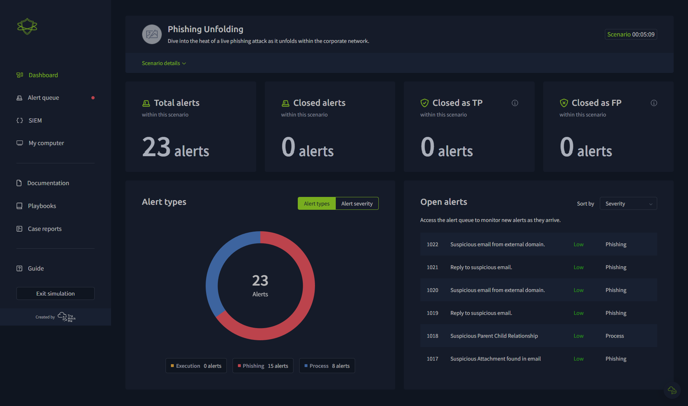

>Get hands-on experience with threat actor TTPs in a safe, simulated environment to improve you and your team's security posture.
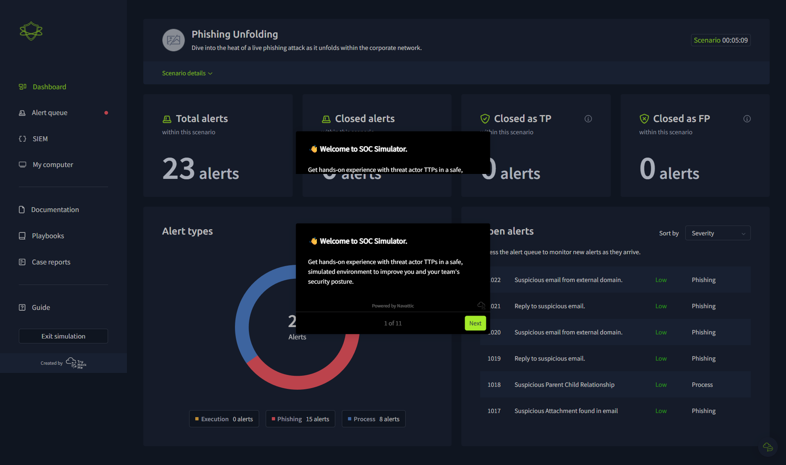

#02 Experience realtime attacks.

>Alerts trigger in realtime as threat actor events unfold throughout a scenario.
>Las alertas se activan en tiempo real a medida que los eventos de los actores de amenazas se desarrollan a lo largo de un escenario.

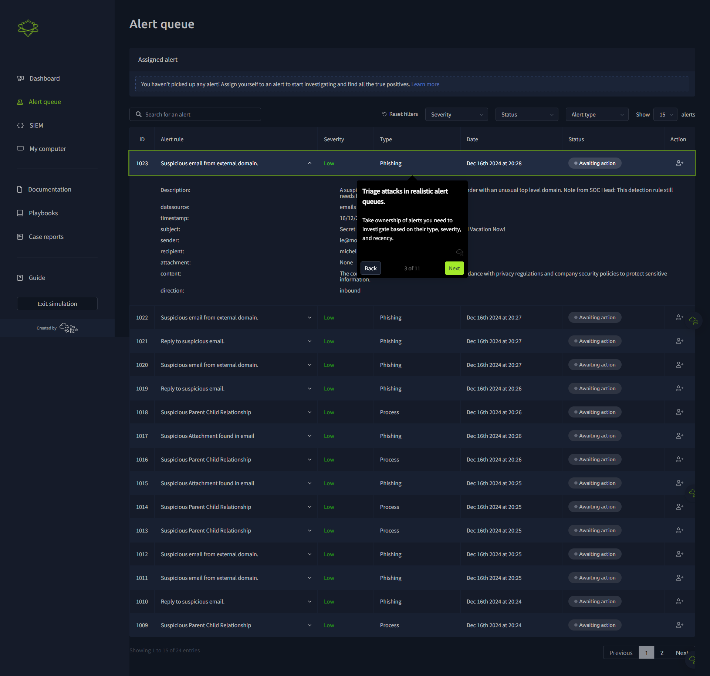

#03 Triage attacks in realistic alert queues.

>Take ownership of alerts you need to investigate based on their type, severity, and recency.
>Toma posesión de las alertas que necesitas investigar basándote en su tipo, severidad y antigüedad.

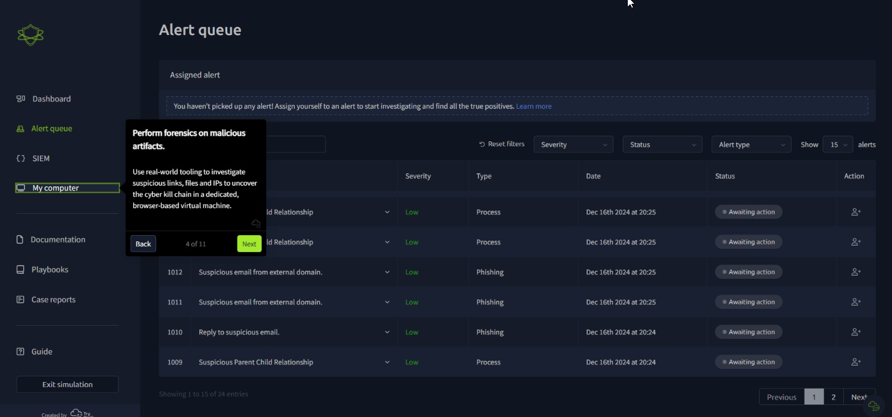

#04 Perform forensics on malicious artifacts.

>Use real-world tooling to investigate suspicious links, files and IPs to uncover the cyber kill chain in a dedicated, browser-based virtual machine.
>Usa herramientas del mundo real para investigar enlaces, archivos e IPs sospechosas para descubrir la cadena de matanza cibernética (Cyber Kill Chain) en una máquina virtual dedicada basada en navegador.

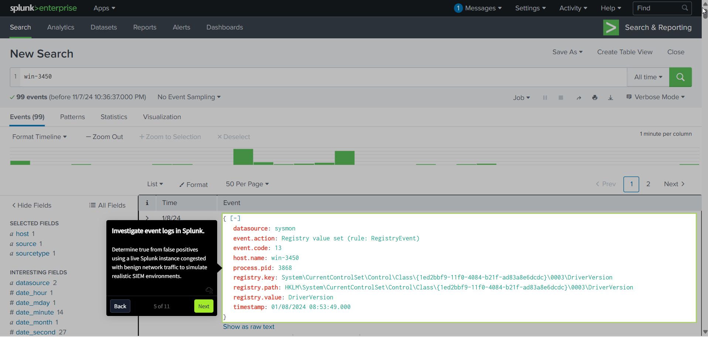

#05 Investigate event logs in Splunk.

>Determine true from false positives using a live Splunk instance congested with benign network traffic to simulate realistic SIEM environments.
>Determina positivos verdaderos de falsos usando una instancia de Splunk en vivo congestionada con tráfico de red benigno para simular entornos SIEM realistas.

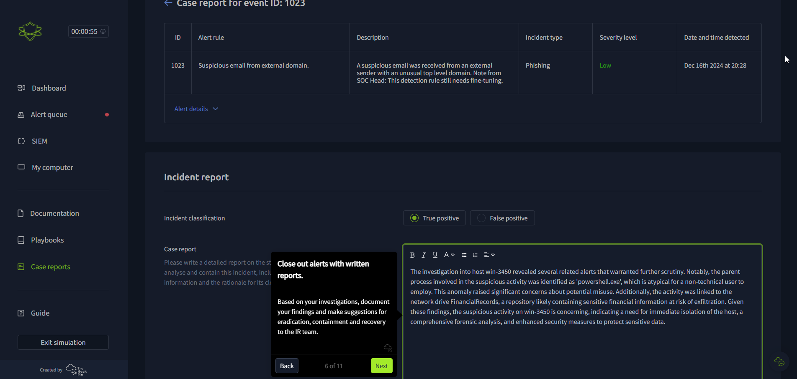

#06 Close out alerts with written reports.

>Based on your investigations, document your findings and make suggestions for eradication, containment and recovery to the IR team.
>Basado en tus investigaciones, documenta tus hallazgos y haz sugerencias de erradicación, contención y recuperación al equipo de Respuesta a Incidentes (IR).

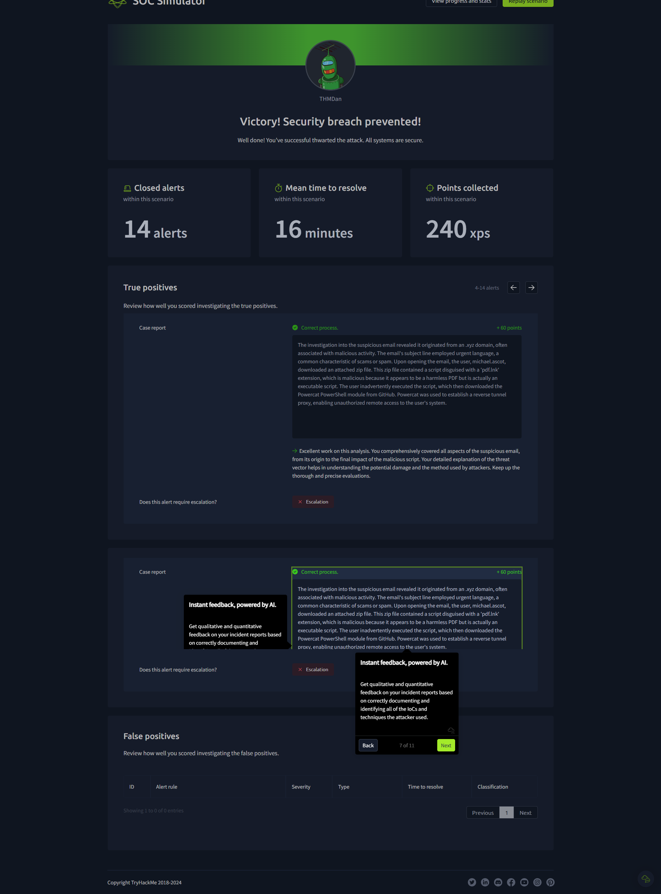

#07 Instant feedback, powered by AI.

>Get qualitative and quantitative feedback on your incident reports based on correctly documenting and identifying all of the IoCs and techniques the attacker used.
>Obtén retroalimentación cualitativa y cuantitativa sobre tus informes de incidentes basada en la documentación e identificación correcta de todos los IoCs y técnicas que el atacante utilizó.

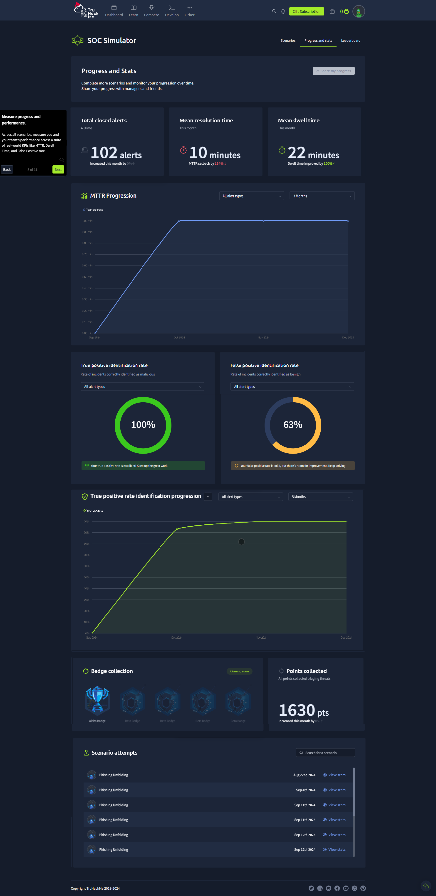

#08 Measure progress and performance.

>Across all scenarios, measure you and your team's performance across a suite of real-world KPIs like MTTR, Dwell Time, and False Positive rate.
>A través de todos los escenarios, mide tu rendimiento y el de tu equipo mediante un conjunto de KPIs del mundo real como MTTR, Dwell Time y tasa de falsos positivos.

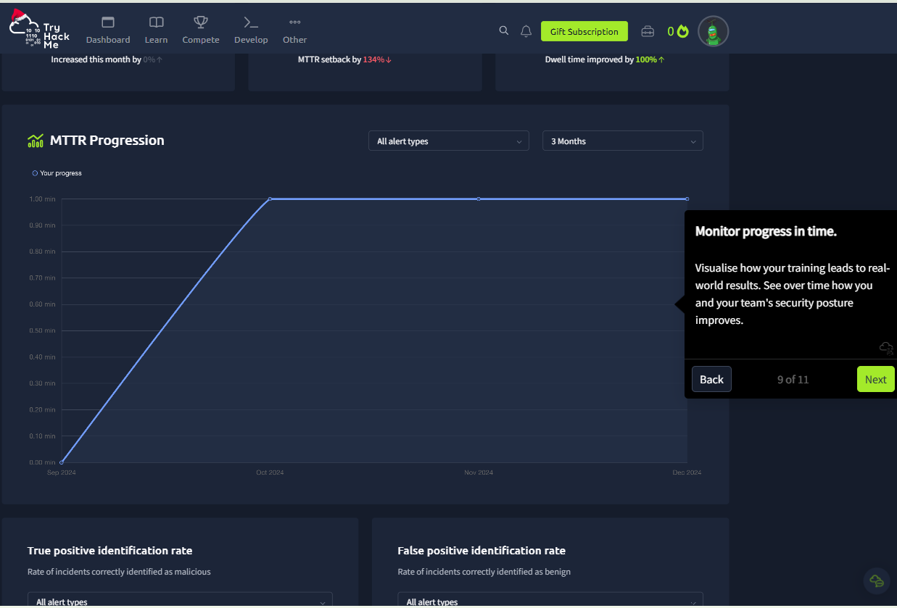

#09 Monitor progress in time.

>Visualise how your training leads to real-world results. See over time how you and your team's security posture improves.
>Visualiza cómo tu entrenamiento conduce a resultados en el mundo real. Observa a través del tiempo cómo mejora la postura de seguridad tuya y de tu equipo.

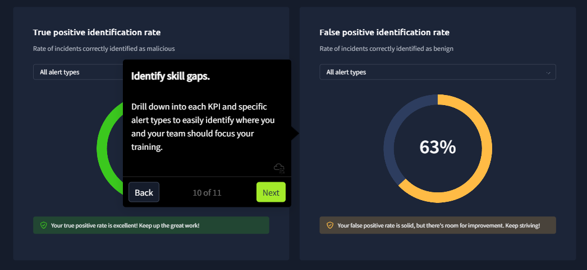

#10 Identify skill gaps.

> Drill down into each KPI and specific alert types to easily identify where you and your team should focus your training.
> Profundiza en cada KPI y tipos de alerta específicos para identificar fácilmente dónde tú y tu equipo deben enfocar su entrenamiento.

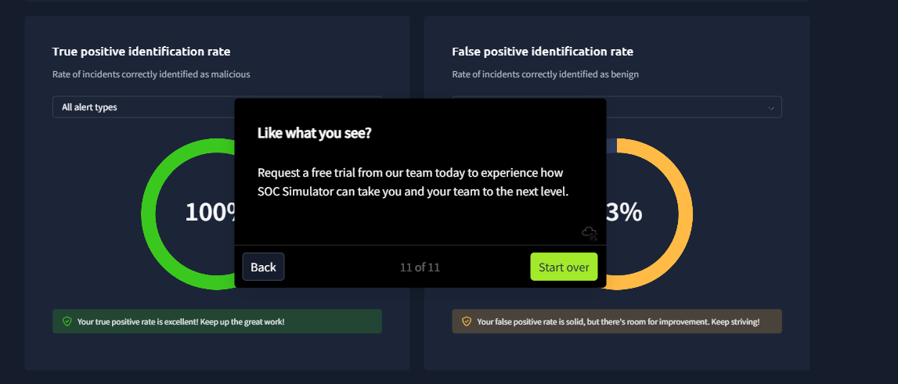

#11 Like what you see?

> Request a free trial from our team today to experience how SOC Simulator can take you and your team to the next level.
>  Solicita una prueba gratuita a nuestro equipo hoy para experimentar cómo el Simulador de SOC puede llevarte a ti y a tu equipo al siguiente nivel.

Link ** https://tryhackme.com/soc-sim/?ref=nav

Source iframe 
> El parámetro s=[0-9] típicamente corresponde a la diapositiva o paso específico en la demostración interactiva. siendo 0 el primero, 1 el segundo...
 hxxps://capture.navattic.com/cm42ruftv000103mhg6hb4617?g=cm42rufu7003403mh3vj38fgr&s=[0-10] 
Powered by Navattic