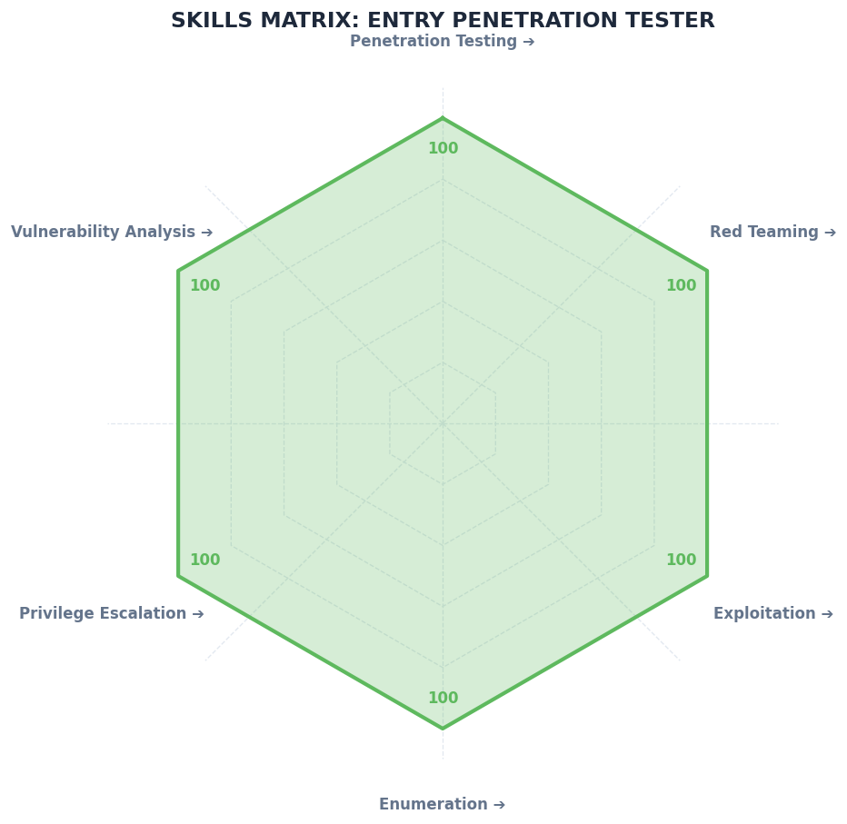
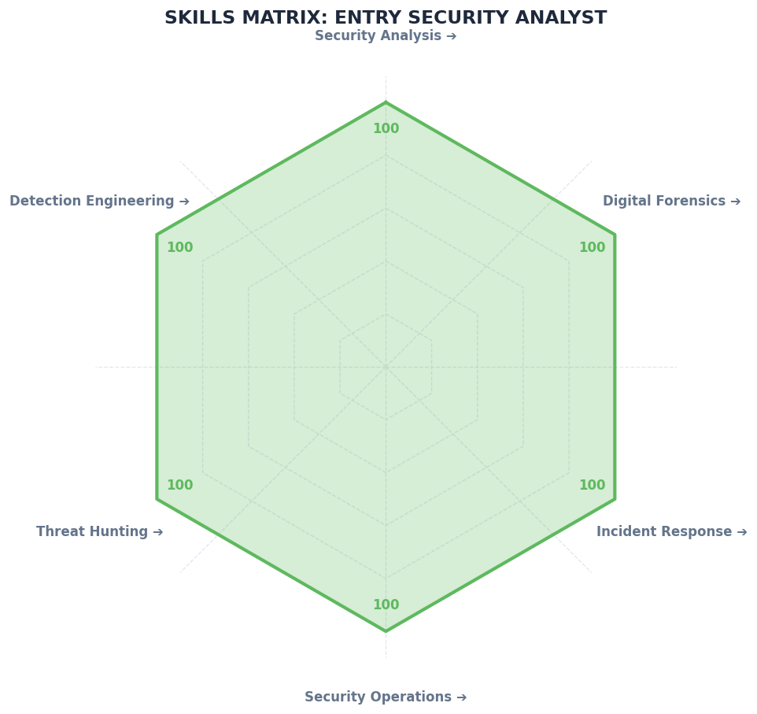
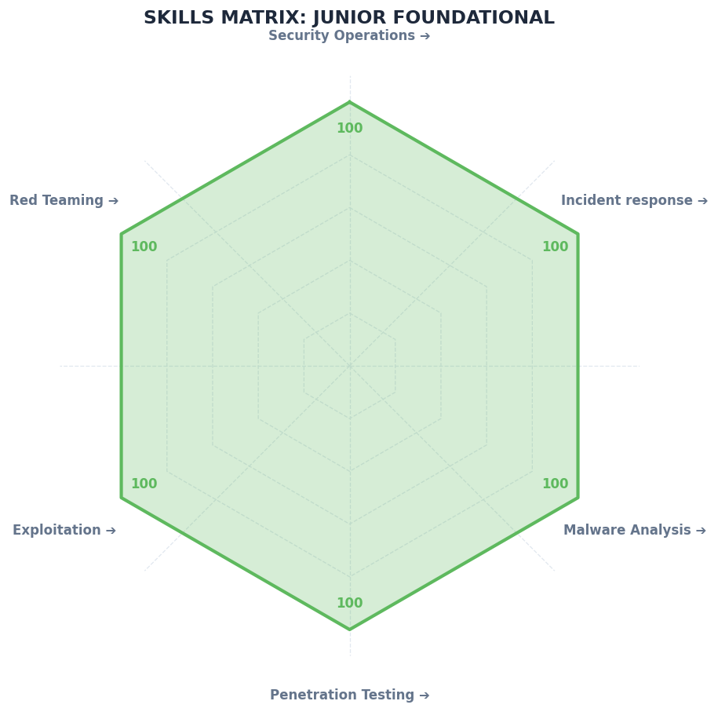
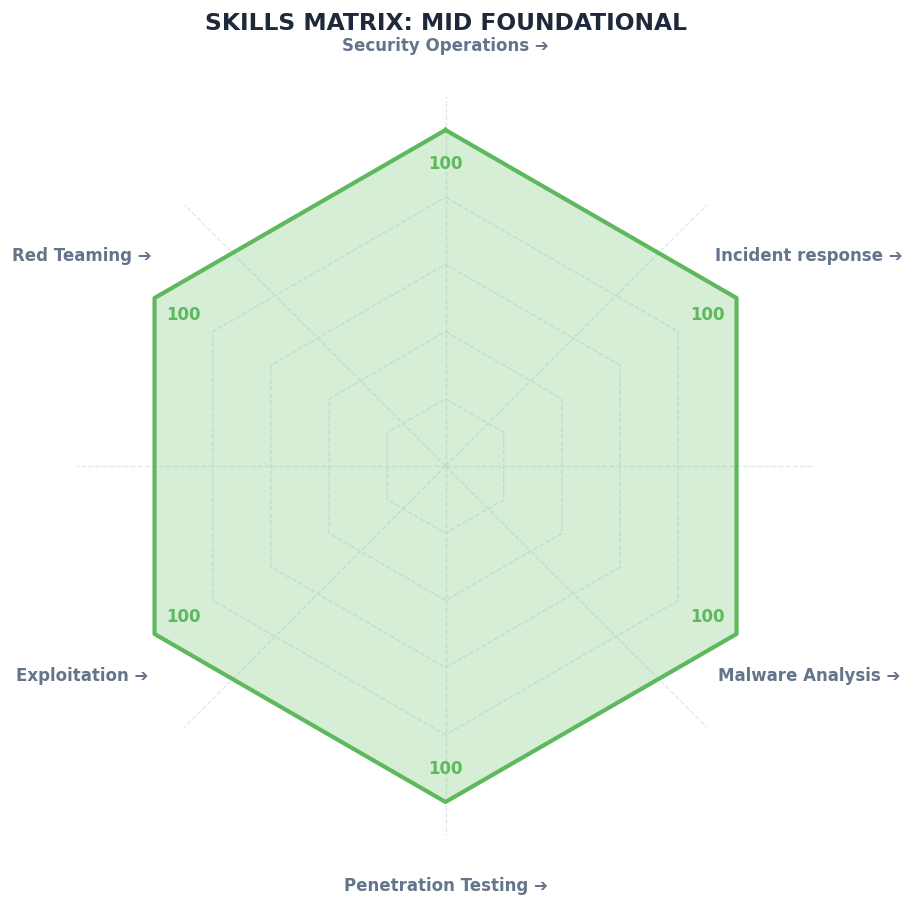
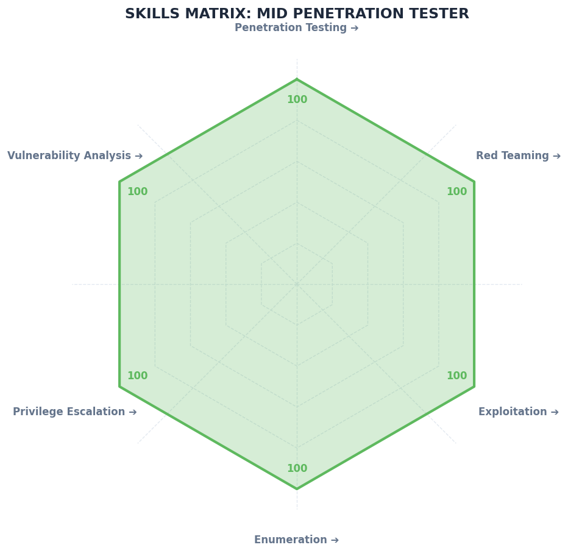
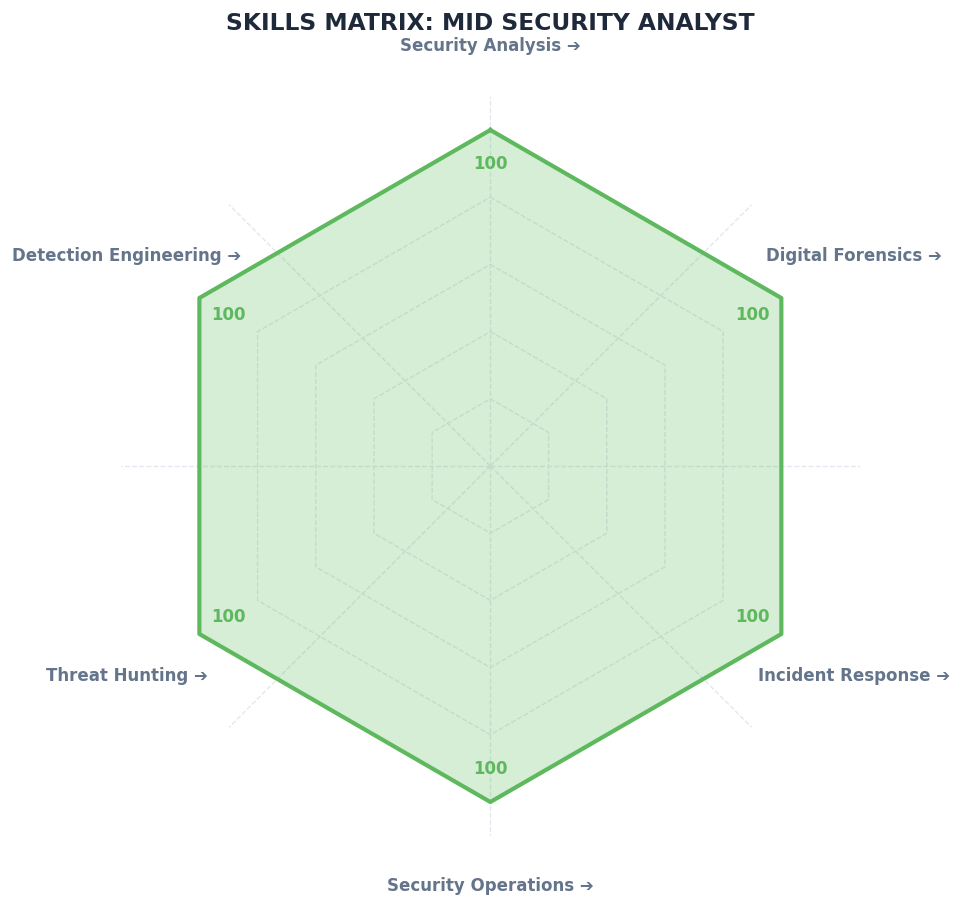
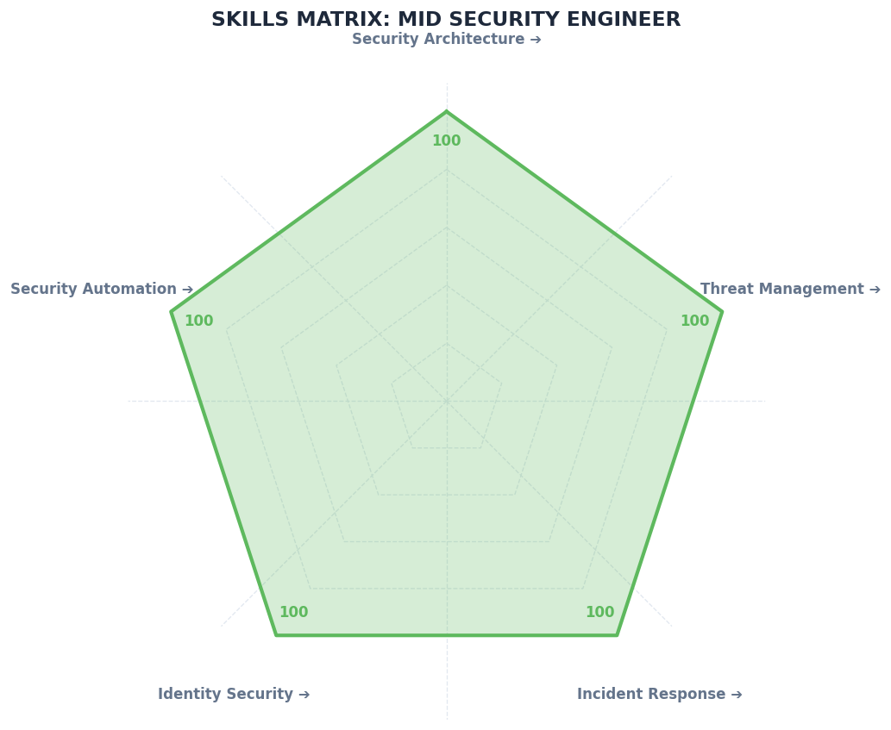
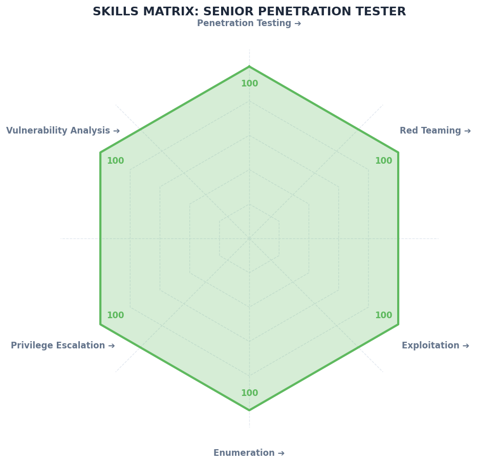
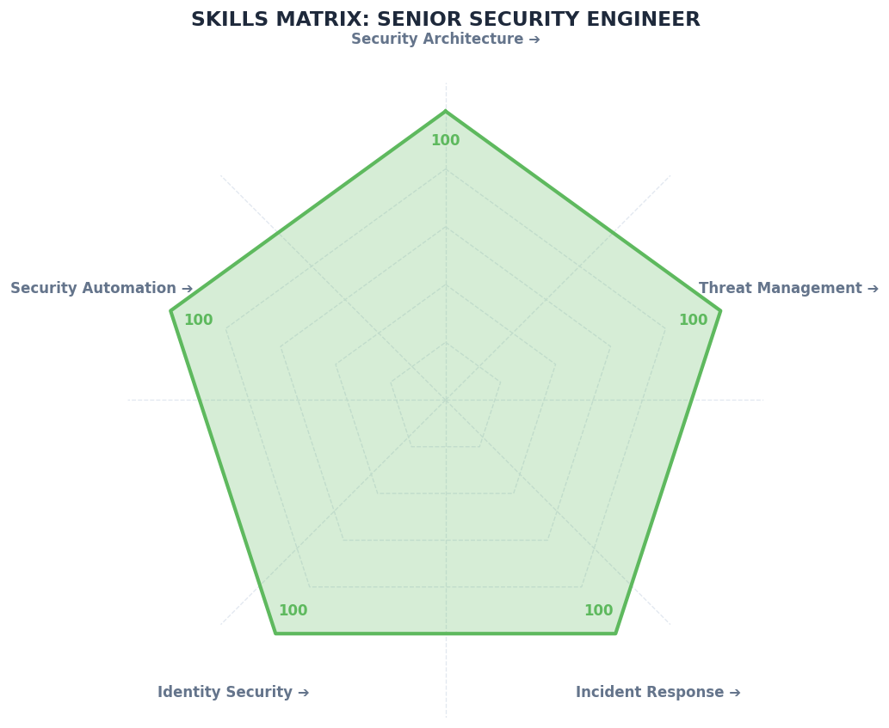

# Skill Matrix [INFO]

Generador personal para gráficos al estilo de skill matrix, con datos json ordenados con categorías.
categorias en json 
generador de imagen desde el json 

Saludos

Ejemplos de resultado en 

## Reporte de Gráficos Exportados / Exported Charts Report

## 🟢 Nivel Entry (Entrada)

---

## 🟡 Nivel Junior

---

## 🟠 Nivel Mid

---

## 🔴 Nivel Senior

