# T‍abletop exercises   (TTX)
> Tabletop Exercises at Lightning Speed
> Slow, static drills are a thing of the past: generate AI-powered scenarios in seconds, test real
> workflows, and get actionable reports instantly.

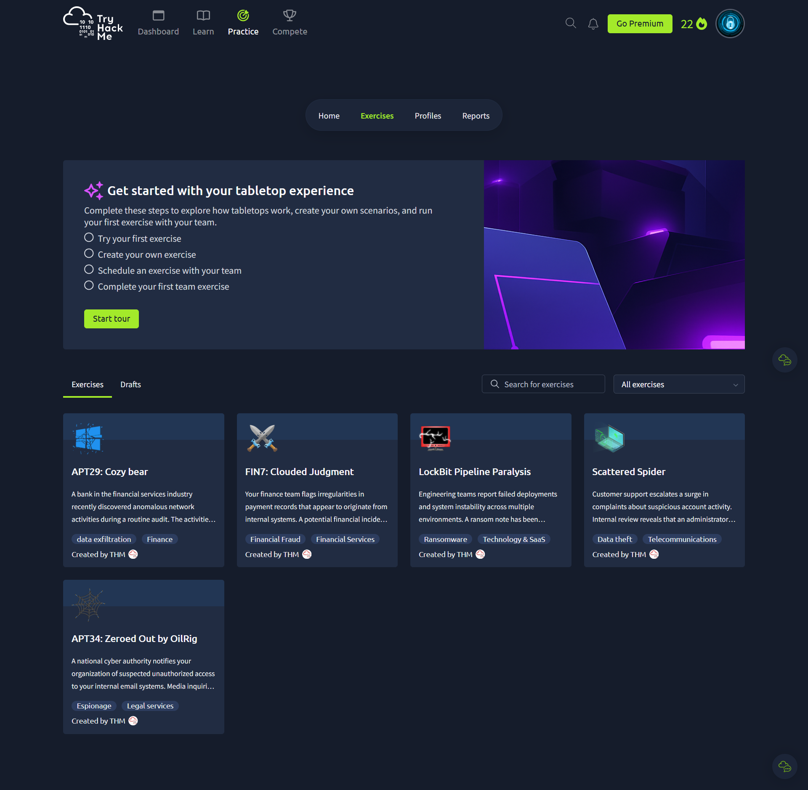

# 00⚡️ Build bespoke tabletop exercises in minutes, not days.
>  Create CSIRT tabletop exercises in seconds based on industry and attack type, or build fully customised exercises tailored to your company environment and specific

https://capture.navattic.com/cmg7vz3dr000004jv80pd8cbr?g=cmg86d09h000004labmu40ixr&s=0

> Your guided, live fire exercise is ready to go as soon as you are.
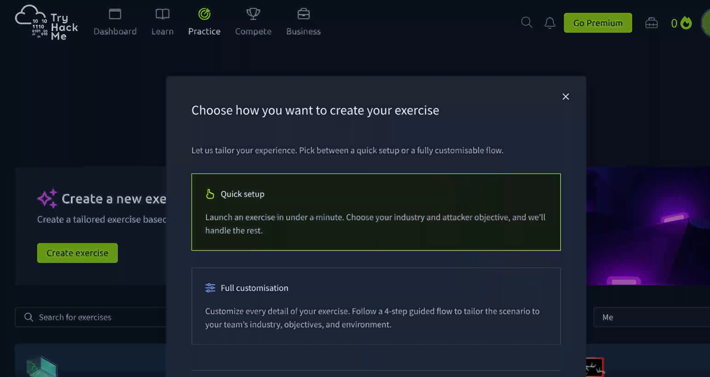

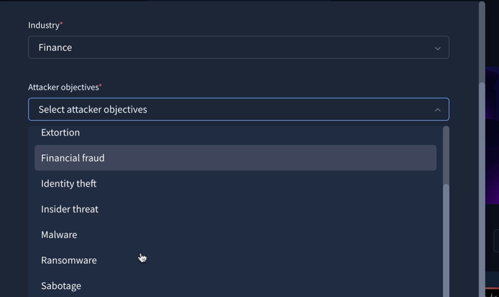

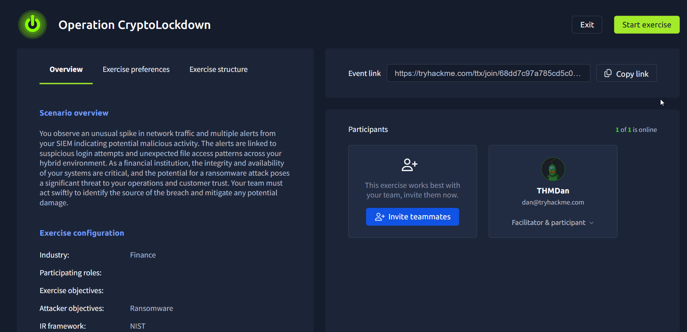

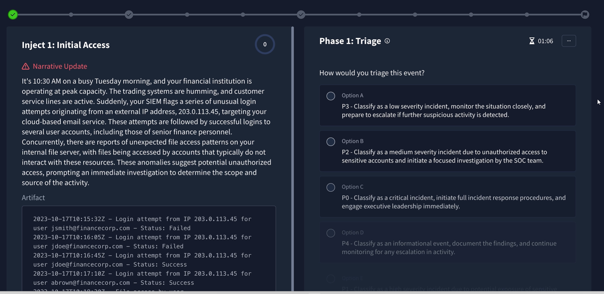
 

#  🚨 Respond to dynamic injects and IoCs
>  Test your teams ability to react to injects and corresponding artefacts. As the exercise progresses, injects respond to your team's actions.
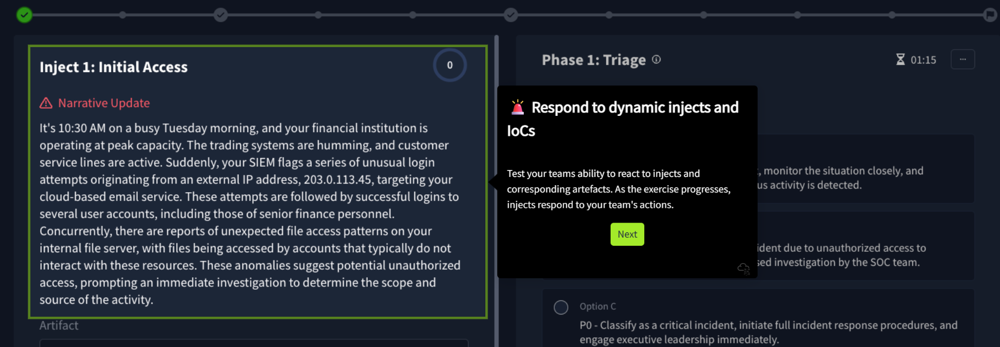

# vote
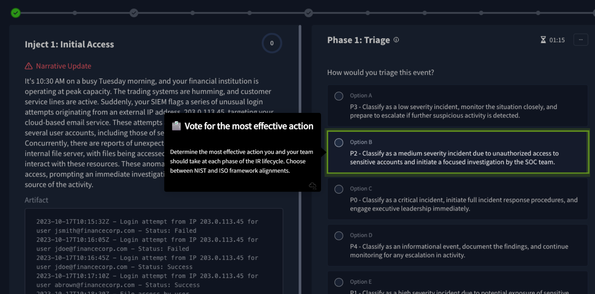
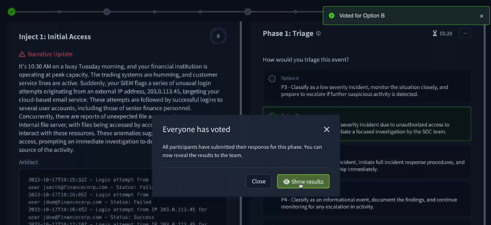

#  🏆 Earn more points for the most effective actions
> Keep your team engaged with live response scores as the exercise progresses. You can even set decaying points if your team takes too long to take action!
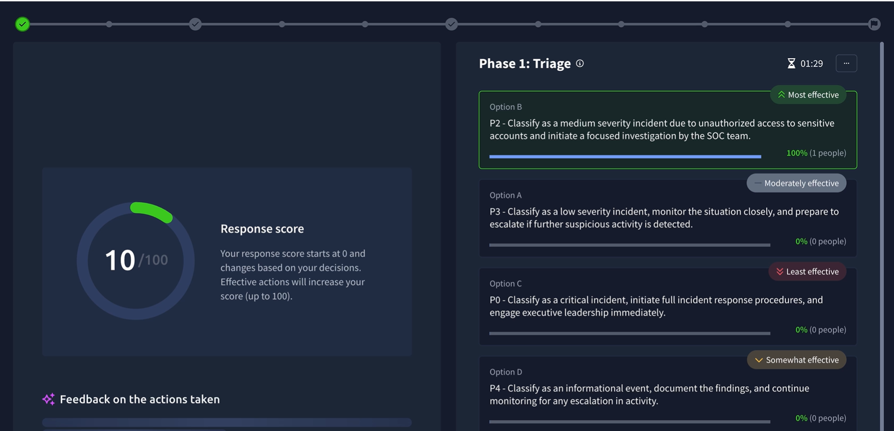
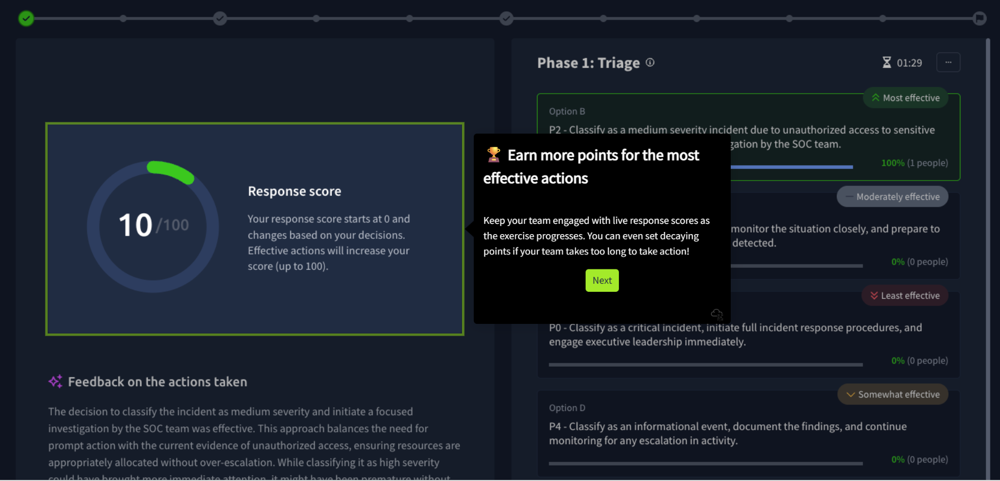

# 💡Get realtime feedback from your AI facilitator
> Review the impacts of your team's actions immediately and how alternate actions would have influenced outcomes.
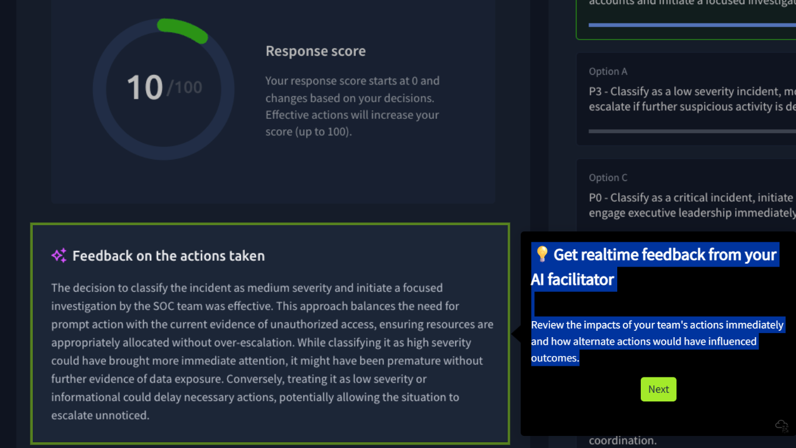

# 🧮 View vote counts for each action

> See which members of your team voted for which options and discuss how they would influence your response to the attack.

# ⏩ Progress through each inject of the attack

> Respond and take progressive actions from Initial Access through to Privilege Escalation and Goal Execution.

# 📝 Instant, audit-ready reporting

> Get a written report after completing every exercise with take-away actions and performance summaries across the entire IR lifecycle

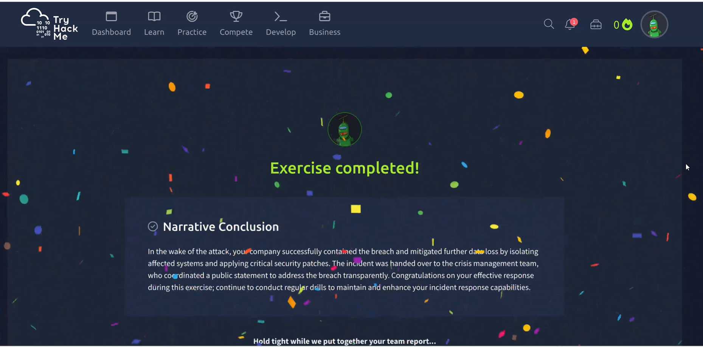
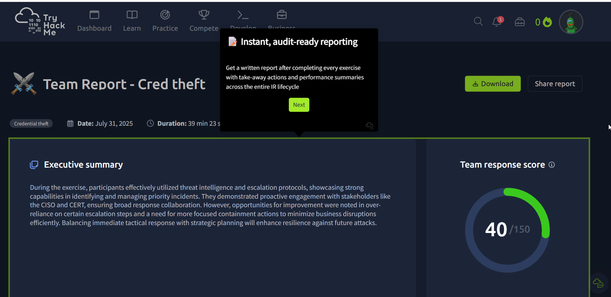

# 🎯 Actionable take-aways

>  With every completed exercise, your AI facilitator suggests five action items for you and your team based on your performance.

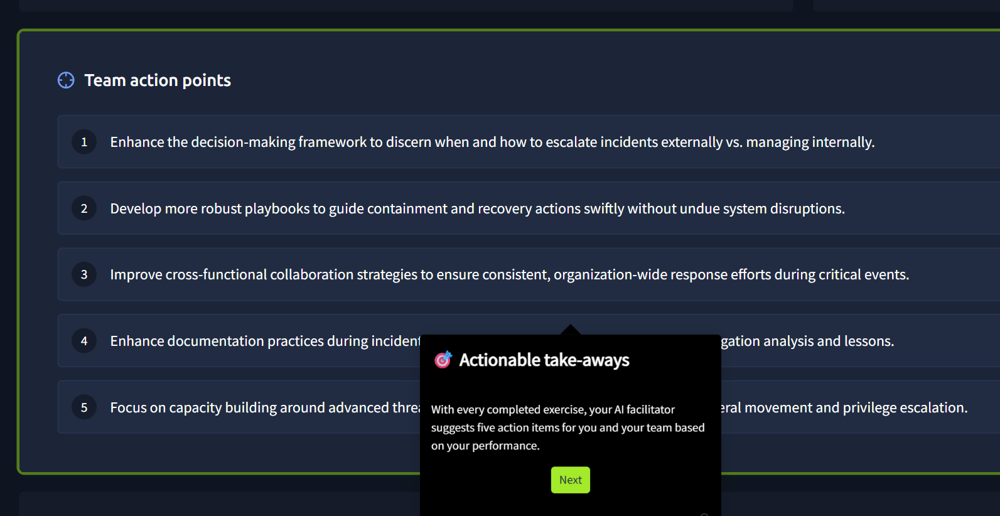

# 📈 Assess your team's performance

>  Get a breakdown of team effectiveness across each phase of the IR lifecycle.
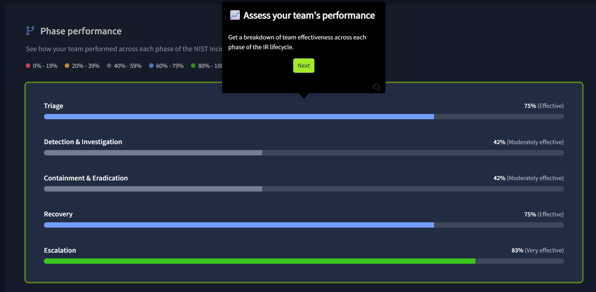

# 🔎 Review every inject

>  See your team's votes on actions across every phase and inject for the entire exercise for auditing and post-exercise debriefs.
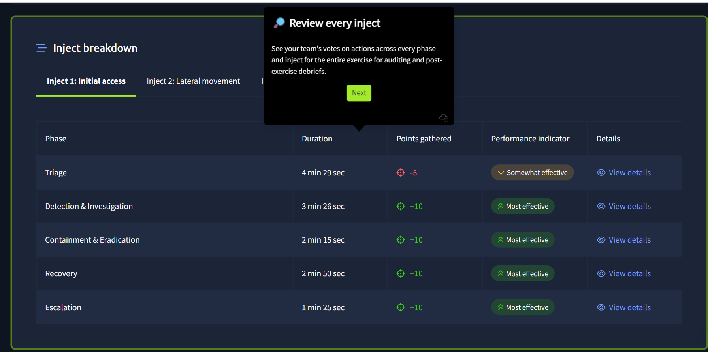

# 🏅 Certificate of completion

>  Download and share proof of your exercise with all the report's details in a PDF for your records and audit compliance.

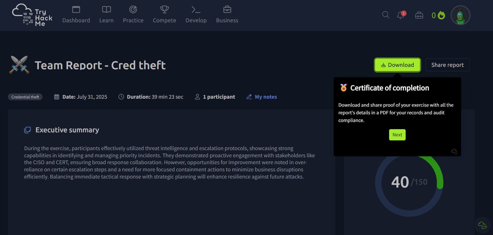

# 💪 Run your first exercise today

>  With TryHackMe tabletop exercises, it's easier and quicker than ever to run bespoke tabletop exercises for your team.

Link ** https://tryhackme.com/tabletop-exercises

Source iframe 
>  El parámetro s=[0-19] típicamente corresponde a la diapositiva o paso específico en la demostración interactiva. siendo 0 el primero, 1 el segundo...
 
 hxxps://capture.navattic.com/cmg7vz3dr000004jv80pd8cbr?g=cmg86d09h000004labmu40ixr&s=[0-19]
Powered by Navattic
 
 
 
 
 
---

#  Flow Guide: Tabletop Exercises (TTX)

###  1. Initial Exercise Setup

* **Rapid Creation:** Build tailored exercises in minutes. Templates can be industry-specific (e.g., CSIRT-focused) or fully customized to the organization’s unique environment.
* **Role Assignment:** Assemble the team and assign specific roles: **Facilitator**, **Participant**, and **Observer**.

###  2. Live Fire Execution

* **Dynamic Inject & IoCs:** Teams respond to real-time incident "injects" and artifacts (Indicators of Compromise). The narrative evolves dynamically based on the team's decisions.
* **Voting System:** During each phase of the Incident Response (IR) lifecycle, participants vote on the most effective course of action. Logic can be aligned with **NIST** or **ISO** frameworks.
* **Gamification & Scoring:** The system awards points for high-impact actions. An optional "decaying points" setting simulates time pressure and the cost of delayed response.

###  3. Facilitation and Discussion

* **Real-Time AI Feedback:** An AI facilitator immediately analyzes the impact of team actions, demonstrating how alternative choices would have altered the outcome.
* **Vote Analysis:** View vote tallies for each action to drive discussion on differing perspectives and how they influence the overall defense posture.
* **Attack Progression:** The flow mirrors the **Cyber Kill Chain**: Initial Access  Privilege Escalation  Execution of Objectives.

###  4. Evaluation and Reporting

* **Audit-Ready Reports:** Automatically generate a comprehensive written report summarizing performance across the entire IR cycle upon completion.
* **Actionable Takeaways:** The AI facilitator suggests five specific action items based on the actual performance and gaps identified during the drill.
* **Effectiveness Metrics:** Detailed breakdown of team efficacy per phase to pinpoint specific process bottlenecks or knowledge gaps.

---
  
#  Guía de Flujo: Tabletop Exercises (TTX)

###  1. Configuración Inicial del Ejercicio

* **Creación Rápida:** Construcción de ejercicios a medida en minutos. Se pueden basar en la industria y el tipo de ataque (ej. CSIRT) o personalizarse completamente según el entorno de la empresa.
* **Asignación de Roles:** Se debe reunir al equipo y asignar roles específicos: Facilitador, Participante y Observador.

###  2. Ejecución del Ejercicio (Live Fire)

* **Inyecciones Dinámicas e IoCs:** El equipo debe responder a inyecciones de incidentes y artefactos (Indicadores de Compromiso) en tiempo real. La narrativa del ejercicio evoluciona y responde según las acciones que tome el equipo.
* **Sistema de Votación:** En cada fase del ciclo de vida de Respuesta a Incidentes (IR), los participantes votan por la acción más efectiva. Se puede elegir entre alineaciones con marcos de trabajo **NIST** o **ISO**.
* **Gamificación y Puntuación:** El sistema otorga puntos por las acciones más efectivas para mantener el compromiso. Existe la opción de configurar "puntos decrecientes" si el equipo tarda demasiado en actuar.

###  3. Facilitación y Discusión

* **Feedback de IA en Tiempo Real:** Un facilitador de IA revisa el impacto de las acciones del equipo de inmediato, mostrando cómo otras alternativas habrían influido en los resultados.
* **Análisis de Votos:** Se pueden ver los recuentos de votos por cada acción para discutir por qué ciertos miembros eligieron opciones distintas y cómo influyen en la respuesta al ataque.
* **Progresión del Ataque:** El flujo sigue las fases críticas: Acceso Inicial ->  Escalada de Privilegios ->  Ejecución de Objetivos.

###  4. Evaluación y Reporte

* **Reportes Listos para Auditoría:** Al finalizar, se genera automáticamente un informe escrito que incluye resúmenes de rendimiento en todo el ciclo de IR.
* **Acciones Recomendadas (Take-aways):** El facilitador de IA sugiere cinco ítems de acción específicos basados en el desempeño real durante el ejercicio.
* **Métricas de Efectividad:** Desglose detallado de la efectividad del equipo en cada fase para identificar brechas de conocimiento o procesos.

 