#Threat Hunting simulator
Uncover hidden threats and expose blind spots with
real attacker based training
Sharpen your threat hunting process and spot real adversary behavior that evades traditional tools.

#01 👋 Welcome to the Threat Hunting simulator!
> Get hands-on experience in a secure, simulated environment. Detect hidden threats and strengthen your organisation's security posture.

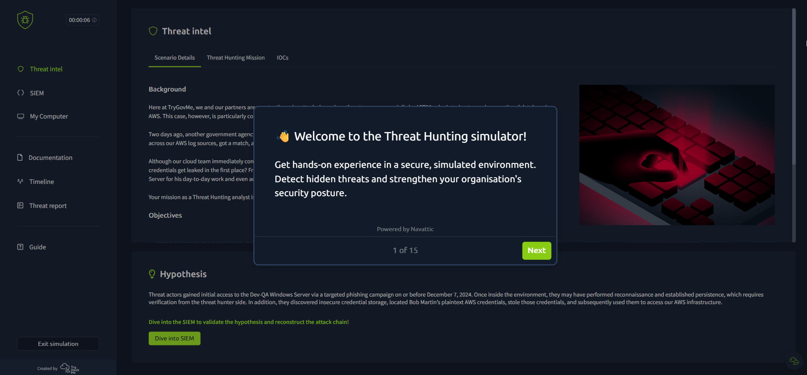

 #02 Kick off the hunt!
> The Threat Intel hub provides IOCs, attack timelines, analyst notes, and a working hypothesis for thorough assessment.

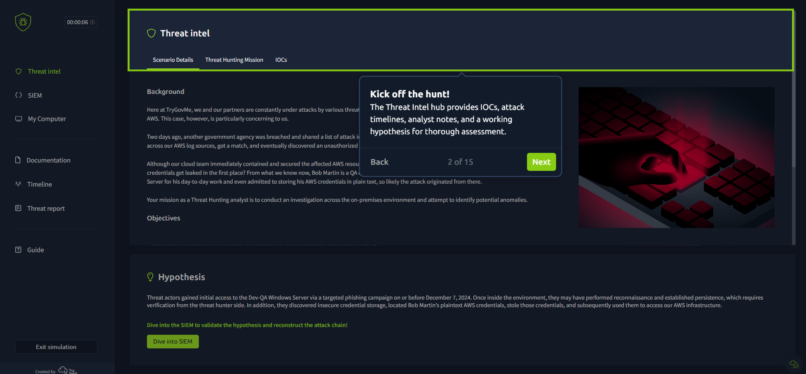

#03 Review the hypothesis
> Dive into the investigation to either prove or challenge the hypothesis in the Threat Intel hub.

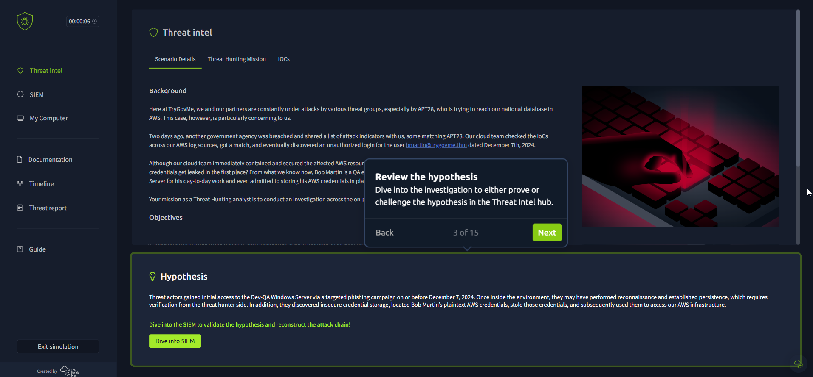

#04 Follow the trail
> Investigate the attack via the SIEM and VM.

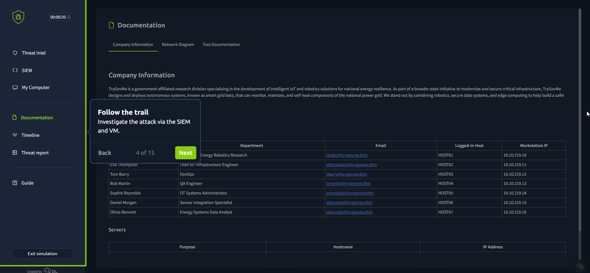

#05 Hunt down every move
> Correlate, analyse, and uncover the full attack chain.

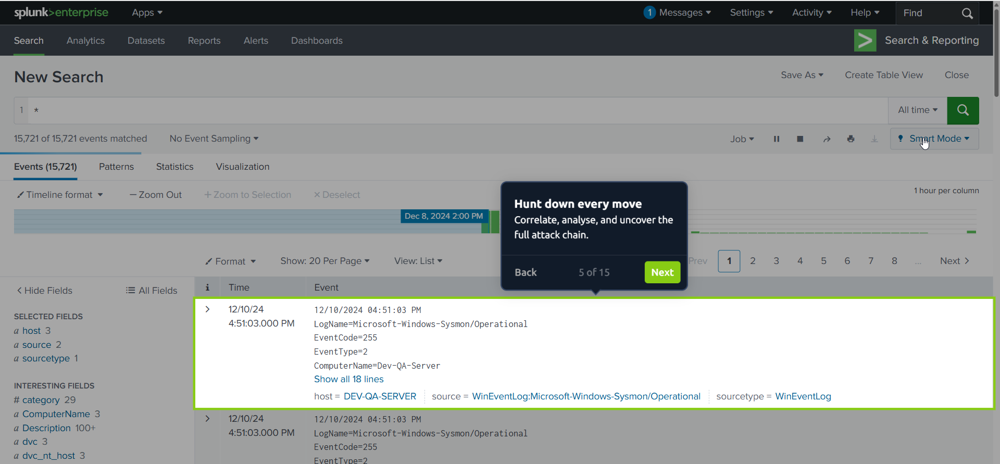

#06 Don't forget documentation
> Documentation is a key part of following the trail

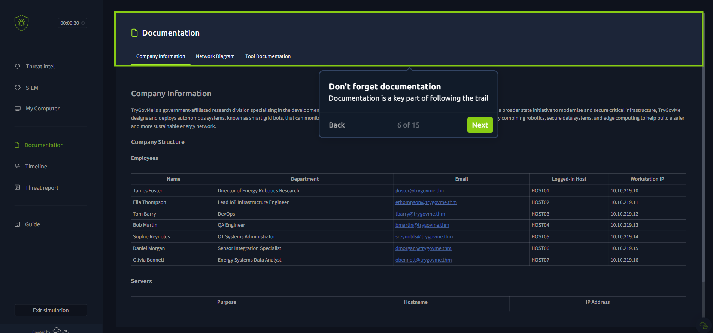

#07 Reconstruct the attack
> Identify and plot each phase on the timeline.

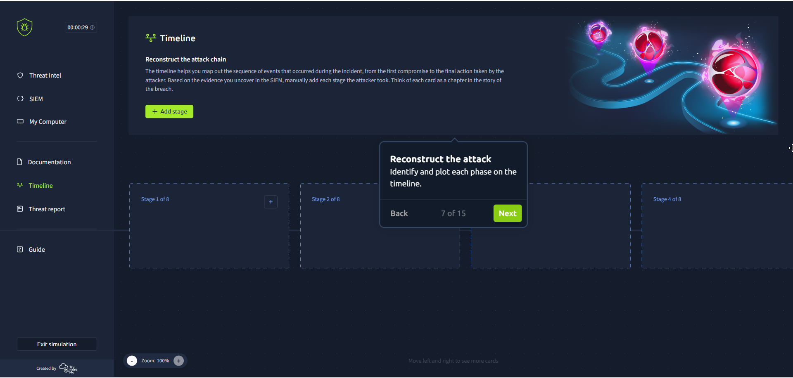
 
#08 fill details
> Fill in the details uncovered during your investigation to assemble the attack sequence...

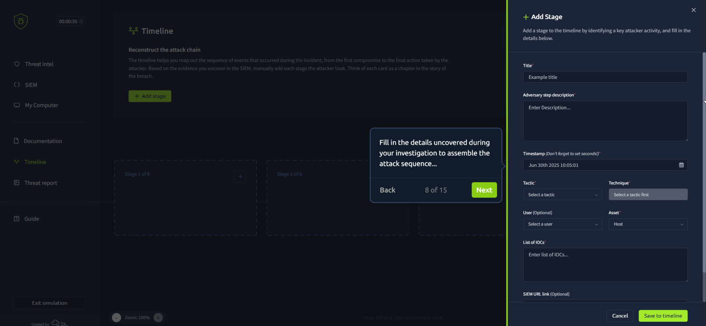

#09 Drag and drop
> You can also drag and drop the stages to change their order...

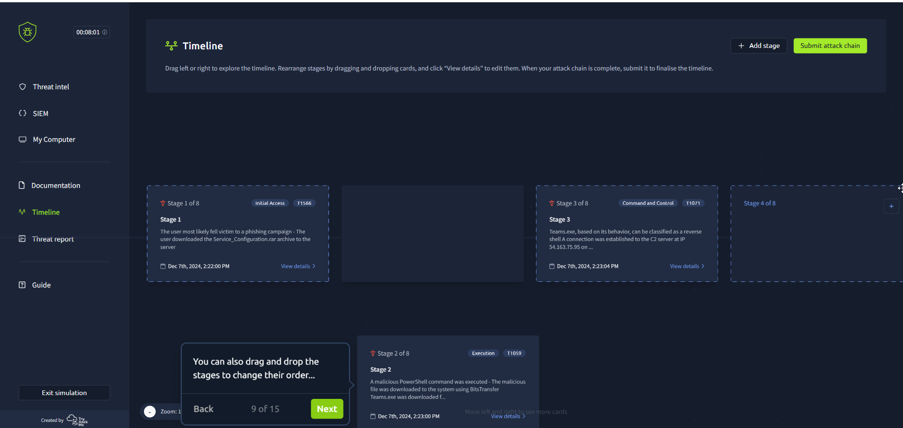

#10 ready [Submit attack chain]
> Ready? Submit your analysis to move forward.

![10](./IMG/10.png

#11 AI generated threat report based on your attack chain
> Review the AI-generated report outlining the attack timeline: from the initial foothold to full system compromise

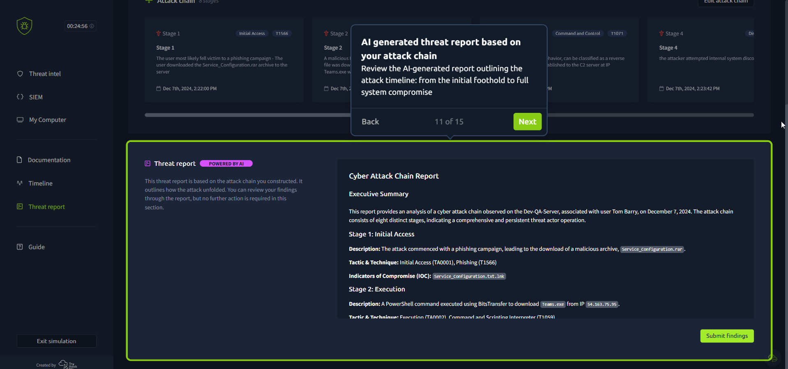

#12 Prove or disprove the hypothesis
> Decide whether to accept or reject the hypothesis based on your investigation.
> Click Submit to finish.

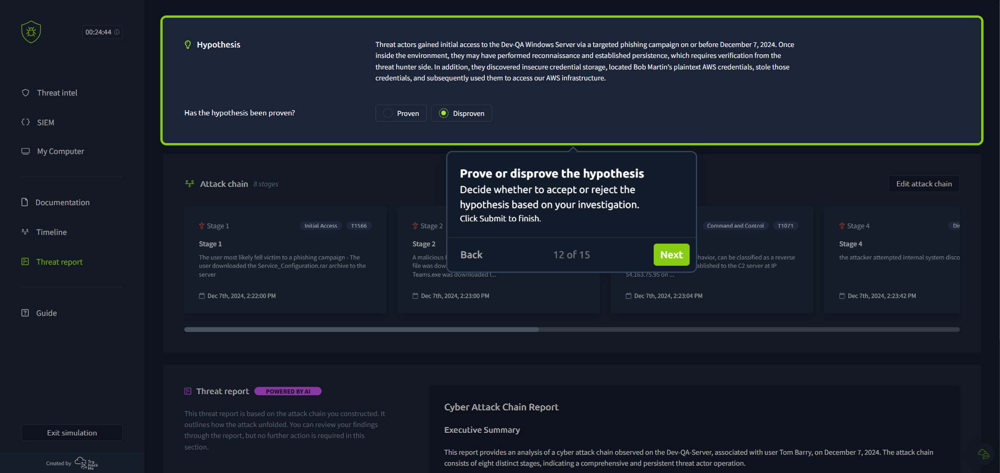

#13 Instant feedback, powered by AI.
> Receive detailed qualitative and quantitative feedback on your hypothesis and attack chain.

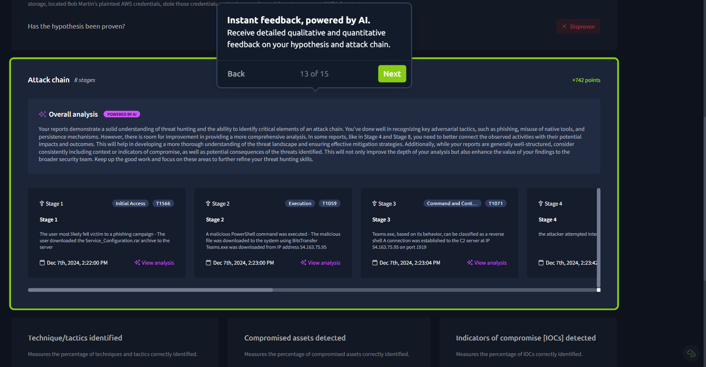

#14 Identify skill gaps
> Drill down to each KPI to easily identify where you and your team should focus your training.

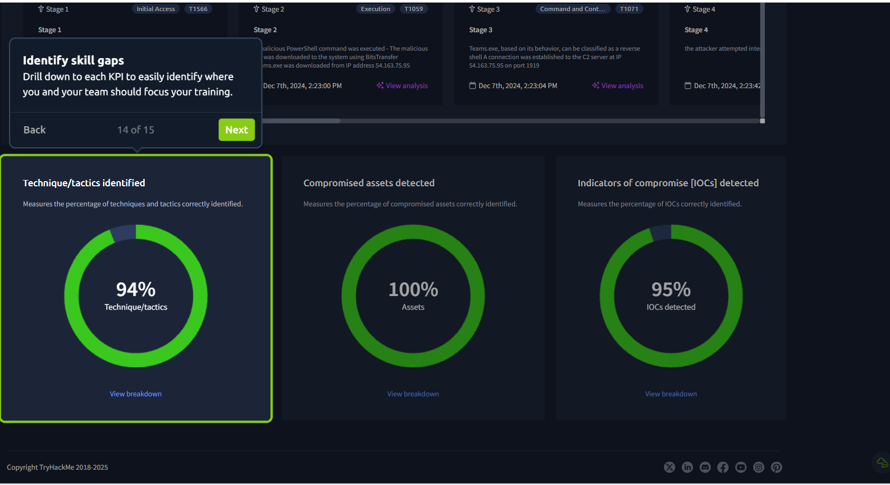
#15 Like what you see?

> Request a free trial from our team today to experience how the Threat Hunting Simulator can take you and your team to the next level.

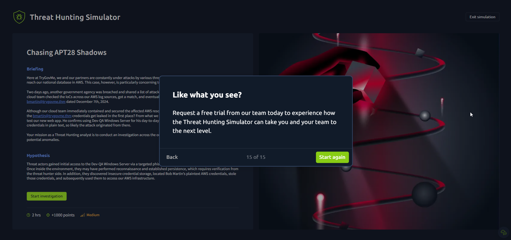

Link ** https://tryhackme.com/threat-hunting-sim/?ref=nav

Source iframe
> El parámetro s=[0-14] típicamente corresponde a la diapositiva o paso específico en la demostración interactiva. siendo 0 el primero, 1 el segundo...

hxxps://capture.navattic.com/cmbr3h8rw000204juc1909pc4?g=cmbr3h8sb001n04ju6ed09s5g&s=[0-14]
Powered by Navattic

