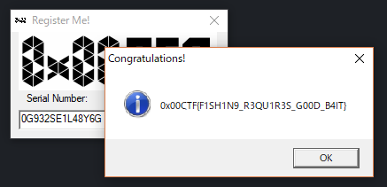

# 🖼️ img — 0x00sec CTF 2017 (artefactos del evento)

> **ES:** Imágenes originales del evento, reunidas aquí desde `Reversing/` y la raíz del proyecto.
> No son material de reto reutilizable: son capturas de contexto. Ver el alcance de cada una abajo.
> **EN:** Original event images, gathered here from `Reversing/` and the project root.
> Not reusable challenge material: they are context captures. See each one's scope below.

| Archivo | Origen | Alcance / Scope |
|---|---|---|
| `referencia.png` | `Reversing/referencia.png` (movido 2026-09-26) | **Solo `challenge-001` (Gone Fishing).** Diálogo «Register Me!» del propio reto. |
| `tabla final.jpg` | `tabla final.jpg` en la raíz (movido 2026-09-26) | **Clasificación global top-10 del evento. No es un resultado propio.** |

---

## `referencia.png` — diálogo de `challenge-001`

> **ES:** Captura del diálogo de registro del binario `challenge-001` (Gone Fishing), tal y como
> aparece tras introducir el serial correcto. Contenido textual (transcrito por OCR sobre la
> imagen el 2026-09-26):
>
> ```
> Register Me!
> Congratulations!
> Serial Number:
> 0x00CTF{F1SH1N9_R3QU1R3S_G00D_B4IT}
> 0G932SE1L48Y6G
> OK
> ```
>
> Sirve de comprobación visual del método de `../Reversing/reto1.md`: el serial `0G932SE1L48Y6G`
> y la flag coinciden con lo documentado ahí. No cubre ningún otro reto.
>
> **EN:** Capture of the registration dialog of the `challenge-001` (Gone Fishing) binary, as shown
> after entering the correct serial. Text content (transcribed via OCR on 2026-09-26):
>
> ```
> Register Me!
> Congratulations!
> Serial Number:
> 0x00CTF{F1SH1N9_R3QU1R3S_G00D_B4IT}
> 0G932SE1L48Y6G
> OK
> ```
>
> It visually corroborates the method in `../Reversing/reto1.md`: serial `0G932SE1L48Y6G` and the
> flag match what is documented there. It covers no other challenge.



---

## `tabla final.jpg` — clasificación global del evento ⚠️

> **ES:** **Esto NO es una puntuación de Apuromafo.** Es la tabla de winners publicada por la
> organización al cerrar el 0x00sec CTF 2017: los diez primeros puestos del evento completo,
> incluyendo Equipos (*Teams*), no solo la categoría Reversing. Se conserva como **contexto del
> evento**; citarla como logro propio sería falso.
>
> Texto de la imagen (OCR, 2026-09-26): `Winners` — «Below are the top ten players and their
> point scores.» Columnas: `Rank` | `Player` | `Score`.
>
> **EN:** **This is NOT an Apuromafo score.** It is the winners table published by the organizers
> at the end of 0x00sec CTF 2017: the overall top ten of the whole event, Teams included, not just
> the Reversing category. Kept as **event context**; presenting it as an own achievement would be
> false.

| Rank | Player | Score |
|---|---|---|
| 1 | Jinmo123 | 1445 |
| 2 | dcua | 1445 |
| 3 | Harekaze | 800 |
| 4 | *(no legible en la imagen)* | 670 |
| 5 | Spritzers | 670 |
| 6 | Can | 650 |
| 7 | System | 445 |
| 8 | Sw1ss | 370 |
| 9 | Leeky | 370 |
| 10 | F_T | 350 |


**Notas sobre la transcripción / Notes on the transcription**

- **ES:** El nombre del puesto 4 no se pudo leer con fiabilidad (celda no reconocida por el OCR);
  se marca como no legible en vez de inventarlo. Los nombres se transcriben tal y como aparecen en
  la tabla, con la grafía propia de cada participante.
- **EN:** The rank 4 name could not be read reliably (cell not recognised by OCR); it is marked as
  unread rather than invented. Names are transcribed as they appear, with each participant's own
  spelling.

**Pista de coherencia / Consistency clue**

> **ES:** `Harekaze` figura 3.º con 800 puntos, lo que concuerda con la writeup de st98 citada en
> `../Reversing/reto0.md`, `reto1.md` y `reto4.md` (alias `Harekaze`, 3.er puesto). `Apuromafo`
> **no aparece** en esta tabla.
> **EN:** `Harekaze` places 3rd with 800 points, consistent with the st98 writeup cited in
> `../Reversing/reto0.md`, `reto1.md` and `reto4.md` (handle `Harekaze`, 3rd place). `Apuromafo`
> **does not appear** in this table.

---

## ⚠️ Aviso Legal / Disclaimer

> **ES:** Uso educativo y personal únicamente. Imágenes del evento 0x00sec CTF 2017, ya archivado.
> **EN:** Educational and personal use only. Images from the archived 0x00sec CTF 2017 event.

_Fecha de edición: 2026-09-26_
